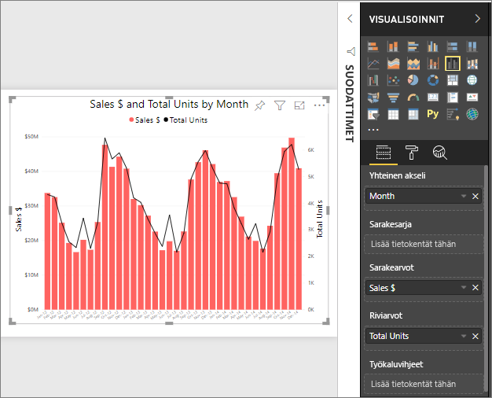

# Viivakaaviot Power BI:ssä
Viivakaaviot ovat arvopisteiden sarjoja, jotka esitetään pisteillä ja yhdistetään suorilla viivoilla. Viivakaaviossa voi olla yksi tai useampi viiva. Viivakaavioissa on X- ja Y-akseli. 

## Luo viivakaavio
Näissä ohjeissa käytetään myynnin ja markkinoinnin mallisovellusta sellaisen viivakaavion luomiseen, joka näyttää tämän vuoden myynnin luokittain. Seuraa mukana hankkimalla mallisovellus appsource.comista.

1. Aloita tyhjältä raporttisivulta. Jos käytät Power BI ‑palvelua, varmista, että avaat raportin [muokkausnäkymässä](../service-interact-with-a-report-in-editing-view.md).

2. Valitse Kentät-ruudusta **SalesFact**\>**Yksiköt yhteensä**, ja valitse **Päivämäärä** > **Kuukausi**.  Power BI luo pylväskaavion raporttipohjalle.

    

4. Muunna viivakaavio valitsemalla viivakaaviomalli Visualisoinnit-ruudusta. 

    
   

4. Suodata viivakaavio näyttämään tiedot vuosille 2012–2014. Jos Suodattimet-ruutu on kutistettu, laajenna se nyt. Valitse Kentät-ruudusta **Päivämäärä**\>**Vuosi** ja vedä se Suodattimet-ruutuun. Pudota se otsikon **Tämän visualisoinnin suodattimet** alle. 
     
    

    Vaihda **Lisäsuodattimet** tilaan **Perussuodattimet** ja valitse **2012**, **2013** ja **2014**.

    

6. Voit vaihtoehtoisesti [säätää kaavion tekstin väriä ja kokoa](power-bi-visualization-customize-title-background-and-legend.md). 

    

## Lisää kaavioon lisäviivoja
Viivakaavioissa voi olla useita eri viivoja. Ja joissakin tapauksissa viivojen arvot voivat olla niin erkautuvia, etteivät ne näy hyvin yhdessä. Katsotaanpa lisäviivojen lisäämistä nykyiseen kaavioomme ja sitä, miten voimme muotoilla kaaviota, kun viivojen esittämät arvot ovat hyvin erilaisia. 

### Lisää lisäviivoja
Sen sijaan, että tarkastelemme kaikkien alueiden yksikköjä yhtenä viivana kaaviossa, jaetaanpa yksiköiden kokonaismäärä alueen mukaan. Voit lisätä lisäviivoja vetämällä kohdan **Sijainti** > **Alue** Selite-säilöön.

   

### Käytä kahta Y-akselia
Entä jos haluan tarkastella kokonaismyyntiä ja yksiköiden kokonaismäärää samassa kaaviossa? Myyntiluvut ovat paljon suurempia kuin yksikkönumerot, minkä vuoksi viivakaavio on käyttökelvoton. Itse asiassa yksiköiden kokonaismäärän punainen viiva näyttää olevan nolla.

   

Jotta voit näyttää voimakkaasti erkautuvat arvot yhdessä kaaviossa, käytä yhdistelmäkaaviota. Saat tietää kaiken yhdistelmäkaavioista lukemalla artikkelin [Power BI:n yhdistelmäkaaviot](power-bi-visualization-combo-chart.md). Alla olevassa esimerkissämme voimme näyttää myynnin ja yksiköiden kokonaismäärän yhteisesti yhdessä kaaviossa lisäämällä toisen Y-akselin. 

   

## Korostaminen ja ristiinsuodatus
Lisätietoja Suodattimet-paneelin käyttämisestä saat ohjeaiheesta [Suodattimen lisääminen raporttiin](../power-bi-report-add-filter.md).

Arvopisteen valitseminen viivakaaviossa ristiinkorostaa ja ristiinsuodattaa muut raporttisivulla olevat visualisoinnit... ja päinvastoin. Seuraa mukana avaamalla **Markkinaosuus**-välilehti.  

Viivakaaviossa yksi arvopiste on pisteen leikkauskohta X-akselilla ja Y-akselilla. Kun valitset arvopisteen, Power BI lisää merkit osoittamaan, mikä piste (yhdelle viivalle) tai mitkä pisteet (jos viivoja on vähintään kaksi) ovat raporttisivun muiden visualisointien ristiinkorostuksen ja ristiinsuodatuksen lähde. Jos visualisointi on hyvin tiheä, Power BI valitsee lähimmän pisteet, jossa voit napsauttaa visualisointia.

Tässä esimerkissä olemme valinneet arvopisteen, joka kattaa seuraavat: Heinäkuu 2014, Yksikköjen markkinaosuus-% R12 33,16 ja Yksikköjen markkinaosuus-% 34,74.

Huomaa, miten pylväskaavio on ristiinkorostettu ja mittari ristiinsuodatettu.

Jos haluat määrittää, miten visualisoinnit ristiinkorostavat ja -suodattavat toisiaan, katso [visualisointien vuorovaikutukset Power BI -raportissa](../service-reports-visual-interactions.md)

## Huomioon otettavat seikat ja vianmääritys
* Yhdessä viivakaaviossa ei voi olla kahta Y-akselia.  Sen sijaan on käytettävä yhdistelmäkaaviota.
* Yllä olevassa esimerkissä kaavioita muotoiltiin fonttikoon suurentamiseksi, fontin värin muuttamiseksi, akselin lisäämiseksi otsikoihin, kaavion otsikon ja selitteen keskittämiseksi, kummankin akselin aloittamiseksi nollasta ja niin edelleen. Muotoilu-ruudussa (maalirullakuvake) on siten loputon sarja vaihtoehtoja, joiden avulla saat kaaviosi näyttämään juuri siltä, miltä haluat niiden näyttävän. Paras tapa oppia on avata Muotoilu-ruutu ja tutustua eri toimintoihin.

## Seuraavat vaiheet

[Visualisointityypit Power BI:ssä](power-bi-visualization-types-for-reports-and-q-and-a.md)

