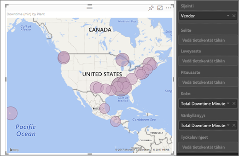
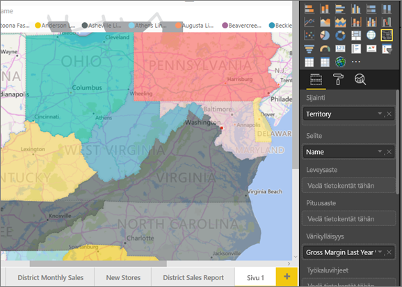
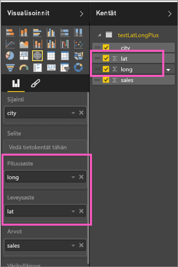
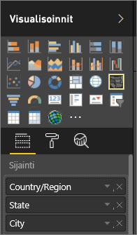

# Vinkkejä Power BI -karttavisualisoinneille
Power BI:n voi integroida Bing Mapsin kanssa, jolloin karttoja voidaan luoda oletusarvoisten karttakoordinaattien avulla (prosessia kutsutaan geokoodaukseksi). Power BI ja Bing Maps käyttävät algoritmeja oikean sijainnin määrittämiseen, mutta joskus sijainnin määritys perustuu parhaaseen arvaukseen. Jos Power BI ei pysty luomaan kartan visualisointia itse, se käyttää apuna Bing Mapsia. 

Palomuuri on ehkä päivitettävä, jotta Bingin geokoodauksessa hyödyntämiä URL-osoitteita voidaan käyttää.  Tässä on luettelo näistä URL-osoitteista:
* https://dev.virtualearth.net/REST/V1/Locations
* https://platform.bing.com/geo/spatial/v1/public/Geodata
* https://www.bing.com/api/maps/mapcontrol

Voit parantaa geokoodausta seuraavien vinkkien avulla. Tutustu ensimmäisen vinkkisarjan vinkkeihin, jos sinulla on pääsy tietojoukkoon. Toisen vinkkisarjan vinkeissä kerrotaan, mitä voit tehdä Power BI:ssä, jos et voi käyttää tietojoukkoa. 

## Mitä tietoja Bing Mapsiin lähetetään?
Power BI -palvelu ja Power BI Desktop lähettävät Bingiin maantieteellisiä tietoja, joita se tarvitsee kartan visualisoinnin luomiseen. Tämä voi sisältää visualisoinnin kentän **Sijainti**-, **Leveysaste**- ja **Pituusaste**-säilöjen tiedot. Lähetettävät tiedot vaihtelevat kartan tyypin mukaan. Lue lisätietoja [Bing Maps -tietosuojatiedoista](https://go.microsoft.com/fwlink/?LinkID=248686).

* Jos kartoille (kupla-, pistekaavio- tai pistetulostuskartoille) on annettu leveys- ja pituusasteet, tietoja ei lähetetä Bingiin. Muussa tapauksessa Bingiin lähetetään **Sijainti**-säilössä olevat tiedot.     

* Täytetyissä kartoissa on oltava kenttä **Sijainti**-säilössä, vaikka leveys- ja pituusasteet on annettu. Kaikki **Sijainti**-, **Leveysaste**- tai **Pituusaste**-säilöissä olevat tiedot lähetetään Bingiin.
  
    Seuraavassa esimerkissä geokoodauksessa käytetään **Toimittaja**-kenttää, joten kaikki Toimittaja-sarakkeen arvot lähetetään Bingiin. **Koko**- ja **Värikylläisyys**-säilöjen tietoja ei lähetetä Bingiin.
  
    
  
    Alla olevassa toisessa esimerkissä geokoodauksessa käytetään **Alue**-kenttää, joten kaikki Alue-sarakkeen arvot lähetetään Bingiin. **Selite**- ja **Värikylläisyys**-säilöjen tietoja ei lähetetä Bingiin.
  
    

## Tietojoukko: vinkkejä pohjana olevan tietojoukon parantamiseen
Jos sinulla on pääsy tietojoukkoon, jota käytetään kartan visualisoinnin luomiseen, voit parantaa geokoodausta muutamilla eri tavoilla.

**1. Luokittele maantieteelliset kentät Power BI Desktopissa**

Määrittämällä *tietokentille* tietoluokan Power BI Desktopissa voit varmistaa, että kentät on geokoodattu oikein. Valitse haluamasi sarake tietonäkymässä. Valitse valintanauhassa **Mallinnus**-välilehti ja määritä sitten **tietoluokaksi** **Osoite**, **Kaupunki**, **Maanosa**, **Maa/alue**, **Hallintoalue**, **Postinumero**, **Osavaltio** tai **Provinssi**. Näiden tietoluokkien avulla Bing voi koodata päivämäärän oikein. Lisätietoja on artikkelissa [Tietojen luokittelu Power BI Desktopissa](../desktop-data-categorization.md). Jos muodostat reaaliaikaisen yhteyden SQL Server Analysis Servicesiin, sinun on määritettävä tietojen luokittelu Power BI:n ulkopuolella [SQL Server Data Toolsin (SSDT)](https://docs.microsoft.com/sql/ssdt/download-sql-server-data-tools-ssdt) avulla.

**2. Käytä useita sijaintisarakkeita**    
 Joskus tietoluokkien määrittäminen yhdistämistä varten ei riitä siihen, että Bing ymmärtää käyttäjän aikeet. Jotkin määritykset ovat moniselitteisiä, koska paikka sijaitsee useassa eri maassa tai usealla eri alueella. ***Southampton*** esimerkiksi sijaitsee Englannissa, Pennsylvaniassa ja New Yorkissa.

Power BI käyttää Bingin [jäsentämätöntä URL-mallipalvelua](https://msdn.microsoft.com/library/ff701714.aspx) leveys- ja pituusasteiden noutamiseen maan osoitearvojen perusteella. Jos tiedot eivät sisällä riittävästi sijaintitietoja, lisää kyseisiä sarakkeita ja luokittele ne asianmukaisesti.

 Jos sinulla esimerkiksi on vain Kaupunki-sarake, geokoodaus voi olla Bingille vaikeaa. Tee sijainnista yksiselitteinen lisäämällä ylimääräisiä maantieteellisiä sarakkeita.  Joskus vain yhden sijaintisarakkeen – tässä tapauksessa osavaltio- tai provinssisarakkeen – lisääminen tietojoukkoon riittää. Muista myös luokitella se oikein. Katso kohta 1.

Varmista, että jokaisella kentällä on vain yksi sijaintiluokka. Kaupunki-sijaintikentässä tulee olla esimerkiksi **Southampton**, ei **Southampton, New York**.  Osoite-sijaintikentissä tulee olla **1 Microsoft Way**, ei **1 Microsoft Way, Redmond, WA**.

**3. Käytä tarkkoja leveys- ja pituusasteita**

Lisää tietojoukkoon leveys- ja pituusastearvot. Tämä poistaa moniselitteisyyden ja palauttaa tulokset entistä nopeammin. Leveysaste- ja Pituusaste-kenttien muodon on oltava *Desimaaliluku*, ja sen voi määrittää tietomallissa.

<iframe width="560" height="315" src="https://www.youtube.com/embed/ajTPGNpthcg" frameborder="0" allowfullscreen></iframe>

**4. Käytä Paikka-luokkaa sarakkeille, joissa on täydelliset sijaintitiedot**

Vaikka suosittelemme käyttämään kartoissa maantieteellisiä hierarkioita, voit määrittää tietojen luokitteluksi **Paikka**, jos sinun on käytettävä yhtä, täydelliset maantieteelliset tiedot sisältävää sijaintisaraketta. Jos sarakkeessa on täydelliset osoitetiedot, kuten 1 Microsoft Way, Redmond Washington 98052, tämä yleinen tietoluokka toimii parhaiten Bingissä. 

## Power BI: vinkkejä parhaan tuloksen saamiseen kartan visualisointeja käytettäessä
**1. Käytä leveys- ja pituusastekenttiä (jos ne on luotu)**

Jos käyttämälläsi tietojoukolla on leveys- ja pituusastekentät, käytä niitä Power BI:ssä.  Power BI:ssä on erityisiä säilöjä, joiden avulla tiedoista voidaan tehdä yksiselitteistä. Vedä leveystiedot sisältävä kenttä **Visualisoinnit > Leveysaste** -alueelle.  Tee sama pituusastetiedoille. Kun teet näin, sinun on myös täytettävä *Sijainti*-kentän tiedot, kun luot visualisointeja. Muussa tapauksessa tiedot koostetaan oletusarvoisesti, joten esimerkiksi leveys- ja pituusasteet yhdistetään osavaltiotasolla, ei kaupunkitasolla.

 

## Käytä maantieteellisiä hierarkioita, jotta voit porautua sijainnin eri tasoille
Kun tietojoukossa on jo eritasoisia sijaintitietoja, Power BI:n avulla voidaan luoda *maantieteellisiä hierarkioita*. Tämä tapahtuu vetämällä useita kenttiä **Sijainti**-säilöön. Kun kenttiä käytetään tällä tavalla yhdessä, niistä tulee maantieteellinen hierarkia. Olemme lisänneet alla olevaan esimerkkiin maantieteelliset kentät kohteille: maa/alue, osavaltio ja kaupunki. Power BI:ssä tämän maantieteellisen hierarkian avulla voidaan porautua tietojen eri tasoille.

  

   

Kun tietoihin poraudutaan maantieteellisten hierarkioiden avulla, on tärkeää tietää, miten porautumispainikkeet toimivat ja mitä tietoja Bing Mapsiin lähetetään. 

* Porapainike äärimmäisenä oikealla, kutsutaan Porautumistilaksi  avulla voit valita karttasijainnin ja porautua kyseiseen sijaintiin taso kerrallaan. Jos esimerkiksi otat Poraudu alaspäin -toiminnon käyttöön ja napsautat Pohjois-Amerikkaa, siirryt hierarkiassa seuraavalle tasolle – Pohjois-Amerikan osavaltioihin. Geokoodausta varten Power BI lähettää Bing Mapsiin vain Pohjois-Amerikan maa- ja osavaltiotiedot.  
* Vasemmassa reunassa on kaksi muuta porautumistoimintoa. Ensimmäisen vaihtoehdon,  , avulla voit porautua hierarkian seuraavalle tasolle kaikissa sijainneissa yhtä aikaa. Jos esimerkiksi tarkastelet maita ja siirryt sitten tämän toiminnon avulla seuraavalle tasolle tarkastelemaan osavaltioita, Power BI näyttää kaikkien maiden osavaltiot. Geokoodausta varten Power BI lähettää Bing Mapsiin osavaltiotiedot (ei maatietoja) kaikista sijainneista. Tästä toiminnosta on hyötyä, jos hierarkian tasot eivät liity sen yläpuolella olevaan tasoon. 
* Toinen toiminto,  , muistuttaa Poraudu alaspäin -toimintoa, mutta sinun ei tarvitse napsauttaa karttaa.  Toiminto laajentaa alaspäin hierarkian seuraavalle tasolle muistaen nykyisen tason kontekstin. Jos esimerkiksi tarkastelet maita ja valitset tämän kuvakkeen, siirryt hierarkiassa alaspäin seuraavalle tasolle eli osavaltioihin. Geokoodausta varten Power BI lähettää Bing Mapsiin tietoja jokaisesta osavaltiosta ja osavaltiota vastaavasta maasta, jotta geokoodaus on mahdollisimman tarkka. Useimmissa kartoissa käytät joko tätä toimintoa tai oikeassa reunassa olevaa Poraudu alaspäin -toimintoa, joten voit lähettää Bingiin mahdollisimman paljon tietoja tarkkojen sijaintitietojen saamiseksi. 

## Seuraavat vaiheet
[Power BI -visualisointiin porautuminen](../consumer/end-user-drill.md)

[Power Bi -visualisoinnit](power-bi-report-visualizations.md)

Onko sinulla kysyttävää? [Kokeile Power BI -yhteisöä](https://community.powerbi.com/)

