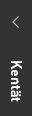
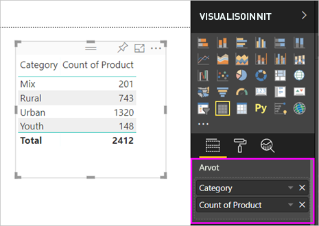
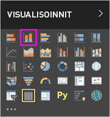

# Visualisointien lisääminen Power BI -raporttiin, osa 1

Tässä artikkelissa annetaan lyhyt esittely visualisointien lisäämisestä raporttiin. Se koskee sekä Power BI -palvelua että Power BI Desktopia. Katso lisätietoja edistyneemmästä sisällöstä tämän sarjan [osasta 2](power-bi-report-add-visualizations-ii.md). Katso kuinka Amanda esittelee joitakin eri tapoja, joilla raportille voidaan luoda visualisointeja ja kuinka niitä voidaan muokata ja muotoilla. Voit sitten kokeilla itse luomalla oman raportin [Myynti- ja markkinointimallista](../sample-datasets.md).

<iframe width="560" height="315" src="https://www.youtube.com/embed/IkJda4O7oGs" frameborder="0" allowfullscreen></iframe>

## Raportin avaaminen ja uuden sivun lisääminen

1. Avaa [raportti muokkausnäkymässä](../service-interact-with-a-report-in-editing-view.md).

    Tässä opetusohjelmassa käytetään [myynti- ja markkinointimallia](../sample-datasets.md).

1. Jos **Kentät**-ruutu ei ole näkyvissä, valitse nuolikuvake sen avaamiseksi.

   

1. Lisää raporttiin tyhjä sivu.

## Visualisointien lisääminen raporttiin

1. Luo visualisointi vetämällä kenttä **Kentät**-ruudussa.

    Aloita numeerisesta kentästä, kuten **SalesFact** > **Sales $** . Power BI luo pylväskaavion, jossa on yksi pylväs.

    

    Tai voit aloittaa luokkakentästä, kuten **Nimi** tai **Tuote**. Power BI luo taulukon ja lisää tämän kentän **Arvot**-säilöön.

    

    Tai aloita paikkatietokentästä, kuten **Alue** > **Kaupunki**. Power BI ja Bing Maps luovat karttavisualisoinnin.

    

1. Luo visualisointi ja muuta sitten sen tyyppiä. Valitse **Tuote** > **Luokka** ja sitten **Tuote** > **Tuotteen määrä** lisätäksesi ne molemmat **Arvot**-säilöön.

   

1. Muuta visualisointi pylväskaavioksi valitsemalla **pinotun pylväskaavion kuvake**.

   

1. Kun olet luonut visualisointeja raporttiin, voit [kiinnittää ne raporttinäkymään](../service-dashboard-pin-tile-from-report.md). Kiinnittääksesi visualisoinnin, valitse kiinnityskuvake .

   
  
## Seuraavat vaiheet

 Jatka kohtaan:

* [Osa 2: Visualisointien lisääminen Power BI -raporttiin](power-bi-report-add-visualizations-ii.md)

* [Käsittele raportin visualisointeja](../consumer/end-user-reading-view.md).

* [Luo lisää visualisointeja](power-bi-report-visualizations.md).

* [Tallenna raporttisi](../service-report-save.md).
