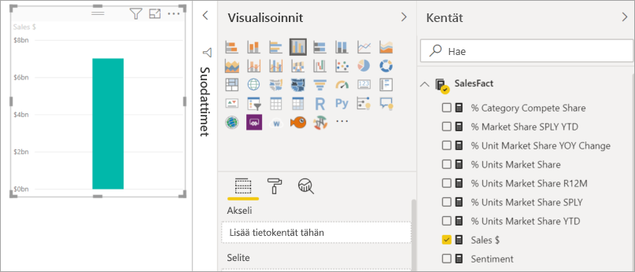
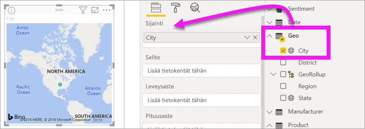
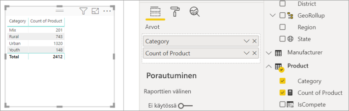
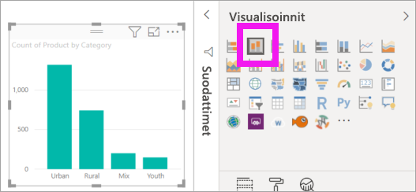
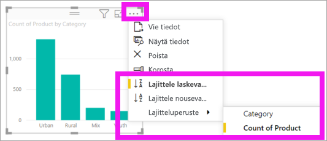

# Visualisointien lisääminen Power BI -raporttiin, osa 1

[!INCLUDE [power-bi-visuals-desktop-banner](../includes/power-bi-visuals-desktop-banner.md)]

Tässä artikkelissa annetaan lyhyt esittely visualisointien lisäämisestä raporttiin. Se koskee sekä Power BI -palvelua että Power BI Desktopia. Katso lisätietoja edistyneemmästä sisällöstä tämän sarjan [osasta 2](power-bi-report-add-visualizations-ii.md). Katso kuinka Amanda esittelee joitakin eri tapoja, joilla raportille voidaan luoda visualisointeja ja kuinka niitä voidaan muokata ja muotoilla. Voit sitten kokeilla itse luomalla oman raportin [Myynti- ja markkinointimallista](../sample-datasets.md).

<iframe width="560" height="315" src="https://www.youtube.com/embed/IkJda4O7oGs" frameborder="0" allowfullscreen></iframe>

## Edellytykset

Tässä opetusohjelmassa käytetään [myynti- ja markkinointi -PBIX-tiedostoa](https://download.microsoft.com/download/9/7/6/9767913A-29DB-40CF-8944-9AC2BC940C53/Sales%20and%20Marketing%20Sample%20PBIX.pbix).

1. Valitse Power BI Desktopin valikkorivin vasemmasta yläosasta **Tiedosto** > **Avaa**
   
2. Etsi oma **myynti- ja markkinointi -PBIX-tiedostosi**

1. Avaa **myynti- ja markkinointi -PBIX-tiedosto** raporttinäkymässä .

1. Valitse  uuden sivun lisäämiseksi.

## Visualisointien lisääminen raporttiin

1. Luo visualisointi vetämällä kenttä **Kentät**-ruudussa.

    Aloita numeerisesta kentästä, kuten **Sales** > **TotalSales**. Power BI luo pylväskaavion, jossa on yksi pylväs.

    

    Tai voit aloittaa luokkakentästä, kuten **Nimi** tai **Tuote**. Power BI luo taulukon ja lisää tämän kentän **Arvot**-säilöön.

    

    Tai aloita paikkatietokentästä, kuten **Alue** > **Kaupunki**. Power BI ja Bing Maps luovat karttavisualisoinnin.

    

## Visualisoinnin tyypin vaihtaminen

 Luo visualisointi ja muuta sitten sen tyyppiä. 
 
 1. Valitse **Tuote** > **Luokka** ja sitten **Tuote** > **Tuotteen määrä** lisätäksesi ne molemmat **Arvot**-säilöön.

    

1. Muuta visualisointi pylväskaavioksi valitsemalla **pinotun pylväskaavion kuvake**.

   

1. Muuta visualisoinnin lajittelutapaa valitsemalla **Enemmän vaihtoehtoja** (...).  Lajitteluasetusten avulla voit muuttaa lajittelun suuntaa (nouseva tai laskeva) lajitteluperusteena käytettävää saraketta (**Lajitteluperuste**).

   
  
## Seuraavat vaiheet

 Jatka kohtaan:

* [Osa 2: Visualisointien lisääminen Power BI -raporttiin](power-bi-report-add-visualizations-ii.md)

* Toimia raportin [visualisointien kanssa](../consumer/end-user-reading-view.md).

