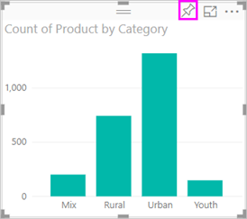

# Visualisointien lisääminen Power BI -raporttiin, osa 1
Tässä artikkelissa annetaan lyhyt esittely visualisointien lisäämisestä raporttiin joko Power BI -palvelulla tai Power BI Desktopilla.  Katso lisätietoja edistyneemmästä sisällöstä [osasta II](power-bi-report-add-visualizations-ii.md). Katso kuinka Amanda esittelee joitakin eri tapoja, joilla raportille voidaan luoda visualisointeja ja kuinka niitä voidaan muokata ja muotoilla. Voit sitten kokeilla itse luomalla oman raportin [Myynti- ja markkinointimallista](../sample-datasets.md).

<iframe width="560" height="315" src="https://www.youtube.com/embed/IkJda4O7oGs" frameborder="0" allowfullscreen></iframe>

## Raportin avaaminen ja uuden sivun lisääminen
1. Avaa [raportti muokkausnäkymässä](../consumer/end-user-reading-view.md). Tässä opetusohjelmassa käytetään [myynti- ja markkinointimallia](../sample-datasets.md).
2. Jos Kentät-ruutu ei ole näkyvissä, valitse nuolikuvake sen avaamiseksi. 
   
   
3. Lisää raporttiin tyhjä sivu.

## Visualisointien lisääminen raporttiin
1. Luo visualisointi vetämällä kenttä **Kentät**-ruudussa.  
   
   **Aloita numeerisesta kentästä**, kuten SalesFact > Myynti $. Power BI luo pylväskaavion, jossa on yksi pylväs.
   
   
   
   **Tai voit aloittaa luokkakentästä**, kuten Nimi tai Tuote: Power BI luo taulukon ja lisää kentän **Arvot**-kohtaan.
   
   
   
   **Tai aloita paikkatietokentästä**, kuten Alue > Kaupunki. Power BI ja Bing Maps luovat karttavisualisoinnin.
   
   
2. Luo visualisointi ja muuta sitten sen tyyppiä. Valitse **Tuote > Luokka** ja **Tuote > Tuotteen määrä** lisätäksesi ne molemmat **arvoihin**.
   
   
3. Muuta visualisointi pylväskaavioksi valitsemalla pylväskaaviokuvake.
   
   
4. Kun olet luonut visualisointeja raporttiin, voit [kiinnittää ne raporttinäkymään](../service-dashboard-pin-tile-from-report.md). Kiinnittääksesi visualisoinnin, valitse kiinnitä-kuvake .
   
   
  

## Seuraavat vaiheet
 Jatka [osaan 2: Visualisointien lisääminen Power BI -raporttiin](power-bi-report-add-visualizations-ii.md)
   
   Toimia raportin [visualisointien kanssa](../consumer/end-user-reading-view.md).
   
   [Luoda lisää visualisointeja](power-bi-report-visualizations.md).
   
   [Tallentaa raporttisi](../service-report-save.md).
