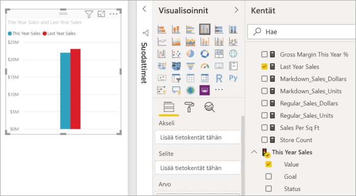
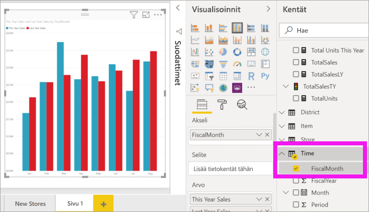
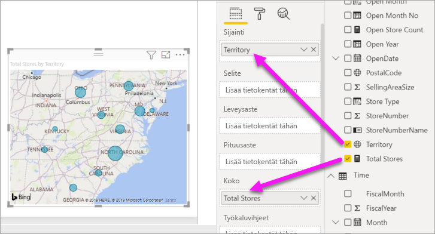
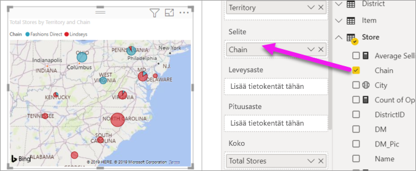

# Visualisointien lisääminen Power BI -raporttiin, osa 2

[!INCLUDE [power-bi-visuals-desktop-banner](../includes/power-bi-visuals-desktop-banner.md)]

[Osassa 1](power-bi-report-add-visualizations-i.md) opettelit luomaan tavallisia visualisointeja valitsemalla kenttien nimien vieressä olevia valintaruutuja.  Osassa 2 opetetaan luomaan visualisointeja ja muokkaamaan niitä vetämis- ja pudottamistoiminnon avulla sekä hyödyntämällä **Kentät**- ja **Visualisoinnit**-paneeleja.

## Uuden visualisoinnin luominen
Tässä opetusohjelmassa perehdymme jälleenmyyntianalyysimallin tietojoukkoon ja luomme siitä muutamia olennaisimpia visualisointeja.

## Edellytykset

Tässä opetusohjelmassa käytetään [Jälleenmyyntianalyysimallin PBIX-tiedostoa](http://download.microsoft.com/download/9/6/D/96DDC2FF-2568-491D-AAFA-AFDD6F763AE3/Retail%20Analysis%20Sample%20PBIX.pbix).

1. Valitse Power BI Desktopin valikkorivin vasemmasta yläosasta **Tiedosto** > **Avaa**
   
2. **Jälleenmyyntianalyysimallin PBIX-tiedoston löytäminen**

1. Avaa **Jälleenmyyntianalyysimallin PBIX-tiedosto** raporttinäkymässä .

1. Valitse  uuden sivun lisäämiseksi.

## Visualisointien lisääminen raporttiin

Luo visualisointi vetämällä kenttä **Kentät**-ruudussa. Luotavan visualisoinnin tyyppi riippuu valitun kentän tyypistä. Power BI käyttää tietotyyppiä määrittääkseen, mitä visualisointia käytetään tulosten näyttämiseen. Voit muuttaa visualisointia valitsemalla eri kuvakkeen Visualisoinnit-ruudusta. Muista, että kaikki visualisoinnit eivät voi näyttää tietojasi. Esimerkiksi maantieteelliset tiedot eivät näy oikein suppilokaavion tai viivankaavion avulla. 

### Lisää aluekaavio, jossa esitetään tämän vuoden myynti viime vuoteen verrattuna

1. Valitse **Myynti**-taulukosta **Myynti tänä vuonna** > **Arvo** ja **Myynti edellisvuonna**. Power BI luo pylväskaavion.  Kaavio on kiinnostava, joten haluat perehtyä myyntiin tarkemmin. Miltä myynti näyttää kuukausittain?  
   
   

2. Vedä Aika-taulukosta **Akseli**-alueelle **FiscalMonth**.  
   

3. [Vaihda visualisointi](power-bi-report-change-visualization-type.md) aluekaavioksi.  Valittavissa on monenlaisia visualisointityyppejä. Voit päättää, mitä niistä haluat käyttää katsomalla [niiden kuvaukset, vinkit parhaista käytännöistä ja opetusohjelmia](power-bi-visualization-types-for-reports-and-q-and-a.md). Valitse Visualisoinnit-ruudusta aluekaaviokuvake .

4. Lajittele visualisointi valitsemalla **Enemmän vaihtoehtoja** (...) ja valitsemalla **Lajitteluperuste** >  **FiscalMonth**.

5. [Muokkaa visualisoinnin kokoa](power-bi-visualization-move-and-resize.md) valitsemalla visualisointi, tarttumalla kiinni yhdestä sen kehyksessä olevista ympyröistä ja vetämällä. Tee visualisoinnista niin suuri, ettei vierityspalkkia enää näy, ja niin pieni, että tilaa jää toisellekin visualisoinnille.
   
   
6. [Tallenna raportti](../service-report-save.md).

### Lisää karttavisualisointi, joka näyttää myynnin sijainnin mukaan.

1. Valitse **Kauppa**-taulukosta **Alue**. Vedä Koko-alueelle vaihtoehto **Myymälöitä yhteensä**. Power BI tunnistaa, että Alue-arvo tarkoittaa sijaintia, ja luo karttavisualisoinnin.  
   

2. Lisää visualisoinnille selite.  Jos haluat nähdä tiedot kaupan nimen mukaan, vedä **Kauppa** > **Ketju** selitealueelle.  
   

## Seuraavat vaiheet
* Lisätietoja [Power BI -raporttien visualisoinneista](power-bi-report-visualizations.md).  
* Onko sinulla kysyttävää? [Kokeile Power BI -yhteisöä](http://community.powerbi.com/)

