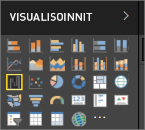

# Visualisoinnit Power BI -raporteissa
Visualisoinnit näyttävät merkityksellisiä tietoja datasta. Power BI -raportissa voi olla yksittäinen visualisointi yhdellä sivulla tai sivukaupalla visualisointeja. Power BI -palvelussa visualisointeja voi [kiinnittää raporteista koontinäyttöihin](../service-dashboard-pin-tile-from-report.md). 

On tärkeää erottaa raporttien *luojat* niiden *kuluttajista*. Jos muodostat tai muokkaat raporttia, olet luoja.  Luojilla on raportin ja sen pohjana olevan tietojoukon muokkausoikeudet. Power BI Desktopissa tämä tarkoittaa, että voit avata tietojoukon tietonäkymässä ja luoda visualisointeja raporttinäkymässä. Power BI -palvelussa tämä tarkoittaa, että voit avata tietojoukon tai raportin editorin [muokkausnäkymässä](../consumer/end-user-reading-view.md). Jos raportti tai koontinäyttö on [jaettu kanssasi](../consumer/end-user-shared-with-me.md), olet raportin **kuluttaja**. Voit tarkastella ja käsitellä raporttia ja sen visualisointeja, mutta et voi tallentaa muutoksia.

Power BI:ssä on monta erilaista visualisointityyppiä käytettävissä suoraan VISUALISOINNIT-ruudusta. 

Voit myös hakea lisää vaihtoehtoja [Microsoft AppSource -yhteisösivustossa](https://appsource.microsoft.com), josta voit ladata Microsoftin ja yhteisön tarjoamia [mukautettuja visualisointeja](https://appsource.microsoft.com/marketplace/apps?product=power-bi-visuals&page=1).    

<iframe width="560" height="315" src="https://www.youtube.com/embed/SYk_gWrtKvM?list=PL1N57mwBHtN0JFoKSR0n-tBkUJHeMP2cP" frameborder="0" allowfullscreen></iframe>

  Jos olet uusi Power BI -käyttäjä tai haluat kerrata, löydät Power BI -visualisointien perusteet alla olevien linkkien kautta.  Vaihtoehtoisesti voit hakea lisätietoja sisällysluettelosta (artikkelin vasemmassa reunassa).

## Visualisoinnin lisääminen Power BI:ssä
[Luo visualisointeja](power-bi-report-add-visualizations-i.md) raporttien sivuilla. Selaa [käytettävissä olevien visualisointien ja niiden opetusohjelmien luetteloa.](power-bi-visualization-types-for-reports-and-q-and-a.md) 

## Mukautetun visualisoinnin lataaminen ja käyttäminen Power BI:ssä
Lisää oma tai [Microsoft AppSource -yhteisösivustosta](https://appsource.microsoft.com/marketplace/apps?product=power-bi-visuals) löytämäsi mukautettu visualisointi. Oletko luova henkilö? Tutustu lähdekoodiimme ja luo [kehittäjätyökalujen](../service-custom-visuals-getting-started-with-developer-tools.md) avulla uusi visualisointityyppi. Halutessasi voit myös [jakaa sen yhteisön kanssa](../developer/office-store.md)

## Visualisointityypin muuttaminen
Kokeile [muuttaa visualisointityyppiä](power-bi-report-change-visualization-type.md) ja tutki, mikä toimii parhaiten omien tietojesi kohdalla.

## Visualisoinnin kiinnittäminen
Power BI -palvelussa visualisointeja voi [kiinnittää koontinäyttöön](../service-dashboard-pin-tile-from-report.md) ruutuna. Jos muutat visualisointia kiinnittämisen jälkeen, koontinäytön ruutu ei muutu – jos se oli viivakaavio, se pysyy viivakaaviona, vaikka muuttaisit sen raportissa rengaskaavioksi.

## Seuraavat vaiheet
[Visualisointityypit Power BI:ssä](power-bi-visualization-types-for-reports-and-q-and-a.md)