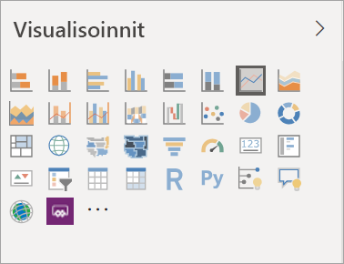
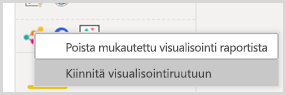
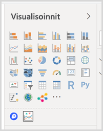

# Visualisoinnit Power BI -raporteissa

[!INCLUDE[consumer-appliesto-yyyn](../includes/consumer-appliesto-yyyn.md)]    

Visualisoinnit näyttävät merkityksellisiä tietoja datasta. Power BI -raportissa voi olla yksittäinen visualisointi yhdellä sivulla tai sivukaupalla visualisointeja. Power BI -palvelussa visualisointeja voi [kiinnittää raporteista koontinäyttöihin](../create-reports/service-dashboard-pin-tile-from-report.md).

On tärkeää erottaa toisistaan raporttien *suunnittelija* ja *kuluttajat*.  Jos luot tai muokkaat raporttia, olet suunnittelija.  Suunnittelijoilla on raportin ja sen pohjana olevan tietojoukon muokkausoikeudet. Power BI Desktopissa tämä tarkoittaa, että voit avata tietojoukon tietonäkymässä ja luoda visualisointeja raporttinäkymässä. Power BI -palvelussa tämä tarkoittaa, että voit avata tietojoukon tai raportin editorin [muokkausnäkymässä](../consumer/end-user-reading-view.md). Jos raportti tai koontinäyttö on [jaettu kanssasi](../consumer/end-user-shared-with-me.md), olet raportin *kuluttaja*. Voit tarkastella ja käsitellä raporttia ja sen visualisointeja, mutta et voi tehdä yhtä paljon muutoksia kuin *suunnittelija*.

Power BI:ssä on monta erilaista visualisointityyppiä käytettävissä suoraan Visualisoinnit-ruudusta.

Voit myös hakea lisää vaihtoehtoja [Microsoft AppSource -yhteisösivustossa](https://appsource.microsoft.com), josta voit [ladata](https://appsource.microsoft.com/marketplace/apps?page=1&product=power-bi-visuals) Microsoftin ja yhteisön tarjoamia [Power BI -visualisointeja](../developer/visuals/custom-visual-develop-tutorial.md).

Jos olet uusi Power BI -käyttäjä tai haluat kerrata, löydät Power BI -visualisointien perusteet alla olevien linkkien kautta.  Vaihtoehtoisesti voit hakea lisätietoja sisällysluettelosta (artikkelin vasemmassa reunassa).

## Visualisoinnin lisääminen Power BI:ssä

[Luo visualisointeja](power-bi-report-add-visualizations-i.md) raporttien sivuilla. Selaa [käytettävissä olevien visualisointien ja niiden opetusohjelmien luetteloa.](power-bi-visualization-types-for-reports-and-q-and-a.md) 

## Mukautetun visualisoinnin lataaminen ja käyttäminen Power BI:ssä

Lisää oma tai [Microsoft AppSource -yhteisösivustosta](https://appsource.microsoft.com/marketplace/apps?product=power-bi-visuals) löytämäsi mukautettu visualisointi. Oletko luova henkilö? Tutustu lähdekoodiimme ja luo [kehittäjien työkalujen](../developer/visuals/custom-visual-develop-tutorial.md) avulla uusi visualisointityyppi. Halutessasi voit [jakaa sen yhteisölle](../developer/visuals/office-store.md). Saat lisätietoja mukautetun visualisoinnin kehittämisestä [Power BI:n mukautetun visualisoinnin kehittäminen](../developer/visuals/custom-visual-develop-tutorial.md) -ohjeartikkelista.

## Visualisointiruudun räätälöinti (esikatselu)

Jos käytät samaa mukautettua visualisointia useissa raporteissa, voit kiinnittää sen visualisointiruutuusi. Jos haluat kiinnittää visualisoinnin, napsauta sitä hiiren kakkospainikkeella ja kiinnitä se ruutuun.

Kun visualisointi on kiinnitetty, se liikkuu muiden oletusvisualisointien mukana. Tämä visualisointi on nyt yhdistetty tiliin, jolla olet kirjautuneena, joten uudet luomasi raportit sisältävät automaattisesti tämän visualisoinnin, jos olet kirjautuneena. Tämän ansiosta voit standardoida tietyn visualisoinnin todella helposti ilman, että sinun täytyy lisätä se jokaiseen raporttiin.

Kun tämä toiminto on esikatseluvaiheessa, näet kiinnitetyt visualisointisi vain Power BI Desktopissa. Lisäksi tämä toiminto edellyttää, että olet kirjautuneena.

## Visualisointityypin muuttaminen

Kokeile [muuttaa visualisointityyppiä](power-bi-report-change-visualization-type.md) ja tutki, mikä toimii parhaiten omien tietojesi kohdalla.

## Visualisoinnin kiinnittäminen

Power BI -palvelussa visualisointeja voi [kiinnittää koontinäyttöön](../create-reports/service-dashboard-pin-tile-from-report.md) ruutuna. Jos muutat visualisointia kiinnittämisen jälkeen, koontinäytön ruutu ei muutu – jos se oli viivakaavio, se pysyy viivakaaviona, vaikka muuttaisit sen raportissa rengaskaavioksi.

## Rajoitukset ja huomioon otettavat seikat
- Visualisointi saattaa latautua hitaasti. Tämä riippuu tietolähteestä ja kenttien määrästä (mittarit tai sarakkeet).  Suosittelemme luettavuus- ja suorituskykysyistä, että käytät visualisoinneissa enintään yhteensä 10–20 kenttää. 

- Visualisoinnissa voi käyttää enintään 100 kenttää (mittarit tai sarakkeet). Jos visualisointisi lataaminen epäonnistuu, pienennä kenttien määrää.   

## Seuraavat vaiheet

* [Visualisointityypit Power BI:ssä](power-bi-visualization-types-for-reports-and-q-and-a.md)
* [Power BI -visualisoinnit](../developer/visuals/power-bi-custom-visuals.md)
