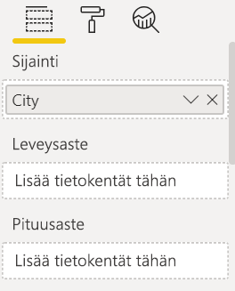
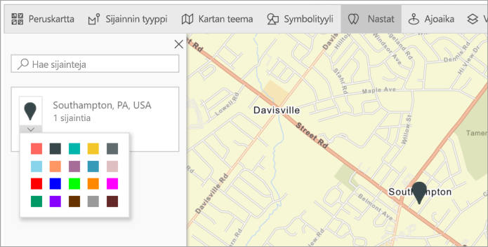
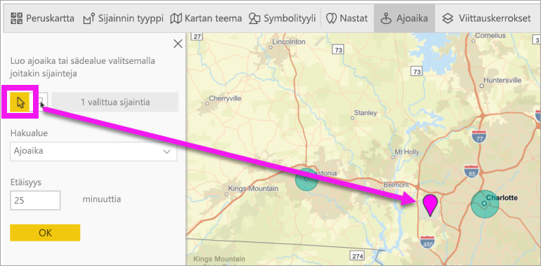
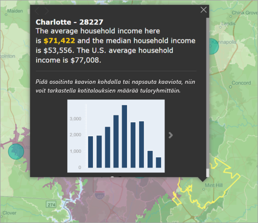
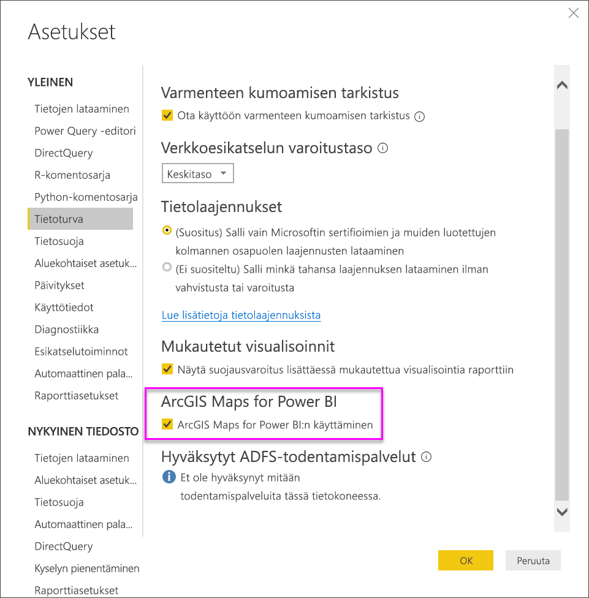

# ArcGIS-karttojen luominen Power BI Desktopissa

[!INCLUDE [power-bi-visuals-desktop-banner](../includes/power-bi-visuals-desktop-banner.md)]

Tämä opetusohjelma on kirjoitettu ArcGIS-karttaa Power BI:lle luovan henkilön näkökulmasta. Kun *suunnittelija* jakaa Power BI:lle tehdyn ArcGIS-kartan työtoverille, kyseinen työtoveri voi tarkastella ja käsitellä karttaa mutta ei tallentaa muutoksia. Lisätietoja ArcGIS-kartan tarkastelemisesta on ohjeartikkelissa [ArcGIS Maps for Power BI -karttojen käsittely](power-bi-visualizations-arcgis.md).

ArcGIS-kartat ja Power BI yhdessä tekevät kartoista muutakin kuin vain esitettäviä pisteitä. Valitse pohjakarttoja, sijaintityyppejä, teemoja, symbolityylejä ja viittauskerroksia, joiden avulla voit luoda upeita, informatiivisia karttavisualisointeja. Määräävien tietokerrosten yhdistäminen tila-analyysiä sisältävien karttojen kanssa mahdollista visualisaation tietojen entistä tarkemman ymmärtämisen.

 Mobiililaitteella voit tarkastella ja käsitellä ArcGIS Maps for Power BI -karttoja, mutta et luoda niitä. Katso [ArcGIS-karttojen käsittely](power-bi-visualizations-arcgis.md).

> [!TIP]
> GIS on lyhenne sanoista Geographic Information Systems (paikkatietojärjestelmät).

Alla olevassa esimerkissä tummanharmaa pohja kuvastaa alueellista myyntiä lämpökarttana, jota verrataan demografisen kerroksen sisältämiin vuoden 2016 mediaanituloihin. ArcGIS Maps for Power BI:n monipuolisten kartoitusominaisuuksien, demografisten tietojen ja karttavisualisointien ansiosta voit kertoa tarinasi parhaalla mahdollisella tavalla.

> [!TIP]
> Katso esimerkkejä ja lue käyttäjien kokemuksia [Esrin ArcGIS Maps for Power BI -sivulta](https://www.esri.com/powerbi). Katso myös Esrin ohjeartikkeli [ArcGIS Maps for Power BI:n käytön aloitus](https://doc.arcgis.com/en/maps-for-powerbi/get-started/about-maps-for-power-bi.htm).

## Käyttäjän suostumus
ArcGIS Maps for Power BI on Esrin (https://www.esri.com) ) toimittama. ArcGIS Maps for Power BI:n käyttöön sovelletaan Esrin käyttöehtoja ja tietosuojakäytäntöä. Power BI -käyttäjien, jotka haluavat käyttää ArcGIS Maps for Power BI -visualisointeja, on ilmaistava suostumuksensa valintaikkunassa.

**Resurssit**

[Käyttöehdot](https://go.microsoft.com/fwlink/?LinkID=826322)

[Tietosuojakäytäntö](https://go.microsoft.com/fwlink/?LinkID=826323)

[ArcGIS Maps for Power BI -tuotesivu](https://www.esri.com/powerbi)

## Edellytykset

Tässä opetusohjelmassa käytetään [Power BI Desktopia ja jälleenmyyntianalyysimallin PBIX-tiedostoa](https://download.microsoft.com/download/9/6/D/96DDC2FF-2568-491D-AAFA-AFDD6F763AE3/Retail%20Analysis%20Sample%20PBIX.pbix). ArcGIS Maps for Power BI voidaan luoda myös Power BI-palvelua käyttämällä. 

1. Valitse valikkorivin vasemmasta yläosasta **Tiedosto** \> **Avaa**
   
2. Etsi paikalliseen tietokoneeseesi tallennettu **Jälleenmyyntianalyysimallin PBIX-tiedosto**.

1. Avaa **Jälleenmyyntianalyysimalli** raporttinäkymässä .

1. Valitse  uuden sivun lisäämiseksi.

   
## ArcGIS Maps for Power BI -karttavisualisointien luominen

Katso, miten Will luo muutamia erilaisia visualisointeja, ja kokeile itse alla olevien ohjeiden mukaisesti. Käytä pohjana [jälleenmyyntianalyysimallin .PBIX-tiedostoa](../sample-datasets.md).
    

   > [!NOTE]
   > Tässä videossa käytetään Power BI Desktopin vanhempaa versiota.
   > 

> [!VIDEO https://www.youtube.com/embed/EKVvOZmxg9s]

1. Valitse ArcGIS Maps for Power BI -kuvake Visualisoinnit-ruudussa.
   
        

2. Power BI lisää tyhjän mallin raportin pohjaan. Tässä opetusohjelmassa käytämme ilmaista versiota.
   
   

3. Vedä **Kentät**-ruudussa tietokenttä **Sijainti-** tai **Leveysaste-** ja/tai **Pituusaste**-säilöön. Tässä esimerkissä arvoina käytetään **Kaupunki > Kauppa**.
   
   > [!NOTE]
   > ArcGIS Maps for Power BI tunnistaa automaattisesti, kannattaako valitsemasi kentät näyttää kartalla muotona vai pisteenä. Voit muuttaa oletusasetuksia asetuksista (ks. alla).
   > 
   > 
   
    

4. Vedä **Kentät**-ruudussa mittari **Koko**-säilöön, jos haluat säätää tietojen näyttötapaa. Tässä esimerkissä arvoina käytetään **Myynti > Viime vuoden myynti**.
   
    

Olet luonut ensimmäisen ArcGIS Map for Power BI -kartan. Tarkennetaan ja muotoillaan seuraavaksi karttaa käyttämällä peruskarttoja, sijaintityyppejä, teemoja ja muita.

## ArcGIS Maps for Power BI:n asetukset ja muotoilu
**ArcGIS Maps for Power BI** -muotoiluominaisuuksien käyttö:

1. Voit käyttää lisätoimintoja valitsemalla **Lisää toimintoja** (...) visualisoinnin oikeasta yläkulmasta ja valitsemalla **Muokkaa**.
   
   
   
   Visualisointi laajenee ja käytettävissä olevat ominaisuudet näytetään yläreunassa. Kunkin toiminnon valitseminen avaa tehtäväruudun, jossa on yksityiskohtaisia asetuksia. 
   
   
   

> [!TIP]
> **Esri** tarjoaa [monipuolisia ](https://go.microsoft.com/fwlink/?LinkID=828772)**ArcGIS Maps for Power BI**:n ominaisuuksia koskevia ohjeita.

### Pohjakartat
Tarjolla on neljä pohjakarttaa: tummanharmaa pohja, vaaleanharmaa pohja, OpenStreetMap ja Kadut.  *Kadut* on ArcGIS:n oletuspohjakartta.

Voit käyttää pohjakarttaa valitsemalla sen tehtäväruudusta.

### Sijainnin tyyppi
ArcGIS Maps for Power BI havaitsee automaattisesti parhaan tavan näyttää tiedot kartalla. Se valitsee joko pisteet tai rajat. Sijainnin tyypin asetusten avulla voit hienosäätää näitä valintoja.

**Rajat** toimii vain, jos tietosi sisältävät maantieteellisiä vakioarvoja. ArcGIS Maps for Power BI päättelee automaattisesti kartalla näytettävän muodon. Maantieteellisiä vakioarvoja ovat mm. maa, maakunta ja postinumero. Kuten sijaintitietoja lisättäessä, Power BI ei välttämättä tunnista, että kentän on oletusarvoisesti oltava raja tai se ei ehkä löydä tietojesi rajoja.  

### Kartan teema
Voit valita neljästä kartan teemasta. Power BI valitsee automaattisesti joko **Vain sijainti**- tai **Koko**-teemat sen perusteella, mitä lisäsit **Sijainti**- ja **Koko**-säilöön. Karttamme on valinnut vaihtoehdon **Koko**, koska lisäsimme kenttiä molempiin säilöihin. Kokeile muita teemoja ja valitse jälleen **Koko** ennen seuraavaan vaiheeseen siirtymistä.  

<table>
<tr><th>Teema</th><th>Kuvaus</th>
<tr>
<td>Vain sijainti</td>
<td>Piirtää arvopisteet tai täytetyt rajat kartalle Sijainti-säilöön lisäämäsi kentän perusteella.</td>
</tr>
<tr>
<td>Lämpökartta</td>
<td>Piirtää kartalle tietojen painotuksen. Korkeamman aktiviteetin tai arvon alueita edustavat voimakkaammat ja hohtavat värit. </td>
</tr>
<tr>
<td>Koko</td>
<td>Piirtää arvopisteet kartalle Koko-säilöön lisäämäsi kentän perusteella.</td>
</tr>
<tr>
<td>Klusterointi</td>
<td>Määritetyn klusterin säteen pisteet ryhmitellään yhdeksi symboliksi, joka edustaa kartta-alueen pisteiden määrää. </td>
</tr>
</table>

### Symbolityyli
Symbolityylien avulla voit hienosäätää tietojen esitystapaa kartalla. Symbolityylit ovat tilannekohtaisia. Ne vaihtelevat valitun sijainnin tyypin ja kartan teeman mukaan. Alla olevassa esimerkissä näkyy Kartan teemana **Koko** ja useita läpinäkyvyyteen, tyyliin ja kokoon tehtyjä symbolityylin säätöjä. 

### Nastat
Voit kiinnittää huomion karttapisteisiin lisäämällä nastoja.  

1. Valitse **Nastat**-välilehti.
2. Kirjoita avainsanoja (esim. paikka, kiinnostava kohde) hakuruutuun ja tee valinta avattavasta valikosta. Kartalle ilmestyy symboli, johon näkymä lähennetään automaattisesti. Hakutulokset tallennetaan Nastat-ruudun sijaintikortteihin. Voit tallentaa enintään 10 sijaintikorttia.
   
   
3. Power BI lisää nastan kyseiseen sijaintiin. Voit muuttaa nastan väriä.
   
   
4. Lisää ja poista nastoja.
   
   

### Ajoaika
Ajoaika-ruudulla voit valita sijainnin ja määrittää sitten, mitkä kartan kohteet ovat tietyllä säteellä tai tietyn ajoajan päässä. Alla olevassa esimerkissä näkyy 50-mailin säde Washington DC:stä.  Luo oma ajoaikakerros noudattamalla alla olevia ohjeita. 
    

1. Valitse yksittäinen valinta -työkalu ja sitten nasta- tai kupla. Tässä esimerkissä olemme valinneet Charlotte Douglasin lentokentälle nastan.

   
   
   > [!TIP]
   > Sijainti on helpompi valita, jos lähennät karttanäkymää. Voit lähentää käyttämällä +-kuvaketta tai hiiren vierityspainiketta.
   > 
   > 
2. Oletetaan, että olet lentämässä Charlotte Douglasin lentokentälle muutamaksi päiväksi ja haluat tietää, mitkä ketjumyymälöistäsi ovat kohtuullisen ajomatkan päässä. Muuta hakualueeksi **Ajoaika** ja etäisyydeksi **25** minuuttia. Valitse OK.    
   
    

    

3. 25 minuutin ajomatkan sisällä on kaksi myymälää. Säde näkyy violettina. Voita valita minkä tahansa sijainnin ja tarkastella sen tietoja. Vaihtoehtoisesti voit muotoilla sädettä muuttamalla sen väriä ja ääriviivoja.
   
    

### Viittauskerros
#### Viittauskerros - Demografiset tiedot
ArcGIS Maps for Power BI sisältää erilaisia demografisia kerroksia, jotka auttavat tietojen kontekstualisoinnissa Power BI:ssä.

1. Valitse **Viittauskerros**-välilehti ja valitse **Demografiset tiedot**.
2. Luettelossa kunkin kerroksen vieressä on valintaruutu. Valitse valintaruutu lisätäksesi kyseisen kerroksen kartalle.  Tässä esimerkissä olemme lisänneet kotitalouksien keskimääräiset tulot. 
   
    
3. Jokainen kerros on vuorovaikutteinen. Näytä tiedot viemällä hiiren osoitin kuplan päälle. Napsauttamalla varjostettua aluetta voit tarkastella tietoja kaaviomuodossa. Tässä olemme valinneet postinumeron 28227, ja meillä on kaksi kaaviota, joita voimme tarkastella.
   
    

#### Viittauskerros - ArcGIS
ArcGIS Online tarjoaa organisaatioille mahdollisuuden julkaista julkisia verkkokarttoja. Esri tarjoaa myös valvotut verkkokartat Living Atlas -järjestelmän kautta. ArcGIS-välilehdessä voit tehdä hakuja kaikista julkisista verkkokartoista ja Living Atlas -kartoista ja lisätä niitä kartan viittauskerroksiksi.

1. Valitse **Viittauskerros**-välilehti ja sitten **ArcGIS**.
2. Kirjoita hakusanat ja valitse sitten karttakerros. Tässä esimerkissä on käytetty USA:n edustajainhuoneen vaalipiirejä.
   
    
3. Saat tiedot valitsemalla varjostetun alueen, jolloin voit avata *Valitse viittauskerroksesta*: Valitse viittauskerroksesta rajat tai objektit viittauskerroksen valintatyökalun avulla.

 

## Arvopisteiden valinta
ArcGIS Maps for Power BI tarjoaa viisi valintatilaa, joiden avulla voit valita tiedot tarkasti ja nopeasti.

Voit vaihtaa valintatilaa pitämällä kohdistinta alla olevassa kuvassa näkyvän yksittäinen valinta -työkalun kuvakkeen päällä. Tämä laajentaa piilotetun palkin lisätyökalut näkyviin:

Jokaisella työkalulla on yksilöivä rooli, jonka avulla voit valita tiedot: 

 Valitse yksittäisiä arvopisteitä.

 Piirrä suorakulmio kartalle ja valitse siihen sisältyvät arvopisteet.

 Voit käyttää rajauksia tai monikulmioita viittauskerroksissa ja valita siten sisäpuolelle jäävät arvopisteet.

 Voit valita tietoja puskurikerroksen avulla.

 Voit valita keskenään samanlaiset arvopisteet.

> [!NOTE]
> Voit valita enintään 250 arvopistettä kerrallaan.
> 
> 

 

## Ohjeiden hakeminen
**Esri** tarjoaa [monipuolisia ](https://go.microsoft.com/fwlink/?LinkID=828772)**ArcGIS Maps for Power BI**:n ominaisuuksia koskevia ohjeita.

Voit esittää kysymyksiä, hakea ajantasaisimpia tietoja, ilmoittaa ongelmista ja hakea vastauksia [**ArcGIS Maps for Power BI**:tä käsittelevästä Power BI -yhteisökeskustelusta](https://go.microsoft.com/fwlink/?LinkID=828771).

Jos sinulla parannusehdotus, lähetä se [Power BI -idealuetteloon](https://ideas.powerbi.com).

 

## ArcGIS Maps for Power BI:n käytön hallinta organisaatiossa
Power BI antaa suunnittelijoiden, vuokraajien järjestelmänvalvojien ja IT-järjestelmänvalvojien valita, käytetäänkö ArcGIS Maps for Power BI:tä. Alla on vaiheita, jotka kukin rooli voi toteuttaa. 

### Suunnittelijan valinnat
Power BI Desktopissa suunnittelijat voivat poistaa ArcGIS Maps for Power BI:n käytöstä suojaus-välilehdessä. Valitse **Tiedosto** > **Asetukset ja vaihtoehdot** ja valitse sitten **Asetukset** > **Tietoturva**. Kun ArcGIS Maps on poistettu käytöstä, sitä ei ladata oletusarvoisesti.

### Vuokraajan järjestelmänvalvojan asetukset
PowerBI.comissa vuokraajan järjestelmänvalvojat voivat poistaa ArcGIS Maps for Power BI:n käytöstä kaikilta käyttäjiltä. Valitse **Asetukset** > **Hallintaportaali** > **Vuokraaja-asetukset**. Käytöstä poiston jälkeen Power BI:n Visualisoinnit-ruudussa ei enää näytetä ArcGIS Maps for Power BI -kuvaketta.

### IT-järjestelmänvalvojan asetukset
Power BI Desktop tukee **ryhmäkäytännön** käyttämistä ArcGIS Maps for Power BI:n poistamiseen käytöstä kaikissa organisaation tietokoneissa.

<table>
<tr><th>Määrite</th><th>Arvo</th>
</tr>
<tr>
<td>avain</td>
<td>Ohjelmisto\Käytännöt\Microsoft\Power BI Desktop&lt;/td&gt;
</tr>
<tr>
<td>valueName</td>
<td>EnableArcGISMaps</td>
</tr>
</table>

Arvo 1 (desimaali) ottaa ArcGIS Maps for Power BI:n käyttöön.

Arvo 0 (desimaali) poistaa ArcGIS Maps for Power BI:n käytöstä.

## Huomioitavat asiat ja rajoitukset
ArcGIS Maps for Power BI on saatavilla seuraavissa palveluissa ja sovelluksissa:

<table>
<tr><th>Palvelu/sovellus</th><th>Käytettävyys</th></tr>
<tr>
<td>Power BI Desktop</td>
<td>Kyllä</td>
</tr>
<tr>
<td>Power BI -palvelu (app.powerbi.com)</td>
<td>Kyllä</td>
</tr>
<tr>
<td>Power BI -mobiilisovellukset</td>
<td>Kyllä</td>
</tr>
<tr>
<td>Power BI:n julkaise verkkoon -toiminto</td>
<td>Ei</td>
</tr>
<tr>
<td>Power BI Embedded</td>
<td>Ei</td>
</tr>
<tr>
<td>Upottaminen Power BI -palveluun (PowerBI.com)</td>
<td>Ei</td>
</tr>
</table>

Palveluita tai sovelluksia, joissa ArcGIS Maps for Power BI ei ole käytettävissä, visualisointi näkyy tyhjänä Power BI -logon yhteydessä.

Kun katuosoitteiden sijaintitietoja lisätään, vain ensimmäisten 1500 osoitteen sijaintitiedot voidaan lisätä. Paikannimien ja maiden sijaintitietoja ei lasketa 1500 osoitteen kiintiöön.

 

**Miten ArcGIS Maps ja Power BI toimivat yhdessä?**
ArcGIS Maps for Power BI on Esrin (https://www.esri.com) ) toimittama. ArcGIS Maps for Power BI:n käyttöön sovelletaan Esrin [käyttöehtoja](https://go.microsoft.com/fwlink/?LinkID=8263222) ja [tietosuojakäytäntöä](https://go.microsoft.com/fwlink/?LinkID=826323). Power BI -käyttäjien, jotka haluavat käyttää ArcGIS Maps for Power BI -visualisointeja, on ilmaistava suostumuksensa valintaikkunassa (ks. Käyttäjän suostumus -kohta).  Esrin ArcGIS Maps for Power BI:n käyttöön sovelletaan Esrin käyttöehtoja ja tietosuojakäytäntöä, joihin on linkki suostumuksen valintaikkunassa. Kunkin käyttäjän on ilmaistava suostumuksensa ennen ArcGIS Maps for Power BI:n ensimmäistä käyttökertaa. Kun käyttäjä antaa suostumuksensa, visualisointiin sidotut tiedot lähetetään Esrin palveluihin, joissa niihin lisätään vähintään sijaintitiedot. Tämä tarkoittaa sijaintitietojen muuntamista pituus- ja leveyspiireiksi, jotka voidaan esittää kartalla. Voit olettaa, että kaikki visualisointeihin sidotut tiedot voidaan lähettää Esrin palveluihin. Esri tarjoaa mm. pohjakarttojen, paikkatietojen analyysin ja sijaintitietojen lisäämisen tapaisia palveluita. ArcGIS Maps for Power BI:n visualisoinnit toimivat yhdessä näiden palvelujen kanssa Esrin tarjoaman ja ylläpitämän suojatun SSL-sertifioidun yhteyden avulla. Lisätietoja ArcGIS Maps for Power BI:stä on tarjolla Esrin [ArcGIS Maps for Power BI -tuotesivulla](https://www.esri.com/powerbi).

Kun käyttäjä tilaa Plus-version Esrin ArcGIS Maps for Power BI:n kautta tarjoaman tilauksen kautta, käyttäjän ja Esrin välillä on suora suhde. Power BI ei lähetä käyttäjän henkilökohtaisia tietoja Esrille. Käyttäjä kirjautuu Esrin tarjoamaan AAD-sovellukseen omalla AAD-tunnuksellaan ja ilmaisee luottavansa siihen. Tällöin käyttäjä jakaa henkilökohtaiset tietonsa suoraan Esrille. Kun käyttäjä lisää Plus-sisältöä ArcGIS Maps for Power BI -visualisointiin, kyseistä sisältöä tarkastelevilla ja muokkaavilla muilla Power BI -käyttäjillä on myös oltava Plus-tilaus. 

Jos sinulla on kysyttävää Esrin ArcGIS Maps for Power BI:n teknisestä toiminnasta, ota yhteyttä Esriin tukisivun kautta.

**Mitä tietoja Esrille lähetetään?**
Lisätietoja Esrille lähetettävistä tiedoista on Esrin [dokumentaatiosivustossa](https://doc.arcgis.com/en/maps-for-powerbi/get-started/data-transfer.htm).

**Onko ArcGIS Maps for Power BI:n käyttö maksullista?**

**Esri** tarjoaa ArcGIS Map for Power BI:n käyttöön ilman lisämaksuja. Sinun on ensin hyväksyttävä käyttösopimus.  

**Saan Power BI Desktopissa virhesanoman, jonka mukaan välimuisti on täynnä**

Tämä on virhe, jota korjataan parhaillaan.  Voit tällä välin tyhjentää välimuistin yrittämällä poistaa tiedostot tästä sijainnista: C:\Users\\AppData\Local\Microsoft\Power BI Desktop\CEF. Käynnistä sitten Power BI uudelleen.

**Tukeeko ArcGIS Maps for Power BI Esri-muototiedostoja?**

ArcGIS Maps for Power BI havaitsee automaattisesti yleiset rajat, kuten maiden/alueiden, osavaltioiden/provinssien ja postinumeroalueiden rajat. Jos sinun on lisättävä omia muotoja, voit tehdä sen käyttämällä [Shape Maps for Power BI Desktopia](desktop-shape-map.md).

**Voinko tarkastella ArcGIS-karttoja offline-tilassa?**

Et. Power BI tarvitsee verkkoyhteyden karttojen näyttämiseen.

**Voinko muodostaa yhteyden ArcGIS Online -tiliini Power BI:stä?**

Et vielä. Kun [äänestät tätä ideaa](https://ideas.powerbi.com/forums/265200-power-bi-ideas/suggestions/9154765-arcgis-geodatabases), saat sähköpostiviestin kun ominaisuuden kehittäminen aloitetaan.  

## Seuraavat vaiheet
[Kanssasi jaetun ArcGIS-kartan käsitteleminen](power-bi-visualizations-arcgis.md)

[Blogimerkintä, jossa ilmoitetaan ArcGIS Maps for Power BI:n saatavuudesta](https://powerbi.microsoft.com/blog/announcing-arcgis-maps-for-power-bi-by-esri-preview/)

Onko sinulla kysyttävää? [Voit esittää kysymyksiä Power BI -yhteisössä](https://community.powerbi.com/)

