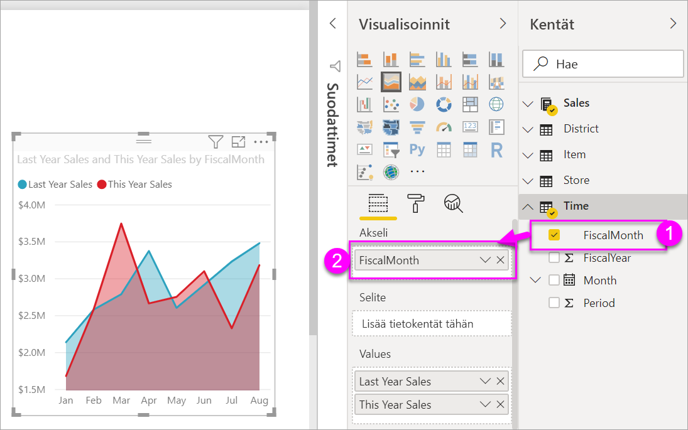
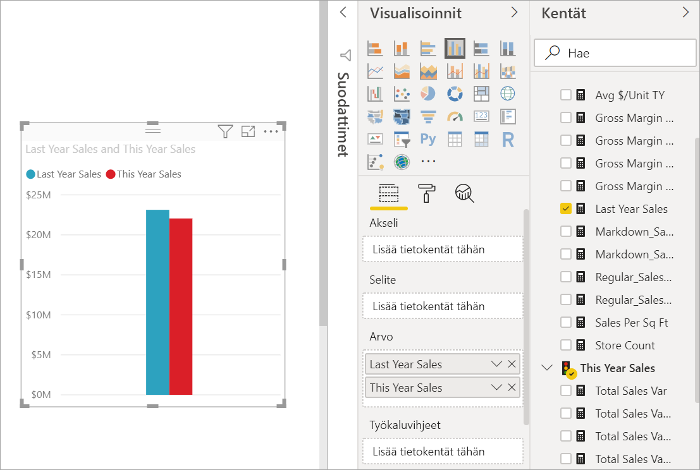
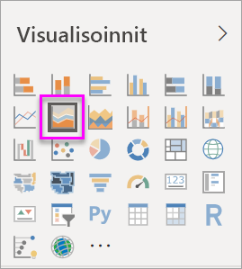
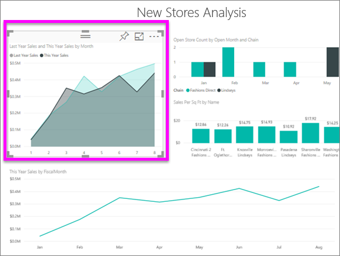
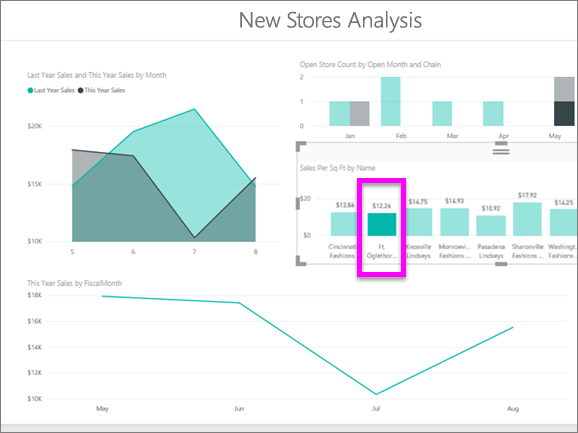

# Perusaluekaavio
Perusaluekaavio (eli kerrostettu aluekaavio) perustuu viivakaavioon. Akselin ja rivin välissä oleva alue täytetään väreillä osoittamaan määrää. 

Aluekaaviot korostavat muutoksen suuruutta ajan kuluessa, ja niiden avulla voidaan kiinnittää huomio trendin kokonaisarvoon. Esimerkiksi tiedot, jotka edustavat tuottoa ajan kuluessa, voidaan kuvata aluekaaviossa kokonaistuoton korostamiseksi.

## Milloin kannattaa käyttää perusaluekaaviota
Perusaluekaavio on hyvä valinta:

* jos haluat tarkastella ja vertailla määrän trendiä aikasarjassa 
* yksittäisille sarjoille, jotka edustavat fyysisesti laskettavissa olevaa joukkoa

### Edellytykset
 - Power BI -palvelu
 - Jälleenmyyntianalyysimalli

Seurataksesi kirjaudu Power BI:hin, valitse **Nouda tiedot \> Mallit \> Jälleenmyyntianalyysimalli > Yhdistä** ja valitse **Koontinäyttö**. 

## Perusaluekaavion luominen
 

1. Avaa Jälleenmyyntianalyysimalli-raportti valitsemalla Jälleenmyyntianalyysimalli-koontinäytössä **Myymälöitä yhteensä** -ruutu.
2. Avaa raportti muokkausnäkymässä valitsemalla **Muokkaa raporttia**.
3. Lisää uusi raporttisivu valitsemalla raportin alareunasta keltainen plus (+) -kuvake.
4. Luo aluekaavio, joka näyttää tämän vuoden myynnin ja edellisen vuoden myynnin kuukauden mukaan.
   
   a. Valitse Kentät-ruudussa **Myynti \> Viime vuoden myynti** ja **Tämän vuoden myynti > Arvo**.

   

   b.  Muunna kaavio takaisin perusaluekaavioksi valitsemalla Aluekaavio-kuvake Visualisoinnit-ruudussa.

   
   
   c.  Valitse **Aika\> Kuukausi** ja lisää se **Akseli**-kohtaan.   
   
   
   d.  Jos haluat näyttää kaavion kuukauden mukaan, valitse kolme pistettä (visualisoinnin oikeassa yläkulmassa) ja valitse **Lajittele kuukauden mukaan**. Jos haluat muuttaa lajittelujärjestyksen, valitse kolme pistettä uudelleen ja valitse joko **Lajittele nousevaan järjestykseen** tai **Lajittele laskevaan järjestykseen**.

## Korostaminen ja ristiinsuodatus
Lisätietoja Suodattimet-paneelin käyttämisestä saat ohjeaiheesta [Suodattimen lisääminen raporttiin](../power-bi-report-add-filter.md).

Voit korostaa kaavion tietyn alueen valitsemalla alueen tai sen yläreunan.  Toisin kuin muut visualisointityypit, jos muita visualisointeja on samalla sivulla, perusaluekaavion korostaminen ei ristiinsuodata muita visualisointeja raportin sivulla. Aluekaaviot ovat kuitenkin ristiinsuodatuksen kohteena muiden raportin sivulla olevien visualisointien käynnistämänä. 

1. Kokeile sitä valitsemalla aluekaavio ja kopioimalla se toiselle raportin sivulle (CTRL-C ja CTRL-V).
2. Valitse yksi sävytetyistä alueista ja sen jälkeen toinen. Huomaa, että tällä ei ole vaikutusta muihin sivulla oleviin visualisointeihin.

    

3. Valitse nyt elementti sivun muista visualisoinneista. Se voi olla esimerkiksi sarakekaavio tai kuukausi viivakaaviossa. Huomaa, miten tämä suodattaa aluekaavion.  

     

Lisätietoja on artikkelissa [Visualisointitoimet raporteissa](../service-reports-visual-interactions.md)

## Huomioon otettavat seikat ja vianmääritys   
* [Tee raportista helpommin käytettävä toimintarajoitteisille ihmisille](../desktop-accessibility.md)
* Perusaluekaaviot eivät toimi arvojen vertailussa kerrostettujen alueiden eston vuoksi. Power BI käyttää läpinäkyvyyttä osoittamaan alueiden päällekkäisyyttä. Se kuitenkin toimii hyvin vain kahdella tai kolmella eri alueella. Kun haluat verrata trendiä yli kolmeen mittariin, kokeile viivakaavioiden käyttämistä. Kun haluat verrata määrää yli kolmeen mittariin, kokeile puukartan käyttämistä.

## Seuraava vaihe
[Raportit Power BI:ssä](power-bi-visualization-card.md)  

