# <a name="best-design-practices-for-reports-and-visuals"></a>Raporttien ja visualisointien parhaat suunnittelukäytännöt

Tämä artikkeli sisältää raporttien parhaat suunnittelukäytännöt Power BI:ssä. Siinä käsitellään suunnitteluperiaatteita, joita voit noudattaa omissa raporteissasi sekä raporttiin sisältyvissä sivuissa ja yksittäisissä visualisoinneissa. Monet näistä parhaista käytännöistä soveltuvat myös koontinäyttöjen suunnitteluun.

> [!NOTE]
> Tämän artikkelin suositukset on tarkoitettu ohjenuoraksi tilanteissa, joissa niistä voi olla hyötyä. Alla kuvatun jokaisen periaatteen osalta on yleensä päteviä syitä ”rikkoa sääntöä”.

Toivomme, että tämä artikkeli antaa sinulle alkusysäyksen ja että sovellat oppimaasi omiin raportteihin ja visualisointeihin sekä jatkat keskustelua [Microsoft Power BI -yhteisössä](http://community.powerbi.com/). BI-raportin suunnittelu ja visualisoinnin käyttö on juuri nyt kuuma aihealue. Monet ajatusjohtajat, blogikirjoittajat ja verkkosivustot tarkastelevat BI-raportin suunnittelua perinpohjaisesti. Olemme luetelleet niistä muutamia artikkelin lopussa.

> *Tietoja tulvii joka nurkasta. Kyse ei ole niiden liian suuresta määrästä vaan siitä, ettemme tiedä, miten taltuttaa niitä.*
-- Stephen Few

## <a name="a-look-at-the-landscape-and-terminology"></a>Katsaus käyttöympäristöön ja terminologiaan

Power BI -raportissa voi olla yksi tai useampi raporttisivu. Kaikkiin sivuihin viitataan yhteisesti raporttina. Raportin peruselementtejä ovat visualisoinnit (tunnetaan myös visuaaleina), erilliset kuvat ja tekstiruudut. Siihen liittyy lukemattomia muotoiluvaihtoehtoja yksittäisistä arvopisteistä raportin elementteihin ja itse raporttisivuun.

Aloitamme raportin suunnitteluvaiheesta, jatkamme raportin suunnittelun perusperiaatteisiin, käsittelemme visuaalisen suunnittelun periaatteita ja pureudumme lopuksi yksittäisten visualisointityyppien parhaisiin käytäntöihin.

Löydät syvällisiä neuvoja ja ohjeita Power BI -raporttien luomisesta ja käyttämisestä artikkelista [Power BI:n käyttäminen](https://powerbi.microsoft.com/learning/).

## <a name="before-you-build-your-first-visualization-focus-on-requirements"></a>Keskity ennen ensimmäisen visualisoinnin luomista vaatimuksiin

Raportin luominen alkaa jo ennen ensimmäisen visualisoinnin luomista, koska hyvän raportin perustana on suunnittelu. Tutustu käsiteltäviin tietoihin ja kirjoita ylös raportin vaatimukset. Esitä itsellesi seuraavat kysymykset:

* Mikä on liiketoimintatarve?

* Miten lukijat aikovat käyttää näitä tietoja?

* Kuka aikoo käyttää näitä tietoja?

* Mitä päätöksiä lukija pystyy tekemään tämän raportin perusteella?

Suunnittelu perustuu näistä kysymyksistä saatuun vastaukseen. Jokainen raportti kertoo tarinan. Varmista, että tarina vastaa liiketoimintatarvetta. Voi olla houkuttelevaa lisätä visualisointeja, jotka näyttävät dramaattisia merkityksellisiä tietoja. Jos nämä tiedot eivät kuitenkaan vastaa liiketoimintatarpeita, raportista ei ole hyötyä – ja itse asiassa nämä visualisoinnit saattavat häiritä lukijoiden keskittymistä. Lisäksi saatat huomata, ettet pysty tekemään päätöstä näiden tietojen perusteella. Voitko tämän raportin avulla mitata tärkeitä asioita?

Voit käyttää raportteja muun muassa valvontaan, selvittämiseen, seurantaan, ennustamiseen, mittaamiseen, hallintaan ja testaukseen. Esimerkiksi liiketoimintatarpeena voi olla suorituskykyä mittaava myyntiraportti. Voit esimerkiksi suunnitella raportin, joka tarkastelee nykyistä myyntiä vertaamalla sitä aiempaan myyntiin ja kilpailijoihin. Se voi myös sisältää suorituskykyilmaisimia, jotka käynnistävät hälytyksiä. Lukijat voivat myyntilukujen perusteella havaita myymälöiden sulkemisia tai toimitusketjuongelmia, jotka voivat vaikuttaa myyntiin. He voivat myös ehkä tarkastella myyntiä esimerkiksi myymälän, alueen, tuotteen ja vuodenajan mukaan.

Tiedä raportin asiakkaat. Suunnittele raportti, jossa käytetään tuttua terminologiaa ja annetaan tietoja asiakkaiden tietotasoa vastaavalla yksityiskohtaisuuden ja monimutkaisuuden tasolla. Onko asiakastyyppejä useampia? Yksi raporttityyppi ei aina sovi kaikille. Suunnittele erillisiä raporttisivuja, jotka perustuvat asiantuntemukseen. Varmista, että otsikoit jokaisen sivun selvästi, jotta asiakkaat löytävä tarvitsemansa. Voit myös käyttää osittajia, jotta asiakkaat voivat räätälöidä sivut haluamakseen. Ota asiakas mukaan suunnitteluvaiheeseen ja vältä luomasta jotakin, jota uskot heidän tarvitsevan. Jos olet tehnyt tämän virheen, valmistaudu aloittamaan uudestaan ja toista suunnittelumenettely.

Kun olet määrittänyt liiketoimintatarpeen, asiakkaat ja sisällytettävän metriikan, valitse oikeat visualisoinnit tarinan kertomiseksi. Selvitä, miten voit esittää nämä visualisoinnit tehokkaimmin. Aloitetaanpa käsittelemällä joitakin raportin suunnittelun perusperiaatteita.

## <a name="principles-of-report-design"></a>Raportin suunnittelun periaatteet

Raporttisivun tila on rajallinen. Yksi vaikeimmista asioista onkin mahduttaa kaikkia haluamasi elementit tähän tilaan siten, että tiedot ymmärretään helposti. Älä myöskään aliarvioi visuaalisesti houkuttelevan raportin arvoa. Tärkeintä on löytää tasapaino houkuttelevan ja hyödyllisen raportin välillä.

Katsotaanpa asettelua, selkeyttä ja estetiikkaa.

### <a name="layout-of-the-report-canvas"></a>Raportin piirtoalustan asettelu

Raportin piirtoalustalla on rajallisesti tilaa. Jos et saa kaikkia elementtejä mahtumaan yhdelle raporttisivulle, voit jakaa raportin usealle sivulle. Voit räätälöidä raporttisivun tietyn kohderyhmän mukaan (esimerkiksi HR, IT, myynti, SLT). Voit halutessasi räätälöidä sen erityisen liiketoimintakysymyksen mukaan:

* ”Miten viat vaikuttavat käyttökatkoomme?”

* ”Miten markkinointikampanjamme vetoaa tunteisiin?”

On ehkä parempi lähestyä sitä asteittaisen tarinan avulla. Ensimmäinen sivu voi olla yleiskatsaus tai huomiota herättävä ”koukku”, tarinaa jatketaan toisella sivulla ja siihen syvennytään tarkemmin kolmannella sivulla jne. Jos koko raporttisi mahtuu yhdelle sivulle, tämä toimii myös. Jos näin ei ole, luo erillisiä raporttisivuja, jotka pätkivät sisällön loogisesti. Älä unohda antaa sivuille merkityksellisiä ja hyödyllisiä nimiä.

Ajattele, että täytät taidegalleriaa. Et varmaankaan laittaisi 50 taideteosta pieneen huoneeseen, jonka täyttäisit tuoleilla maalaten kunkin seinän eri värillä. Valitsisit kuraattorina vain teokset, joilla on yhteinen teema. Asettelisit ne ympäri huonetta, jotta vierailijoilla on runsaasti tilaa liikkua ja ajatella. Saatat jopa asettaa tietokortteja, joissa kuvataan vierailijoiden tarkastelemia teoksia. Sen vuoksi useimmissa moderneissa gallerioissa onkin runsaasti seiniä!

Tätä artikkelia varten aloitamme raportin esimerkillä, joka vaatii  paljon työtä. Soveltamalla suunnittelun parhaita käytäntöjä ja periaatteita voimme parantaa raporttiamme.


**Kuva 1: Tämä huonosti suunniteltu raporttisivu vaatii paljon työtä**

Yllä olevassa esimerkissä on monta tilaan liittyvää (asettelu) suunnitteluongelmaa, joita käsittelemme seuraavassa:

* tasaus, järjestys ja läheisyys

* huono tilankäyttö ja lajittelu

* tarpeettomat osat

### <a name="alignment-order-and-proximity"></a>Tasaus, järjestys ja läheisyys

Raportin elementtien asettelu vaikuttaa lukijan ymmärryskykyyn ja ohjaa häntä raporttisivun läpi. Elementtien sijoittelutapa kertoo tarinan. Tarina voi olla ”aloita tästä ja katso sitten tätä” tai ”nämä kolme elementtiä liittyvät toisiinsa”.

* Useimmissa kulttuureissa luetaan vasemmalta oikealle ja ylhäältä alas. Sijoita kaikkein tärkein elementti raportin vasempaan yläkulmaan. Järjestä sitten muut visualisoinnit siten, että tietoja selataan ja ymmärretään loogisesti.

* Sijoita elementit, jotka edellyttävät lukijaa tekemään valinnan, niiden visualisointien vasemmalle puolelle, joihin valinta vaikuttaa (esimerkiksi osittajat).

* Aseta sijaintiin liittyvät elementit lähelle toisiaan. Läheisyys merkitsee elementtien välistä suhdetta.

* Toinen tapa välittää suhteita on lisätä reunus tai väritausta liittyvien elementtien ympärille. Vastaavasti voit erottaa raportin eri osiot lisäämällä erotinviivan.

* Voit pätkiä raporttisivun osiot visuaalisesti tyhjän tilan avulla.

* Täytä raporttisivu. Jos siinä on liian paljon tyhjää tilaa, suurenna visualisointeja tai pienennä piirtoalustaa.

* Määritä raportin elementtien koot harkitusti. Älä anna tilan saatavuuden määrätä visualisoinnin kokoa.

* Tee tärkeistä elementeistä suurempia kuin muista tai lisää nuolen kaltainen visuaalinen elementti huomion kiinnittämiseksi.

* Tasaa raporttisivun elementit joko symmetrisesti tai tarkoituksella epäsymmetrisesti.

Katsotaanpa tasausta tarkemmin.

#### <a name="alignment"></a>Tasaus

Tasaus ei tarkoita sitä, että eri osien on oltava saman kokoisia. Se ei tarkoita, että sinulla on oltava sama määrä osia raportin jokaisella rivillä. Se tarkoittaa vain sitä, että sivun rakenne helpottaa sen selausta ja luettavuutta.

Näemme päivitetystä raportistamme, että olemme tasanneet raportin osat vasempaan ja oikeaan reunaan. Olemme myös tasanneet kunkin raportin rivin vaaka- ja pystysuunnassa. Osittajat ovat niiden visualisointien vasemmalla puolella, joihin ne vaikuttavat.


**Kuva 2: Huono esimerkkiraporttimme parani asettelun muokkauksilla**

Power BI sisältää työkaluja, joiden avulla voit tasata visualisointeja. Kun olet valinnut Power BI Desktopissa useita visualisointeja, voit täsmätä visualisointien sijainnin **Visualisointityökalut**-valintanauhan **Tasaa**- ja **Jaa**-vaihtoehtojen avulla.

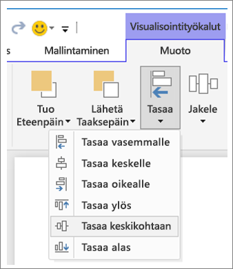

**Kuva 3a: Tasaa visualisointityökalut Power BI Desktopissa**


**Kuva 3b: Tasaa visualisointityökalut Power BI -palvelussa**

Power BI-palvelussa ja Power BI Desktopissa voit myös tarkasti hallita visualisointien kokoa ja sijaintia. Löydät tämän ohjausobjektin **Yleiset**-välilehden **Muoto**-ruudusta kaikille visualisoinneille:

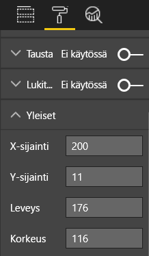

**Kuva 4: Määritä visualisoinnin tarkka sijainti**

Esimerkkiraporttisivullamme (kuva 2) Power BI tasaa kaksi korttia ja leveän reunuksen **X-sijainnissa** arvoon 200.

#### <a name="fit-to-the-space"></a>Sovita tilaan

Hyödynnä optimaalisesti käytettävissä olevaa tilaa. Jos tiedät, miten käyttäjät tarkastelevat raporttia ja näyttävät sen, suunnittele raportti sen mukaisesti. Vähennä tyhjää tilaa piirtoalustan täyttämiseksi. Pyri kaikin tavoin välttämään vierityspalkkeja yksittäisissä visualisoinneissa. Täytä tila puristamatta visualisointeja liian pieneen tilaan.

##### <a name="adjust-the-page-size"></a>Säädä sivun kokoa

Pienentämällä sivun kokoa yksittäiset elementit näyttävät suuremmilta verrattuna koko sivuun. Poista valinta sivun mistä tahansa visualisoinnista ja käyttämällä **Muoto**-ruudun **Sivun koko** -välilehteä.

Tässä on raporttisivu, jossa käytetään sivukokoa **4:3** ja sitten sivukokoa **16:9**. Huomaa, miten asettelu sopii paljon paremmin sivukokoon 16:9. Tilaa jää jopa riittävästi vierityspalkin poistamiseen toisesta visualisoinnista.

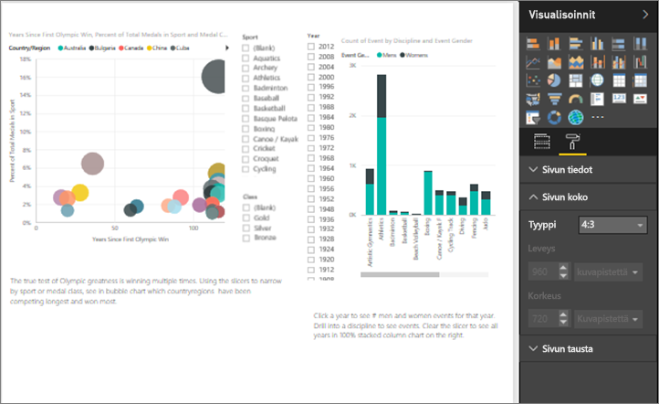

**Kuva 5a: Raportti sivukoossa 4:3**

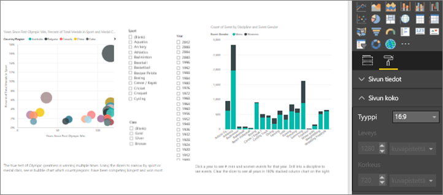

**Kuva 5b: Raportti sivukoossa 16:9**

Tarkastellaanko raporttiasi sivukoossa 4:3 vai 16:9 vai toisessa kuvasuhteessa? Pieneltä vai suurelta näytöltä? Vai tarkastellaanko raporttiasi kaikissa mahdollisissa näyttösuhteissa ja -koissa? Pidä tämä mielessä suunnittelun aikana.

Näyttää siltä, että esimerkkiraporttisivumme on hieman ahdas. Visualisointia ei ole valittuna:

1. Valitse  **Muotoilu**-välilehden avaamiseksi.

1. Laajenna **sivun kokoa**.

1. Valitse **Tyyppi**-kohdalle **Mukautettu**.

1. Muuta **Korkeus**-kohdan arvoksi **900**.

    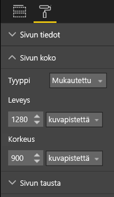

**Kuva 6: Lisää sivun korkeutta**

#### <a name="reduce-clutter"></a>Poista tarpeettomat kohdat

Tarpeettomia kohtia sisältävää raporttisivua on vaikea ymmärtää yhdellä silmäyksellä. Se voi olla jopa niin hankalaa, että lukijat eivät edes tohdi yrittää. Hankkiudu eroon kaikista raportin elementeistä, jotka eivät ole tarpeellisia. Älä lisää ominaisuuksia, jotka eivät helpota ymmärtämistä tai selaamista. Raporttisivun on välitettävä tiedot mahdollisimman selkeästi, nopeasti ja johdonmukaisesti.

Edward Tufte kutsuu sitä kirjassaan *The Visual Display of Quantitative Information* ”tiedosta käsinkirjoitukseen -suhteeksi”. Poista periaatteessa kaikki, joka ei ole olennaista.

Poistamasi turhat kohdat lisäävät tyhjää tilaa raporttisivulla. Se antaa lisää tilaa, jotta voit soveltaa parhaita käytäntöjä, joista luimme [Tasaus, järjestys ja läheisyys](#alignment-order-and-proximity) -osiossa.

Esimerkkimme näyttää nyt jo paremmalta. Olemme poistaneet tarpeettomia kohtia ja lisänneet muotoja elementtien ryhmittelemiseksi yhteen. Taustakuva on poistettu, tarpeeton nuolimuoto ja tekstiruutu on poistettu, yksi visualisointi on siirretty raportin toiselle sivulle jne. Olemme myös pidentäneet sivun kokoa tyhjän tilan lisäämiseksi.


**Kuva 7: Huonosta esimerkkiraportista on poistettu tarpeettomat kohdat**

### <a name="tell-a-story-at-a-glance"></a>Kerro tarina yhdellä silmäyksellä

Yleisenä testinä pitäisi olla se, että joku, joka ei ole nähnyt raporttia aiemmin, pystyy nopeasti ymmärtämään sen ilman selityksiä. Lukijoiden pitäisi nopealla silmäyksellä nähdä, mitä sivu käsittelee, ja mitä kukin kaava/taulukko käsittelee.

Kun lukijat tarkastelevat raporttia, katseen pitäisi keskittyä elementtiin, jota haluat heidän katsovan ensin. Jatku sitten vasemmalta oikealle ja ylhäältä alas. Voit muuttaa tätä käytöstä lisäämällä visuaalisia vihjeitä, kuten tekstiruudun selitteitä, muotoja, reunuksia, kokoja ja värejä.

#### <a name="text-boxes"></a>Tekstiruudut

Joskus visualisointien otsikot eivät riitä kertomaan tarinaa. Lisäämällä tekstiruutuja voit viestiä raportteja tarkastelevien henkilöiden kanssa. Tekstiruudut voivat kuvata raporttisivua, visualisointien ryhmää tai yksittäistä visualisointia. Ne voivat selittää tuloksia tai määritellä tarkemmin visualisointia tai sen osia tai visualisointien välisiä suhteita. Tekstiruutujen avulla voidaan kiinnittää huomio tekstiruudussa korostettujen eri kriteerien mukaan.

Valitse Power BI -palvelun yläreunan valikkopalkista **Tekstiruutu**. (Valitse Power BI Desktopissa **Tekstiruutu** valintanauhan **Lisää**-alueelta.)

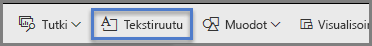

**Kuva 8: Lisää tekstiruutu Power BI -palvelussa**

Kirjoita tyhjään ruutuun teksti. Määritä sitten ohjausobjektien avulla fontti, koko, tasaus ja paljon muuta. Voit muuttaa ruudun kokoa kahvojen avulla.

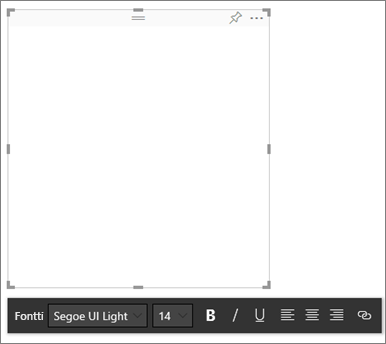

**Kuva 9: Muotoile tekstiruutua**

Älä kuitenkaan lisää liikaa tekstiä. Jos raportissa on liikaa tekstiä, se vie huomion pois visualisoinneista. Jos raporttisivulle on mielestäsi lisättävä paljon tekstiä, jota se olisi ymmärrettävä, aloita raportti uudelleen. Voitko valita eri visualisoinnin, joka kertoo paremman tarinan yksistään? Voitko muokata visualisoinnin alkuperäisiä otsikkoja siten, että niitä on helpompi ymmärtää?

#### <a name="text"></a>Teksti

Luo tekstityyliopas ja sovella sitä raportin kaikkiin sivuihin. Valitse vain pari fonttia, tekstikokoa ja väriä. Sovella tätä tyyliopasta tekstielementteihin. Voit myös soveltaa sitä fonttivalintoihin, joita teet visualisoinneissa. Katso [Otsikot ja selitteet, jotka ovat osa visualisointeja](#titles-and-labels-that-are-part-of-the-visualizations) -osiota. Määritä sääntöjä sille, milloin käytät esimerkiksi lihavointia, kursivointia, suurempaa fonttikokoa ja tiettyjä värejä. Yritä välttää koko sanan kirjoittamista isolla tai alleviivausta.

#### <a name="shapes"></a>Muodot

Muodot voivat myös helpottaa selausta ja ymmärtämistä. Voit muotojen avulla ryhmitellä liittyviä tietoja yhteen, korostaa tärkeitä tietoja ja käyttää nuolia katseen suuntaamiseen. Muodot auttavat lukijoita ymmärtämään, mistä aloittaa ja miten tulkita raporttia. Suunnittelussa tästä käytetään usein termiä *kontrasti*.

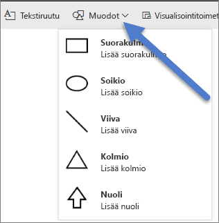

**Kuva 10a: Muodot Power BI -palvelussa**

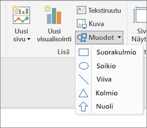

**Kuva 10b: Muodot Power BI Desktopissa**

Miltä esimerkkisivumme näyttää nyt? Kuvassa 11 näkyy siistimpi sivu, jossa on vähemmän tarpeettomia osia ja jossa on käytetty johdonmukaisesti tekstiä, fontteja ja värejä. Vasemmassa yläkulmassa oleva sivun otsikko kertoo, mitä sivulla käsitellään.


**Kuva 11: Esimerkkiraporttimme, johon on lisätty tekstin ohjeviivat ja otsikko**

Esimerkissämme raporttisivun otsikko lisättiin vasempaan yläkulmaan eli ensimmäiseen paikkaan, jota lukijat katsovat. Fonttikoko on 28 ja fontti on Segoe Bold, jotta otsikko erottuu selvästi sivun muista osista. Tekstityylioppaassa korostetaan osia, joissa ei ole taustoja, mustia otsikoita, selitteitä ja nimiä. Sovelsimme tätä mahdollisuuksien mukaan sivun kaikkiin visualisointeihin (yhdistelmäkaavion akseleita ja otsikoita ei voi muokata). Lisäksi näitä elementtejä määritettiin tyylioppaan ohjeiden mukaisesti:

* Kortit: **Luokan nimi** -arvoksi määritettiin **Pois käytöstä**, **Otsikko**-arvoksi **Käytössä**, 12 pistettä, musta ja keskitetty.

* Visualisoinnin otsikot: Jos se on **käytössä**, määritä arvoksi 12 pistettä ja tasattu vasemmalle.

* Osittajat: **Ylätunniste**-arvoksi on määritetty **Pois käytöstä** ja **Otsikko**-arvoksi **Käytössä**. Jätä **Kohteet** > **Teksti** harmaaksi ja pistekooksi 10.

* Piste- ja pylväskaaviot: musta fontti X- ja Y-akseleille sekä X- ja Y-akseleiden otsikoille, jos käytössä.

#### <a name="color"></a>Väri

Käytä väriä johdonmukaisesti. Käsittelemme väriä tarkemmin artikkelissa [Visuaalisen suunnittelun periaatteet](#principles-of-visual-design). Tässä tapauksessa on kyse oikean värin valinnasta. Tällä tavoin väri ei häiritse lukijoiden kykyä ymmärtää nopeasti raporttiasi. Liian monet kirkkaat värit rasittavat aisteja. Tässä osiossa kerrotaan lisää siitä, mitä värin kanssa ei pitäisi tehdä.

#### <a name="backgrounds"></a>Taustat

Kun määrität raporttisivujen taustoja, valitse värit, jotka eivät jätä raporttia varjoon, kalskahda yhteen sivun muiden värien kanssa tai yleensäkään osu häiritsevästi silmään. Muista, että joillakin väreillä on luontainen merkityksensä. Esimerkiksi Yhdysvalloissa punainen väri tulkitaan yleensä ”kielteiseksi”.

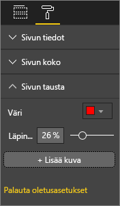

**Kuva 12: Määritä raportin tausta**

Et ole luomassa taideteosta vaan toiminnallista raporttia. Valitse väri, joka parantaa luettavuutta ja tuo esiin raportin elementit. Verkkosivujen värin ja visualisointien käyttöä koskevan tutkimuksen mukaan värien välinen suurempi kontrasti nopeuttaa ymmärtämistä. Tätä aihetta käsitellään kahdessa teknisessä raportissa:

* [The effect of text and background color on visual search of Web pages (Tekstin ja taustavärin vaikutus verkkosivujen visuaaliseen hakuun)](https://www.sciencedirect.com/science/article/pii/S0141938202000410)

* [Determining Users’ Perception of Web Page Visual Complexity and Aesthetic Characteristics (Käyttäjien näkemyksen määrittäminen verkkosivujen visuaalisesta monimutkaisuudesta ja esteettisistä ominaisuuksista)](https://www.researchgate.net/publication/301362579_Determining_Users'_Perception_of_Web_Page_Visual_Complexity_and_Aesthetic_Characteristics)

Olemme soveltaneet joitakin värien parhaita käytäntöjä esimerkkiraporttiimme (kuvat 20 ja 21). Tärkein muutos oli taustavärin muuttaminen mustaksi. Keltainen oli liian räikeä ja rasitti silmiä. Lisäksi **Laske urheilijan nimi vuoden ja luokan mukaan** -kaaviossa palkkien keltainen osa katosi keltaiseen taustaan. Mustan (tai valkoisen) taustan käyttäminen takaa mahdollisimman hyvän kontrastin ja huomioi kiinnittyy visualisointeihin.

Paransimme esimerkkiraporttia myös seuraavasti:

#### <a name="page-title"></a>Sivun otsikko

Kun muutimme taustan mustaksi, otsikko katosi, koska tekstiruutukentässä voi käyttää vain mustaa fonttia. Voit korjata tämän ongelman lisäämällä sen sijaan tekstiruudun otsikon:

1. Poista teksti tekstiruutu valittuna.

1. Valitse **Visualisoinnit**-välilehdestä **Otsikko** ja ota se **käyttöön**.

1. Valitse nuoli **Otsikko**-vaihtoehtojen laajentamiseksi.

1. Syötä **Kesäolympialaiset** **Otsikon teksti** -kenttään.

1. Valitse **fonttiväriksi** valkoinen.

    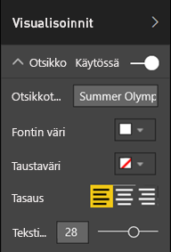

    **Kuva 13: Lisää sivun otsikko**

#### <a name="cards"></a>Kortit

Kortin visualisoinneille:

1. Valitse  **Muotoilu**-välilehden avaamiseksi.

1. Määritä **taustan** tilaksi **Käytössä**.

1. Valitse valkoinen, jonka **Läpinäkyvyys** on **0 %** .

    

1. Määritä sitten **otsikon** tilaksi **Käytössä**.

1. Valitse **fonttiväriksi** valkoinen ja **taustaväriksi** musta.

    

#### <a name="slicers"></a>Osittajat

Tässä vaiheessa kahdella osittajalla oli erilainen muotoilu, mikä ei ole suunnittelun kannalta järkevää. Kummallekin osittajalle: 

1. Muuta taustaväriksi turkoosi.

    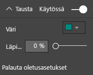

    **Kuva 14: Muuta osittajan taustaväriä**

    Turkoosi on hyvä valinta, koska se on osa sivun värivalikoimaa – näet sen täytetyssä kartassa, puukartassa ja pylväskaaviossa.

1. Lisää ohut valkoinen reunus.

    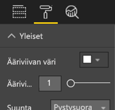

    **Kuva 15: Lisää osittajaan reunus**

1. Harmaata fonttia on vaikea erottaa turkoosia vasten, joten muuta **kohteiden** väri valkoiseksi.

    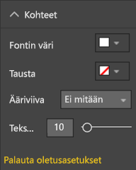

    **Kuva 16: Muuta osittajan fonttiväriä**

1. Muuta lopuksi **Otsikko**-kohdassa **fonttiväriksi** valkoinen ja lisää musta **taustaväri**.

    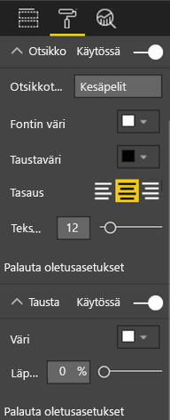

    **Kuva 17: Muotoile osittajan otsikko**

#### <a name="rectangle-shape"></a>Suorakulmio-muoto

Suorakulmio on myös kadonnut mustaan taustaan. Voit korjata tämän ongelman seuraavasti:

1. Valitse muoto.

1. Liu’uta **Muotoile muoto** -ruudussa **taustavärin** tilaksi **Käytössä**.

    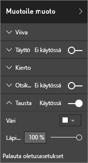

    **Kuva 18: Muotoile muoto**

#### <a name="column-charts-bubble-chart-filled-map-and-treemap"></a>Pylväskaaviot, kuplakaavio, täytetty kartta ja puukartta

Lisää valkoinen tausta raporttisivun jäljellä oleviin visualisointeihin. **Muotoilu**-ruudusta:

1. Laajenna **Tausta**-vaihtoehtoa.

1. Määritä **väriksi** valkoinen.

1. Muuta **läpinäkyvyydeksi** 0.

    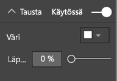

    **Kuva 19: Lisää valkoinen tausta jäljellä oleviin visualisointeihin**

Raportti näyttää seuraavanlaiselta uudelleenmuotoilun jälkeen:


**Kuva 20: Esimerkkiraportti, johon on sovellettu värien käytön parhaita käytäntöjä (musta tausta)**


**Kuva 21: Esimerkkiraportti, johon on sovellettu värien käytön parhaita käytäntöjä (valkoinen tausta)**

### <a name="aesthetics"></a>Estetiikka

Olemme käsitelleet edellä jo paljon esteettisiä näkökohtia, kuten tasausta, väriä, fonttivalintoja ja tarpeettomia osia. Meidän kannattaa käsitellä myös paria muuta raportin suunnittelun parasta käytäntöä. Ne käsittelevät raportin yleistä ulkoasua.

Muista, että raportin funktiona on täyttää liiketoimintatarve, eikä olla kaunis. Raportin ulkoasun on kuitenkin jossain määrin oltava kaunis etenkin ensivaikutelman luomiseksi. Nashvillen konsultti Tony Bodoh selittää ”Tunteet pulpahtavat pintaan puoli sekuntia ennen kuin logiikka saa jalansijaa”. Lukijat reagoivat raporttisivuun ensin tunnetasolla ennen kuin tutustuvat siihen syvemmin. Jos sivusi näyttää epäjärjestelmälliseltä, sekavalta tai ammattitaidottomalta, lukijasi ei ehkä koskaan tutustu sen välittämään upeaan tarinaan.

Blogikirjoittaja ja TechTarget-toimialan analyytikko Wayne Eckerson esittää tätä koskevan mainion analogian. Raportin suunnittelu on aivan kuin sisustaisit huonetta. Ajan kuluessa ostat maljakon, sohvan, päätypöydän ja maalauksen. Pidät erikseen näistä kaikista elementeistä. Vaikka jokainen yksilöllinen valinta on merkityksellinen, yhdessä nämä esineet saattavat kalskahtaa toisiinsa tai kilpailla huomiosta.

Keskity seuraaviin seikkoihin:

* Luo raportille yhteinen teema tai ulkoasu, jota sovellat raportin kaikille sivuille.

* Käytä erillisiä kuvia ja muuta grafiikkaa tukena poikkeamatta todellisesta tarinasta.

* Sovella myös kaikkia parhaita käytäntöjä, joita käsittelimme tässä artikkelin kohdassa.

## <a name="principles-of-visual-design"></a>Visuaalisen suunnittelun periaatteet

Olemme jo tarkastelleet raportin suunnittelun periaatteita ja sitä, miten voimme järjestää raportin elementit siten, että lukijat ymmärtävät raportin nopeasti. Tutustumme nyt itse visualisointien suunnittelun periaatteisiin. Seuraavassa osiossa pureudumme yksittäisiin visualisointeihin ja käsittelemme joitakin yleisemmin käytettyjen tyyppien parhaita käytäntöjä.

Jätämme tässä osiossa esimerkkiraporttisivumme rauhaan hetkeksi ja tarkastelemme muita esimerkkejä. Kun olemme käyneet läpi visuaalisen suunnittelun periaatteet, palaamme esimerkkiraporttisivullemme ja sovellamme oppimaamme (vaiheittaisten ohjeiden avulla).

### <a name="planning--choose-the-right-visual"></a>Suunnittelu – valitse oikea visualisointi

Samalla tavoin kuin on tärkeää suunnitella raportti ennen sen luomista, jokainen visualisointi vaatii myös suunnittelua. Kysy itseltäsi ”Minkä tarinan yritän kertoa tämän visualisoinnin avulla” ja selvitä sitten, millainen visualisointityyppi kertoo tarinan parhaiten. Voit näyttää edistymisen myyntisyklissä palkkikaaviossa, mutta eikö vesiputous- tai suppilokaavio kertoisi sitä paremmin? Saat lisätietoja tästä prosessista lukemalla tämän artikkelin viimeisen osion [Visualisointityypit ja parhaat käytännöt](#visual-types-and-best-practices). Se kuvaa joidenkin yleisempien visualisointityyppien parhaita käytäntöjä. Älä hämmästy, jos ensimmäinen valitsemasi visualisointityyppi ei loppujen lopuksi olekaan paras vaihtoehto. Kokeile useampaa kuin yhtä visualisointityyppiä, jotta löydät parhaimmalta näyttävän vaihtoehdon.

Tutustu siihen, miten kvantitatiiviset ja luokittaiset tiedot eroavat toisistaan ja mitkä visualisointityypit toimivat parhaiten tietyntyyppisten tietojen kanssa. Kvantitatiivisiin tietoihin viitataan usein mittareina ja ne ovat yleensä numeerisia. Luokittaisiin tietoihin viitataan usein dimensioina ja niitä voidaan luokitella. Käsittelemme tätä tarkemmin [Oikean mittarin valinta](#choose-the-right-measure) -osiossa.

Vältä houkutusta käyttää muodikkaita tai monimutkaisempia visualisointityyppejä vain siksi, että raportti tekisi suuremman vaikutuksen. Tavoitteena on soveltaa kaikkein yksinkertaisinta vaihtoehtoa tarinasi välittämiseen. Tiedot voidaan välittää nopeasti vaakasuuntaisten palkkikaavioiden ja yksinkertaisten viivakaavioiden avulla. Ne ovat tuttuja ja helppokäyttöisiä, ja useimmat lukijat pystyvät tulkitsemaan ne vaivattomasti. Lisäksi etuna on myös se, että useimmat lukevat vasemmalta oikealla ja ylhäältä alas. Nämä kaksi kaaviotyyppiä voidaan siten käydä läpi ja tiedot ymmärtää nopeasti.

Onko visualisointia vieritettävä tarinan kertomiseksi? Jos mahdollista, vältä vieritystä. Kokeile käyttää suodattimia ja hyödyntää hierarkioita/alirakenteita. Jos nämä elementit eivät poista vierityspalkkia, harkitse erilaisen visualisointityypin valintaa. Jos et pysty poistamaan vieritystä, lukijasi pitävät mieluiten vaakasuorasta kuin pystysuorasta vierityksestä.

Vaikka valitsisit ehdottomasti parhaimman visualisoinnin tarinalle, saatat kuitenkin tarvita apua tarinan kertomiseen. Tässä vaiheessa voit käyttää selitteitä, otsikkoja, valikkoja, värejä ja kokoja. Käsittelemme näitä rakenne-elementtejä myöhemmin [Rakenne-elementit](#design-elements) -osiossa.

### <a name="choose-the-right-measure"></a>Valitse oikea mittari

Onko visualisoinnin avulla kerrottu tarina kiinnostava? Onko sillä merkitystä? Älä luo visualisointeja turhaan. Ajattelit ehkä, että tiedot kertovat kiinnostavan tarina, mutta näin ei olekaan. Älä pelkää aloittaa alusta ja etsiä kiinnostavampaa tarinaa. Tai ehkä tarina on olemassa, mutta sitä on mitattava eri tavalla.

Oletetaan esimerkiksi, että haluat mitata myyntiesimiestesi onnistumista. Mitä mittaria käyttäisit tähän tehtävään? Pitäisitkö mittarina parasta kokonaismyyntiä tai kokonaistuottoa, kasvua viime vuoteen verrattuna tai suorituskykyä verrattuna kohdetavoitteeseen? Myyjänä toimiva Sirkka on ehkä saavuttanut suurimman tuoton. Jos näytät kokonaistuoton myyjän mukaan palkkikaaviossa, hän saattaa näyttää rokkitähdeltä verrattuna muihin myyjiin. Mutta jos Sirkan myyntikustannukset (kuten matka-, toimitus- ja valmistuskulut) ovat korkeat, pelkkä myynnin tarkasteleminen ei kerro parasta tarinaa.

#### <a name="reflect-reality-dont-distort-reality"></a>Heijasta todellisuutta, älä vääristele totuutta

On mahdollista luoda visualisointi, joka vääristelee totuutta. Eräällä verkkosivustolla tietojen tehokäyttäjät jakavat näitä huonoina pitämiään visualisointeja. Kommenteissa tulee yleisesti esiin pettymys yritykseen, joka loi ja jakoi tämän visualisoinnin. Huono visualisointi välittää viestin siitä, ettei tähän yritykseen voi luottaa.

Luo siis visualisointeja, jotka eivät tarkoituksella vääristele todellisuutta ja joita ei ole manipuloitu. Voit näin kertoa tarinan, jonka haluat niiden avulla välittää. Tässä on esimerkki:


**Kuva 22: Vääristellyn todellisuuden kaavio**

Tässä esimerkissä näyttäisi siltä, että neljän yrityksen välillä on suuri ero ja että CorpB pärjää selvästi paremmin kuin kolme muuta yritystä. Huomaa kuitenkin, että X-akseli ei ala nollasta ja että yritysten välisiin eroihin liittyy todennäköisesti virhemarginaali. Tässä ovat samat tiedot, kun X-akseli alkaa nollasta.


**Kuva 23: Realistinen kaavio**

Lukijat odottavat ja usein olettavat, että X-akseli alkaa nollasta. Jos et halua aloittaa nollasta, tee se siten, ettei se vääristele tuloksia. Harkitse visuaalisen vihjeen tai tekstiruudun lisäämistä huomauttaaksesi normista poikkeamisesta.

### <a name="design-elements"></a>Rakenne-elementit

Kun olet valinnut tyypin sekä mitannut ja luonut visualisoinnin, on aika hienosäätää ulkoasua mahdollisimman hyväksi. Tässä osiossa käsitellään seuraavia seikkoja:

* Asettelu, tila ja koko

* Teksti-elementit: selitteet, huomautukset, valikot, otsikot

* Lajittelu

* Visuaalinen vuorovaikutus

* Väri

#### <a name="tweaking-visuals-for-best-use-of-space"></a>Visualisointien sovittaminen parasta tilankäyttöä varten

Jos yritä mahduttaa useita kaavioita raporttiin, tietojen käsinkirjoitussuhteen maksimointi auttaa tuomaan esiin tietojen välittämän tarinan. Kuten aiemmin mainittiin, Edward Tufte huomautti ”tiedoista käsinkirjoitukseen -suhteesta”. Tavoitteena on poistaa kaaviosta mahdollisimman monta merkintää heikentämättä lukijan kykyä tulkita tietoja.

Alla olevassa ensimmäisessä kaavioryhmässä on toistuvia akselin selitteitä: **tammikuu 2014**, **huhtikuu 2014**ja niin edelleen. Otsikoissa toistetaan **päivämäärän mukaan**. Kunkin kaavion otsikot vaativat myös erillisen vaakasuuntaisen tilan jokaisessa kaaviossa. Poistamalla kaavion otsikot ja ottamalla käyttöön yksittäiset akselin selitteet poistamme hieman tekstiä ja käytämme yleistä tilaa paremmin. Teksti supistuu entisestään ja tiedoille saadaan lisää tilaa, kun poistamme akselin selitteet yläreunan kahdesta kaaviosta.

Jos haluat korostaa tiettyjä ajanjaksoja, voit piirtää viivoja tai suorakulmioita kaikkien kaavioiden taakse. Tällä tavoin katse ohjautuu ylös ja alas vertailun helpottamiseksi.

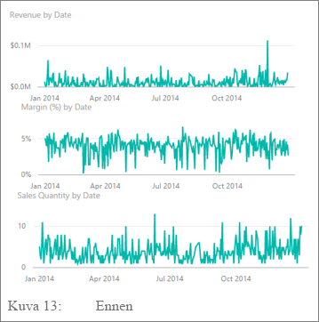

**Kuva 24: Ennen**


**Kuva 25: Jälkeen**

**Ota akselin otsikot käyttöön tai poista ne käytöstä**

1. Valitse visualisointi, jotta se on aktiivinen.

1. Valitse  **Muotoilu**-välilehden avaamiseksi.

1. Laajenna **X-akselin** tai **Y-akselin** vaihtoehtoja.

1. Liu’uta **otsikon** liukusäädin käyttöön tai pois käytöstä.

    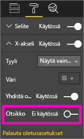

    **Kuva 26: Ota akselien otsikot käyttöön tai poista ne käytöstä**

##### <a name="to-turn-axis-labels-on-and-off"></a>Ota akselin selitteet käyttöön tai poista ne käytöstä

1. Valitse visualisointi, jotta se on aktiivinen.

1. Valitse  **Muotoilu**-välilehden avaamiseksi.

1. **X-akselin** ja **Y-akselin** vieressä on liukusäätimet.

1. Vedä liukusäädintä, jotta voit ottaa akselin selitteet käyttöön tai poistaa ne käytöstä.

    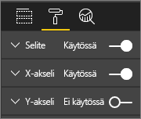

    **Kuva 27: Ota akselien selitteet käyttöön tai poista ne käytöstä**

    > [!TIP]
    > Saatat ehkä poistaa Y-akselin selitteet käytöstä tilanteessa, jossa **tietoselitteet** on otettu käyttöön.

##### <a name="to-remove-visual-titles"></a>Visualisointien otsikoiden poistaminen

1. Valitse visualisointi, jotta se on aktiivinen.

1. Valitse  **Muotoilu**-välilehden avaamiseksi.

1. Aseta **otsikon** liukusäädin tilaan **pois käytöstä**.

    

    **Kuva 28: Poista visualisointien otsikot**

Pohdi, miten lukijat tarkastelevat raporttia. Varmista, että visualisoinnit ja teksti ovat riittävän leveitä ja tummia, jotta ne voidaan lukea. Jos sinulla on suhteellisesti suurempi visualisointi sivulla, lukijat voivat olettaa, että kyse on tärkeimmästä asiasta. Lisää riittävästi tilaa visualisointien välille, jotta raporttisi ei näytä sekavalta ja epäselvältä. Tasaa visualisoinnit, jotta ohjaat lukijoiden katseen oikeaan paikkaan.

##### <a name="to-resize-a-visual"></a>Visualisoinnin koon muuttaminen

1. Valitse visualisointi, jotta se on aktiivinen.

1. Voit muuttaa kokoa tarttumalla yhdestä kahvasta ja vetämällä sitä.

    

    **Kuva 29: Muuta visualisoinnin kokoa**

##### <a name="to-move-a-visual"></a>Visualisoinnin siirtäminen

1. Valitse visualisointi, jotta se on aktiivinen.

1. Valitse visualisoinnin yläreunan keskellä oleva tartuntapalkki ja pidä se alhaalla.

1. Vedä visualisointi uuteen sijaintiinsa.

    

    **Kuva 30: Siirrä visualisointia**

#### <a name="titles-and-labels-that-are-part-of-the-visualizations"></a>Otsikot ja selitteet, jotka ovat osa visualisointeja

Varmista, että otsikot ja selitteet ovat luettavia ja selkeitä. Otsikoissa ja selitteissä olevan tekstin koon on oltava optimaalinen ja värien on erotuttava selvästi. Muistatko tyylioppaamme (katso artikkelissa edellä oleva [Teksti](#text)-osio)? Rajoita värien ja kokojen määrää -- jos kokoja ja värejä on liikaa, sivu näyttää ahtaalta ja sekavalta. Harkitse saman fonttivärin ja koon käyttämistä raporttisivun kaikkien visualisointien otsikoihin. Voit myös valita saman tasauksen raporttisivun kaikille otsikoille.

**Muotoilu-ruutu**

Valitse kullekin jäljempänä luetelluille muotoilumuutoksille Maalirulla-kuvake  **Muotoilu**-välilehden avaamiseksi.

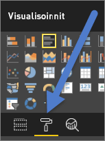

**Kuva 31: Avaa Muotoilu-ruutu**

Valitse sitten säädettävä visuaalinen elementti ja varmista, että se on asetettu tilaan **Käytössä**. Esimerkkejä visuaalisista elementeistä: **X-akseli**, **Y-akseli**, **Otsikko**, **Arvopisteiden otsikot** ja **Selite**. Alla olevassa esimerkissä näytetään **Otsikko**-elementti.

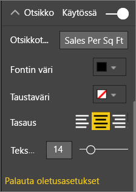

**Kuva 32: Muotoile visualisoinnin otsikko**

##### <a name="set-the-text-size"></a>Määritä tekstin koko

Tekstin kokoa voidaan säätää otsikoille ja arvopisteen otsikoille, mutta ei X- tai Y-akseleille tai selitteille. Käytä etenkin selitteille **näyttöyksiköitä** erilaisia **desimaalipaikkoja**. Löydät lopulta optimaalisen tarkkuustason tietojen näyttämiseksi raportissa.

##### <a name="set-the-text-alignment"></a>Teksti tasauksen määrittäminen

Voit valita otsikon tasauksen vasemmalle, oikealle tai keskelle. Valitse niistä yksi ja sovella tätä samaa asetusta sivun kaikkiin visualisointeihin.

##### <a name="set-the-text-position"></a>Tekstin sijainnin määrittäminen

Tekstin sijaintia voidaan säätää joillekin Y-akseleille ja selitteelle. Valitsitpa näistä minkä tahansa, toimi samalla tavoin muiden Y-akseleiden ja sivun kaikkien muiden selitteiden kanssa.

##### <a name="set-the-title-and-label-length"></a>Otsikon ja selitteen pituuden määrittäminen

Säädä otsikoiden, akselin otsikoiden, arvopisteen otsikoiden ja kuvatekstien pituutta. Jos haluat näyttää jonkin näistä elementeistä, voit pituutta (ja tekstin kokoa) säätämällä varmistaa, ettei Power BI katkaise arvoja:

* **Otsikon** ja **selitteen** asetuksena on **Otsikon teksti**. Syötä todellinen otsikko, joka näkyy visualisoinnissa.

* Käytä **X-akselille** ja **Y-akselille** asetusta **Tyyli**, ja valitse se avattavasta valikosta.

* Käytä **arvopisteen otsikoille** asetusta **Näyttö** ja **Desimaali**. Valitse avattavan **Näyttö**-valikon avulla mittayksiköt: **miljoonat**, **tuhannet**, **ei mitään**, **automaattinen** jne. Kerro Power BI:lle **Desimaali**-kentän avulla näytettävien desimaalien määrä.

##### <a name="set-the-text-color"></a>Tekstin värin määrittäminen

Tekstin väriä voidaan mukauttaa otsikoille, akseleille ja arvopisteen otsikoille.

#### <a name="titles-and-labels-that-arent-part-of-the-visualizations"></a>Otsikot ja selitteet, jotka eivät ole osa visualisointeja

Käsittelimme tässä artikkelissa aiemmin tekstiruutujen lisäämistä raporttisivuille. Joskus visualisointien otsikot eivät riitä kertomaan tarinaa. Voit lisätä tekstiruutuja, jos haluat välittää raporttien lukijoille lisätietoja.

Jotta raporttisivu ei näyttäisi liian sekavalta tai ahtaalta, käytä johdonmukaisesti tekstiruudun fontteja, kokoja, värejä ja tasausta. Jotta voit muuttaa tekstiruudussa olevaa tekstiä, voit tuoda muotoiluvalikon näkyviin valitsemalla tekstiruudun.


**Kuva 33: Muotoile tekstiruudussa käytettävä fontti**

#### <a name="sorting"></a>Lajittelu

Voit tuoda merkitykselliset tiedot nopeammin esiin määrittämällä visualisointien lajittelun. Kun lajittelet esimerkiksi palkkikaaviot laskevassa tai nousevassa järjestyksessä palkeissa olevan arvon mukaan, voit nopeasti näyttää tärkeät lisätiedot tilaa käyttämättä.

Lajittele kaavio seuraavasti:

1. Valitse kaavion oikeassa yläkulmassa olevat kolme pistettä (...).

1. Valitse **Lajittele**.

1. Valitse kenttä, jonka mukaan haluat lajitella, ja suunta.

Lisätietoja on artikkelissa [Visualisoinnin lajittelun muuttaminen](../consumer/end-user-change-sort.md).

#### <a name="chart-interaction-and-interplay"></a>Kaavioiden välinen vuorovaikutus

Yksi Power BI:n kiinnostavimmista ominaisuuksista on kyky muokata tapaa, jolla kaaviot toimivat keskenään vuorovaikutuksessa. Kaavioiden rajat on oletusarvoisesti korostettu: kun valitset tietopisteen, muiden kaavioiden liitännäiset tiedot korostetaan ja liittymättömät tiedot himmennetään. Voit ohittaa tämän toiminnon käyttämällä mitä tahansa kaaviota todellisena suodattimena, mikä säästää sivulla olevaa tilaa. Valitse Power BI-palvelun **Visualisointitoimet** valikkoriviltä muutoksen tekemiseksi.

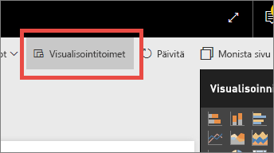

**Kuva 34: Visualisointitoimet**

Päätä sitten sivulla olevan kunkin visualisoinnin osalta, haluatko valita visualisoinnin suodatusta tai korostamista varten, tai olla tekemättä mitään. Kaikkia visualisointeja ei voi korostaa. Visualisoinneille, joita ei voi korostaa, ei ole saatavilla korostuksen ohjausobjektia. Lisätietoja on artikkelissa [Visuaaliset vuorovaikutukset Power BI:ssä](../consumer/end-user-interactions.md).

> [!TIP]
> Power BI:n uusille lukijoille tämä kyky napsauttaa raportteja ja toimia niiden kanssa vuorovaikutuksessa ei ole ehkä heti selkeää. Kun lisäät tekstiruutuja, heidän on helpompi ymmärtää, mitä he voivat valita merkityksellisten lisätietojen saamiseksi.

#### <a name="the-use-of-color-in-visuals"></a>Värien käyttäminen visualisoinneissa

Käsittelimme tässä asiakirjassa aiemmin, miten tärkeää on laatia suunnitelma värien käytöstä raportissa. Tässä osiossa toistetaan hieman samaa asiaa, mutta keskitytään pääasiassa siihen, miten värejä käytetään yksittäisissä visualisoinneissa. Tässä yhteydessä sovelletaan samoja periaatteita: voit värin avulla sitoa raportin yhteen, painottaa tärkeitä tietoja ja parantaa lukijan ymmärrystä visualisoinnista. Liian monien värien käyttö voi olla häiritsevää. Sen vuoksi lukijan voi olla hankala tietää, mitä hänen pitäisi tarkastella. Älä tingi ymmärryksestä kauneuden vuoksi. Lisää väriä vain, jos se parantaa ymmärtämistä.

> [!TIP]
> Tunne yleisösi ja kaikki siihen liittyvät värisäännöt. Esimerkiksi Yhdysvalloissa vihreä tarkoittaa yleensä ”hyvää” asiaa ja punainen ”huonoa” asiaa.

Seuraavissa osioissa käsitellään seuraavia seikkoja:

* Tietojen väri

* Arvopisteen otsikon väri

* Luokittaisten arvojen väri

* Numeeristen arvojen väri

##### <a name="use-colors-to-highlight-interesting-data"></a>Mielenkiintoisten tietojen korostaminen värien avulla

Helpoin tapa käyttää väriä on muuttaa yhden tai useamman tietopisteen väriä, jotta huomio kiinnittyy tähän tietopisteeseen. Tässä esimerkissä väri muuttuu, kun olympialaiset siirretään neljän vuoden jaksosta kahden vuoden jaksoksi kesä- ja talvikisojen vaihtelun vuoksi.


**Kuva 35: Käytä väriä tarinan kertomiseen**

Voit muuttaa tietopisteen värejä **Muotoilu**-ruudun **Tietojen värit** -tietolehdestä. Jos haluat mukauttaa kutakin arvopistettä erikseen, varmista, että **Näytä kaikki** -asetus on **käytössä**.

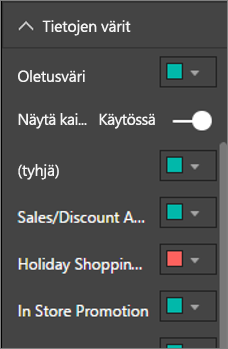

**Kuva 36: Määritä arvopisteen värit**

> [!NOTE]
> Power BI soveltaa oletusarvoista teemaa raportin visualisointeihin. Suunnittelijat valitsevat teemavärit monipuolisuuden ja kontrastin lisäämiseksi. Jos haluat poiketa oletusarvoisesta teemavalikoimasta, valitse **Mukautettu väri**.
>
> 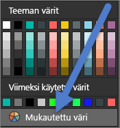
>
> **Kuva 37: Valitse mukautettu väri**

Voit Power BI Desktopissa jopa korostaa **poikkeavia arvoja** tai rivin osiota toisen sarjan avulla:


**Kuva 38: Korosta poikkeavia arvoja Power BI Desktopin avulla**

Tässä **Poikkeavat arvot** -sarja on olemassa vain, kun elokuun keskilämpötila laskee alle 60. Teimme tämän luomalla lasketun DAX-sarakkeen seuraavalla kaavalla:

```
Outliers = if(Editions[Temp]<60, Editions[Temp], BLANK())
```

Esimerkissämme on kolme poikkeavaa arvoa: **1952**, **1956** ja **2000**.

##### <a name="colors-for-labels-and-titles"></a>Selitteiden ja otsikoiden värit

Kun tarkastelet kaikkia käytettävissä olevia muotoiluvaihtoehtoja, löydät useita eri paikkoja lisätä värejä otsikoihin ja selitteisiin. Voit esimerkiksi muuttaa arvopisteen otsikoiden ja akselin otsikoiden väriä. Toimi kuitenkin varovasti. Haluat ehkä yleensä käyttää kullekin visualisoinnin otsikolle yhtä väriä. Kuten tämä artikkelin muiden ohjeiden kanssa, löytyy aina tilanteita ja syitä poiketa säännöistä. Jos päätät poiketa säännöistä, tee se hyvästä syystä.

##### <a name="colors-for-categorical-values"></a>Luokittaisten arvojen värit

Sarjan kaavioiden kuvatekstissä on yleensä luokittainen arvo. Esimerkiksi alla olevan kuvatekstin kukin väri edustaa eri maan/alueen luokkaa.


**Kuva 39: Oletusvärit käytössä**

Suunnittelijat valitsevat oletusvärit, joita Power BI käyttää tarjoamaan hyvän värinerotuksen luokittaisten arvojen välille, jotta ne on helppo erottaa toisistaan. Näitä värejä muutetaan toisinaan vastaamaan tiettyä yrityksen mallia, mutta se voi aiheuttaa ongelmia.


**Kuva 40: Väri saman värin eri sävyinä**

Tähän visualisointiin on valittu yksi sävy ja värin intensiteetti on vaihteleva. Sen vuoksi se antaa väärän käsityksen luokkien välisestä järjestyksestä. Sen mukaan tummat kuplat ovat mittakaavassa korkeammalla tai matalammalla kuin vaaleammat sävyt. Aakkosjärjestystä lukuun ottamatta tämän kaltaisessa luokittaisessa arvossa ei ole yleensä mitään luontaista järjestystä.

Voit muuttaa oletusvärejä valitsemalla  **Muotoilu**-ruudun avaamiseksi, ja valitse **Tietojen värit**.

##### <a name="colors-for-numerical-values"></a>Numeeristen arvojen värit

Jos kentillä on luontainen järjestys ja numeerinen arvo, voit myös värittää arvopisteet arvon mukaan. Arvopisteiden värittämisellä arvon mukaan voi olla hyötyä sen näyttämiseksi, miten arvot on jaettu tiedoissa. Sen avulla Power BI voi myös näyttää kaksi muuttujaa yhdessä kaaviossa. Seuraavassa esimerkissä tehdään esimerkiksi selväksi, että vaikka Kiina on voittanut eniten mitaleja, Japani ja Thaimaa ovat osallistuneet useampiin olympialaisiin.


**Kuva 41: Väritä arvopisteet arvon mukaan**

Tämän kaavion luomiseksi:

1. Valitse visualisointi, jotta se on aktiivinen.

1. Valitse  **Muotoilu**-välilehden avaamiseksi.

1. Valitse **Tietojen värit** > vaihtoehto > **Ehdollinen muotoilu**:

    

    **Kuva 42: Valitse ehdollinen muotoilu**

1. Säädä näitä värejä **Oletusväri – *Tietojen värit*** -valintaikkunassa.

    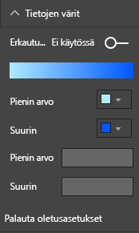

    **Kuva 43: Säädä kylläisyydessä käytettyjä värejä**

Värin avulla voidaan myös korostaa keskitettyä arvoa ympäröivää varianssia. Esimerkiksi positiiviset arvot voidaan värittää vihreiksi ja negatiiviset arvot punaisiksi. Ota huomioon kulttuuriset erot, kun määrität värejä positiivisille tai negatiivisille arvoille. Kaikissa kulttuureissa punainen väri ei välttämättä tarkoita huonoa ja vihreä hyvää.


**Kuva 44: Korosta keskitettyä arvoa ympäröivä varianssi värin avulla**

### <a name="principles-of-visual-design--applied-to-example-report-page"></a>Visuaalisen suunnittelun periaatteet – sovellettuna esimerkkiraporttisivuun

Tartutaanpa nyt edellä käsiteltyihin visuaalisiin periaatteisiin ja sovelletaan niitä esimerkkiraporttiimme.


**Kuva 45: Esimerkkiraporttimme (ennen)**


**Kuva 46: Esimerkkiraporttimme (jälkeen)**

#### <a name="what-did-we-do"></a>Mitä teimme?

| Kohde | Kuvaus |
| ---- | ----------- |
| Osittaja | Tyhjät kohdat poistettiin osittajista lisäämällä sivutason suodatin ja valitsemalla vain **Kulta**, **Hopea**, **Pronssi**. <br> **Ohjausobjektin valinta** -tilaksi muutettiin **Pois käytöstä** kohteille **Valitse yksi** ja **Valitse kaikki**. |
| Kupla | Selitteessä on niin monta kohdetta, että ne vierivät ulos näytöltä. Kuvateksti poistettiin ja otettiin käyttöön sen sijaan **Luokan selitteet**. Tiedot tulevat näkyviin, kun asiakkaat liikuttavat hiirtä kuplien päällä.<br> Otsikkoa lyhennettiin ja poistettiin ”maan/alueen mukaan”, koska se on itsestäänselvää. <br> Akselin otsikot **otettiin käyttöön** kummallekin, jotta kaaviota on helpompi ymmärtää. |
| Täytetty kartta | **Tietojen värejä** muutettiin, jotta ne erottuvat paremmin. <br> Otettiin käyttöön **Eriytyvä** ja **Minimi**-asetukseksi määritettiin vaaleanpunainen ja **Maksimi**-asetukseksi punainen.
| Puukartta | Poistettiin suodatin, joka oli määritetty vain Yhdysvalloille. <br> **Arvopisteen otsikot** määritettiin yhteen desimaalipaikkaan. <br> Visualisoinnissa käytettiin **Luokka**-kenttää, mikä ei ole kovin hyödyllistä, koska se on lähes aina 33 % kolmelle mitalille: kulta, hopea ja pronssi. <br> Valittiin erilainen kiinnostavampi kenttä, **Sukupuoli**. Vesilajit muutettiin sinisiksi ja yleisurheilulajit harmaiksi.
| Yläosan palkkikaavio | Otsikkoa lyhennettiin, poistettiin arvopisteen otsikot, selitteen otsikko poistettiin käytöstä. <br> Otsikon sanajärjestystä muutettiin sopimaan alla olevaan kaavioon.
| Alaosan palkkikaavio | Lajiteltiin nousevan vuoden mukaan vastaamaan yllä olevaa kaaviota. <br> Muutettiin värejä vastaamaan luokkaa. <br> Muutettiin otsikkoa. <br> Poistettiin kuvateksti käytöstä, jotta tiedoille jää enemmän tilaa. <br> Otettiin arvopisteiden otsikot käyttöön. Ne eivät näy raportissa, koska visualisointi on liian pieni selitteille, jotta niitä olisi helppo lukea. Ne näkyvät, kun lukija avaa visualisoinnin **tarkastelutilassa**. Lue lisää [tarkastelutilasta](../consumer/end-user-focus.md). <br> Lisätty **Kilpailujen määrä (erillinen)** **Työkaluvihjeet**-kohtaan. Nyt kun hiirtä liikutetaan pinotun pylvään yläpuolella, työkaluvihjeet kertovat myös, kuinka moneen kilpailuun henkilöt osallistivat sinä vuonna. |
| Visualisointitoimet | Vuorovaikutukset poistettiin käytöstä kummallekin kortille, koska haluan niiden näyttävän aina pelien ja urheilulajien kokonaismäärän. |

## <a name="visual-types-and-best-practices"></a>Visualisointityypit ja parhaat käytännöt

Power BI:ssä on useita alkuperäisiä visualisointityyppejä. Lisättiin mukautettujen visualisointien luettelo, joka on saatavilla Microsoftilta ja Power BI -yhteisöltä, joten visualisointien kokonaismäärä on liian suuri tässä lueteltavaksi. Tarkastellaanpa kuitenkin joitakin useimmin käytettyjä alkuperäisiä visualisointityyppejä.

### <a name="line-charts"></a>Viivakaaviot


Viivakaaviot ovat tehokas tapa tarkastella tietoja ajan kuluessa. Kun tarkastelet tietoja taulukoissa, havaitset nopeasti huiput, notkot, syklit ja toimintatapamallit. Alla olevassa esimerkissä näytetään trendit, jotka koskevat annettujen mitalien lukumäärää ja nämä mitalit voittaneiden urheilijoiden lukumäärää.


**Kuva 47: Viivakaaviot**

#### <a name="best-practices"></a>Parhaat käytännöt

* Kun tarkastelemme viivakaavioita, silmiin pistää ensiksi käyrän muoto. Tarvitsemme siten X-akselia, joka tekee käyrästä mielekkään tällaisissa aika- tai jakeluluokissa. Jos sijoitat X-akselille luokittaisia kenttiä, kuten tuotteen tai maantieteen, viivakaavio ei ole kiinnostava, koska käyrän muoto ei anna mitään merkityksellistä tietoa.

* Jos päätät sijoittaa useita kaavioita toinen toisensa ylä- ja alapuolelle, se helpottaa tällaisten sarjojen vertailua tasaten X-akselin. Suodattimien avulla voit varmistaa, että Power BI näyttää saman arvoalueen. Jos tarkastelet päivämääräalueita, varmista, että ne ovat samat, kuten 1896–2012 kummassakin kaaviossa.

* Käytä koko tila. Jos se on tietojen kannalta järkevää, määritä Y-akselin **aloitus-** ja **lopetuspisteet**, jotta voit poistaa tyhjän tilan kaavion ylä- ja alaosasta. Se auttaa myös visualisointia keskittymään todellisiin arvopisteisiin. Määitä **aloitus-** ja **lopetuspisteet** seuraavasti:

  1. Valitse visualisointi, jotta se on aktiivinen.

  1. Valitse  **Muotoilu**-välilehden avaamiseksi.
  
  1. Laajenna **Y-akselin** aluetta sekä määritä **aloitus**- ja **lopetus**pisteet.
  
      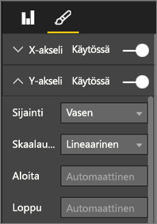
  
      **Kuva 48: Määritä aloitus- ja lopetuspisteet**

* **Aloitus-** ja **lopetuspisteet** on nimenomaisesti määritettävä myös silloin, kun vertailet kahta tai useampaa kaaviota samalla sivulla käyttämällä samaa Y-akselin kenttää. Jos esimerkiksi tarkastelet kumulatiivista tapahtumien lukumäärää ja Ison-Britannian lukumäärät ovat välillä 1–70 ja Australian 1–12, kaksi viivakaaviota näyttää hyvin erilaiset Y-akselit (kuva 49). Tämä vaikeuttaa vertailua yhdellä silmäyksellä. Määritä kaaviot käyttämään sen sijaan samaa Y-akselin aluetta (kuva 50).
  
  
  
  **Kuva 49: Viivakaaviot, joissa on erilaiset Y-akselit**
  
  
  
  **Kuva 50: Viivakaaviot, joissa on samat Y-akselit**

Katso lisätietoja seuraavasta:

* [X- ja Y-akselin ominaisuuksien muokkaaminen](power-bi-visualization-customize-x-axis-and-y-axis.md)

* [Viivakaaviot ja epäsäännölliset välit: yhteensopimaton yhteistyö](http://www.perceptualedge.com/articles/visual_business_intelligence/line_graphs_and_irregular_intervals.pdf)

* [Tietojen visualisointi 101: Viivakaaviot](http://www.columnfivemedia.com/data-visualization-101-line-charts)

### <a name="bar-and-column-charts"></a>Palkki- ja pylväskaaviot


Jos viivakaavioita käytetään yleensä tietojen tarkastelemiseen ajan kuluessa, palkkikaavioita käytetään tietyn arvon tarkastelemiseen eri luokissa. Jos palkit lajitellaan luvun perusteella, näet välittömästi tärkeimmät arvot ja jakelun. Vaakasuuntaiset palkkikaaviot toimivat hyvin pitkissä selitteissä.


**Kuva 51: Vaakasuuntainen palkkikaavio**

#### <a name="best-practices"></a>Parhaat käytännöt

* Näytä arvopisteen selitteet arvoille. Tämä helpottaa erityisten arvojen määrittämistä. Näytä arvopisteen otsikot seuraavasti: 

  1. Valitse visualisointi, jotta se on aktiivinen.

  1. Valitse  **Muotoilu**-välilehden avaamiseksi.
  
  1. Määritä **arvopisteiden otsikoiden** tilaksi **Käytössä**.

      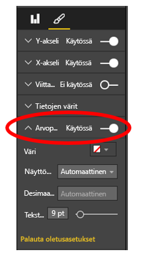

      **Kuva 52: Ota arvopisteiden otsikot käyttöön**

* Edellä oleva palkkikaavio on todella kätevä verrattaessa yhtä mittaria moneen mittariin tiettynä ajankohtana. Samalla kun viivakaavio näytti trendin ajan kuluessa, palkkikaavio näyttää trendin yhdelle luokalle tiettynä ajankohtana. Voimme yhdellä silmäyksellä havaita, että palkkiokaavion mukaan Espanjan työttömyysaste on yksi maailman huonoimmista eli 24,70 %.

* Kun koko palkki- tai pylväskaavio ei mahdu varattuun tilaan, Power BI lisää vierityspalkkeja. Kun se on mahdollista ja järkevää, jäsennä visualisointi ja raportti näyttämään koko kaavio. Näin lukija saa yleiskäsityksen koko jakautumisesta. Valitettavasti tämä ei ole mahdollista esimerkissämme ympäri maailmaa sijaitsevien maiden suuren lukumäärän vuoksi.

  Yksi keino rajoittaa sisällytettäviä arvoja on käyttää suodatinta. Voit esimerkiksi lisätä **Visuaalisen tason** suodattimen, joka näyttää maan vain, jos työttömyysaste on yli 20 %.

* Voit porautua alaspäin (ja jälleen takaisin ylöspäin) palkki- ja pylväskaavioissa. Tämä on kätevä tapa pakata lisätietoja visualisointiin ilman, että se vie lisätilaa. Alla olevassa esimerkissä on hierarkia Alueet > Maat. Kun kaksoisnapsautat aluepalkkia, poraat alaspäin maihin, jotka muodostavat tämän alueen. Katso lisätietoja porautumistilasta artikkelista [Poraustila Power BI:n visualisoinnissa](../consumer/end-user-drill.md).
  
  
  
  **Kuva 53: Poraudu alaspäin**

Lisätietoja palkki- ja pylväskaavioista:

* [Tietojen visualisointi 101: Palkkikaaviot](https://insights.newscred.com/data-visualization-101-bar-charts/)

* [Tietojen visualisoinnin luettelo: Palkkikaavio](http://www.datavizcatalogue.com/methods/bar_chart.html#.VYV-hY3bLJw)

* [Tietojen visualisoinnin luettelo: Monijoukollinen palkkikaavio](http://www.datavizcatalogue.com/methods/multiset_barchart.html#.VYV_gI3bLJw)

### <a name="stacked-bar-and-column-charts"></a>Pinotut palkki- ja pylväskaaviot


Lisää toinen dimensio palkki- ja pylväskaavioihin pinoamalla eri luokkia palkissa tai pylväässä. Kaavio näyttää nyt tietoja yleisestä trendistä (korkeuden ja pituuden mukaan), mutta myös luokkien vaikutuksen tähän trendiin. Seuraava kaavio näyttää huippujalkapallojoukkueen tulojen yleisen kasvun yli 6 miljardin vuonna 2014.


**Kuva 54: Pinottu pylväskaavio**

Tämä pinottu pylväskaavio näyttää, että **kokonaistulot** ovat kasvaneet ajan kuluessa. **Kaupalliset tulot**- ja **Lähetystulot**-luokat ovat myös kasvaneet tasaisesti ajan kuluessa, mikä on lisännyt kokonaistuloja. Tämän kaavion avulla ei ole kuitenkaan helppo vertailla sitä, mikä vaikutus kullakin kolmella luokalla on toinen toisiinsa. Miten Kaupalliset tulot -luokka on esimerkiksi kasvanut verrattuna Lähetystulot- tai Pelipäivän tulot -luokkaan? Nämä tiedot olisi parempi esittää viivakaaviossa, joka auttaa visualisoimaan niitä.

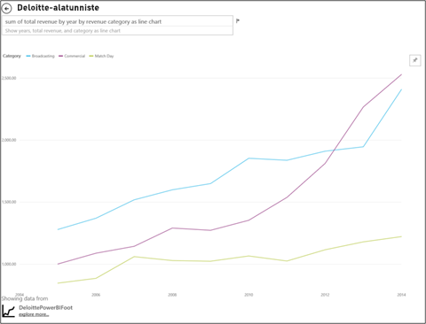

**Kuva 55: Muunna viivakaavioksi**

Tämän viivakaavion avulla on helpompi nähdä, että eniten ovat kasvaneet kaupalliset tulot, joita seuraavat lähetystulot ja pelipäivän tulot.

#### <a name="best-practices"></a>Parhaat käytännöt

* Samoin kuin pylväs- tai palkkikaavioiden tapauksessa, voit valita vaaka- tai pystysuuntaisen näytön välillä. Jos selitteet ovat pitkiä, kannattaa valita vaakasuuntainen näyttö, ja aikasarjatietojen tapauksessa pystysuuntainen näyttö.

* Vältä pinottuja palkki- ja pylväskaavioita, jos haluat näyttää trendien ja muiden mallien muuttumisen ajan kuluessa. Tähän sopivat paljon paremmin muut kaaviot, kuten viivakaaviot.

* Jakautuminen voi myös perustua kokonaismäärään tai sen prosenttiosuuteen.

* Kuten Few mainitsi:

    > *... pinotun palkkikaavion segmenttejä on vaikea vertailla. Jos segmentit on järjestetty vierekkäin ja kaikki kasvavat ylöspäin samasta perusviivasta, niiden korkeuksia on helppo vertailla. Tehtävä vaikeutuu, kun ne pinotaan toinen toisensa päälle. Sen lisäksi vaikka onkin varsin helppo nähdä, miten (tulot) muuttuvat kuukaudesta toiseen, on varsin vaikea nähdä, miten (tulot) muissa (luokissa) ovat muuttuneet*.

* 100-prosentin pinotun kaaviot ovat hyvä valinta, kun prosenttiosuuksien yhteismäärä nousee 100:aan. Seuraavassa esimerkissä näytetään luokan jakautuminen joukkueen mukaan. Prosenttiosuudet ovat suhteellisia ja näyttävät meille yhdellä silmäyksellä mallit. Evertonin tulot ovat peräisin pääasiassa lähetyksistä (yli 70 %) kun taas PSG saa vain 20 % tuloistaan lähetyksistä. Kun valitset vaakasuuntaisen näytön, joukkueen selitteet mahtuvat siihen paremmin ja näet helpommin tuottotyypin vaikutuksen.

  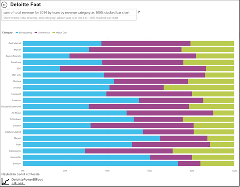

  **Kuva 56: Vaakasuuntainen pinottu kaavio**

Lisätietoja pinotuista kaavioista:

* [Tietojen visualisoinnin luettelo: Pinotut palkkikaaviot](http://www.datavizcatalogue.com/methods/stacked_bar_graph.html#top)

* [Milloin kannattaa käyttää 100-prosentin pinottuja palkkikaavioita?](http://www.perceptualedge.com/blog/?p=2239)

### <a name="combo-bar-and-column-charts"></a>Palkki- ja pylväsyhdistelmäkaaviot


Power BI:ssä pylväs- ja viivakaaviot voidaan yhdistää yhdistelmäkaavioksi. Vaihtoehdot ovat seuraavat: 

* Viivakaavio ja pinottu pylväskaavio 

* Viivakaavio ja klusteroitu pylväskaavio

Voit säästää arvokasta piirtoalustatilaa yhdistämällä kaksi erillistä visualisointia yhdeksi kokonaisuudeksi.

Alla on kaksi näyttökuvaa ennen ja jälkeen.


 **Kuva 57: Kahtena erillisenä kaaviona**

Ensimmäisessä on kaksi erillistä visualisointia: pylväskaavio, joka näyttää väestönkasvun ajan kuluessa, ja viivakaavio, joka näyttää BKT:n ajan kuluessa. Nämä kaaviot sopivat hyvin yhdistelmäkaavioksi, koska niillä on sama X-akseli (vuosi) ja arvot (2002–2012). Miksi et yhdistäisi niitä, jotta voit vertailla näitä kahta trendiä yhdessä visualisoinnissa? Näiden kahden kaavion yhdistäminen nopeuttaa tietojen vertailua.


 **Kuva 58: Yhtenä yhdistelmäkaaviona**

Uudella raporttisivulla on yksi visualisointi: viivakaavio ja pinottu pylväskaavio. Olisimme yhtä helposti voineet luoda viivakaavion ja klusteroidun pylväskaavion. Voimme nyt helpommin tarkastella kahden trendin välistä suhdetta. Voimme nähdä, että väestö ja BKT noudattivat vuoteen 2008 asti samantapaista trendiä. Mutta vuodesta 2009 alkaen väestön kasvun tasaannuttua BKT on vaihdellut enemmän.

#### <a name="best-practices"></a>Parhaat käytännöt

* Yhdistelmäkaaviot toimivat parhaiten, kun molemmalla visualisoinnilla on vähintään yksi sama akseli.

* Tarkkaile akseleitasi! Onko yhdistelmäkaaviota helppo lukea ja tulkita? Käytetäänkö siinä erilaisia alueita ja arvoja? Jos pylväskaavion Y-akselin mittakaava on paljon pienempi kuin viivakaavion Y-akselin mittakaava, yhdistelmäkaavio ei anna merkityksellisiä tietoja. Huomaa kolmas viiva (turkoosin värinen), joka kulkee alas pohjaan asti.

   

   **Kuva 59: Epäonnistunut viivakaavio**

  Yhdistelmäkaaviosta ei ole myöskään hyötyä, jos pylväskaavio ja viivakaavio käyttävät kahta erilaista mittaria, eikä kaksinkertaisia akseleita luoda. Esimerkiksi dollarit verrattuna prosentteihin. Muista sisällyttää kummatkin akselit, jotta lukija ymmärtää paremmin kaaviota. Voit myös harkita akselin otsikkojen lisäämistä.

  Luo kaksi akselia seuraavasti:

    1. Valitse visualisointi, jotta se on aktiivinen.

    1. Valitse  **Muotoilu**-välilehden avaamiseksi.

    1. Laajenna **Y-akselia** ja määritä **Näytä toissijainen** tilaksi **Käytössä**.

          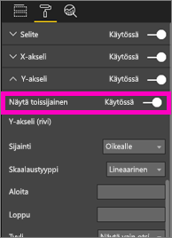

          **Kuva 60: Näytä toissijainen akseli**

    1. Määritä **Y-akselin (pylväskaavio)**  > **otsikon** tilaksi **Käytössä**.

    1. Määritä **Y-akselin (viivakaavio)**  > **otsikon** tilaksi **Käytössä**.

  Kaavio näyttää tältä:

  

  **Kuva 61: Luo sittenkin yhdistelmäkaavio**

* Hyödynnä kaksinkertaisia akseleita. Se on kätevä tapa vertailla useita mittareita, joilla on erilaisia arvoalueita. Se auttaa havainnollistamaan kahden mittarin välistä korrelaatiota yhdessä visualisoinnissa.

Lisätietoja:

* [Yhdistelmäkaavio Power BI:ssä](power-bi-visualization-combo-chart.md)

* [Kaksoisskaalatut akselit kaavioissa: Ovatko ne aina paras ratkaisu? ](http://www.perceptualedge.com/articles/visual_business_intelligence/dual-scaled_axes.pdf)

### <a name="scatter-chart"></a>Pistekaavio


Toisinaan meillä voi olla useita muuttujia, jotka haluamme nähdä yhdessä. Pistekaavio voi tällöin olla kätevä keino yleiskuvan saamiseen. Pistekaaviot näyttävät kahden (pistekaavio) tai kolmen (kuplakaavio) määrällisen mittarin väliset suhteet. Pistekaaviossa on aina kaksi arvoakselia, jotka näyttävät yhden numeerisen tietosarjan vaakasuuntaisella akselilla ja toisen numeerisen arvosarjan pystysuuntaisella akselilla. Kaaviossa näytetään arvopisteet numeerisen arvon X ja Y leikkauskohdassa yhdistämällä nämä kaksi arvoa yhdeksi arvopisteeksi. Power BI voi jakaa nämä arvopisteet tasaisesti tai epätasaisesti vaakasuuntaiselle akselille tietojen mukaan.

Kuplakaaviossa arvopisteet korvataan kuplilla ja kuplan koko edustaa tietojen muuta dimensiota.

Alla olevassa Etelä-Amerikkaa koskevassa kuplakaaviossa verrataan toisiinsa asukaskohtaista BKT:tä (Y-akseli), BKT:n määrää (X-akseli) ja väestöä Etelä-Amerikan maan mukaan.


**Kuva 62: Etelä-Amerikan BKT ja asukasluku kuplakaaviona**

Kuplan koko edustaa tämän maan kokonaisasukaslukua. Brasilian asukasluku on suurin (kuplan koko) ja sillä on suurin osuus Etelä-Amerikan BKT:stä. Se on selvästi pisimmällä X-akselilla. Huomaa kuitenkin, että Uruguayn, Chilen ja Argentiinan asukaskohtainen BKT on korkeampi kuin Brasilian. Ne ovat selvästi ylempänä Y-akselilla.

Jos lisäät toistoakselin, voit pitää itseäsi Hans Roslingina ja kertoa tarinan ajan kuluessa: [Tiedoista merkityksellisiksi tiedoiksi ja vaikuttaviksi tiedoiksi: Afrikan edistymisen näyttäminen Microsoftin Power View’n ja PPI:n avulla](https://www.youtube.com/watch?v=PbaDBJWCeD4). Jos haluat lisätä toistoakselin, vedä päivä/aikakenttä **toistoakselille**.

#### <a name="best-practices"></a>Parhaat käytännöt

* Piste- ja kuplakaaviot ovat mainioita tarinankertojia. Ne eivät ole kuitenkaan yhtä hyödyllisiä tietojen tarkastelussa. Stephen Few huomauttaa seuraavaa:

    > *Tämän lähestymistavan vahvuus havaitaan, kun sitä käytetään tarinan kertomiseen. Kun Rosling kertoo, mitä kaaviossa tapahtuu kun kuplat liikkuvat ympäriinsä ja niiden arvo muuttuu sen mukaan, mitä hän haluaa meille näyttää, tiedot heräävät henkiin. Animoidut kuplakaaviot sopivat kuitenkin selvästi huonommin omatoimiseen tietojen tarkasteluun ja tulkintaan. Rosling ei epäilemättä käytä tätä menetelmää uusiin tarinoihin vaan kertoo vain tunnettuja tarinoita. Emme voi nähdä useampaa kuin yhden kuplan kerralla, koska ne liikkuvat ympäriinsä, joten meidän on pakko toistaa animaatio useamman kerran käsityksen saamiseksi tilanteesta. Voimme lisätä merkintöjä kuplien valitsemiseksi ja nähdä sitten näiden kuplien täydelliset polut. Jos käytät merkintöjä kuitenkin useampaan kuin pariin kuplaan, kaaviosta tulee nopeasti sekava. Haluan lähinnä osoittaa, ettei tämä ole paras keino näyttää näitä tietoja tarkastelua ja analyysiä varten.*

* X- ja Y-akseleiden otsikkojen lisääminen auttaa kertomaan tarinan. Etenkin kuplakaavioissa on useita osia ja otsikot auttavat lukijoita ymmärtämään visualisoinnin.

* Visualisointia on helpompi tulkita, jos lisäät arvopisteen otsikoita. Erityisesti jos kuplakaavion selitteessä on useita kohteita, samanlaisia värejä voi olla hankala erottaa. Yllä olevassa visualisoinnissa Surinamen, Kolumbian ja Ecuadorin selitteiden värit ovat hyvin samanlaiset.

* Loitko pistekaavion ja näitkö vain yhden arvopisteen, joka yhdistää kaikki arvot X- ja Y-akseleille? Vai yhdistääkö kaaviosi kaikki arvot yhdelle vaaka- tai pystysuuntaiselle viivalle? Voit korjata yhdistämisen lisäämällä kentän **Tiedot**-alueelle ja kertoa näin Power BI:lle, miten arvot ryhmitetään. Kentän on oltava yksilöllinen jokaiselle arvopisteelle, jonka haluat piirtää. Löydät ohjeita artikkelista [Power BI:n pistekaavion ja kuplakaavion opetusohjelma](power-bi-visualization-scatter.md).

### <a name="treemap-charts"></a>Puukarttakaaviot


Puukartoista voi olla hyötyä yleiskäsityksen saamiseksi kokonaisuuden eri osien koosta etenkin, kun ne voidaan ryhmitellä luokittain. Kun yrität ymmärtää uutta liiketoimintaa, tärkeimpien osien puukartasta voi olla hyötyä yleisen jakautumisen hahmottamiseksi.

Alla olevassa ensimmäisessä kaaviossa näet heti, että Brasilian osuus on noin puolet Etelä-Amerikan BKT:stä ja että Venezuela ja Argentiina ovat karkeasti ottaen saman kokoisia.

Oletetaan, että haluat laajemman kontekstin ja sinulla on käsitys tärkeimpien osallistuvien maiden vaikutuksesta. Luo visuaalisia hierarkioita, joissa luokan jäsenet (maat) on sijoitettu alueiden sisäpuolelle. Ensinnäkin toinen puukartta antaa meille käsityksen alueiden suhteellisesta koosta. Sitten jokaisella alueella voimme nähdä, mitkä yksittäiset maat osallistuvat eniten. Näemme, että täällä on kolme valtavaa aluetta: Eurooppa, Aasia ja Pohjois-Amerikka. Näiden alueiden sisäpuolella näemme helposti tärkeimmät maat/alueet.

Puukartan pääasiallinen rajoitus on, että on vaikea vertailla pienempiä suorakulmioita. Tämä kaavio soveltuu hyvin yleiskäsityksen antamiseen, mutta pylväs- ja palkkikaaviot ovat luultavasti parempi valinta, jos haluat tarkemman käsityksen eri osien suhteellisesta koosta.

Ensimmäinen puukartta antaa laajemman käsityksen BKT:n koon järjestyksestä. Kuitenkin on vaikea tunnistaa erityisiä eroja maiden väillä (etenkin pienemmät nimettömät lehdet). Näiden tietojen tapauksessa, kun vertat yksittäistä ryhmittelyä, olisi ehkä parempi valita palkki- tai pylväskaavio.

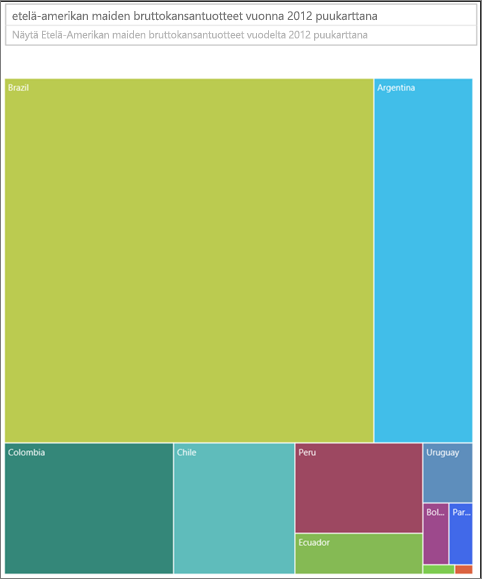

**Kuva 63: Etelä-Amerikan BKT:n vertailu puukarttana**

Seuraavaksi olemme lisänneet alueen toiseksi tietojen tasoksi. Näemme BKT:n yleisen jakautumisen alueiden mukaan. Lisäksi voimme nähdä suhteellisen vaikutuksen alueiden sisällä. Muista, että jos toimit näin muun kuin yhteenlaskettavan mittarin (kuten keskiarvojen) kanssa, tietojen summa ei ehkä edusta yhdistetyn tason todellista arvoa.


**Kuva 64: BKT alueittain ja maittain puukarttana**

Lisätietoja puukartoista:

* [Liiketoimintatietojen etsiminen puukartan visualisointien avulla](http://www.perceptualedge.com/articles/b-eye/treemaps.pdf)

* [Tietojen visualisoinnin luettelo: Puukartta](http://www.datavizcatalogue.com/methods/treemap.html#.VYhylI3bL7Y)

### <a name="other-charts"></a>Muut kaaviot

#### <a name="pie-or-donut-charts"></a>Ympyrä- tai rengaskaaviot


Palkki-, pylväs- ja viivakaaviot sopivat yleensä useimpiin tilanteisiin. Ympyrä- ja rengaskaavioita on usein vaikea tulkita oikein, ja ne voivat itse asiassa usein vääristää tietoja. Vältä niitä aina kun mahdollista. Stephen Few on kirjoittanut erinomaisen artikkelin niiden taustasta ja vaaroista, [Save the Pies for Dessert](https://www.perceptualedge.com/articles/08-21-07.pdf).

Ympyräkaavioista voi olla Stephenin mukaan hyötyä yhdessä tilanteessa eli verrattaessa osien ja kokonaisuuden suhteita toisiinsa. Se on harvoin parempi kuin 100-prosentin pinottu pylväskaavio.

Löydät toisen hauskan ympyräkaaviota koskevan artikkelin (ja animaation) [Darkhorse Analytics -sivustolta](http://www.darkhorseanalytics.com/blog/salvaging-the-pie).

#### <a name="radial-gauges--kpis"></a>Sädemittarit ja suorituskykyilmaisimet


Sädemittarit saattavat tuntua hyvältä visualisoinnilta osoittamaan suorituskykyä suhteessa tavoitteeseen, ja ne ovat suosittuja johdon koontinäytöissä. Niihin liittyy kuitenkin kaksi pääasiallista ongelmaa. Samoin kuin ympyräkaavioita, varjostetun alueen kulmaa on vaikea tulkita verrattuna täyden 180 asteen kaareen tai tavoiteviivaan. Se käyttää myös paljon tilaa näyttämään yhden metriikan.

Hyvä vaihtoehto tälle on yksinkertainen KPI-visualisointi:


Suorituskykyilmaisimet näyttävät arvon, tilan, varianssin tavoitteesta ja trendin samassa tilassa. Vihreä muuttuu punaiseksi, jos tiedot eivät saavuta tavoitetta, ja se voi olla keltainen, jos tiedot saavuttavat jonkin välitavoitteen. Sitä on paljon helpompi lukea ja tulkita kuin sädemittaria.

Katso lisätietoja seuraavasta:

* [Viisarimittarikaaviot Power BI:ssä](power-bi-visualization-radial-gauge-charts.md)

* [Suorituskykyilmaisimien visualisoinnit](power-bi-visualization-kpi.md)

## <a name="conclusion"></a>Päätelmät

Nyt on aika testata näitä parhaita käytäntöjä. Voit kertoa meille myös omista parhaista käytännöistäsi. Etkä ole samaa mieltä suosituksistamme tai löysitkö hyvän syyn poiketa säännöistä? Haluamme kuulla mielellämme myös niitä koskevia kokemuksia.

Onko sinulla kysyttävää? [Kokeile Power BI -yhteisöä](http://community.powerbi.com/)

### <a name="book-recommendations"></a>Kirjasuositukset

Markkinoilla on nykyisin monta hyvää kirjaa, jotka auttavat tiimejä saamaan uusia tietoja visuaalisista suunnittelutekniikoista. Lue ehdottomasti Stephen Few’n *Information Dashboard Design*. Hän käsittelee aihetta tarkemmin kahdessa muussa kirjassa: *Show Me the Numbers* ja *Now You See It*. Few ja muut ovat saaneet inspiraationsa Edward R. Tuftelta, jonka kirjaa *The Visual Display of Quantitative Information* pidetään alan klassikkona. Tufte on myös kirjoittanut teokset *Visual Explanations*, *Envisioning Information* ja *Beautiful Evidence*. Myös Andy Kirkin uusi teos *Data Visualization: A Handbook for Data Driven Design* on hyvä vaihtoehto. Muita suositeltuja kirjailijoita ovat seuraavat: Lachlan James, William McKnight ja Boris Evelson (Forrester), Darkhorse Analytics.
