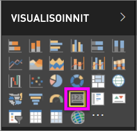
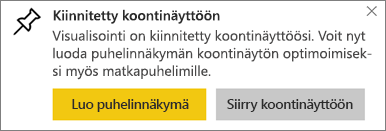
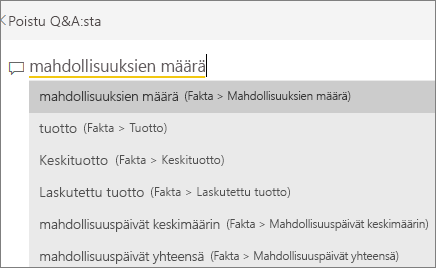
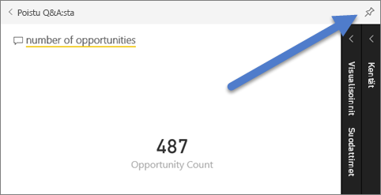
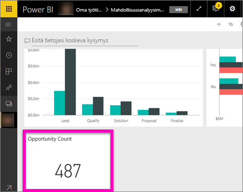

# Kortin visualisoinnit
Joskus yksittäinen luku on tärkein seikka, jota haluat seurata Power BI-raporttinäytöllä tai raportissa, kuten kokonaismyynti, markkinaosuus vuositasolla tai kokonaismahdollisuudet. Tämä visualisointi on nimeltään *Kortti*. Samoin kuin lähes kaikki alkuperäiset Power BI-visualisoinnit, kortit voidaan luoda käyttäen raporttieditoria tai Q&A:ta.

## Kortin luominen raporttieditoria käyttämällä
Näissä ohjeissa käytetään jälleenmyyntianalyysimallia. Jos haluat seurata ohjeita itse, [lataa malli](../sample-datasets.md) joko Power BI ‑palveluun (app.powerbi.com) tai Power BI Desktopiin.   

1. Aloita tyhjältä raporttisivulta ja valitse kenttä **Myymälä** \> **Avoimien myymälöiden määrä**. Jos käytät Power BI ‑palvelua, varmista, että avaat raportin [muokkausnäkymässä](../service-interact-with-a-report-in-editing-view.md).

    Power BI luo pylväskaavion, jossa yksi luku.

   
2. Valitse Visualisoinnit-ruudussa korttikuvake.

   
6. Osoita korttia ja lisää visualisointi koontinäyttöön valitsemalla kiinnityskuvake.

   
7. Kiinnitä ruutu aiemmin luotuun koontinäyttöön tai uuteen koontinäyttöön.

   * Aiemmin luotu raporttinäkymä: valitse raporttinäkymän nimi avattavasta luettelosta.
   * Uusi koontinäyttö: anna nimi uudelle koontinäytölle.
8. Valitse **Kiinnitä**.

   Onnistumissanoma (oikean yläkulman lähellä) ilmaisee, että visualisointi lisättiin ruutuna koontinäyttöön.

   
9. Valitse **Siirry raporttinäkymään**. Siinä voit [muokata ja siirtää](../service-dashboard-edit-tile.md) kiinnitetyn visualisoinnin.

## Luo kortti Q&A-kysymysruudusta
Q&A-kysymysruutu on helpoin tapa tehdä kortti. Q&A-kysymysruutu on käytettävissä Power BI -palvelun raporttinäkymästä tai Desktop-version raporttiruudulta. Seuraavat ohjeet kuvaavat kortin luomista Power BI -palvelun raporttinäkymästä. Jos haluat luoda kortin Q&A:n avulla Power BI Desktopissa, [noudata seuraavia ohjeita](https://powerbi.microsoft.com/blog/power-bi-desktop-december-feature-summary/#QandA) Desktop-raporttien esikatseluun Q&A:n avulla.

Tässä esimerkissä käytetään [Mahdollisuusanalyysimallia](../sample-opportunity-analysis.md).

1. Ala kirjoittaa tiedoista etsittävää asiaa koontinäyttösi ylälaidassa olevaan kysymysruutuun. 

   

> [!TIP]
> Power BI -palvelun raportissa muokkausnäkymässä valitaan **Esitä kysymys** yläreunan valikkorivistä. Etsi Power BI Desktop -raportista tilaa ja avaa kysymysruutu kaksoisnapsauttamalla sitä.

2. Kirjoita kysymysruutuun esimerkiksi ”mahdollisuuksien määrä”.

   

   Kysymysruutu antaa ehdotuksia ja uudelleenmuotoiluja ja näyttää lopuksi kokonaismäärän.  
4. Valitse nastakuvake  oikeasta yläkulmasta kortin lisäämiseksi raporttinäkymään.

   
5. Kiinnitä kortti ruutuna aiemmin luotuun raporttinäkymään tai uuteen raporttinäkymään.

   * Aiemmin luotu koontinäyttö: valitse avattavasta luetteloruudusta koontinäytön nimi. Vaihtoehtosi rajoittuvat vain nykyisessä työtilassasi oleviin koontinäyttöihin.
   * Uusi koontinäyttö: anna uudelle koontinäytölle nimi ja se lisätään nykyiseen työtilaasi.
6. Valitse **Kiinnitä**.

   Onnistumissanoma (oikean yläkulman lähellä) ilmaisee, että visualisointi lisättiin ruutuna raporttinäkymään.  

   
7. Valitse **Siirry koontinäyttöön**, jotta näet uuden ruudun. Siellä voit esimerkiksi [nimetä uudelleen, muuttaa kokoa, lisätä hyperlinkin ja sijoittaa ruudun uudelleen](../service-dashboard-edit-tile.md) raporttinäkymässä.

   

## Muotoile kortti
Käytössäsi on monia vaihtoehtoja otsikoiden, tekstin, värin ja monien muiden ominaisuuksien muuttamiseen. Opit parhaiten luomalla kortin ja tutustumalla sitten Muotoilu-ruutuun. Tässä on joitakin käytössäsi olevista muotoiluasetuksista. 

Muotoilu-ruutu on käytettävissä, kun käsittelet korttia raportissa. Jos teet raportissa muutoksia korttiin, kiinnitettävä se uudelleen, jotta, muutokset näkyvät raporttinäkymässä. 

1. Aloita avaamalla muotoiluruutu valitsemalla maalitelakuvake. 

    
2. Kun kortti on valittu, laajenna **Arvopisteen otsikko** ja muuta väriä, kokoa ja fonttiperhettä. Jos sinulla olisi tuhansia myymälöitä, voisit käyttää **Näytä yksiköt** -toimintoa näyttääksesi myymälöiden määrän tuhansina ja hallitaksesi myös desimaalien määrää. Voit näyttää 125 832,00:n sijaan esimerkiksi 125,8 k.

3.  Laajenna **Luokan nimi** ja muuta väriä ja kokoa.

    

4. Laajenna **Tausta** ja siirrä liukusäädin Käytössä-asentoon.  Nyt voit muuttaa taustaväriä ja läpinäkyvyyttä.

    

5. Jatka muotoiluasetusten tutkimista, kunnes kortti näyttää juuri siltä kuin haluat. 

    

## Huomioon otettavat seikat ja vianmääritys
Jos kysymysruutu ei näy ollenkaan, ota yhteyttä järjestelmän tai vuokraajan järjestelmänvalvojaan.    

## Seuraavat vaiheet
[Yhdistelmäkaaviot Power BI:ssä](power-bi-visualization-combo-chart.md)

[Visualisointityypit Power BI:ssä](power-bi-visualization-types-for-reports-and-q-and-a.md)
