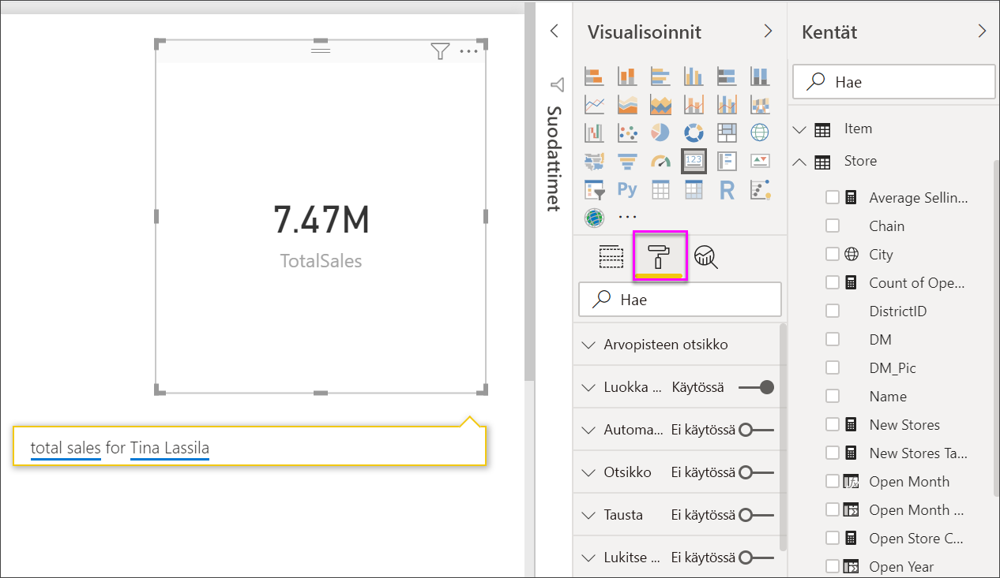
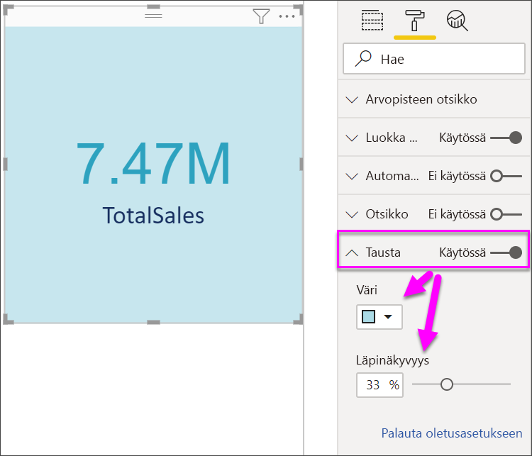

# Kortin visualisoinnit

[!INCLUDE [power-bi-visuals-desktop-banner](../includes/power-bi-visuals-desktop-banner.md)]

Joskus yksittäinen luku on tärkein seikka, jota haluat seurata Power BI-raporttinäytöllä tai raportissa, kuten kokonaismyynti, markkinaosuus vuositasolla tai kokonaismahdollisuudet. Tämä visualisointi on nimeltään *Kortti*. Samoin kuin lähes kaikki alkuperäiset Power BI-visualisoinnit, kortit voidaan luoda käyttäen raporttieditoria tai Q&A:ta.

## Edellytys

Tässä opetusohjelmassa käytetään [Jälleenmyyntianalyysimallin PBIX-tiedostoa](https://download.microsoft.com/download/9/6/D/96DDC2FF-2568-491D-AAFA-AFDD6F763AE3/Retail%20Analysis%20Sample%20PBIX.pbix)

1. Valitse valikkorivin vasemmasta yläosasta **Tiedosto** \> **Avaa**
   
2. **Jälleenmyyntianalyysimallin PBIX-tiedoston löytäminen**

1. Avaa **Jälleenmyyntianalyysimallin PBIX-tiedosto** raporttinäkymässä .

1. Valitse  uuden sivun lisäämiseksi.

## Vaihtoehto 1: Kortin luominen raporttieditoria käyttämällä

Ensimmäinen tapa luoda kortti on käyttää Power BI Desktopin raporttieditoria.

1. Aloita tyhjältä raporttisivulta ja valitse kenttä **Myymälä** \> **Avoimien myymälöiden määrä**.

    Power BI luo pylväskaavion, jossa yksi luku.

   

2. Valitse Visualisoinnit-ruudussa korttikuvake.

   

Olet nyt luonut kortin raporttieditorin avulla. Alla on toinen vaihtoehto kortin luomiseen Q&A-kysymysruudun avulla.

## Vaihtoehto 2: Luo kortti Q&A-kysymysruudusta
Q&A-kysymysruutu on toinen vaihtoehto kortin luomiseen. Q&A-kysymysruutu on käytettävissä Power BI Desktopin raporttinäkymässä.

1. Aloita tyhjältä raporttisivulta

1. Valitse ikkunan yläosassa **Esitä kysymys** -kuvake. 

    Power BI luo kortin ja ruudun kysymystäsi varten. 

   

2. Voit esimerkiksi kirjoittaa kysymysruutuun tekstin ”Tinan kokonaismyynti”.

    Kysymysruutu antaa ehdotuksia ja uudelleenmuotoiluja ja näyttää lopuksi kokonaismäärän.  

   

   

Olet nyt luonut kortin Q&A-kysymysruudun avulla. Seuraavassa on ohjeet korttisi muotoilemiseen omiin tarpeisiisi.

## Muotoile kortti
Käytössäsi on monia vaihtoehtoja otsikoiden, tekstin, värin ja monien muiden ominaisuuksien muuttamiseen. Opit parhaiten luomalla kortin ja tutustumalla sitten Muotoilu-ruutuun. Tässä on joitakin käytössäsi olevista muotoiluasetuksista. 

Muotoilu-ruutu on käytettävissä, kun käsittelet korttia raportissa. 

1. Aloita avaamalla muotoiluruutu valitsemalla maalitelakuvake. 

    

2. Kun kortti on valittu, laajenna **Arvopisteen otsikko** ja muuta väriä, kokoa ja fonttiperhettä. Jos sinulla olisi tuhansia myymälöitä, voisit käyttää **Näytä yksiköt** -toimintoa näyttääksesi myymälöiden määrän tuhansina ja hallitaksesi myös desimaalien määrää. Voit näyttää 125 832,00:n sijaan esimerkiksi 125,8 k.

    

3.  Laajenna **Luokan nimi** ja muuta väriä ja kokoa.

    

4. Laajenna **Tausta** ja siirrä liukusäädin Käytössä-asentoon.  Nyt voit muuttaa taustaväriä ja läpinäkyvyyttä.

    

5. Jatka muotoiluasetusten tutkimista, kunnes kortti näyttää juuri siltä kuin haluat. 

## Huomioon otettavat seikat ja vianmääritys
Jos kysymysruutu ei näy ollenkaan, ota yhteyttä järjestelmän tai vuokraajan järjestelmänvalvojaan.    

## Seuraavat vaiheet
[Yhdistelmäkaaviot Power BI:ssä](power-bi-visualization-combo-chart.md)

[Visualisointityypit Power BI:ssä](power-bi-visualization-types-for-reports-and-q-and-a.md)
