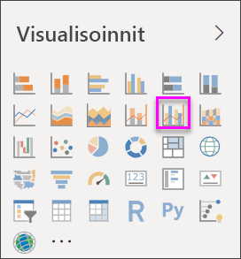
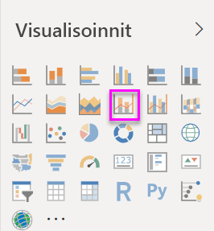
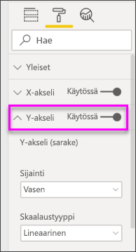
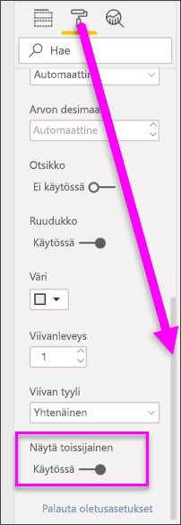

# Yhdistelmäkaavioiden luominen ja käyttäminen Power BI:ssa

[!INCLUDE[consumer-appliesto-nyyn](../includes/consumer-appliesto-nyyn.md)]

[!INCLUDE [power-bi-visuals-desktop-banner](../includes/power-bi-visuals-desktop-banner.md)]

Power BI:ssä yhdistelmäkaavio on yksittäinen visualisointi, joka yhdistää viivakaavion ja pylväskaavion. Näiden kahden kaavion yhdistäminen nopeuttaa tietojen vertailua.

Yhdistelmäkaaviossa voi olla yksi tai kaksi Y-akselia.

## Milloin kannattaa käyttää yhdistelmäkaaviota?
Yhdistelmäkaavio on hyvä vaihtoehto, kun:

* sinulla on viivakaavio ja pylväskaavio, joilla on sama X-akseli
* haluat vertailla useita mittareita eri arvoalueilla
* haluat havainnollistaa kahden mittarin välistä korrelaatiota yhdessä visualisoinnissa
* haluat tarkistaa, täyttääkö mittari toisen mittarin määrittämän tavoitteen
* haluat säästää tilaa piirtoalustalla.

> [!NOTE]
> Raportin jakaminen työtoverin kanssa Power BI:ssä edellyttää, että teillä kummallakin on oma Power BI Pro -käyttöoikeus tai että raportti on tallennettu Premium-kapasiteettiin.

### Edellytykset
Tässä opetusohjelmassa käytetään [Jälleenmyyntianalyysimallin PBIX-tiedostoa](https://download.microsoft.com/download/9/6/D/96DDC2FF-2568-491D-AAFA-AFDD6F763AE3/Retail%20Analysis%20Sample%20PBIX.pbix).

1. Valitse valikkorivin vasemmasta yläosasta **Tiedosto** > **Avaa**
   
2. **Jälleenmyyntianalyysimallin PBIX-tiedoston löytäminen**

1. Avaa **Jälleenmyyntianalyysimallin PBIX-tiedosto** raporttinäkymässä .

1. Valitse  uuden sivun lisäämiseksi.

## Perusmuotoisen yhden akselin yhdistelmäkaavion luominen
Seuraavassa videossa luodaan yhdistelmäkaavio käyttämällä myynti- ja markkinointimallia.
   > [!NOTE]
   > Tässä videossa käytetään Power BI Desktopin vanhempaa versiota.
   > 
   > 
<iframe width="560" height="315" src="https://www.youtube.com/embed/lnv66cTZ5ho?list=PL1N57mwBHtN0JFoKSR0n-tBkUJHeMP2cP" frameborder="0" allowfullscreen></iframe>  

1. Aloita tyhjältä raporttisivulta ja luo pylväskaavio, joka näyttää tämän vuoden myynnin ja myyntikatteen kuukauden mukaan.

    a.  Valitse Kentät-ruudussa **Myynti** \> **Tämän vuoden myynti**  >  **Arvo**.

    b.  Vedä **Myynti** \> **Tämän vuoden myyntikate** **Arvo**-kohtaan.

    c. Valitse **Aika**  \> **FiscalMonth** ja lisää se **Akseli**-kohtaan.

    
5. Valitse **Enemmän vaihtoehtoja** (...) visualisoinnin oikeasta yläkulmasta ja valitse **Lajitteluperuste > FiscalMonth**. Jos haluat muuttaa lajittelujärjestyksen, valitse kolme pistettä uudelleen ja valitse joko **Lajittele nousevaan järjestykseen** tai **Lajittele laskevaan järjestykseen**. Tässä esimerkissä käytetään vaihtoehtoa **Lajittele nousevaan järjestykseen**.

6. Muunna pylväskaavio yhdistelmäkaavioksi. Käytettävissä on kaksi erilaista yhdistelmäkaaviota: **viivakaavio ja pinottu pylväskaavio** sekä **viivakaavio ja lohkopylväskaavio**. Pidä pylväskaavio valittuna ja valitse **Visualisoinnit**-ruudussa **Viiva- ja yhdistelmäpylväskaavio**.

    
7. Vedä **Kentät**-ruudusta **Myynti** \> **Edellisen vuoden myynti** säilöön **Riviarvot**.

   

   Yhdistelmäkaavion pitäisi näyttää suunnilleen tältä:

   

## Kahden akselin yhdistelmäkaavion luominen
Tässä tehtävässä verrataan myyntikatetta ja myyntiä.

1. Luo uusi viivakaavio, joka seuraa **viime vuoden myyntikateprosenttia** **tilikauden kuukauden** mukaan. Valitse kolme pistettä ja lajittele kaavio **kuukauden** mukaan **nousevassa järjestyksessä**.  
Myyntikate oli tammikuussa 35 %, huipussaan 45 % huhtikuussa, laski heinäkuussa ja nousi uudelleen elokuussa. Näemmekö samanlaisen kuvion edellisen ja tämän vuoden myynnissä?

   
2. Lisää **Tämän vuoden myynti > Arvo** ja **Edellisen vuoden myynti** viivakaavioon. **Edellisen vuoden myyntikateprosentin** asteikko on paljon pienempi kuin **myynnin**, mikä vaikeuttaa vertailua.      

   
3. Voit helpottaa visualisoinnin tulkitsemista muuntamalla viivakaavion viivakaavioksi ja pinotuksi pylväskaavioksi.

   

4. Vedä **Edellisen vuoden myyntikateprosentti** **sarakearvoista** **riviarvoihin**. Power BI luo kaksi akselia, jolloin tietojoukkoja voidaan skaalata erikseen; vasen mittaa myyntiä euroissa ja oikea prosenttilukua. Saat vastauksen kysymykseen; kyllä, samanlainen kuvio on havaittavissa.

       

## Akselien otsikoiden lisääminen
1. Valitse maalirullakuvake  muotoiluruudun avaamiseksi.
1. Laajenna **Y-akselin** asetukset alanuolella.
1. Määritä **Y-akseli (sarake)** -kohdan **Sijainti**-asetukseksi **Vasemmalla**, **Otsikko**-asetukseksi **Käytössä**, **Tyyli**-asetukseksi **Näytä vain otsikko** ja **Näyttöyksikkö**-asetukseksi **Miljoonat**.

   
4. Vieritä **Y-akseli (sarake)** -kohdassa alaspäin, kunnes **Näytä toissijainen** on näkyvissä. Koska Y-akseleille on paljon vaihtoehtoja, sinun on ehkä käytettävä molempia vierityspalkkeja. Näytä toissijainen -osassa näkyvät yhdistelmäkaavion viivakaavio-osan muotoiluvaihtoehdot.

   
5. Jätä **Y-akseli (rivi)** > **Sijainti** > **oikealla** sekä määritä **Otsikko** > **Käytössä** ja **Tyyli** > **Näytä vain otsikko**.

   Yhdistelmäkaavio näyttää nyt kaksi akselia otsikoilla.

   

6. Halutessasi voit parantaa kaavion luettavuutta muokkaamalla tekstin fonttia, kokoa ja väriä sekä määrittämällä muita muotoiluasetuksia.

Seuraavat toiminnot:

* [Yhdistelmäkaavion lisääminen koontinäytön ruutuna](../create-reports/service-dashboard-tiles.md)
* [Tallenna raportti](../create-reports/service-report-save.md).
* [Tee raportista helpommin käytettävä toimintarajoitteisille ihmisille](../create-reports/desktop-accessibility-overview.md).

## Ristiinkorostaminen ja ristiinsuodatus

Sarakkeen tai rivin korostaminen yhdistelmäkaaviossa ristiinkorostaa ja ristiinsuodattaa muut raporttisivulla olevat visualisoinnit... ja päinvastoin. Voit muuttaa tätä oletustoimintaa [visualisointitoimien](../create-reports/service-reports-visual-interactions.md) avulla.

## Seuraavat vaiheet

[Rengaskaaviot Power BI:ssä](power-bi-visualization-doughnut-charts.md)

[Visualisointityypit Power BI:ssä](power-bi-visualization-types-for-reports-and-q-and-a.md)
