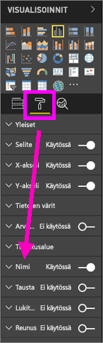
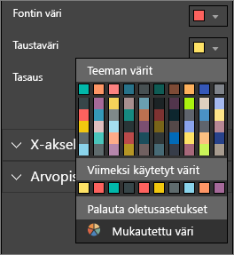
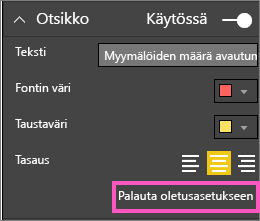
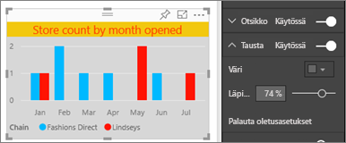
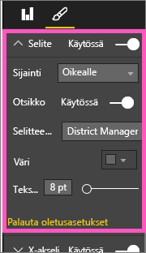

# Mukauta visualisoinnin otsikoita, selitteitä ja taustoja
Tässä opetusohjelmassa opit mukauttamaan visualisointeja muutamalla eri tavalla.   Visualisointien mukauttamiseen on runsaasti vaihtoehtoja, joten paras tapa tutustua niihin kaikkiin on tutustua Muotoilu-ruutuun (valitse maalaustelan kuvake).  Jotta pääset alkuun, tässä artikkelissa kerrotaan, miten voit mukauttaa visualisoinnin otsikkoa, selitettä ja taustaa.  

Kaikkia visualisointeja ei voi mukauttaa, [katso täydellinen luettelo](#list).  

Siirtyä 4:50 pikakelauksella esittelyn, miten voit mukauttaa visualisointeja varten. Kokeile sitten samaa itse seuraamalla videon alapuolella olevia ohjeita.

<iframe width="560" height="315" src="https://www.youtube.com/embed/IkJda4O7oGs" frameborder="0" allowfullscreen></iframe>

### Edellytykset
- Power BI -palvelu tai Power BI Desktop
- Jälleenmyyntianalyysimalli

## Visualisoinnin otsikoiden mukauttaminen raporteissa
Seuraa mukana kirjautumalla sisään Power BI-palveluun (app.powerbi.com) ja avaa [Jälleenmyyntianalyysimalli](../sample-datasets.md)-raportti [muokkausnäkymässä](../service-interact-with-a-report-in-editing-view.md).

> [!NOTE]
> Kun kiinnität visualisoinnin raporttinäkymään, siitä tulee raporttinäkymän ruutu.  Itse ruudut voidaan myös mukauttaa [uusiin otsikoihin, alaotsikoihin ja hyperlinkkeihin, ja niiden kokoa on muutettu](../service-dashboard-edit-tile.md).
> 
> 

1. Siirry raportin ”Uudet myymälät” -sivulle ja valitse ”Avoimien myymälöiden määrä aukiolokuukauden mukaan” -pylväskaavio.
2. Voit näyttää muotoiluasetukset valitsemalla maalitelakuvakkeen Visualisoinnit-ruudussa.  ja valitse **Otsikko** osan laajentamiseksi.  

   
3. Ota **Otsikko** käyttöön tai poista se käytöstä liukusäätimellä. Ota se nyt **käyttöön**.  

   
4. Muuta **otsikkoteksti** kirjoittamalla **Myymälöiden määrä aukiolokuukauden mukaan** teksti-kenttään.  
5. Muuta **fonttiväri** oranssiksi ja **taustaväri** keltaiseksi.

   * Valitse avattava luettelo ja valitse väri **teemaväreistä**, **viimeksi käytetyt värit** tai **mukautetut värit**.
   * Valitse avattava luettelo väri-ikkunan sulkemiseksi.  
     

   Voit aina palata oletusvärit valitsemalla **Palauta oletusasetukseen** väri-ikkunassa.
6. Suurenna tekstikooksi 12.
7. Viimeinen mukautus, joita teemme kaavioon, on sen tasaaminen visualisoinnin keskelle. Otsikon sijainnin oletusarvo on tasattu vasemmalle.  
   

    Tässä vaiheessa opetusohjelmassa sarakkeen kaavion **otsikon** pitäisi näyttää tältä:  
    

    Jos haluat palauttaa kaikki tehdyt mukautukset, valitse **Palauta oletusasetukseen** **otsikon** mukauttamisruudun alareunassa.  
    

## Visualisoinnin taustojen mukauttaminen
Kun sama sarakekaavio on valittuna, laajenna tausta-asetuksia.

1. Ota tausta käyttöön tai poista se käytöstä liukusäätimellä. Ota se nyt **käyttöön**.
2. Muuta taustaväriksi 74 % harmaa.

   * Valitse avattava luettelo ja valitse harmaa väri kohdasta **teemaväri**, **Viimeksi käytetyt värit** tai **Mukautetut värit**.
   * Muuta läpinäkyvyydeksi 74 %.   
     

   Jos haluat palauttaa kaikki toistaiseksi tekemämme taustan mukautukset, valitse **Palauta oletusasetukseen** **Taustan** mukauttamisruudun alareunassa.

## Visualisoinnin selitteiden mukauttaminen
1. Avaa **Yleiskatsaus**-raporttisivu ja valitse ”Kokonaismyynnin variaatioprosentti tilikauden kuukauden mukaan” -kaavio.
2. Valitse Visualisointi-välilehdeltä muotoiluruudussa siveltimen kuvake.  
3. Laajenna **Selitteen** asetuksia.

      
4. Ota selite käyttöön tai poista se käytöstä liukusäätimellä. Ota se nyt **käyttöön**.
5. Siirrä selite visualisoinnin vasemmalle puolelle.    
6. Lisää selitteen otsikko siirtämällä **otsikon** asetukseksi **Käytössä** ja kirjoita **Selitteen nimi** -kenttään **Esimiehet**.
   

   Jos haluat palauttaa kaikki tehdyt mukautukset, valitse **Palauta oletusasetukseen** **selitteen** mukauttamisruudun alareunassa.

## Mukautettavissa olevat visualisointityypit

| Visualisointi | Nimi | Tausta | Selite |
|:--- |:--- |:--- |:--- |
| alue |kyllä |kyllä |kyllä |
| palkki |kyllä |kyllä |kyllä |
| kortti |kyllä |kyllä |– |
| monirivinen kortti |kyllä |kyllä |– |
| sarake |kyllä |kyllä |kyllä |
| yhdistelmä |kyllä |kyllä |kyllä |
| ympyrä |kyllä |kyllä |kyllä |
| täytetty kartta |kyllä |kyllä |kyllä |
| suppilo |kyllä |kyllä |– |
| mittari |kyllä |kyllä |– |
| suorituskykymittari |kyllä |kyllä |– |
| rivi |kyllä |kyllä |kyllä |
| kartta |kyllä |kyllä |kyllä |
| matriisi |kyllä |kyllä |– |
| ympyräkaavio |kyllä |kyllä |kyllä |
| pistekaavio |kyllä |kyllä |kyllä |
| osittaja |kyllä |kyllä |– |
| taulukko |kyllä |kyllä |– |
| tekstiruutu |ei |kyllä |– |
| puukartta |kyllä |kyllä |kyllä |
| vesiputous |kyllä |kyllä |kyllä |

## Seuraavat vaiheet
[X-akselin ja y-akselin mukauttaminen](power-bi-visualization-customize-x-axis-and-y-axis.md)  
[Värien ja akselin ominaisuuksien mukauttaminen](service-getting-started-with-color-formatting-and-axis-properties.md)  
[Power BI:n peruskäsitteet](../consumer/end-user-basic-concepts.md)  
Onko sinulla muuta kysyttävää? [Kokeile Power BI -yhteisöä](http://community.powerbi.com/)

