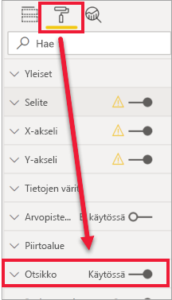
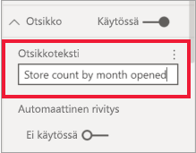
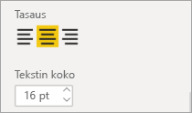
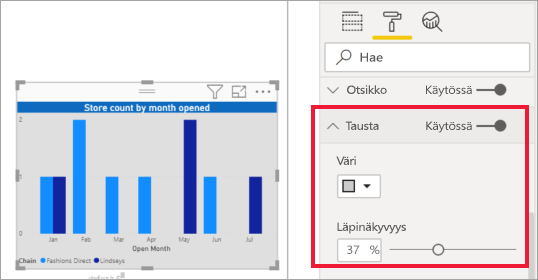
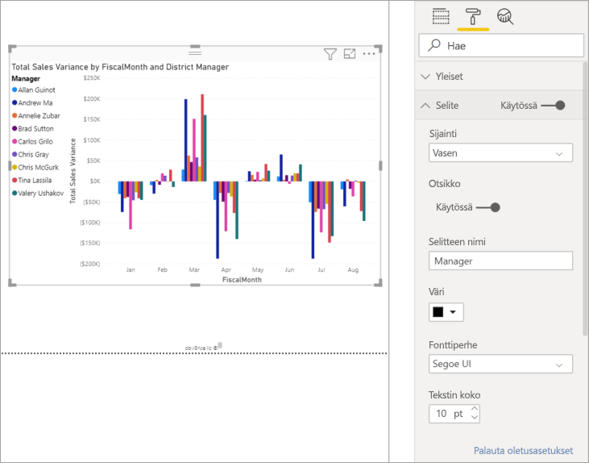

# Visualisoinnin otsikoiden, taustojen ja selitteiden mukauttaminen

Tässä opetusohjelmassa opit pari erilaista tapaa mukauttaa visualisointeja. Visualisointien mukauttamiseen on paljon vaihtoehtoja. Paras keino tutustua niihin kaikkiin on tarkastella **Muotoilu**-ruutua (valitse maalirullakuvake). Jotta pääset alkuun, tässä artikkelissa kerrotaan, miten voit mukauttaa visualisoinnin otsikkoa, selitettä ja taustaa sekä lisätä teeman.

Kaikkia visualisointeja ei voi mukauttaa. Katso lisätietoja visualisointien [täydellisestä luettelosta](#visualization-types-that-you-can-customize).

## Edellytykset

- Power BI -palvelu tai Power BI Desktop

- Jälleenmyyntianalyysimallin raportti

## Visualisoinnin otsikoiden mukauttaminen raporteissa

Seuraa mukana kirjautumalla sisään Power BI Desktopiin ja avaamalla [Jälleenmyyntianalyysimalli](../sample-datasets.md)-raportin.

> [!NOTE]
> Kun kiinnität visualisoinnin raporttinäkymään, siitä tulee raporttinäkymän ruutu. Voit myös mukauttaa itse ruutuja [uusien otsikoiden ja alaotsikoiden sekä hyperlinkkien avulla, ja muuttaa niiden kokoa](../service-dashboard-edit-tile.md).

1. Siirry **Jälleenmyyntianalyysimalli**-raportin **Uudet myymälät** -sivulle.

1. Valitse klusteroitu **Avaa myymälöiden määrä kuukauden ja ketjun mukaan** -pylväskaavio.

1. Voit näyttää muotoiluvaihtoehdot valitsemalla maalirullakuvakkeen **Visualisoinnit**-ruudussa.

1. Valitse **Otsikko** tämän osion laajentamiseksi.

   

1. Siirrä **otsikon** liukusäädin tilaan **Käytössä**.

1. Voit muuttaa otsikkoa kirjoittamalla *Myymälöiden määrä kuukauden mukaan avattuna* **Otsikon teksti** -kenttään.

    

1. Muuta **fonttiväri** valkoiseksi ja **taustaväri** siniseksi.    

    a. Valitse avattava luettelo ja valitse väri **teemaväreistä**, **viimeksi käytetyistä väreistä** tai **mukautetuista väreistä**.

        

    b. Valitse avattava luettelo väri-ikkunan sulkemiseksi.

1. Suurenna teksti kokoon **16 pt**.

1. Viimeinen mukautus, jonka teet kaavion otsikkoon, on sen tasaaminen visualisoinnin keskelle.

    

    Tässä vaiheessa opetusohjelmaa klusteroidun pylväskaavion otsikon pitäisi näyttää seuraavankaltaiselta:

    

Tallenna tekemäsi muutokset ja siirry seuraavaan osioon.

Jos haluat palauttaa kaikki muutokset, valitse **Palauta oletusasetukseen** **Otsikko**-mukauttamisruudun alareunassa.

## Visualisoinnin taustojen mukauttaminen

Kun sama klusteroitu pylväskaavio on valittuna, laajenna **Tausta**-vaihtoehtoja.

1. Siirrä **taustan** liukusäädin tilaan **Käytössä**.

1. Valitse avattava valikko ja valitse harmaa väri.

1. Muuta **läpinäkyvyydeksi** **74 %** .

Tässä vaiheessa opetusohjelmaa klusteroidun pylväskaavion taustan pitäisi näyttää seuraavankaltaiselta:

Tallenna tekemäsi muutokset ja siirry seuraavaan osioon.

Jos haluat palauttaa kaikki muutokset, valitse **Palauta oletusasetukseen** **Tausta**-mukauttamisruudun alareunassa.

## Visualisoinnin selitteiden mukauttaminen

1. Avaa **Yleiskatsaus**-raporttisivu ja valitse **Kokonaismyynnin varianssi tilikauden ja aluejohtajan mukaan** -kaavio.

1. Voit avata Muotoilu-ruudun valitsemalla maalirullakuvakkeen **Visualisoinnit**-välilehdessä.

1. Laajenna **Selite**-vaihtoehdot:

    

1. Siirrä **selitteen** liukusäädin tilaan **Käytössä**.

1. Siirrä selite visualisoinnin vasemmalle puolelle.

1. Lisää selitteen otsikko vaihtamalla **otsikon** tilaksi **Käytössä**.

1. Kirjoita *Esimies* **Selitteen nimi** -kenttään.

1. Muuta **väri** mustaksi.

Tallenna tekemäsi muutokset ja siirry seuraavaan osioon.

Jos haluat palauttaa kaikki muutokset, valitse **Palauta oletusasetukseen** **Selite**-mukauttamisruudun alareunassa.

## Värien mukauttaminen teeman avulla

Raporttiteemojen avulla voit soveltaa rakennemuutoksia koko raporttiin, esimerkiksi käyttää yrityksen värejä, muuttaa kuvakejoukkoja tai ottaa käyttöön visualisointien uuden oletusarvoisen muotoilun. Kun otat käyttöön raporttiteeman, kaikissa raporttisi visualisoinneissa ja muotoiluissa käytetään valitun teeman värejä.

Jos haluat ottaa teeman käyttöön raportissasi, valitse **Vaihda teemaa** valikkoriviltä. Valitse teema.  Alla olevassa raportissa käytetään **Solar**-teemaa.

 

## Visualisointityypit, joita voit mukauttaa

Seuraavassa on luettelo visualisointi- ja mukautusvaihtoehdoista, jotka ovat käytettävissä kullekin:

| Visualisointi | Nimi | Tausta | Selite |
|:--- |:--- |:--- |:--- |
| Alue | kyllä | kyllä |kyllä |
| Palkki | kyllä | kyllä |kyllä |
| Kortti | kyllä | kyllä |– |
| Monirivinen kortti | kyllä | kyllä | – |
| Sarake | kyllä | kyllä | kyllä |
| Yhdistelmä | kyllä | kyllä | kyllä |
| Ympyrä | kyllä | kyllä | kyllä |
| Täytetty kartta | kyllä | kyllä | kyllä |
| Suppilo | kyllä | kyllä | – |
| Mittari | kyllä | kyllä | – |
| Tärkein vaikuttaja | kyllä | kyllä | – |
| Suorituskykyilmaisin | kyllä | kyllä | – |
| Viiva | kyllä | kyllä | kyllä |
| Kartta | kyllä | kyllä | kyllä |
| Matriisi | kyllä | kyllä | – |
| Ympyrä | kyllä | kyllä | kyllä |
| Q&A | kyllä | kyllä | – |
| Piste | kyllä | kyllä | kyllä |
| Muoto | kyllä | kyllä | kyllä |
| Osittaja | kyllä | kyllä | – |
| Taulukko | kyllä | kyllä | – |
| Tekstiruutu | ei | kyllä | – |
| Puukartta | kyllä | kyllä | kyllä |
| Waterfall | kyllä | kyllä | kyllä |

## Seuraavat vaiheet

- [X- ja Y-akselin ominaisuuksien muokkaaminen](power-bi-visualization-customize-x-axis-and-y-axis.md)

- [Värimuotoilun ja akseliominaisuuksien käytön aloittaminen](service-getting-started-with-color-formatting-and-axis-properties.md)

Onko sinulla kysyttävää? [Kokeile Power BI -yhteisöä](https://community.powerbi.com/)
