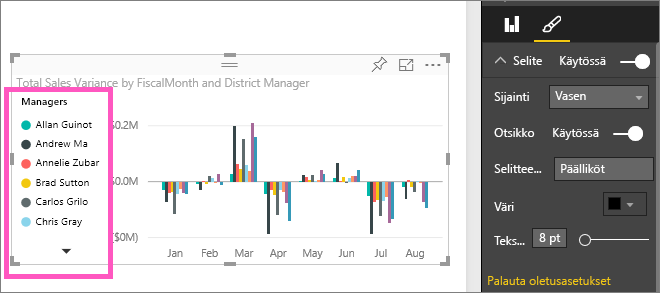

# Mukauta visualisoinnin otsikoita, selitteitä ja taustoja

Tässä opetusohjelmassa opit pari erilaista tapaa mukauttaa visualisointeja. Visualisointien mukauttamiseen on paljon vaihtoehtoja. Paras keino tutustua niihin kaikkiin on tarkastella **Muotoilu**-ruutua (valitse maalirullakuvake). Jotta pääset alkuun, tässä artikkelissa kerrotaan, miten voit mukauttaa visualisoinnin otsikkoa, selitettä ja taustaa.

Kaikkia visualisointeja ei voi mukauttaa. Katso lisätietoja visualisointien [täydellisestä luettelosta](#visualization-types-that-you-can-customize).

Pikakelaa kohtaan 4:50 videossa, jossa on esittely visualisointien mukauttamisesta:

<iframe width="560" height="315" src="https://www.youtube.com/embed/IkJda4O7oGs" frameborder="0" allowfullscreen></iframe>

noudata sitten alla olevia ohjeita ja kokeile samaa itse omilla tiedoillasi.

## Edellytykset

- Power BI -palvelu tai Power BI Desktop

- Jälleenmyyntianalyysimallin raportti

## Visualisoinnin otsikoiden mukauttaminen raporteissa

Seuraa mukana kirjautumalla sisään [Power BI -palveluun](https://app.powerbi.com)ja avaamalla [Jälleenmyyntianalyysimalli](../sample-datasets.md)-raportti [Muokkaa raporttia](../service-interact-with-a-report-in-editing-view.md) -näkymässä.

> [!NOTE]
> Kun kiinnität visualisoinnin raporttinäkymään, siitä tulee raporttinäkymän ruutu. Voit myös mukauttaa itse ruutuja [uusien otsikoiden ja alaotsikoiden sekä hyperlinkkien avulla, ja muuttaa niiden kokoa](../service-dashboard-edit-tile.md).

1. Siirry **Jälleenmyyntianalyysimalli**-raportin **Uudet myymälät** -sivulle.

1. Valitse klusteroitu **Avaa myymälöiden määrä kuukauden ja ketjun mukaan** -pylväskaavio.

1. Voit näyttää muotoiluvaihtoehdot valitsemalla maalirullakuvakkeen **Visualisoinnit**-ruudussa.

1. Valitse **Otsikko** tämän osion laajentamiseksi.

   

1. Siirrä **otsikon** liukusäädin tilaan **Käytössä**.

   

1. Voit muuttaa otsikkoa kirjoittamalla *Myymälöiden määrä kuukauden mukaan avattuna* **Otsikon teksti** -kenttään.

1. Muuta **fonttiväri** oranssiksi ja **taustaväri** keltaiseksi.

    1. Valitse avattava luettelo ja valitse väri **teemaväreistä**, **viimeksi käytetyistä väreistä** tai **mukautetuista väreistä**.

        

    1. Valitse avattava luettelo väri-ikkunan sulkemiseksi.

       Tallenna tekemäsi muutokset.

       Jos haluat palauttaa kaikki muutokset, voit siirtyä takaisin oletusväreihin valitsemalla **Palauta oletusasetukseen** väri-ikkunassa.

1. Suurenna tekstikooksi **12 pt**.

1. Viimeinen mukautus, jonka teet kaavion otsikkoon, on sen tasaaminen visualisoinnin keskelle.

    

Tässä vaiheessa opetusohjelmaa klusteroidun pylväskaavion otsikon pitäisi näyttää seuraavankaltaiselta:

Tallenna tekemäsi muutokset ja siirry seuraavaan osioon.

Jos haluat palauttaa kaikki muutokset, valitse **Palauta oletusasetukseen** **Otsikko**-mukauttamisruudun alareunassa.

## Visualisoinnin taustojen mukauttaminen

Kun sama klusteroitu pylväskaavio on valittuna, laajenna **Tausta**-vaihtoehtoja.

1. Siirrä **taustan** liukusäädin tilaan **Käytössä**.

1. Valitse avattava valikko ja valitse harmaa väri.

1. Muuta **läpinäkyvyydeksi** **74 %** .

Tässä vaiheessa opetusohjelmaa klusteroidun pylväskaavion taustan pitäisi näyttää seuraavankaltaiselta:

Tallenna tekemäsi muutokset ja siirry seuraavaan osioon.

Jos haluat palauttaa kaikki muutokset, valitse **Palauta oletusasetukseen** **Tausta**-mukauttamisruudun alareunassa.

## Visualisoinnin selitteiden mukauttaminen

1. Avaa **Yleiskatsaus**-raporttisivu ja valitse **Kokonaismyynnin varianssi tilikauden ja aluejohtajan mukaan** -kaavio.

1. Voit avata Muotoilu-ruudun valitsemalla maalirullakuvakkeen **Visualisoinnit**-välilehdessä.

1. Laajenna **Selite**-vaihtoehtoja:

      

1. Siirrä **selitteen** liukusäädin tilaan **Käytössä**.

1. Siirrä selite visualisoinnin vasemmalle puolelle.

1. Lisää selitteen otsikko vaihtamalla **otsikon** tilaksi **Käytössä**.

1. Kirjoita *Esimiehet* **Selitteen nimi** -kenttään.

Tässä vaiheessa opetusohjelmaa klusteroidun pylväskaavion selitteen pitäisi näyttää seuraavankaltaiselta:

Tallenna tekemäsi muutokset ja siirry seuraavaan osioon.

Jos haluat palauttaa kaikki muutokset, valitse **Palauta oletusasetukseen** **Selite**-mukauttamisruudun alareunassa.

## Visualisointityypit, joita voit mukauttaa

Seuraavassa on luettelo visualisointi- ja mukautusvaihtoehdoista, jotka ovat käytettävissä kullekin:

| Visualisointi | Nimi | Tausta | Selite |
|:--- |:--- |:--- |:--- |
| Alue | kyllä | kyllä |kyllä |
| Palkki | kyllä | kyllä |kyllä |
| Kortti | kyllä | kyllä |– |
| Monirivinen kortti | kyllä | kyllä | – |
| Sarake | kyllä | kyllä | kyllä |
| Yhdistelmä | kyllä | kyllä | kyllä |
| Ympyrä | kyllä | kyllä | kyllä |
| Täytetty kartta | kyllä | kyllä | kyllä |
| Suppilo | kyllä | kyllä | – |
| Mittari | kyllä | kyllä | – |
| Suorituskykyilmaisin | kyllä | kyllä | – |
| Viiva | kyllä | kyllä | kyllä |
| Kartta | kyllä | kyllä | kyllä |
| Matriisi | kyllä | kyllä | – |
| Ympyrä | kyllä | kyllä | kyllä |
| Piste | kyllä | kyllä | kyllä |
| Osittaja | kyllä | kyllä | – |
| Taulukko | kyllä | kyllä | – |
| Tekstiruutu | ei | kyllä | – |
| Puukartta | kyllä | kyllä | kyllä |
| Waterfall | kyllä | kyllä | kyllä |

## Seuraavat vaiheet

- [X- ja Y-akselin ominaisuuksien muokkaaminen](power-bi-visualization-customize-x-axis-and-y-axis.md)

- [Värimuotoilun ja akseliominaisuuksien käytön aloittaminen](service-getting-started-with-color-formatting-and-axis-properties.md)

- [Peruskäsitteet Power BI -palvelun kuluttajille](../consumer/end-user-basic-concepts.md)

Onko sinulla kysyttävää? [Kokeile Power BI -yhteisöä](https://community.powerbi.com/)
