# X- ja Y-akselin ominaisuuksien muokkaaminen

[!INCLUDE [power-bi-visuals-desktop-banner](../includes/power-bi-visuals-desktop-banner.md)]

Tässä opetusohjelmassa käydään läpi monia tapoja mukauttaa X-akselia ja Y-akselia visualisoinneissa. Kaikilla visualisoinneilla ei ole akseleita. Esimerkiksi ympyräkaaviossa ei ole akseleita. Ja mukautusvaihtoehdot vaihtelevat myös visualisoinnista toiseen. Vaihtoehtoja on niin monta, ettemme voi käsitellä niitä kaikkia tässä yhdessä artikkelissa, joten tutustumme tässä useimmin käytettyihin mukautuksiin ja visualisoinnin **Muotoilu**-ruutuun Power BI -raporttipohjassa.  

Katso, miten Amanda mukauttaa X- ja Y-akseleitaan. Hän esittelee myös erilaisia tapoja hallita ketjutusta käytettäessä porautumista alaspäin ja porautumista ylöspäin.

> [!NOTE]
> Tässä videossa käytetään Power BI:n vanhempaa versiota.

<iframe width="560" height="315" src="https://www.youtube.com/embed/9DeAKM4SNJM" frameborder="0" allowfullscreen></iframe>

## Edellytykset

- Power BI Desktop

- [Jälleenmyyntianalyysimalli ](https://download.microsoft.com/download/9/6/D/96DDC2FF-2568-491D-AAFA-AFDD6F763AE3/Retail%20Analysis%20Sample%20PBIX.pbix)

## Uuden visualisoinnin lisääminen

Ennen kuin voit mukauttaa visualisointia, sinun on luotava se.

1. Avaa jälleenmyyntianalyysiotos Power BI Desktopissa.  

2. Lisää uusi sivu valitsemalla alareunasta keltainen plus-kuvake. 

    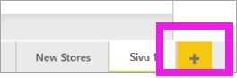

1. Valitse **Visualisoinnit**-ruudusta pinotun pylväskaavion kuvake. Tämä lisää tyhjän mallin raporttisi pohjaan.

    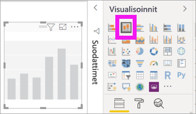

1. Määritä X-akselin arvot valitsemalla **Kentät**-ruudussa **Aika** > **FiscalMonth**.

1. Määritä Y-akselin arvot valitsemalla **Kentät**-ruudussa **Myynti** > **Viime vuoden myynti** ja **Myynti** > **Tämän vuoden myynti** > **Arvo**.

    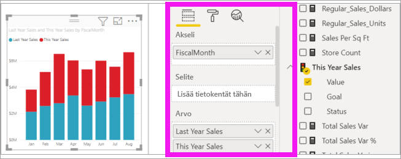

    Voit nyt mukauttaa X-akselia. Power BI tarjoaa lähes rajattomat visualisoinnin muotoiluvaihtoehdot. 

## X-akselin mukauttaminen
X-akselille on monia mukautettavia ominaisuuksia. Voit lisätä ja muokata arvopisteiden otsikoita ja X-akselin otsikkoa. Luokkien osalta voit muokata palkkien, sarakkeiden, viivojen ja alueiden leveyttä, kokoa ja täyttöä. Arvojen osalta voit muokata näyttöyksiköitä, desimaaleja ja ruudukon viivoja. Seuraavassa esimerkissä näytetään sarakekaavion mukautus. Lisätään muutamia mukautuksia, jotta pääset tutustumaan asetuksiin, sen jälkeen voit kokeilla muita omin neuvoin.

### X-akselin selitteiden mukauttaminen
X-akselin selitteet näkyvät kaavion sarakkeiden alapuolella. Juuri nyt ne ovat vaaleanharmaita, pieniä ja vaikealukuisia. Muutetaan sitä.

1. Avaa **Visualisoinnit**-ruudusta **Muotoilu** (maalirullakuvake  ) mukautusasetusten paljastamiseksi.

2. Laajenna X-akselin asetukset.

   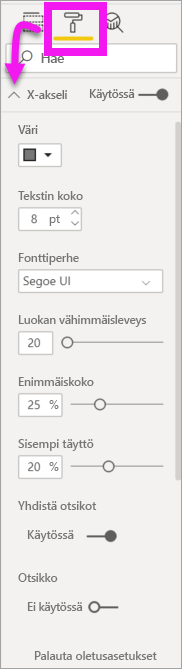

3. Siirrä **X-akselin** liukusäädin tilaan **Käytössä**.

    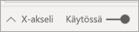

    Saatat haluta asettaa X-akselin tilaan **Pois** esimerkiksi silloin, kun visualisointi selittää itse itsensä ilman selitteitä tai jos raporttisivullasi on tungosta ja sinun tarvitsee tehdä tilaa voidaksesi näyttää lisää tietoa.

4. Muotoile tekstin väriä, kokoa ja fonttia:

    - **Väri**: Valitse musta

    - **Tekstin koko**: Syötä *14*

    - **Fonttiperhe**: Valitse **Arial Black**

    - **Sisempi täyttö**: Syötä *40%*

        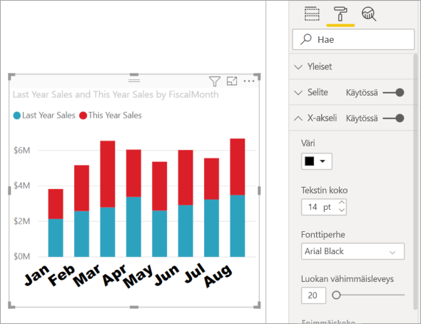
    
5. Ehkä et pidä siitä, miten X-akselin teksti näytetään lävistäjällä. Sinulla on useita vaihtoehtoja. 
    - Muuta tekstin koko pienemmäksi kuin 14.
    - Tee visualisoinnista suurempi. 
    - Näytä vähemmän sarakkeita ja lisää vierityspalkki suurentamalla **luokan vähimmäisleveyttä**. 
    
    Tässä olemme valinneet toisen vaihtoehdon ja tarttuneet yhteen koonmuuttamispalkeista visualisoinnin tekemiseksi leveämmäksi. Siihen mahtuu nyt 14 pisteen teksti ilman tarvetta näyttää tekstiä kulmassa tai vierityspalkilla varustettuna. 

   

### X-akselin otsikon mukauttaminen
Kun X-akselin otsikko on **Käytössä**, X-akselin otsikko näkyy X-akselin selitteiden alla. 

1. Määritä ensin X-akselin otsikon tilaksi **Käytössä**.  

    

    Ensimmäiseksi huomaat, että visualisointisi X-akselilla on nyt oletusotsikko.  Tässä tapauksessa se on **FiscalMonth**.

   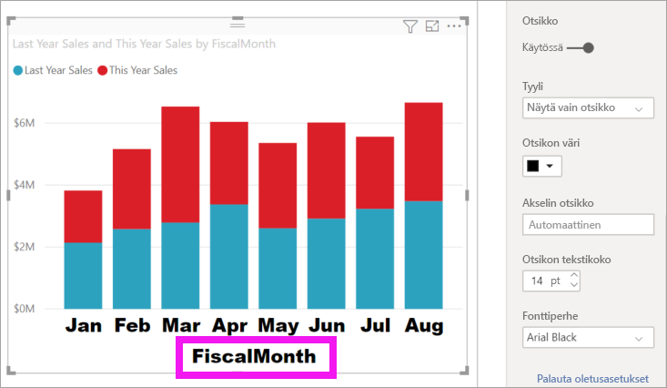

1. Muotoile otsikon tekstin väriä, kokoa ja fonttia:

    - **Otsikon väri**: Valitse oranssi

    - **Akselin otsikko**: Kirjoita *Fiscal Month* (muista välilyönti)

    - **Otsikon tekstin koko**: Anna *18*

    Kun olet suorittanut mukautukset, pinotun pylväskaaviosi tulisi näyttää suunnilleen tältä:

    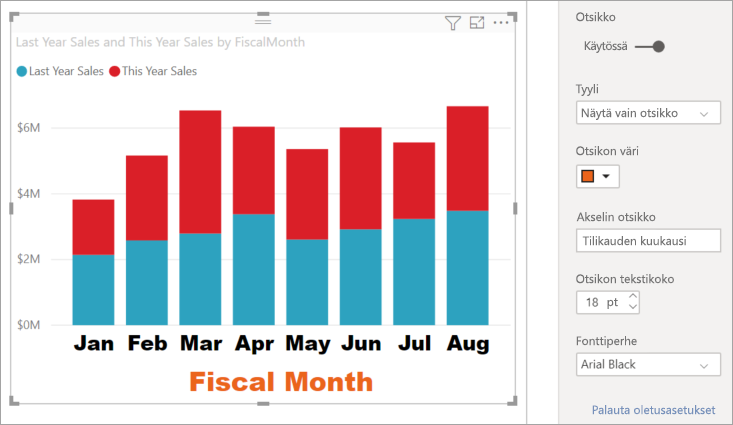

1. Tallenna tekemäsi muutokset ja siirry seuraavaan osioon. Jos haluat palauttaa kaikki muutokset, valitse **Palauta oletusasetukseen** **X-akselin** mukauttamisruudun alareunassa. Seuraavaksi mukautat Y-akselin.

## Y-akselin mukauttaminen
Y-akselilla on monia mukautettavia ominaisuuksia. Voit lisätä ja muokata arvopisteiden otsikkoja, Y-akselin otsikkoa ja ruudukkoviivoja. Arvojen osalta voit muokata näyttöyksiköitä, desimaaleja, aloituspistettä ja loppupistettä. Luokkien osalta taas voit muokata palkkien, sarakkeiden, viivojen ja alueiden leveyttä, kokoa ja täyttöä. 

Seuraavassa esimerkissä jatkamme pylväskaavion mukauttamista. Tehdään muutamia muutoksia, jotta pääset tutustumaan asetuksiin, sen jälkeen voit kokeilla muita omin neuvoin.

### Y-akselin selitteiden mukauttaminen
Y-akselin selitteet näytetään oletusarvoisesti vasemmalla. Juuri nyt ne ovat vaaleanharmaita, pieniä ja vaikealukuisia. Muutetaan sitä.

1. Laajenna Y-akselin asetukset.

   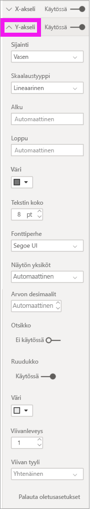

1. Siirrä **Y-akselin** liukusäädin tilaan **Käytössä**.  

    

    Haluat ehkä poistaa Y-akselin käytöstä säästääksesi tilaa lisätiedoille.

1. Muotoile tekstin väriä, kokoa ja fonttia:

    - **Väri**: Valitse musta

    - **Tekstin koko**: Anna *10*

    - **Näytön yksiköt**: Valitse **Miljoonat**

    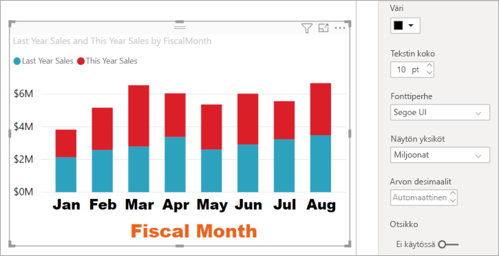

### Y-akselin otsikon mukauttaminen
Kun Y-akselin otsikko on **Käytössä**, Y-akselin otsikko näkyy Y-akselin selitteiden vierellä. Tämän visualisoinnin tapauksessa Y-akselin otsikko ei paranna visualisointia, joten jätä **Otsikko**-kohdan tilaksi **Pois käytöstä**. Lisäämme Y-akselin otsikon myöhemmin kaksoisakselivisualisointiin tässä opetusohjelmassa. 

### Ruudukkoviivojen mukauttaminen
Varmista, että ruudukko erottuu, muuttamalla väriä ja suurentamalla viivanleveyttä:

- **Väri**: Valitse oranssi

- **Viivanleveys**: Syötä *2*

Mukautusten jälkeen pylväskaavion pitäisi näyttää suunnilleen tältä:

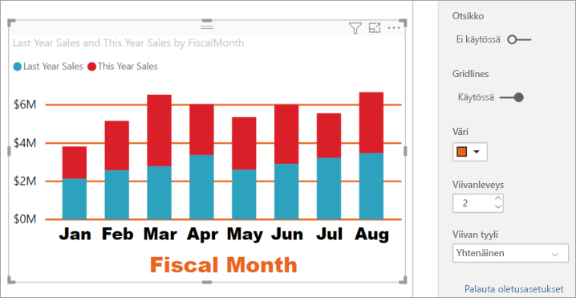

## Visualisointien mukauttaminen kahdelle Y-akselille

Eräät visualisoinnit voivat hyötyä kahdesta Y-akselista. Yhdistelmäkaavio on hyvä esimerkki. Ennen kuin voimme muotoilla kaksinkertaisen Y-akselin, luomme yhdistelmäkaavio, joka vertailee myynnin ja käyttökatteen trendejä.  

### Kahden Y-akselin kaavion luominen

1. Valitse pylväskaavio ja muuta se *Viivan ja pinotun sarakkeen* muotoiseksi kaavioksi. Tämä visualisointityyppi tukee yksirivisen kaavion arvoa ja useita pinottavia sarakearvoja. 

    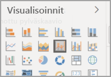
   

2. Vedä **Myynti** > **Käyttökate viime vuodelta %** Kentät-ruudusta **Viiva-arvot** -säilöön.

    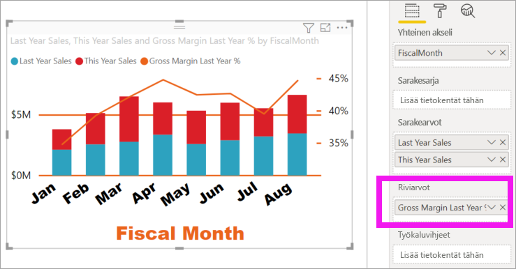

    
3. Muotoile visualisointi uudelleen ja poista kulmikkaat X-akselin selitteet. 

   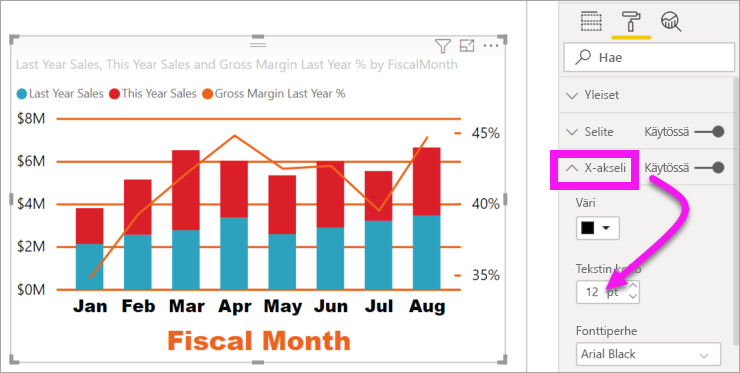

   Power BI luo kaksi Y-akselia, jolloin arvot voidaan skaalata eri tavalla. Vasen akseli mittaa myyntidollareita ja oikea akseli mittaa voittoprosenttia.

### Toisen Y-akselin muotoileminen
Koska aloitimme visualisoinnilla, jossa oli yksi muotoiltu Y-akseli, Power BI loi toisen Y-akselin samoin asetuksin. Voimme kuitenkin muuttaa sen. 

1. Voit näyttää muotoiluvaihtoehdot valitsemalla maalirullakuvakkeen **Visualisoinnit**-ruudussa.

1. Laajenna Y-akselin asetukset.

1. Vieritä alaspäin, kunnes löydät **Näytä toissijainen** -vaihtoehdon. Tarkista, että se on **Käytössä**. Toissijainen Y-akseli edustaa viivakaaviota.

   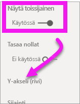

1. (Valinnainen) Mukauta kahden akselin fontin väri, koko ja näytön yksiköt. Jos vaihdat jommankumman akselin **sijaintia**, akselit vaihdetaan päittäin.

### Otsikoiden lisääminen molempiin akseleihin

Akselien otsikoiden lisääminen auttaa näin mutkikkaassa visualisoinnissa.  Otsikot auttavat työtovereita ymmärtämään visualisoinnin paremmin.

1. Ota sekä **Y-akselin (sarake)** että **Y-akselin (rivi)** **otsikot** **käyttöön**.

1. Määritä **tyylin** arvoksi **Näytä vain otsikko** kummallekin.

   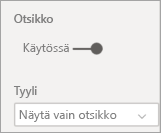

1. Yhdistelmäkaavio näyttää nyt kaksi akselia otsikoilla.

   

1. Muotoile otsikot. Tässä esimerkissä olemme lyhentäneet toisen otsikoista ja vähentäneet molempien kirjainkokoa. 
    - Fonttikoko: **9**
    - **Akselin otsikko** lyhennetty ensimmäiselle Y-akselille (pylväskaavio): Myynti viime ja tänä vuonna

    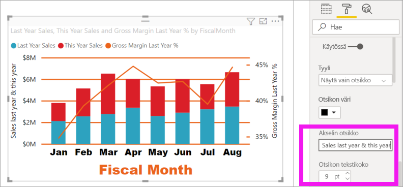

Katso lisätietoja kohdista [Vinkkejä värimuotoiluun Power BI:ssä](service-tips-and-tricks-for-color-formatting.md) ja [Mukauta visualisoinnin otsikoita, selitteitä ja taustoja](power-bi-visualization-customize-title-background-and-legend.md). Etsi myös pian tulevia uusia päivityksiä muotoiluruuduista. 

## Seuraavat vaiheet

- [Visualisoinnit Power BI -raporteissa](power-bi-report-visualizations.md)

Onko sinulla kysyttävää? [Kokeile Power BI -yhteisöä](https://community.powerbi.com/)
