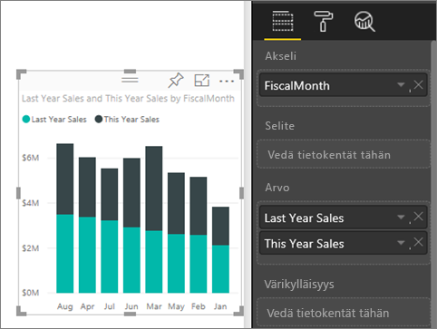
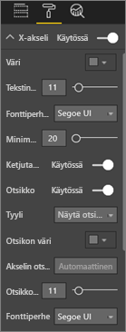
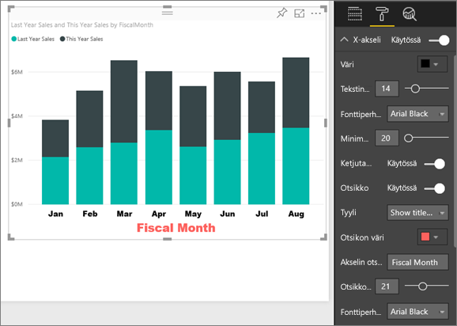
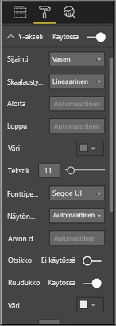
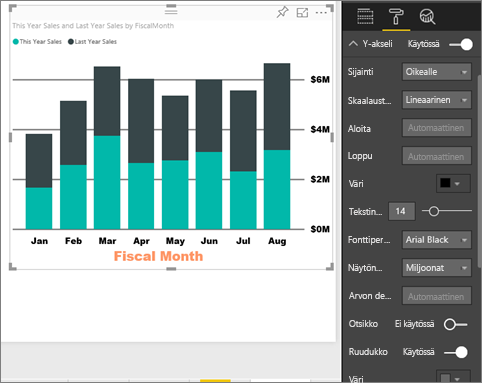
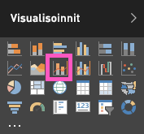
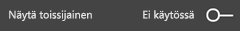
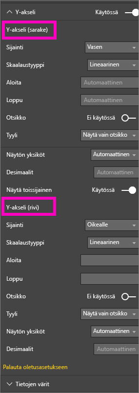
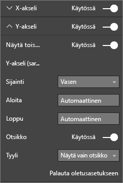

# X- ja Y-akselin ominaisuuksien muokkaaminen
Tässä opetusohjelmassa käydään läpi monia tapoja mukauttaa X-akselia ja Y-akselia visualisoinneissa. Kaikissa visualisoinneissa ei ole akseleita, tai niitä ei voi mukauttaa; esimerkiksi ympyräkaaviossa ei ole akseleita. Mukautusasetukset vaihtelevat myös visualisoinnista riippuen, joten yksi artikkeli ei riitä kaikkien vaihtoehtojen läpikäymiseen. Tämä artikkeli tarjoaa yleiskatsauksen useimmin käytettyihin akselien mukautuksiin ja visualisoinnin muotoiluvälilehteen Power BI -raporttipohjassa.  

> [!NOTE]
> Tämä sivu koskee sekä Power BI -palvelua että Power BI Desktopia. Nämä mukautukset, jotka ovat käytettävissä, kun **Muotoilu** (maalitelakuvake  ) on valittuna, ovat myös käytettävissä Power BI Desktopissa.  
>
>

Katso videolta, miten X- ja Y-akseleita mukautetaan ja miten ketjutusta voidaan hallita siirtyessä ylä- ja alirakenteisiin. Kokeile sitten samaa itse jälleenmyyntianalyysimallin avulla noudattamalla videon alapuolella olevia vaiheittaisia ohjeita.

<iframe width="560" height="315" src="https://www.youtube.com/embed/9DeAKM4SNJM" frameborder="0" allowfullscreen></iframe>

## X-akselien visualisointien mukauttaminen raporteissa
## Visualisoinnin luominen pinotussa kaaviossa
Kirjaudu sisään Power BI-palveluun ja avaa **Jälleenmyyntianalyysimalli**-raportti [muokkausnäkymässä](../service-interact-with-a-report-in-editing-view.md). Käytämme [jälleenmyyntianalyysimallia](../sample-datasets.md) esimerkkinä.

1. Luo uusi pylväskaavio, jossa näkyy tämän vuoden myynti ja edellisen vuoden myynti tilikauden kuukauden mukaan.
2. Muunna se pinotuksi pylväskaavioksi.

    

## X-akselin mukauttaminen
1. Avaa mukautusasetukset valitsemalla Visualisoinnit ja suodattimet -ruudussa **Muotoilu** (maalitelakuvake ).
2. Laajenna X-akselin asetukset.

   
3. Ota X-akseli käyttöön tai poista se käytöstä liukusäätimellä. Ota se nyt **käyttöön**.  X-akselin voi poistaa käytöstä esimerkiksi tilan säästämiseksi uusille tiedoille.

    
4. Muotoile tekstin väriä, kokoa ja fonttia. Tässä esimerkissä olemme määrittäneet tekstin **väriksi** musta, **tekstin kooksi** 14 ja **fontiksi** Arial Black.  
5. Ota X-akselin otsikko **käyttöön** ja näytä X-akselin nimi – tässä tapauksessa **FiscalMonth**.  
6. Muotoile otsikon tekstin väriä, kokoa ja fonttia.  Tässä esimerkissä olemme määrittäneet **otsikon väriksi** oranssi, muuttaneet **akselin otsikon** muotoon **Tilikauden kuukausi** ja määrittäneet **otsikon tekstikoon** arvoksi 21.
7. Valitse kolme pistettä (...) kaavion oikeassa yläkulmassa ja valitse **Lajitteluperuste: FiscalMonth**.

    Mukautusten jälkeen pylväskaavion pitäisi näyttää suunnilleen tältä:

     

Jos haluat palauttaa kaikki tehdyt mukautukset, valitse **Palauta oletusasetukseen** **X-akselin** mukauttamisruudun alareunassa.

## Y-akselin mukauttaminen
1. Laajenna Y-akselin asetukset.

   

2. Ota Y-akseli käyttöön tai poista se käytöstä liukusäätimellä. Ota se nyt **käyttöön**.  Y-akselin voi poistaa käytöstä esimerkiksi tilan säästämiseksi uusille tiedoille.
   
    
3. Siirrä Y-akselin **sijainti** oikealle.
4. Muotoile tekstin väriä, kokoa ja fonttia. Tässä esimerkissä olemme määrittäneet tekstin **väriksi** musta, **tekstin kooksi** 14 ja **fontiksi** Arial Black.  
5. Säilytä **Näyttöyksiköt** miljoonina ja **Arvon desimaalit** nollana.
6. Y-akselin otsikko ei paranna tätä visualisointia, joten jätä **Otsikko** poissa käytöstä.  
7. Varmista, että ruudukko erottuu, muuttamalla **värin** tummanharmaaksi ja suurentamalla **viivanleveyden** arvoon 2.

    Mukautusten jälkeen pylväskaavion pitäisi näyttää suunnilleen tältä:

     

## Kahden Y-akselin visualisointien mukauttaminen
Sinun täytyy ensin luoda yhdistelmäkaavio myymälöiden määrän vaikutuksesta myyntiin.  Tämä on sama kaavio, joka luodaan [Yhdistelmäkaavion opetusohjelmassa](power-bi-visualization-combo-chart.md). Muotoile sitten molemmat Y-akselit.

### Kahden Y-akselin kaavion luominen
1. Luo uusi viivakaavio, joka seuraa **myyntiä > viime vuoden myyntikateprosenttia** **ajan > FiscalMonth** mukaan.
2. Lajittele visualisointi valitsemalla kolme pistettä (...) ja valitsemalla **Lajitteluperuste: kuukausi**

    

    > [NOTE]: For help sorting by month, see [sorting by other criteria](../consumer/end-user-change-sort.md#other)

    Myyntikate oli tammikuussa 35 %, huipussaan 45 % huhtikuussa, laski heinäkuussa ja nousi uudelleen elokuussa. Näemmekö samanlaisen kuvion edellisen ja tämän vuoden myynnissä?
     
3. Lisää **Tämän vuoden myynti > Arvo** ja **Edellisen vuoden myynti** viivakaavioon. **Edellisen vuoden myyntikateprosentin** asteikko (sininen 0 % -ruudukkoviiva) on paljon pienempi kuin **myynnin**, mikä vaikeuttaa vertailua. Y-akselin prosenttiosuudet ovat myös naurettavia.      

    

5. Voit helpottaa visualisoinnin tulkitsemista muuntamalla viivakaavion viivakaavioksi ja pinotuksi pylväskaavioksi.

   

6. Vedä **Edellisen vuoden myyntikateprosentti** **sarakearvoista** **riviarvoihin**. Nyt sinulla on aiemmin luotu pinottu pylväskaavio ***sekä*** viivakaavio.  (Halutessasi voit käyttää aiemmin oppimaasi ja muokata akselien fonttien väriä ja kokoa.)
   
   Power BI luo kaksi akselia, jolloin tietojoukkoja voidaan skaalata erikseen; vasen mittaa myyntiä euroissa ja oikea prosenttilukua.

   

### Toissijaisen Y-akselin muotoileminen
1. Voit näyttää muotoiluasetukset valitsemalla maalitelakuvakkeen **Visualisoinnit**-ruudussa.    
2. Laajenna Y-akselin asetukset alanuolella.    
3. Selaa luetteloa, kunnes löydät kohdan **Näytä toissijainen**. Vaihda **Näytä toissijainen** -kohdan arvo **Ei käytössä** arvoon **Käytössä**.    

   

   

4. (Valinnainen) Mukauta akselit. Jos vaihdat jommankumman akselin **sijaintia**, akselit vaihdetaan päittäin.

   

### Otsikoiden lisääminen molempiin akseleihin
Akselien otsikoiden lisääminen voi auttaa näin monimutkaisessa visualisoinnissa.  Otsikot auttavat työtovereita ymmärtämään visualisoinnin paremmin.

1. Ota sekä **Y-akselin (sarake)** että **Y-akselin (rivi)** **otsikot** **käyttöön**.
2. Määritä **tyylin** arvoksi **Näytä vain otsikko**.

       
3. Yhdistelmäkaavio näyttää nyt kaksi akselia otsikoilla.

   

Lisätietoja on artikkelissa [Vihjeitä ja vinkkejä värimuotoiluun, otsikointiin ja akseliominaisuuksien käyttöön](service-tips-and-tricks-for-color-formatting.md).

## Huomioon otettavat seikat ja vianmääritys
Jos raportin omistaja on luokitellut X-akselin päivämääräksi, **Tyyppi**-asetus on näkyvissä ja voit valita jatkuvan tai luokittaisen välillä.

## Seuraavat vaiheet
Lisätietoja [Power BI -raporttien visualisoinneista](power-bi-report-visualizations.md)

[O](power-bi-visualization-customize-title-background-and-legend.md)[tsikoiden, taustojen ja selitteiden mukauttaminen](power-bi-visualization-customize-title-background-and-legend.md)

[Värien ja akselin ominaisuuksien mukauttaminen](service-getting-started-with-color-formatting-and-axis-properties.md)

[Power BI:n peruskäsitteet](../consumer/end-user-basic-concepts.md)

Onko sinulla muuta kysyttävää? [Kokeile Power BI -yhteisöä](http://community.powerbi.com/)
