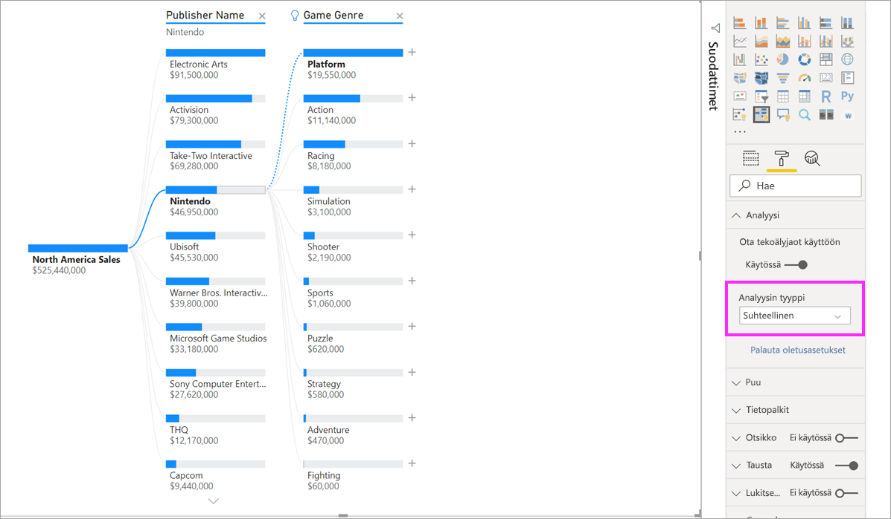

# Hajotuspuu-visualisoinnin luominen ja tarkasteleminen Power BI:ssä (esiversio)
[!INCLUDE [power-bi-visuals-desktop-banner](../includes/power-bi-visuals-desktop-banner.md)]

Power BI hajotuspuu-visualisoinnin avulla voit visualisoida tietoja useissa ulottuvuuksissa. Se kokoaa tiedot automaattisesti ja mahdollistaa porautumisen ulottuvuuksiin missä tahansa järjestyksessä. Lisäksi se on tekoäly-visualisointi, joten voit pyytää sitä etsimään tiettyjen ehtojen perusteella seuraavan ulottuvuuden, johon porautua. Tämän ansiosta se on arvokas työkalu ad-hoc-tutkimiseen ja pääsyyn analysointiin.

Tässä opetusohjelmassa käytetään kahta esimerkkiä:

- Toimitusketjuskenaario, jossa analysoidaan, kuinka suuri prosenttiosuus yrityksen tuotteista on jälkitoimituksessa (loppu varastosta).  
- Myyntiskenaario, jossa videopelin myynti eritellään useiden tekijöiden mukaan, kuten peligenren ja julkaisijan.

## Aloittaminen
Valitse Visualisoinnit-ruudusta hajotuspuun kuvake.

Visualisointi edellyttää kahdentyyppisiä syötteitä.

**Analysoi** – Mittari, jonka haluat analysoida. Tämän on oltava määrä tai kooste.  
**Selitysperuste** – Vähintään yksi dimensio, johon haluat porautua.

Kun vedät mittarin kenttään, visualisointi päivittyy ja näyttää koostetun määrän. Alla olevassa esimerkissä visualisoidaan jälkitoimituksessa olevien tuotteiden keskimääräisen prosenttimäärän (5,07 %) 

Seuraavaksi lisätään vähintään yksi dimensio, johon haluat porautua. Lisää nämä kentät **Selitysperuste**-säilöön. Huomaa, että pääsolmun vieressä näkyy plusmerkki. Jos valitset +-merkin, voit valita, mihin kenttään haluat porautua (voit porautua kenttiin haluamassasi järjestyksessä).

Jos valitset **Ennusteen poikkeama** -vaihtoehdon, puu laajenee ja erittelee mittayksikön sarakkeen arvojen mukaan. Tämä prosessi voidaan toistaa valitsemalla toinen solmu, johon poraudutaan.

Viimeisen tason solmun valitseminen ristiinsuodattaa tiedot. Aiemman tason solmun valitseminen vaihtaa polkua.

Muiden visualisointien käsitteleminen ristiinsuodattaa hajotuspuun. Tämän seurauksena solmujen järjestys tasoilla voi muuttua.
Alla olevassa esimerkissä olemme ristiinsuodattaneet puun Ubisoftin mukaan. Polku päivittyy, ja Xbox-myynti siirtyy ensimmäiseltä sijalta toiselle, kun PlayStation ohittaa sen. 

Jos sitten ristiinsuodatamme puun Nintendon mukaan, Xbox-myynti on tyhjä, koska Xboxille ei ole kehitetty Nintendo-pelejä. Xbox polkuineen suodattuu pois näkymästä.

Kadonneesta polusta huolimatta nykyiset tasot (tässä tapauksessa Pelin tyylilaji) säilyvät kiinnitettyinä puuhun. Näin ollen Nintendo-solmun valitseminen laajentaa puun automaattisesti Pelilaji-kohtaan.

## Tekoälyjaot

Tekoälyjaot-toiminnon avulla voit selvittää, mistä tietoja kannattaa seuraavaksi etsiä. Nämä jaot näkyvät luettelon yläosassa, ja ne on merkitty hehkulampulla. Jakojen avulla voit löytää tiedoista suuria ja pieniä arvoja automaattisesti.

Analyysi voi toimia kahdella tavalla asetustesi mukaan. Oletustoiminta on seuraavanlainen:

**Suurin arvo**: Käsittelee kaikki käytettävissä olevat kentät ja määrittää, mihin poraudutaan, jotta saadaan analysoitavan mittayksikön suurin arvo.  
**Pienin arvo**: Käsittelee kaikki käytettävissä olevat kentät ja määrittää, mihin poraudutaan, jotta saadaan analysoitavan mittayksikön pienin arvo.  

Jos **Suuri arvo** -vaihtoehto valitaan jälkitoimitusten esimerkissä, tuloksena on seuraava: 

**Tuotetyyppi**-kohdan vieressä näkyy hehkulamppu, joka ilmaisee, että kyseessä oli tekoälyjako. Puussa on myös pisteviiva, joka suosittelee **Potilaan valvonta** -solmua, jolloin tulokseksi saadaan suurin jälkitilausten arvo (9,2 %). 

Vie hiiren osoitin hehkulampun päälle, niin saat näkyviin työkaluvihjeen. Tässä esimerkissä työkaluvihje on "Jälkitoimitusten % on suurin, kun Tuotetyyppi on Potilaan valvonta".

Voit määrittää visualisoinnin etsimään **suhteelliset** tekoälyjaot **absoluuttisten** tekoälyjakojen sijasta. 

Suhteellisessa tilassa haetaan suuret arvot, jotka erottuvat muista (verrattuna sarakkeen muihin tietoihin). Esitellään tätä tarkastelemalla esimerkkiä. 

Yllä olevassa näyttökuvassa tarkastellaan Pohjois-Amerikan videopelimyyntiä. Puu jaetaan ensin **Julkaisijan nimen** perusteella ja sitten poraudutaan kohteeseen Nintendo. Kun valitaan **Suuri arvo**, seurauksena on **Alusta on Nintendo** -kohteen laajentaminen. Koska Nintendo (julkaisija) kehittää pelejä vain Nintendo-konsoleille, esillä on vain yksi arvo, joten se on odotetusti myös suurin arvo.

Kiinnostavampi jako olisi kuitenkin katsoa, mikä suuri arvo erottuu suhteessa saman sarakkeen muihin arvoihin. Jos Analyysi-tyyppi vaihdetaan **absoluuttisesta** **suhteelliseen**, Nintendolle saadaan seuraava tulos: 

Tällä kertaa suositeltu arvo on **Alusta pelin tyylilajissa**.  Alusta ei tuota suurempaa absoluuttista arvoa kuin Nintendo (19 950 000 $ vs 46 950 000 $). Tämä arvo kuitenkin erottuu joukosta.

Tarkemmin ottaen Pelin tyylilaji -arvoja on 10, joten alustan odotettu arvo olisi 4,6 M $, jos ne jakautuisivat tasaisesti. Alustan arvo on kuitenkin lähes 20 miljoonaa dollaria, mikä on mielenkiintoinen tulos, koska se on neljä kertaa odotettua suurempi.

Laskutoimitus on seuraava:

Pohjois-Amerikan alustakohtainen myynti / Abs(Avg(Pohjois-Amerikan pelilajikohtainen myynti))  
vs  
Pohjois-Amerikan Nintendo-myynti / Abs(Avg(Pohjois-Amerikan alustakohtainen myynti))  

Tämä tarkoittaa seuraavaa:

19 550 000 / (19 550 000 + 11 140 000 + ... + 470 000 + 60 000 / 10) = 4,25x  
vs  
46 950 000 / (46 950 000/1) = 1x  

Jos et halua käyttää puussa mitään tekoälyn jakoja, voit myös poistaa ne käytöstä **Analyysin muotoilu** -asetuksissa:  

## Puun vaikutus tekoälyjakoihin

Sinulla voi olla useita peräkkäisiä tekoälytasoja. Voit myös yhdistää eri tekoälytasoja (siirry korkeasta arvosta alhaiseen arvoon ja takaisin korkeaan arvoon): 

Jos valitset puussa eri solmun, tekoälyjaot laskevat uudelleen alusta alkaen. Alla olevassa esimerkissä vaihdettiin **Ennusteen poikkeama** -tason valittua solmua. Seuraavat tasot muuttuvat, niin että ne antavat oikean korkeat ja alhaiset arvot 

Tekoälytasot lasketaan uudelleen myös, kun ristiinsuodatat hajotuspuun toisen visualisoinnin mukaan. Alla olevassa esimerkissä näkyy, että jälkitoimitusprosentti on suurin tehtaassa #0477.

Jos pylväskaaviosta kuitenkin valitaan **huhtikuu**, suurimmaksi arvoksi muuttuu **Tuotetyyppi on kehittynyt kirurginen**. Tässä tapauksessa uudelleen ei järjestetä pelkkiä solmuja, vaan lisäksi valittiin aivan eri sarake. 

Jos haluat tekoälytasojen käyttäytyvän muiden kuin tekoälytasojen tavoin, palauta toiminta oletusarvoiseksi valitsemalla hehkulamppu. 

Useita tekoälytasoja voidaan ketjuttaa yhteen, mutta ei-tekoälytaso ei voi seurata tekoälytasoa. Jos teemme manuaalisen jaon tekoälyjaon jälkeen, tekoälytason hehkulamppu katoaa ja taso muuntuu normaalitasoksi. 

## Lukitus

Sisällöntekijä voi lukita tasoja raportin kuluttajilta. Kun taso on lukittu, sitä ei voida poistaa tai muuttaa. Kuluttaja voi tutkia lukitun tason eri polkuja, mutta itse tasoa ei voi muuttaa. Tekijänä voit pitää hiiren kohdistinta aiemmin luotujen tasojen kohdalla, niin lukkokuvake tulee näkyviin. Voit lukita niin monta tasoa kuin haluat, mutta lukitsemattomat tasot eivät voi edeltää lukittuja tasoja.

Alla olevassa esimerkissä kaksi ensimmäistä tasoa on lukittu. Tämä tarkoittaa sitä, että raportin kuluttajat voivat muuttaa tasoa 3 ja 4 sekä jopa lisätä myöhemmin uusia tasoja. Kahta ensimmäistä tasoa ei kuitenkaan voi muuttaa:

## Tunnetut rajoitukset

Puun tasojen suurin sallittu määrä on 50. Puussa kerralla visualisoitavien arvopisteiden suurin sallittu määrä on 5 000. Katkaisemme tasot siten, että näytämme ylimmät n. Tällä hetkellä ylin n -taso on määritetty kymmeneen. 

Hajotuspuuta ei tueta seuraavissa skenaarioissa:  
-   Paikallinen Analysis Services

Tekoälyjakoja ei tueta seuraavissa skenaarioissa:  
-   Azure Analysis Services
-   Suora kysely
-   Power BI -raporttipalvelin
-   Verkkoon julkaiseminen
-   Monimutkaiset mittarit ja Analyze-laajennusrakenteiden mittarit

Muut esikatselun rajoitukset:
- Power BI Mobile  
- Kiinnittäminen koontinäyttöön
- Tietojen toimintojen näyttäminen
- Tuki Q&A:ssa

## Seuraavat vaiheet

[Power BI -rengaskaavio](power-bi-visualization-doughnut-charts.md)

[Power Bi -visualisoinnit](power-bi-report-visualizations.md)

