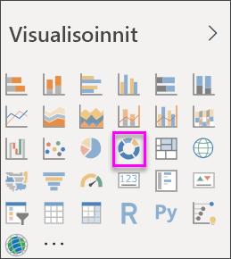

# Rengaskaavioiden luominen ja käyttäminen Power BI:ssa

[!INCLUDE [power-bi-visuals-desktop-banner](../includes/power-bi-visuals-desktop-banner.md)]

Rengaskaavio muistuttaa ympyräkaaviota siten, että se näyttää osien suhteen kokonaisuuteen. Ainoa ero on se, että keskellä on tyhjää tilaa otsikkoa tai kuvaketta varten.

## Edellytys

Tässä opetusohjelmassa käytetään [Jälleenmyyntianalyysimallin PBIX-tiedostoa](https://download.microsoft.com/download/9/6/D/96DDC2FF-2568-491D-AAFA-AFDD6F763AE3/Retail%20Analysis%20Sample%20PBIX.pbix).

1. Valitse valikkorivin vasemmasta yläosasta **Tiedosto** > **Avaa**
   
2. **Jälleenmyyntianalyysimallin PBIX-tiedoston löytäminen**

1. Avaa **Jälleenmyyntianalyysimallin PBIX-tiedosto** raporttinäkymässä .

1. Select  uuden sivun lisäämiseksi.

## Rengaskaavion luominen

1. Aloita tyhjältä raporttisivulta ja valitse Kentät-ruudusta **Myynti**\>**Viime vuoden myynti**.  
   
3. Valitse Visualisointi-ruudusta  muuntamaan pylväskaavio rengaskaavioksi. Jos **Viime vuoden myynti** ei ole **Arvot**-alueella, vedä se sinne.
     
   

4. Valitse **Kohteen** \> **luokka** sen lisäämiseksi **Selite**-alueelle. 
     
    

5. Voit vaihtoehtoisesti [säätää kaavion tekstin väriä ja kokoa](power-bi-visualization-customize-title-background-and-legend.md). 

## Huomioon otettavat seikat ja vianmääritys
* Rengaskaavion arvojen summan on oltava 100 %.
* Liian monta luokkaa vaikeuttaa luettavuutta ja tulkintaa.
* Rengaskaavioita kannattaa käyttää vertailemaan tiettyä osaa kokonaisuuteen sen sijaan, että verrattaisiin yksittäisiä osia keskenään. 

## Seuraavat vaiheet
[Suppilokaaviot Power BI:ssä](power-bi-visualization-funnel-charts.md)

[Visualisointityypit Power BI:ssä](power-bi-visualization-types-for-reports-and-q-and-a.md)

