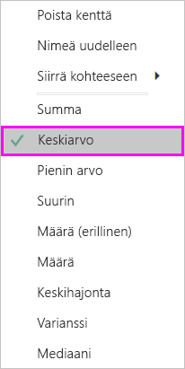
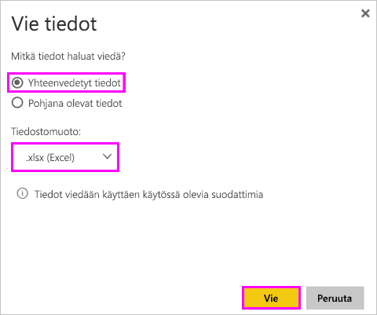

# Visualisoinnin lähdetietojen vieminen

> [!IMPORTANT]
> Kaikki tiedot eivät ole kaikkien käyttäjien tarkasteltavissa tai vietävissä. On suojauksia, joita raporttien suunnittelijat ja järjestelmänvalvojat käyttävät koontinäyttöjä ja raportteja luodessaan. Eräät tiedot ovat rajoitettuja, piilotettuja tai luottamuksellisia, eikä niitä voi nähdä eikä viedä ilman erityisiä oikeuksia. 

## Kuka saa viedä tietoja

Jos sinulla on oikeudet tietoihin, voit nähdä ja viedä tietoja, joita Power BI käyttää visualisoinnin luomiseen. Usein tieto on luottamuksellista tai se on rajoitettu tietyille käyttäjille. Sellaisissa tapauksissa et voi nähdä etkä viedä kyseisiä tietoja. Katso yksityiskohdat tämän asiakirjan lopussa olevasta osasta **Rajoitukset ja huomioon otettavat seikat**. 

## Tietojen tarkastelu ja vienti

Jos haluat nähdä tiedot, joita Power BI käyttää visualisoinnin luomiseksi, [voit näyttää nämä tiedot Power BI:ssä](service-reports-show-data.md). Voit myös viedä nämä tiedot Exceliin *.xlsx*- tai *.csv*-tiedostona. Tietojen vienti edellyttää Pro- tai Premium-käyttöoikeutta sekä tietojoukon ja raportin muokkausoikeuksia. <!--If you have access to the dashboard or report but the data is classified as *highly confidential*, Power BI will not allow you to export the data.-->

Katso videolta, miten tiedot viedään raportin visualisoinnista, tallennetaan *.xlsx*-tiedostoksi ja avataan Excelissä. Kokeile sitten itse noudattamalla videon alapuolella olevia vaiheittaisia ohjeita. Huomaa, että tässä videossa käytetään Power BI:n vanhempaa versiota.

<iframe width="560" height="315" src="https://www.youtube.com/embed/KjheMTGjDXw" frameborder="0" allowfullscreen></iframe>

## Tietojen vieminen Power BI -koontinäytöstä

1. Valitse Lisää toimintoja (...) visualisoinnin oikeasta yläkulmasta.

    

1. Valitse vaihtoehto **Vie .csv:hen**.

    

1. Power BI vie tiedot *.csv*-tiedostoon. Jos olet suodattanut visualisoinnin, myös .csv-vienti suodatetaan. 

1. Selain kehottaa tallentamaan tiedoston.  Kun tiedosto on tallennettu, avaa *.csv*-tiedosto Excelissä.

    

## Tietojen vieminen raportista

Seuraa mukana avaamalla [Hankinta-analyysimallin raportti](../sample-procurement.md) Power BI -palvelun muokkausnäkymässä. Lisää uusi tyhjä raporttisivu. Lisää sitten kooste, hierarkia ja visualisoinnin tason suodatin noudattamalla alla olevia ohjeita.

### Luo pinottu pylväskaavio

1. Luo uusi **pinottu pylväskaavio**.

    

1. Valitse **Kentät**-ruudussa **Sijainti > Kaupunki**, **Sijainti > Maa/alue** ja **Lasku > Alennusprosentti**.  Voit joutua siirtämään **alennusprosentin** **Arvo**-säilöön.

    

1. Muuta **alennusprosentin** kooste **määrästä** **keskiarvoksi**. Valitse **Arvo**-säilössä **Alennusprosentti**-kohdan (siinä voi olla **Alennusprosentin laskelma**) oikealla puolella oleva nuoli ja valitse **Keskiarvo**.

    

1. Lisää suodatin **Kaupunki**-kohtaan, valitse kaikki kaupungit ja poista sitten **Atlanta**.

    

   
1. Poraudu hierarkiassa alaspäin yhden tason verran. Ota porautuminen käyttöön ja poraudu alaspäin **Kaupunki**-tasolle. 

    

Nyt voit kokeilla molempia tietojen vientivaihtoehtoja.

### Vie ***yhteenvedetyt*** tiedot
Valitse vaihtoehto **Yhteenvedetyt tiedot**, jos haluat viedä tietoja siitä, mitä näet kyseisessä visualisoinnissa.  Tämän tyyppinen vienti näyttää vain ne tiedot (sarakkeet ja mittarit), joita käytetään visualisoinnin luomiseen.  Jos visualisoinnissa on kooste, viet koottuja tietoja. Jos sinulla esimerkiksi on palkkikaavio, jossa on neljä palkkia, saat neljä riviä Excel-tietoa. Yhteenvedetyt tiedot ovat saatavilla Power BI -palvelussa *.xlsx*- ja *.csv*-muodoissa sekä Power BI Desktopissa .csv-muodossa.

1. Valitse kolme pistettä (...) visualisoinnin oikeasta yläkulmasta. Valitse **Vie tiedot**.

    

    Power BI -palvelussa, koska visualisoinnissasi on kooste (muutit **Lukumäärän** *keskiarvoksi*), sinulla on kaksi vaihtoehtoa:

    - **Yhteenvedetyt tiedot**

    - **Pohjana olevat tiedot**

    Lue lisätietoja koosteista artikkelissa [Koosteet Power BI:ssä](../service-aggregates.md).

    > [!NOTE]
    > Power BI Desktopissa voit ainoastaan viedä yhteenvedetyt tiedot .csv-tiedostona. 
    
    
1. Valitse **Vie tiedot** -vaihtoehdosta **Yhteenvedetyt tiedot**, valitse joko *.xlsx* tai *.csv*, ja valitse sitten **Vie**. Power BI vie tiedot.

    

1. Kun valitset **Vie**, selain pyytää sinua tallentamaan tiedoston. Kun tiedosto on tallennettu, avaa se Excelissä.

    

    Tässä esimerkissä Excel-vienti näyttää kunkin kaupungin kokonaissumman. Koska Atlanta on suodatettu pois, se ei sisälly tuloksiin. Laskentataulukon ensimmäisellä rivillä näytetään suodattimet, joita Power BI käytti poimiessaan tietoja.
    
    - Kaikki hierarkian käyttämät tiedot viedään, ei pelkästään visualisoinnin nykyisellä porautumistasolla käytettyjä tietoja. Olemme esimerkiksi porautuneet alas kaupunkitasolle, mutta vientiimme sisältyy myös maakohtaisia tietoja.  

    - Viedyt tietomme on koostettu. Meillä on yksi rivi kullekin kaupungille.

    - Koska olemme käyttäneet suodattimia visualisoinnissa, vietävät tiedot viedään suodatettuina. Huomaa, että ensimmäisellä rivillä näkyy **Käytössä olevat suodattimet: Kaupunki ei ole Atlanta, Georgia**. 

### Vie ***pohjana olevat*** tiedot

Valitse tämä vaihtoehto, jos haluat nähdä visualisoinnissa olevat tiedot ***ja*** lisätiedot tietojoukosta (katso lisätietoja alla olevasta kaaviosta). Jos visualisoinnissa on kooste, kooste voidaan poistaa valitsemalla **Pohjana olevat tiedot**. Tässä esimerkissä Excel-vienti näyttää yhden rivin tietojoukon kullekin Kaupunki-riville ja tämän yksittäisen syötteen alennusprosentin. Power BI tasoittaa tiedot, se ei koosta niitä.  

Kun valitset **Vie**, Power Bi vie tiedot *.xlsx*-tiedostoon ja selain pyytää sinua tallentamaan tiedoston. Kun tiedosto on tallennettu, avaa se Excelissä.

1. Valitse visualisoinnin oikeasta yläkulmasta kolme pistettä (...). Valitse **Vie tiedot**.

    

    Power BI -palvelussa, koska visualisoinnissasi on kooste (muutit **Lukumäärän** **keskiarvoksi**), sinulla on kaksi vaihtoehtoa:

    - **Yhteenvedetyt tiedot**

    - **Pohjana olevat tiedot**

    Lue lisätietoja koosteista artikkelissa [Koosteet Power BI:ssä](../service-aggregates.md).

    > [!NOTE]
    > Power BI Desktopissa voit ainoastaan viedä yhteenvedetyt tiedot. 
    
    
1. Valitse kohdasta **Vie tiedot** vaihtoehto **Pohjana olevat tiedot** ja valitse sitten **Vie**. Power BI vie tiedot.

    

1. Kun valitset **Vie**, selain pyytää sinua tallentamaan tiedoston. Kun tiedosto on tallennettu, avaa se Excelissä.

    
    
    - Tässä näyttökuvassa näkyy vain pieni osa Excel-tiedostosta; siinä on yli 100 000 riviä.  
    
    - Kaikki hierarkian käyttämät tiedot viedään, ei pelkästään visualisoinnin nykyisellä porautumistasolla käytettyjä tietoja. Olemme esimerkiksi porautuneet alas kaupunkitasolle, mutta vientiimme sisältyy myös maakohtaisia tietoja.  

    - Koska olemme käyttäneet suodattimia visualisoinnissa, vietävät tiedot viedään suodatettuina. Huomaa, että ensimmäisellä rivillä näkyy **Käytössä olevat suodattimet: Kaupunki ei ole Atlanta, Georgia**. 

## Omistusoikeudellisen tiedon suojaaminen

Tietojoukkoosi kuuluu ehkä sisältöä, jota kaikkien käyttäjien ei sovi nähdä. Jollet ole varovainen, pohjana olevien tietojen vienti voi päästää käyttäjät näkemään kaikki asianomaisen visualisoinnin yksityiskohtaiset tiedot – jokaisen tietosarakkeen ja -rivin. 

On useita strategioita, joita Power BI -järjestelmänvalvojien ja suunnittelijoiden tulisi käyttää omistusoikeudellisen tiedon suojaamiseksi. 

- Suunnittelijat [päättävät siitä, mitkä *vientivaihtoehdot*](#set-the-export-options) ovat käytettävissä.  

- Power BI -järjestelmänvalvojat voivat kytkeä tietojen viennin pois organisaationsa käytöstä. 

- Tietojoukkojen omistajat voivat määrittää rivitason suojauksen (RLS). RLS rajoittaa käyttöoikeuksia vain luku -käyttäjiltä. Mutta jos olet määrittänyt sovellustyötilan ja antanut jäsenille muokkausoikeudet, RLS-rooleja ei sovelleta heihin. Lisätietoja on artikkelissa [Rivitason suojaus](../service-admin-rls.md).

- Raporttisuunnittelijat voivat piilottaa sarakkeita niin, että ne eivät näy **Kentät**-luettelossa. Lisätietoja on kohdassa [Tietojoukon ominaisuudet](../developer/automation/api-dataset-properties.md)

- Power BI -järjestelmänvalvojat voivat lisätä [luottamuksellisuustunnisteita](../admin/service-security-data-protection-overview.md) koontinäyttöihin, raportteihin, tietojoukkoihin ja tietovoihin. He voivat sitten pakottaa suojausasetuksia, kuten salauksia tai vesileimoja, viedessään tietoa. 

- Power BI -järjestelmänvalvojat voivat käyttää [Microsoft Cloud App Securitya](../admin/service-security-data-protection-overview.md) käyttäjien käyttöoikeuksien ja toiminnan valvomiseen, reaaliaikaisen riskianalyysin suorittamiseen ja otsikkokohtaisten ohjausobjektien määrittämiseen. Organisaatiot voivat esimerkiksi määrittää Microsoft Cloud App Securityn avulla käytännön, joka estää käyttäjiä lataamasta arkaluontoisia tietoja Power BI:stä hallitsemattomiin laitteisiin. 

## Pohjana olevien tietojen vieminen

Kun valitset **Pohjana olevat tiedot**, saatat nähdä erilaisia tietoja. Näiden tietojen ymmärtäminen saattaa vaatia järjestelmänvalvojan tai IT-osaston apua. 

>

| Visualisoinnin sisältö | Mitä näet viennissä  |
|---------------- | ---------------------------|
| Koosteet | *ensimmäisen* koosteen ja ei-piilotetut tiedot tämän koosteen koko taulukosta |
| Koosteet | liittyvät tiedot – jos visualisointi käyttää muita tietoja muista tietotaulukoista, jotka  *liittyvät* koosteen sisältävään tietotaulukkoon (kunhan tämä suhde on \*:1 tai 1:1) |
| Mittarit* | kaikki mittarit visualisoinnissa *ja* kaikki mittarit mistä tahansa tietotaulukosta, joka sisältää visualisoinnissa käytetyn mittarin |
| Mittarit* | kaikki ei-piilotetut tiedot taulukoista, jotka sisältävät tämän mittarin (kunhan tämä suhde on \*:1 tai 1:1) |
| Mittarit* | kaikki tiedot kaikista taulukoista, jotka liittyvät mittarit sisältävään taulukkoon ketjun \*:1/1:1) kautta |
| Vain mittarit | kaikki ei-piilotetut sarakkeet kaikista liittyvistä taulukoista (mittarin laajentamiseksi) |
| Vain mittarit | koostetut tiedot kaikille mallin mittarien monistetuille riveille. |

\* Power BI Desktopin tai Power BI -palvelun raportointinäkymässä tulee näkyviin *mittari* luettelossa **Kentät** yhdessä laskinkuvakkeen kanssa . Mittarit voidaan luoda Power BI Desktopissa.

### Vientiasetusten määrittäminen

Power BI:n raporttien suunnitteluohjelmassa määritetään, mitkä tietojen vientiasetukset ovat kuluttajien käytettävissä. Vaihtoehdot ovat seuraavat:

- Salli loppukäyttäjien viedä yhteenvetotiedot Power BI -palvelusta tai Power BI -raporttipalvelimelta.

- Salli loppukäyttäjien viedä sekä yhteenvetotiedot että pohjana olevat tiedot palvelusta tai raporttipalvelimelta.

- Älä salli loppukäyttäjien viedä mitään tietoja palvelusta tai raporttipalvelimelta.

    > [!IMPORTANT]
    > Suosittelemme, että raportin suunnittelijat käyvät läpi vanhat raportit ja määrittävät vientiasetukset manuaalisesti tarpeen mukaan.

Määritä nämä asetukset seuraavasti:

1. Aloita Power BI Desktopissa.

1. Valitse vasemmasta yläkulmasta **Tiedosto** > **Asetukset ja Vaihtoehdot** > **Asetukset**.

1. Valitse **NYKYINEN TIEDOSTO** -kohdassa **Raportin asetukset**.

    

1. Valitse asetus **Vie tiedot** -osiosta.

Voit myös päivittää tämän määrityksen Power BI -palvelussa.

On tärkeää panna merkille, että jos Power BI:n hallintaportaalin asetukset ja tietojen viennin raporttiasetukset ovat ristiriidassa keskenään, hallinta-asetukset ohittavat tietojen vientiasetukset.

## Rajoitukset ja huomioitavat asiat
Nämä rajoitukset ja huomioitavat asiat koskevat Power BI Desktopia ja Power BI -palvelua, mukaan lukien Power BI Prota ja Premiumia.

- Jos haluat viedä tiedot visualisoinnista, sinulla on oltava [pohjana olevan tietojoukon luonnin käyttöoikeus](https://docs.microsoft.com/power-bi/service-datasets-build-permissions).

-  **Power BI Desktopista** ja **Power BI -palvelusta** voidaan viedä **tuontitilaraportista** *.csv*-tiedostoon korkeintaan 30 000 riviä.

- Sovellukset voivat viedä **tuontitilaraportista** *.xlsx*-tiedostoon korkeintaan 150 000 riviä.

- Vienti *pohjana olevien tietojen* avulla ei toimi, jos:

  - versio on vanhempi kuin 2016.

  - mallin taulukoilla ei ole yksilöivää tunnusta.
    
  -  jos järjestelmänvalvoja tai raportin suunnittelija on poistanut käytöstä tämän ominaisuuden.

- *Pohjana olevien tietojen* vienti ei toimi, jos *Näytä kohteet, joilla ei ole tietoja* -asetus on käytössä visualisoinnissa, jota Power BI on viemässä.

- Käytettäessä DirectQueryä Power BI voi viedä enintään 16 Mt pakkaamattomia tietoja. Odottamaton tulos saattaa olla, että viet vähemmän kuin rivien enimmäismäärän. Tämä on todennäköistä, jos:

    - Sarakkeita on useita.

    - Sinulla on vaikeasti pakattavia tietoja.

    - Muut tekijät lisäävät tiedostokokoa ja vähentävät niiden rivien määrää, jotka Power BI voi viedä.

- Jos visualisointi käyttää useamman kuin yhden tietotaulukon tietoja, eikä näille taulukoille ole suhdetta tietomallissa, Power BI vie vain ensimmäisen taulukon tiedot.

- Mukautettuja visualisointeja ja R-visualisointeja ei tällä hetkellä tueta.

- Voit Power BI:ssä nimetä kentän (sarakkeen) uudelleen kaksoisnapsauttamalla kenttää ja kirjoittamalla uuden nimen. Power BI viittaa uuteen nimeen *aliaksena*. On mahdollista, että Power BI -raporttiin voi päätyä kenttien nimien kaksoiskappaleita, mutta Excel ei salli kaksoiskappaleita. Kun Power BI vie sitten tiedot Exceliin, kentän aliakset muunnetaan takaisin alkuperäisen kentän (sarakkeen) nimiksi.  

- Jos *.csv*-tiedostossa on Unicode-merkkejä, teksti ei ehkä näy oikein Excelissä. Esimerkiksi valuuttasymbolit ja vieraskieliset sanat ovat Unicode-merkkejä. Voit avata tiedoston Muistiossa, ja Unicode näyttää sen oikein. Jos haluat avata tiedoston Excelissä, vaihtoehtoisena menetelmänä on tuoda *.csv*-tiedosto. Vie tiedosto Exceliin seuraavasti:

  1. Avaa Excel.

  1. Siirry **Tiedot**-välilehteen.
  
  1. Valitse **Hae ulkoiset tiedot** > **Tekstistä**.
  
  1. Valitse paikallinen kansio, johon tiedosto on tallennettu, ja valitse *.csv*.

- Power BI -järjestelmänvalvojat voivat poistaa tietojen viennin käytöstä.

Onko sinulla kysyttävää? [Voit esittää kysymyksiä Power BI -yhteisössä](https://community.powerbi.com/)
