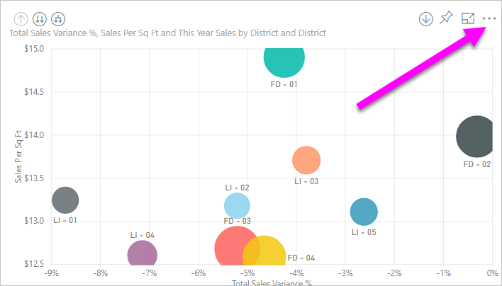
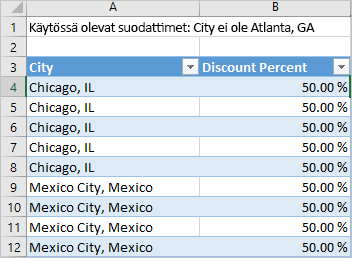

# Visualisoinnin lähdetietojen vieminen

Jos haluat nähdä tiedot, joita Power BI käyttää visualisoinnin luomiseksi, [voit näyttää nämä tiedot Power BI:ssä](service-reports-show-data.md). Voit myös viedä nämä tiedot Exceliin *.xlsx*- tai *.csv*-tiedostona. Tietojen vienti edellyttää Pro- tai Premium-käyttöoikeutta ja tietojoukon ja raportin muokkausoikeuksia. <!--If you have access to the dashboard or report but the data is classified as *highly confidential*, Power BI will not allow you to export the data.-->

Katso videolta, miten tiedot viedään raportin visualisoinnista, tallennetaan *.xlsx*-tiedostoksi ja avataan Excelissä. Kokeile sitten itse noudattamalla videon alapuolella olevia vaiheittaisia ohjeita.

<iframe width="560" height="315" src="https://www.youtube.com/embed/KjheMTGjDXw" frameborder="0" allowfullscreen></iframe>

## Tietojen vieminen Power BI -koontinäytöstä

1. Valitse kolme pistettä (...) visualisoinnin oikeasta yläkulmasta.

    

1. Valitse **Vie tiedot** -kuvake.

    

1. Power BI vie tiedot *.csv*-tiedostoon. Jos olet suodattanut visualisoinnin, sovellus suodattaa ladatut tiedot.

1. Selain kehottaa tallentamaan tiedoston.  Kun tiedosto on tallennettu, avaa *.csv*-tiedosto Excelissä.

    

## Tietojen vieminen raportista

Seuraa mukana avaamalla [Hankinta-analyysimallin raportti](../sample-procurement.md) muokkausnäkymässä. Lisää uusi tyhjä raporttisivu. Lisää sitten kooste ja visualisoinnin tason suodatin noudattamalla alla olevia ohjeita.

1. Luo uusi **pinottu pylväskaavio**.

1. Valitse **Kentät**-ruudussa **Sijainti > Kaupunki** ja **Lasku > Alennusprosentti**.  Voit joutua siirtämään **alennusprosentin** **Arvo**-säilöön.

    

1. Muuta **alennusprosentin** kooste **määrästä** **keskiarvoksi**. Valitse **Arvo**-säilössä **Alennusprosentti**-kohdan (siinä voi olla **Alennusprosentin laskelma**) oikealla puolella oleva nuoli ja valitse **Keskiarvo**.

    

1. Lisää suodatin **Kaupunki**-kohtaan, valitse kaikki kaupungit ja poista sitten **Atlanta**.

    

   Nyt voit kokeilla molempia tietojen vientivaihtoehtoja.

1. Valitse kolme pistettä (...) visualisoinnin oikeasta yläkulmasta. Valitse **Vie tiedot**.

    

    Jos visualisoinnissa on Power BI Onlinessa kooste (olet esimerkiksi muuttanut **Määrä**-vaihtoehdoksi *keskiarvo*, *summa* tai *pienin arvo*), sinulla on kaksi vaihtoehtoa:

    - **Yhteenvedetyt tiedot**

    - **Pohjana olevat tiedot**

    Power BI Desktopissa on vain **Yhteenvedetyt tiedot** -vaihtoehto. Lue lisätietoja koosteista artikkelissa [Koosteet Power BI:ssä](../service-aggregates.md).

1. Valitse **Vie tiedot** -vaihtoehdosta **Yhteenvedetyt tiedot**, valitse joko *.xlsx* tai *.csv*, ja valitse sitten **Vie**. Power BI vie tiedot.

    

    Jos käytit suodattimia visualisointiin, viedyt tiedot viedään suodatettuina. Kun valitset **Vie**, selain pyytää sinua tallentamaan tiedoston. Kun tiedosto on tallennettu, avaa se Excelissä.
    
    Kaikki hierarkian käyttämät tiedot viedään, ei pelkästään visualisoinnin nykyisellä porautumistasolla käytettyjä tietoja. Esimerkiksi jos visualisointia ei ole vielä siirretty alaspäin ylimmältä tasolta, viedyt tiedot sisältävät kaikki hierarkian tiedot, ei vain visualisoinnin luomiseen sen nykyisellä porautumistasolla käytettyjä tietoja.

    **Yhteenvedetyt tiedot**: Valitse tämä vaihtoehto, jos haluat viedä tietoja siitä, mitä näet tässä visualisoinnissa.  Tällainen vientityyppi näyttää vain tiedot (sarakkeet ja mittarit), jotka valitsit visualisoinnin luomiseksi.  Jos visualisoinnissa on kooste, viet koottuja tietoja. Esimerkiksi jos sinulla on palkkikaavio, joka näyttää neljä palkkia, saat neljä tietoriviä. Yhteenvedetyt tiedot ovat saatavilla *.xlsx*- ja *.csv*-muodossa.

    Tässä esimerkissä Excel-vienti näyttää kunkin kaupungin kokonaissumman. Koska Atlanta on suodatettu pois, se ei sisälly tuloksiin. Laskentataulukon ensimmäisellä rivillä näytetään suodattimet, joita Power BI käytti poimiessaan tietoja.

    

1. Kokeile nyt valita **Pohjana olevat tiedot**, *.xlsx*, ja sitten **Vie**. Power BI vie tiedot. 

    > [!NOTE]
    > Raportin asetusten mukaan sinulla voi olla vaihtoehto, jonka mukaan voit tai et voi viedä pohjana olevia tietoja.

    Jos käytit suodattimia visualisointiin, viedyt tiedot viedään suodatettuina. Kun valitset **Vie**, selain pyytää sinua tallentamaan tiedoston. Kun tiedosto on tallennettu, avaa se Excelissä.
    
    Kaikki hierarkian käyttämät tiedot viedään, ei pelkästään visualisoinnin nykyisellä porautumistasolla käytettyjä tietoja. Esimerkiksi jos visualisointia ei ole vielä siirretty alaspäin ylimmältä tasolta, viedyt tiedot sisältävät kaikki hierarkian tiedot, ei vain visualisoinnin luomiseen sen nykyisellä porautumistasolla käytettyjä tietoja.

    >[!WARNING]
    >Viemällä pohjana olevat tiedot käyttäjät voivat tarkastella kaikkia yksityiskohtaisia tietoja – tietojen kaikissa sarakkeissa. Power BI -palvelun järjestelmänvalvojat voivat poistaa tämän käytöstä organisaatiossaan. Jos olet tietojoukon omistaja, voit määrittää sarakkeet **piilotetuiksi** niin, että ne eivät näy **Kenttä**-luettelossa Power BI Desktopissa tai Power BI -palvelussa.

    **Pohjana olevat tiedot**: Valitse tämä vaihtoehto, jos haluat nähdä visualisoinnissa olevat tiedot ***ja*** lisätiedot mallista (katso lisätietoja alla olevasta kaaviosta). Jos visualisoinnissa on kooste, kooste voidaan poistaa valitsemalla *Pohjana olevat tiedot*. Kun valitset **Vie**, Power Bi vie tiedot *.xlsx*-tiedostoon ja selain pyytää sinua tallentamaan tiedoston. Kun tiedosto on tallennettu, avaa se Excelissä.

    Tässä esimerkissä Excel-vienti näyttää yhden rivin tietojoukon kullekin Kaupunki-riville ja tämän yksittäisen syötteen alennusprosentin. Power BI tasoittaa tiedot. Se ei koosta niitä. Laskentataulukon ensimmäisellä rivillä näytetään suodattimet, joita Power BI käytti poimiessaan tietoja.  

    

## Pohjana olevien tietojen vieminen

Kun valitset **Pohjana olevat tiedot**, saatat nähdä erilaisia tietoja. Näiden tietojen ymmärtäminen saattaa vaatia järjestelmänvalvojan tai IT-osaston apua. Power BI Desktopin tai palvelun raportointinäkymässä tulee näkyviin *mittari*, joka näyttää **Kentät**-luettelossa laskinkuvakkeen. Power BI Desktop luo mittayksiköt. Power BI -palvelu ei tee näin.

| Visualisoinnin sisältö | Mitä näet viennissä  |
|---------------- | ---------------------------|
| Koosteet | *ensimmäisen* koosteen ja ei-piilotetut tiedot tämän koosteen koko taulukosta |
| Koosteet | liittyvät tiedot – jos visualisointi käyttää muita tietoja muista tietotaulukoista, jotka  *liittyvät* koosteen sisältävään tietotaulukkoon (kunhan tämä suhde on \*:1 tai 1:1) |
| Mittarit | kaikki mittarit visualisoinnissa *ja* kaikki mittarit mistä tahansa tietotaulukosta, joka sisältää visualisoinnissa käytetyn mittarin |
| Mittarit | kaikki ei-piilotetut tiedot taulukoista, jotka sisältävät tämän mittarin (kunhan tämä suhde on \*:1 tai 1:1) |
| Mittarit | kaikki tiedot kaikista taulukoista, jotka liittyvät mittarit sisältävään taulukkoon ketjun \*:1/1:1) kautta |
| Vain mittarit | kaikki ei-piilotetut sarakkeet kaikista liittyvistä taulukoista (mittarin laajentamiseksi) |
| Vain mittarit | koostetut tiedot kaikille mallin mittarien monistetuille riveille. |

### Vientiasetusten määrittäminen

Power BI:n raporttien suunnitteluohjelmassa määritetään, mitkä tietojen vientiasetukset ovat kuluttajien käytettävissä. Vaihtoehdot ovat seuraavat:

- Salli loppukäyttäjien viedä yhteenvetotiedot Power BI -palvelusta tai Power BI -raporttipalvelimelta.

- Salli loppukäyttäjien viedä sekä yhteenvetotiedot että pohjana olevat tiedot palvelusta tai raporttipalvelimelta.

- Älä salli loppukäyttäjien viedä mitään tietoja palvelusta tai raporttipalvelimelta.

    > [!IMPORTANT]
    > Suosittelemme, että raportin suunnittelijat käyvät läpi vanhat raportit ja määrittävät vientiasetukset manuaalisesti tarpeen mukaan.

Määritä nämä asetukset seuraavasti:

1. Aloita Power BI Desktopissa.

1. Valitse vasemmasta yläkulmasta **Tiedosto** > **Asetukset ja Vaihtoehdot** > **Asetukset**.

1. Valitse **NYKYINEN TIEDOSTO** -kohdassa **Raportin asetukset**.

    

1. Valitse asetus **Vie tiedot** -osiosta.

Voit päivittää tätä asetusta myös Power BI -palvelussa.

On tärkeää panna merkille, että jos Power BI:n hallintaportaalin asetukset ja tietojen viennin raporttiasetukset ovat ristiriidassa keskenään, hallinta-asetukset ohittavat tietojen vientiasetukset.

## Rajoitukset ja huomioitavat asiat
Nämä rajoitukset ja huomioitavat asiat koskevat Power BI Desktopia ja Power BI -palvelua, mukaan lukien Power BI Prota ja Premiumia.

- Jos haluat viedä tiedot visualisoinnista, sinulla on oltava [pohjana olevan tietojoukon luonnin käyttöoikeus](https://docs.microsoft.com/power-bi/service-datasets-build-permissions).

-  **Power BI Desktopista** ja **Power BI -palvelusta** voidaan viedä **tuontitilaraportista** *.csv*-tiedostoon korkeintaan 30 000 riviä.

- Sovellukset voivat viedä **tuontitilaraportista** *.xlsx*-tiedostoon korkeintaan 150 000 riviä.

- Vienti *pohjana olevien tietojen* avulla ei toimi, jos:

  - versio on vanhempi kuin 2016.

  - mallin taulukoilla ei ole yksilöivää tunnusta.
    
  -  jos järjestelmänvalvoja tai raportin suunnittelija on poistanut käytöstä tämän ominaisuuden.

- *Pohjana olevien tietojen* vienti ei toimi, jos *Näytä kohteet, joilla ei ole tietoja* -asetus on käytössä visualisoinnissa, jota Power BI on viemässä.

- Käytettäessä DirectQueryä Power BI voi viedä enintään 16 Mt pakkaamattomia tietoja. Odottamaton tulos saattaa olla, että viet vähemmän kuin rivien enimmäismäärän. Tämä on todennäköistä, jos:

    - Sarakkeita on useita.

    - Sinulla on vaikeasti pakattavia tietoja.

    - Muut tekijät lisäävät tiedostokokoa ja vähentävät niiden rivien määrää, jotka Power BI voi viedä.

- Jos visualisointi käyttää useamman kuin yhden tietotaulukon tietoja, eikä näille taulukoille ole suhdetta tietomallissa, Power BI vie vain ensimmäisen taulukon tiedot.

- Mukautettuja visualisointeja ja R-visualisointeja ei tällä hetkellä tueta.

- Voit Power BI:ssä nimetä kentän (sarakkeen) uudelleen kaksoisnapsauttamalla kenttää ja kirjoittamalla uuden nimen. Power BI viittaa uuteen nimeen *aliaksena*. On mahdollista, että Power BI -raporttiin voi päätyä kenttien nimien kaksoiskappaleita, mutta Excel ei salli kaksoiskappaleita. Kun Power BI vie sitten tiedot Exceliin, kentän aliakset muunnetaan takaisin alkuperäisen kentän (sarakkeen) nimiksi.  

- Jos *.csv*-tiedostossa on Unicode-merkkejä, teksti ei ehkä näy oikein Excelissä. Esimerkiksi valuuttasymbolit ja vieraskieliset sanat ovat Unicode-merkkejä. Voit avata tiedoston Muistiossa, ja Unicode näyttää sen oikein. Jos haluat avata tiedoston Excelissä, vaihtoehtoisena menetelmänä on tuoda *.csv*-tiedosto. Vie tiedosto Exceliin seuraavasti:

  1. Avaa Excel.

  1. Siirry **Tiedot**-välilehteen.
  
  1. Valitse **Hae ulkoiset tiedot** > **Tekstistä**.
  
  1. Valitse paikallinen kansio, johon tiedosto on tallennettu, ja valitse *.csv*.

- Power BI -järjestelmänvalvojat voivat poistaa tietojen viennin käytöstä.

Onko sinulla kysyttävää? [Voit esittää kysymyksiä Power BI -yhteisössä](https://community.powerbi.com/)
