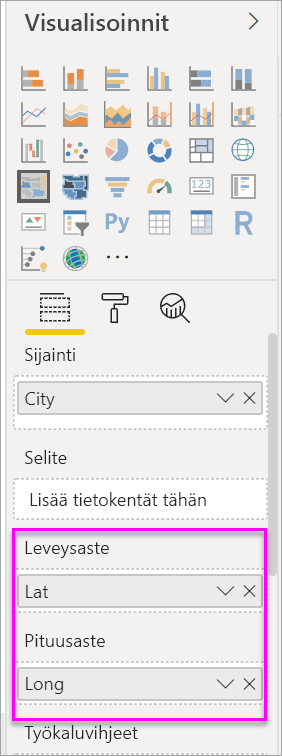

# Täytettyjen karttojen (koropleettikartat) luominen ja käyttäminen Power BI:ssä

[!INCLUDE[consumer-appliesto-nyyn](../includes/consumer-appliesto-nyyn.md)]

[!INCLUDE [power-bi-visuals-desktop-banner](../includes/power-bi-visuals-desktop-banner.md)]

Täytetyssä kartassa käytetään sävytystä tai kuvioita esittämään, miten arvot vaihtelevat suhteellisesti maantieteellisellä alueella.  Suhteelliset erot hahmottuvat nopeasti, kun sävytys vaihtelee vaaleammasta (tarkoittaen harvinaisempaa/pienempää) tummempaan (yleisempi/enemmän).    

## Mitä Bingille lähetetään?
Power BI:n voi integroida Bingin kanssa, jotta käytettäviin saadaan oletusarvoiset karttakoordinaatit (prosessia kutsutaan geokoodaukseksi). Kun luot karttavisualisoinnin Power BI -palvelussa tai Power BI Desktopissa, Bingille lähetetään tiedot visualisoinnin luonnissa käytettävistä **Sijainti**-, **Leveysaste**- ja **Pituusaste**-säilöistä.

Palomuuri on ehkä päivitettävä, jotta Bingin geokoodauksessa hyödyntämiä URL-osoitteita voidaan käyttää.  Tässä on luettelo näistä URL-osoitteista:
- https://dev.virtualearth.net/REST/V1/Locations    
- https://platform.bing.com/geo/spatial/v1/public/Geodata    
- https://www.bing.com/api/maps/mapcontrol

Lisätietoja Bingille lähetettävistä tiedoista sekä vinkkejä geokoodauksen parantamiseen saat ohjeaiheesta [Vihjeitä ja vinkkejä karttavisualisointeja varten](power-bi-map-tips-and-tricks.md).

## Milloin kannattaa käyttää täytettyä karttaa?
Täytetyt kartat ovat hyvä vaihtoehto, kun:

* haluat esittää kvantitatiivista tietoa kartalla.
* haluat esittää paikkaan liittyviä malleja ja paikkojen välisiä suhteita.
* kun tiedot on standardoitu.
* kun käsittelet sosioekonomisia tietoja.
* kun määritetyt alueet ovat tärkeitä.
* kun haluat yleiskuvan jakaumasta maantieteellisten sijaintien suhteen.

### Edellytykset
Tässä oppaassa käytetään [myynti- ja markkinointi-PBIX-mallitiedostoa](https://download.microsoft.com/download/9/7/6/9767913A-29DB-40CF-8944-9AC2BC940C53/Sales%20and%20Marketing%20Sample%20PBIX.pbix).
1. Valitse valikkorivin vasemmasta yläosasta **Tiedosto** > **Avaa**
   
2. Etsi oma kappaleesi **PBIX-esimerkkitiedostosta**

1. Avaa **myynti- ja markkinointi-PBIX-tiedosto** raporttinäkymässä .

1. Valitse  uuden sivun lisäämiseksi.

> [!NOTE]
> Raportin jakaminen työtoverin kanssa Power BI:ssä edellyttää, että teillä kummallakin on oma Power BI Pro -käyttöoikeus tai että raportti on tallennettu Premium-kapasiteettiin.    

### Täytetyn kartan luominen
1. Valitse Kentät-ruudusta **Alue** \> **Osavaltio**.    

   
2. [Muuta kaavio](power-bi-report-change-visualization-type.md) täytetyksi kartaksi. Huomaa, että kohdassa **Sijainti** näkyy nyt **Osavaltio**. Bing Maps käyttää **Sijainti**-kohdan kenttää kartan luomiseen.  Sijainti voi tarkoittaa monenlaisia kelvollisia paikkatietoja: maita, osavaltioita, piirikuntia, kaupunkeja, postinumeroita ja niin edelleen. Bing Maps tarjoaa täytettävät karttamuodot sijainteja varten, olivatpa ne missä päin maailmaa tahansa. Jos Sijainti-kohdassa ei ole kelvollista merkintää, Power BI ei voi luoda täytettyä karttaa.  

   
3. Voit suodattaa kartan näyttämään vain Yhdysvaltojen mannerosat.

   a.  Etsi Visualisoinnit-ruudun vasemmalta puolelta **Suodattimet**-ruutu. Jos se on pienennettynä, suurenna se.

   b.  Vie hiiren osoitin kohtaan **Osavaltio** ja valitse laajennusnuoli.  
   

   c.  Valitse valintaruutu **Kaikki**-kohdan vierestä ja poista valintamerkki vaihtoehdosta **AK**.

   
4. Avaa Muotoilu-ruutu valitsemalla maalitelakuvake ja valitse **Tietojen värit**.

    

5. Valitse **Ehdollinen muotoilu** -vaihtoehto napsauttamalla kolmea päällekkäistä pistettä.

    

6. Käytä **Oletusväri - Tietojen värit** -näyttöä määrittääksesi, miten täytetty karttasi sävytetään. Asetukset antavat sinun muun muassa valita, mihin kenttään sävytys perustuu ja miten sävytys lisätään. Tässä esimerkissä käytetään kenttää **SalesFact** > **Sentiment**, ja asenteen pienin arvo määritetään oranssiksi ja suurin arvo siniseksi. Arvot, jotka jäävät maksimi- ja minimiarvon väliin, näkyvät oranssin ja sinisen sävyissä. Käytetyt värit näkyvät näytön alareunassa olevassa kuvassa. 

    

7. Täytetty kartta sävytetään vihreällä ja punaisella niin, että punainen edustaa alempia asennearvoja ja vihreät suurempia, positiivisempia asenteita.  Jos haluat lisätietoja, vedä kenttä työkaluvihjeisiin.  Olemme lisänneet **SalesFact** > **Sentiment -välin**. Idahon (ID) tilan korostaminen osoittaa, että asenneväli on alhainen, 6.
   

10. [Tallenna raportti](../service-report-save.md).

Power BI:n avulla voit hallita täytetyn kartan ulkoasua vapaasti. Harjoittele väriasetusten käyttöä, kunnes ulkoasu vastaa odotuksiasi. 

## Korostaminen ja ristiinsuodatus
Lisätietoja Suodattimet-paneelin käyttämisestä saat ohjeaiheesta [Suodattimen lisääminen raporttiin](../power-bi-report-add-filter.md).

Yksittäisen sijainnin korostaminen täytetyssä kartassa ristiinsuodattaa muut raporttisivulla olevat visualisoinnit – ja päinvastoin.

1. Tallenna tämä raportti valitsemalla **tiedosto > Tallenna**, ennen kuin siirryt eteenpäin. 

2. Kopioi täytetty kartta painamalla CTRL-C.

3. Avaa Asenne-raporttisivu valitsemalla raporttipohjan alaosasta **Asenne**-välilehti.

    

4. Siirrä visualisointeja ja muuta niiden kokoa sivulla tilan lisäämiseksi, ja liitä sitten komennolla CTRL-V täytetty kartta edellisestä raportista. (Näet seuraavat kuva.)

   

5. Valitse täytetystä kartasta jokin osavaltio.  Tämä ristiinkorostaa ja -suodattaa muut sivulla olevat visualisoinnit. Valitsemalla **Texas** ristiinsuodatat kortteja ja ristiinkorostat palkkikaaviota. Tästä näet, että asenne on 75 ja että Texas on keskialueella 23.   
   
2. Valitse arvopiste VanArsdel – Asenne kuukauden mukaan -viivakaaviosta. Toiminto suodattaa täytetyn kartan niin, että se näyttää asennearvot VanArsdelista eikä sen kilpailijasta.  
   

## Huomioon otettavat seikat ja vianmääritys
Karttatiedot saattavat olla epäselviä.  Esimerkiksi Ranskassa on Paris (Pariisi) mutta myös Texasissa on Paris. Olet luultavasti tallentanut maantieteelliset tiedot erillisiin sarakkeisiin: oma sarake kaupunkien nimille, oma osavaltion tai provinssin nimille ja niin edelleen. Bing ei välttämättä pysty sen vuoksi päättelemään, kumpi Paris on kyseessä. Jos tietojoukossasi on valmiiksi mukana leveys- ja pituusasteet, Power BI:ssä on erityiskenttiä, joiden avulla voit poistaa kartoista edellä kuvatun kaltaiset epäselvyydet. Vedä leveystiedot sisältävä kenttä Visualisoinnit \> Leveysaste-alue.  Tee sama pituusastetiedoille.    

Jos sinulla on oikeudet muokata tietojoukkoa Power BI Desktopissa, katso seuraava video, jossa käsitellään karttaepäselvyyksien vähentämistä.

> [VIDEO https://www.youtube.com/embed/Co2z9b-s_yM ]

Jos sinulla ei käytettävissäsi leveys- ja pituusastetietoja mutta sinulla on tietojoukon käyttöoikeus, [päivitä tietojoukkosi näiden ohjeiden mukaisesti](https://support.office.com/article/Maps-in-Power-View-8A9B2AF3-A055-4131-A327-85CC835271F7).

Lisäohjeita karttavisualisointien tekemiseen saat ohjeaiheesta [Vihjeitä ja vinkkejä karttavisualisointeja varten](../power-bi-map-tips-and-tricks.md).

## Seuraavat vaiheet

[Muotokartta](desktop-shape-map.md)

[Visualisointityypit Power BI:ssä](power-bi-visualization-types-for-reports-and-q-and-a.md)
