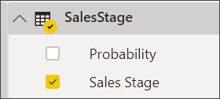
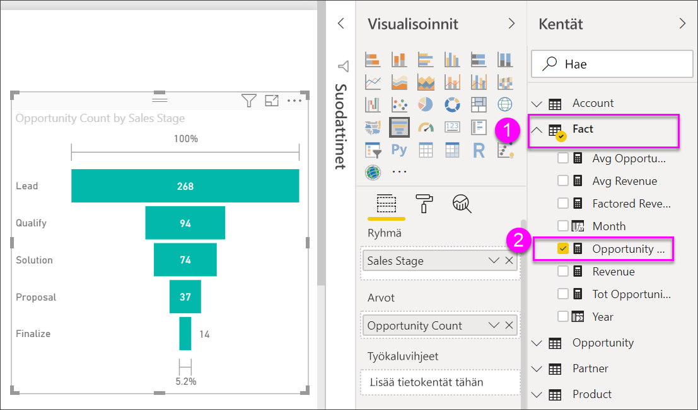

# Suppilokaavio

[!INCLUDE [power-bi-visuals-desktop-banner](../includes/power-bi-visuals-desktop-banner.md)]

Suppilokaavion avulla voit visualisoida lineaarisen prosessin, jossa on peräkkäisiä, toisiinsa liittyviä vaiheita. Esimerkiksi myynnistä voi tehdä suppilokaavion, jossa seurataan asiakkuuksien eri vaiheita: liidi \> hyväksytty liidi \> prospekti \> sopimus \> suljettu.  Suppilon muoto välittää yhdellä silmäyksellä tarkastelemasi prosessin kunnon.

Suppilon kukin vaihe edustaa prosenttiosuutta kokonaismäärästä. Siten useimmissa tapauksissa suppilokaaviosta tulee suppilon muotoinen – ensimmäinen vaihe on kaikkein suurin ja kukin seuraava vaihe on pienempi kuin sitä edeltänyt vaihe.  Myös päärynänmuotoisista suppilokaavioista on hyötyä: sen avulla voi tunnistaa ongelman prosessissa.  Tyypillisesti kuitenkin ensimmäinen vaihe, ”sisäänotto”, on kaikkein suurin.

## Milloin kannattaa käyttää suppilokaaviota?
Suppilokaavio on hyvä vaihtoehto:

* kun tiedot seuraavat toinen toistaan ja etenevät vähintään 4 vaiheen kautta.
* kun on odotettavissa, että ”kohteiden” määrä ensimmäisessä vaiheessa on suurempi kuin viimeisessä vaiheessa.
* kun haluat laskea (tuoton/myyntien/sopimuksien jne.) mahdollisuuksia vaihekohtaisesti.
* kun haluat laskea ja seurata konversio- ja asiakaspoistuma-astetta.
* kun haluat paljastaa lineaarisen prosessin pullonkauloja.
* kun haluat seurata ostoskorin työnkulkua.
* kun haluat seurata napsautusvaiheiden kautta etenevien mainos- tai markkinointikampanjoiden etenemistä ja onnistumista.

## Suppilokaavioiden avulla työskenteleminen
Suppilokaavioissa on seuraavia ominaisuuksia:

* Suppilokaavioita voi lajitella.
* Suppilokaaviot tukevat kerrannaisia.
* Suppilokaavioihin voi tehdä samalla raporttisivulla olevien muiden visualisointien mukaan korostuksia ja ristiinsuodatuksia.
* Suppilokaavioiden avulla voidaan tehdä korostuksia ja ristiinsuodatuksia muihin samalla raporttisivulla oleviin visualisointeihin.
   > [!NOTE]
   > Seuraavassa videossa luodaan suppilokaavio käyttämällä myynti- ja markkinointiaiheista otosta. Kokeile sitten samaa itse Mahdollisuusanalyysimallin PBIX-tiedoston avulla noudattamalla videon alapuolella olevia ohjeita
   > 
   > 
## Edellytys

Tässä opetusohjelmassa käytetään [Mahdollisuusanalyysimallin PBIX-tiedostoa](https://download.microsoft.com/download/9/1/5/915ABCFA-7125-4D85-A7BD-05645BD95BD8/Opportunity%20Analysis%20Sample%20PBIX.pbix
).

1. Valitse valikkorivin vasemmasta yläosasta **Tiedosto** > **Avaa**
   
2. **Mahdollisuusanalyysimallin PBIX-tiedoston löytäminen**

1. Avaa **Mahdollisuusanalyysimallin PBIX-tiedosto** raporttinäkymässä .

1. Valitse  uuden sivun lisäämiseksi.

## Perusluontoisen suppilokaavion luonti
Seuraavassa videossa luodaan suppilokaavio käyttämällä myynti- ja markkinointiaiheista otosta.

<iframe width="560" height="315" src="https://www.youtube.com/embed/qKRZPBnaUXM" frameborder="0" allow="autoplay; encrypted-media" allowfullscreen></iframe>

Nyt voit luoda oman suppilokaavion, joka esittää mahdollisuuksien määrän kussakin myyntivaiheessa.

1. Aloita tyhjältä raporttisivulta ja valitse kenttä **Myyntivaihe** \> **Myyntivaihe**.
   
    

1. Valitse suppilokuvake  pylväskaavion muuntamiseksi suppilokaavioksi.

2. Valitse **Kentät**-paneelista **Fakta** \> **Mahdollisuuksien määrä**.
   
    
4. Kun viet hiiren osoittimen haluamasi palkin kohdalle, esiin tulee monenlaista tietoa.
   
   * Vaiheen nimi
   * Kyseisessä vaiheessa sillä hetkellä olevien mahdollisuuksien määrä
   * Yleinen konversioaste (% liideistä) 
   * Vaiheesta seuraavaan etenevien aste (kutsutaan myös poistuma-asteeksi), joka on prosenttiarvo edellisestä vaiheesta (tässä tapauksessa ehdotusvaiheen suhde ratkaisuvaiheeseen)
     
     

6. [Tallenna raportti](../service-report-save.md).

## Korostaminen ja ristiinsuodatus
Lisätietoja Suodattimet-paneelin käyttämisestä, katso ohjeet [suodattimen lisäämisestä raporttiin](../power-bi-report-add-filter.md).

Yksittäisen palkin korostaminen suppilossa ristiinsuodattaa muut raporttisivulla olevat visualisoinnit... ja päinvastoin. Jatka harjoittelua lisäämällä suppilokaavion sisältämälle raporttisivulle joitakin muitakin visualisointeja.

1. Valitse suppilokaavion palkki **Ehdotus**. Se ristiinkorostaa muut sivulla olevat visualisoinnit. Voit valita useita kohteita kerralla käyttämällä Ctrl-näppäintä.
   
   
2. Jos haluat määrittää asetukset siitä, miten visualisoinnit ristiinkorostavat ja -suodattavat toisiaan, katso [visualisointien vuorovaikutukset Power BI:ssä](../service-reports-visual-interactions.md)

## Seuraavat vaiheet

[Mittarit Power BI:ssä](power-bi-visualization-radial-gauge-charts.md)

[Visualisointityypit Power BI:ssä](power-bi-visualization-types-for-reports-and-q-and-a.md)
