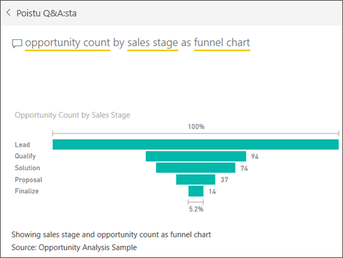

# Suppilokaavio
Suppilokaavion avulla voit visualisoida lineaarisen prosessin, jossa on peräkkäisiä, toisiinsa liittyviä vaiheita. Esimerkiksi myynnistä voi tehdä suppilokaavion, jossa seurataan asiakkuuksien eri vaiheita: liidi \> hyväksytty liidi \> prospekti \> sopimus \> suljettu.  Suppilon muoto välittää yhdellä silmäyksellä tarkastelemasi prosessin kunnon.

Suppilon kukin vaihe edustaa prosenttiosuutta kokonaismäärästä. Siten useimmissa tapauksissa suppilokaaviosta tulee suppilon muotoinen – ensimmäinen vaihe on kaikkein suurin ja kukin seuraava vaihe on pienempi kuin sitä edeltänyt vaihe.  Myös päärynänmuotoisista suppilokaavioista on hyötyä: sen avulla voi tunnistaa ongelman prosessissa.  Tyypillisesti kuitenkin ensimmäinen vaihe, ”sisäänotto”, on kaikkein suurin.

## Milloin kannattaa käyttää suppilokaaviota?
Suppilokaavio on hyvä vaihtoehto:

* kun tiedot seuraavat toinen toistaan ja etenevät vähintään 4 vaiheen kautta.
* kun on odotettavissa, että ”kohteiden” määrä ensimmäisessä vaiheessa on suurempi kuin viimeisessä vaiheessa.
* kun haluat laskea (tuoton/myyntien/sopimuksien jne.) mahdollisuuksia vaihekohtaisesti.
* kun haluat laskea ja seurata konversio- ja asiakaspoistuma-astetta.
* kun haluat paljastaa lineaarisen prosessin pullonkauloja.
* kun haluat seurata ostoskorin työnkulkua.
* kun haluat seurata napsautusvaiheiden kautta etenevien mainos- tai markkinointikampanjoiden etenemistä ja onnistumista.

## Suppilokaavioiden avulla työskenteleminen
Suppilokaavioissa on seuraavia ominaisuuksia:

* Suppilokaavioita voi kiinnittää raporttisivulle raporteista ja Q&A:sta.
* Suppilokaavioita voi lajitella.
* Suppilokaaviot tukevat kerrannaisia.
* Suppilokaavioihin voi tehdä samalla raporttisivulla olevien muiden visualisointien mukaan korostuksia ja ristiinsuodatuksia.
* Suppilokaavioiden avulla voidaan tehdä korostuksia ja ristiinsuodatuksia muihin samalla raporttisivulla oleviin visualisointeihin.

## Perusluontoisen suppilokaavion luonti
Seuraavassa videossa luodaan suppilokaavio käyttämällä myynti- ja markkinointiaiheista otosta.

<iframe width="560" height="315" src="https://www.youtube.com/embed/qKRZPBnaUXM" frameborder="0" allow="autoplay; encrypted-media" allowfullscreen></iframe>

Nyt voit luoda oman suppilokaavion, joka esittää mahdollisuuksien määrän kussakin myyntivaiheessa.

Näissä ohjeissa käytetään mahdollisuusanalyysimallia. Jos haluat seurata ohjeita itse, [lataa malli](../sample-datasets.md) joko Power BI ‑palveluun (app.powerbi.com) tai Power BI Desktopiin.   

1. Aloita [tyhjältä raporttisivulta](../power-bi-report-add-page.md) ja valitse kenttä **Myyntivaihe** \> **Myyntivaihe**. Jos käytät Power BI ‑palvelua, varmista, että avaat raportin [muokkausnäkymässä](../service-interact-with-a-report-in-editing-view.md).
   
    
2. [Muuta kaavio](power-bi-report-change-visualization-type.md) suppilokaavioksi. Huomaa, että **Myyntivaihe** näkyy kohdassa **Ryhmä**. 
3. Valitse **Kentät**-paneelista **Fakta** \> **Mahdollisuuksien määrä**.
   
    
4. Kun viet hiiren osoittimen haluamasi palkin kohdalle, esiin tulee monenlaista tietoa.
   
   * Vaiheen nimi
   * Kyseisessä vaiheessa sillä hetkellä olevien mahdollisuuksien määrä
   * Yleinen konversioaste (% liideistä) 
   * Vaiheesta seuraavaan etenevien aste (eli poistuma-aste), joka on % edellisestä vaiheesta (tässä tapauksessa ehdotusvaiheen suhde ratkaisuvaiheeseen)
     
     
5. [Lisää suppilo raporttisivulle koontinäyttöruutuna](../service-dashboard-tiles.md). 
6. [Tallenna raportti](../service-report-save.md).

## Korostaminen ja ristiinsuodatus
Lisätietoja Suodattimet-paneelin käyttämisestä, katso ohjeet [suodattimen lisäämisestä raporttiin](../power-bi-report-add-filter.md).

Yksittäisen palkin korostaminen suppilossa ristiinsuodattaa muut raporttisivulla olevat visualisoinnit... ja päinvastoin. Jatka harjoittelua lisäämällä suppilokaavion sisältämälle raporttisivulle joitakin muitakin visualisointeja.

1. Valitse suppilokaavion palkki **Ehdotus**. Se ristiinkorostaa muut sivulla olevat visualisoinnit. Voit valita useita kohteita kerralla käyttämällä Ctrl-näppäintä.
   
   
2. Jos haluat määrittää asetukset siitä, miten visualisoinnit ristiinkorostavat ja -suodattavat toisiaan, katso [visualisointien vuorovaikutukset Power BI:ssä](../service-reports-visual-interactions.md)

## Suppilokaavion luonti Q&A:lla
Avaa mahdollisuusanalyysimallin koontinäyttö tai haluamasi muu koontinäyttö, johon on kiinnitetty vähintään yksi visualisointi mahdollisuusanalyysimallin tietojoukosta.  Kun kirjoitat Q&A:ssa kysymyksen, Power BI hakee vastauksia kaikista valittuun koontinäyttöön liitetyistä tietojoukoista (eli tietojoukoista, joista on kiinnitetty ruutuja kyseiseen koontinäyttöön). Lisätietoja on artikkelissa [Power BI:n peruskäsitteet](../service-basic-concepts.md).

1. Ala kirjoittaa kysymystäsi mahdollisuusanalyysimallin koontinäytön Q&A-kysymyskenttään.
   
   
   
2. Muista lisätä teksti ”suppilona” (”as funnel”), jotta Power BI tietää, minkä visualisointityypin haluat.

## Seuraavat vaiheet

[Mittarit Power BI:ssä](power-bi-visualization-radial-gauge-charts.md)

[Visualisointityypit Power BI:ssä](power-bi-visualization-types-for-reports-and-q-and-a.md)
