# Tärkeiden vaikuttajien visualisointi
Tärkeimpien vaikuttajien visualisoinnin avulla ymmärrät paremmin sinua kiinnostavaan arvoon vaikuttavia tekijöitä. Se analysoi tietosi, panee merkitsevät tekijät järjestykseen ja näyttää ne tärkeinä vaikuttajina. Oletetaan esimerkiksi, että haluat ymmärtää, millaiset asiat vaikuttavat henkilöstön vaihtuvuuteen. Yksi tekijä voi olla työsopimuksen pituus ja toinen vaikkapa työntekijän ikä. 
 
## Milloin tärkeimpiä vaikuttajia kannattaa käyttää 
Tärkeimpien vaikuttajien visualisointi on hyvä valinta, kun haluat: 
- nähdä, mitkä tekijät vaikuttavat analysoitavaan arvoon
- verrata näiden tekijöiden suhteellista tärkeyttä toisiinsa. Onko lyhytaikaisilla työsopimuksilla esimerkiksi enemmän merkitystä työntekijöiden vaihtuvuuteen kuin pitkäaikaisilla? 

## Tärkeimpien vaikuttajien vaatimukset 
Analysoitavan arvon on oltava luokittainen tai numeerinen kenttä (koosteita ja mittareita ei vielä tueta).

## Tärkeimpien vaikuttajien visualisoinnin ominaisuudet

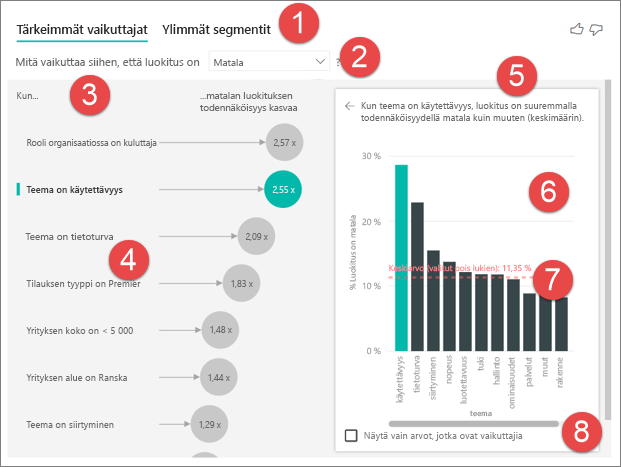

1. **Välilehdet**: Siirry näkymästä toiseen valitsemalla välilehti. **Tärkeimmissä vaikuttajissa** näet valittuun mittausarvoon eniten vaikuttavat tekijät. **Ylimmissä segmenteissä** näet valittuun mittausarvoon eniten vaikuttavat segmentit. *Segmentti* koostuu arvojen yhdistelmästä. Yksi segmentti voivat olla kuluttajat, jotka ovat olleet kuluttajia ainakin kahdenkymmenen vuoden ajan ja asuvat maan länsiosissa. 

2. **Avattava luetteloruutu**: Tutkimuksen kohteena olevan mittarin arvo. Tarkastele tämän esimerkin **luokitus**-arvoa. Valittu arvo on **pieni**.

3. **Oikaisu**: Oikaisu auttaa tulkitsemaan vasemman ruudun visualisointia.

4. **Vasen ruutu**: Vasen ruutu sisältää yhden visualisoinnin. Tässä tapauksessa vasen ruutu näyttää luettelon tärkeimmistä vaikuttajista.

5. **Oikaisu**: Oikaisu auttaa meitä tulkitsemaan oikean ruudun visualisointia.

6. **Oikea ruutu**: Oikea ruutu sisältää yhden visualisoinnin. Tässä tapauksessa pylväskaavio näyttää kaikki arvot tärkeimmälle vaikuttajalle **Teema**, joka valittiin vasemmasta ruudusta. Tietty vasemman ruudun **käytettävyys**-arvo näkyy vihreänä. Kaikki muut **Teemaan** liittyvät arvot näkyvät mustana.

7. **Keskiarvon viiva**: Keskiarvo lasketaan kaikille muille mahdollisille **Teeman** arvoille paitsi **käytettävyydelle**. Laskelma koskee siis kaikkia mustalla näkyviä arvoja. Se kertoo, mikä muiden **teemojen** prosenttiosuus johti alhaiseen luokitukseen. Toisin sanoen antaessaan luokituksen asiakas ilmoittaa luokitukselle myös syyn eli teeman. Teemoja ovat esimerkiksi käytettävyys, nopeus, tietoturva ym. 

   **Teema on käytettävyys** on vasemman ruudun visualisoinnin mukaan toiseksi tärkein alhaiseen luokitukseen vaikuttava tekijä. Jos lasket keskiarvon kaikista muista teemoista ja niiden vaikutuksesta **alhaiseen** luokitukseen, tulos näkyy punaisena. Kaikista muista teemoista vain 11,35 prosenttia on suurempia kuin **käytettävyys**.

8. **Valintaruutu**: **Näytä vain arvot, jotka ovat vaikuttajia**.

## Tärkeimpien vaikuttajien visualisoinnin luominen 
 
Katso tästä videosta, miten voit luoda visualisoinnin tärkeimmistä vaikuttajista. Luo sitten visualisointi näiden vaiheiden avulla. 

<iframe width="560" height="315" src="https://www.youtube.com/embed/fDb5zZ3xmxU" frameborder="0" allow="accelerometer; autoplay; encrypted-media; gyroscope; picture-in-picture" allowfullscreen></iframe>

Tuotepäällikkö haluaa selvittää, mitkä tekijät saavat asiakkaat esittämään kielteisiä mielipiteitä pilvipalvelustasi. Jos haluat osallistua, avaa [asiakaspalautteen PBIX-tiedosto](https://github.com/Microsoft/powerbi-desktop-samples/blob/master/2019/customerfeedback.pbix) Power BI Desktopissa. Voit myös ladata [asiakaspalautteen Excel-tiedoston Power BI -palvelulle tai Power BI Desktopille](https://github.com/Microsoft/powerbi-desktop-samples/blob/master/2019/customerfeedback.xlsx). 

> [!NOTE]
> Asiakaspalautteen tietojoukko perustuu seuraavaan julkaisuun: [Moro et al., 2014] S. Moro, P. Cortez ja P. Rita. "A Data-Driven Approach to Predict the Success of Bank Telemarketing." *Decision Support Systems*, Elsevier, 62:22-31, kesäkuu 2014. 

1. Avaa raportti ja valitse **tärkeimpien vaikuttajien** kuvake. 

    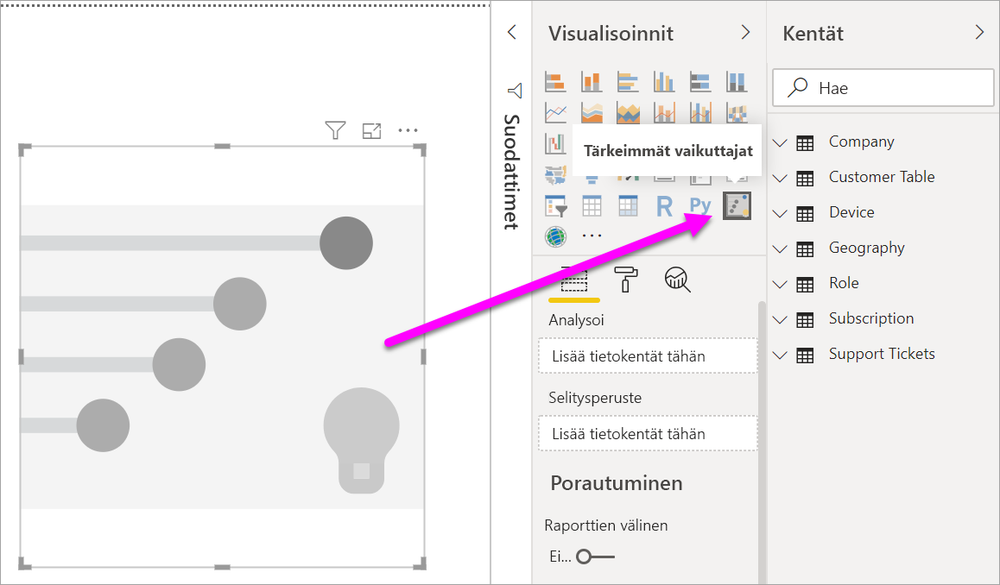

2. Siirrä tutkittava mittausarvo **Analysoi**-kenttään. **Analysoi**-kenttä tukee vain luokkamuuttujia ja ei-jatkuvia muuttujia. Jatkuvia muuttujia ei tueta. Katso, mikä aiheuttaa palvelun matalat luokitukset, valitsemalla **Asiakastaulukko** > **Luokitus**. 
3. Vedä sitten mielestäsi **Luokitukseen** vaikuttavia kenttiä **Selitysperuste**-kenttään. Voit siirtää niin monta kenttää kuin haluat. Aloita tässä tapauksessa seuraavista:
    - Maa tai alue 
    - Rooli organisaatiossa 
    - Paketin tyyppi 
    - Yrityksen koko 
    - teema 
1. Jotta voit keskittyä negatiivisiin luokituksiin, valitse **alhainen**-vaihtoehto avattavasta **Mikä aiheuttaa luokituksen olevan** -ruudusta.  

    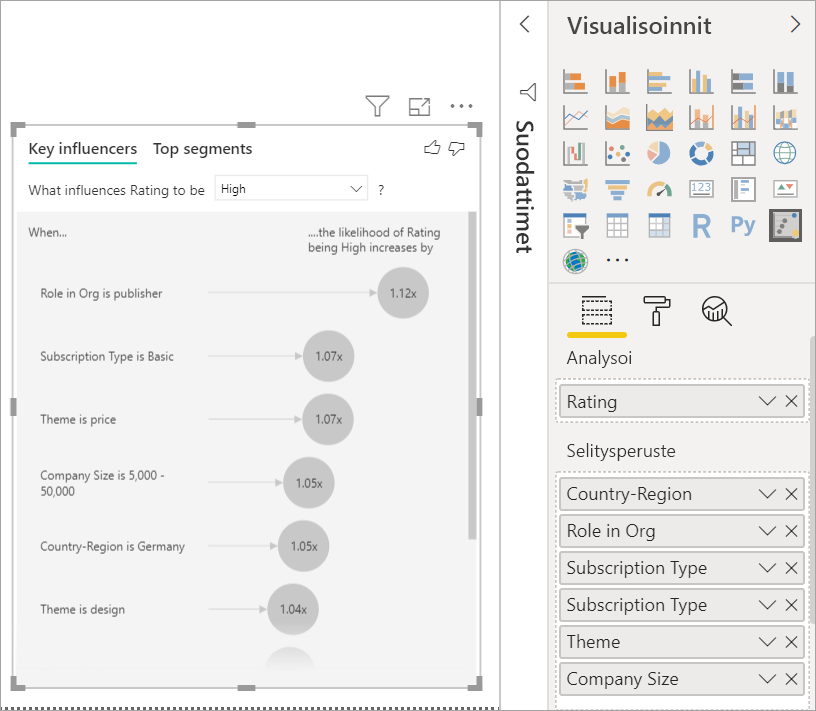

Analyysi tapahtuu analysoitavan kentän taulukkotasolla. Tässä tapauksessa se on **Luokitus**-arvo. Tämä mittausarvon on määritetty asiakastasolla. Kullekin asiakkaalle on annettu joko suuri tai alhainen pistemäärä. Kaikki selittävät tekijät on määriteltävä asiakastasolla, jotta visualisointi voi hyödyntää niitä. 

Edellisessä esimerkissä kaikki selittävät tekijät vastaavat mittausarvoa yksi yhteen- tai monta yhteen -suhteessa. Tässä tapauksessa kukin pistemäärä liittyy täsmälleen yhteen teemaan. Tämä teema oli asiakasarviointien pääteema. Vastaavasti asiakkaat ovat kotoisin tietystä maasta, edustavat tiettyä jäsenyystyyppiä ja heillä on tietty rooli organisaatiossaan. Selittävät tekijät ovat siis jo asiakkaan määritteitä, eikä mitään muunnoksia tarvita. Visualisointi voi käyttää niitä välittömästi. 

Myöhemmin tarkastelemme tässä opetusohjelmassa mutkikkaampia esimerkkejä, joissa on kyse yksi moneen -suhteista. Tällaisissa tapauksissa sarakkeet on ensin koostettava asiakastasolle, ennen kuin analyysi voidaan suorittaa. 

Selittävinä tekijöinä käytetyt mittarit ja koosteet arvioidaan myös **Analysoi**-arvon taulukkotasolla. Tässä artikkelissa on myöhemmin esimerkkejä. 

## Tärkeimpien luokkavaikuttajien tulkitseminen 
Katsotaanpa tärkeimpiä vaikuttajia alhaisten luokitusten takana. 

### Tärkein yksittäinen tekijä, joka vaikuttaa alhaisen luokituksen todennäköisyyteen

Tässä esimerkissä organisaatiolla on kolme roolia: kuluttaja, järjestelmänvalvoja ja julkaisija. Kuluttajan rooli on tärkeimpiä alhaiseen luokitukseen liittyviä tekijöitä. 

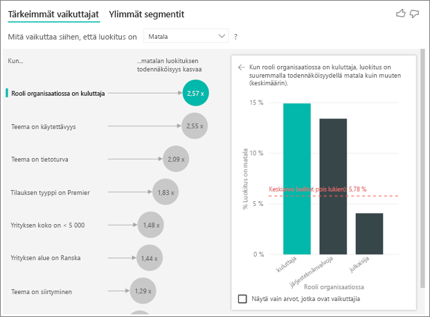

Tarkemmin ilmaistuna, kuluttajat antavat palvelulle kielteisen arvion 2,57 kertaa todennäköisemmin. Tärkeimpien vaikuttajien kaavio luetteloi tekijän **Rooli organisaatiossa = kuluttaja** vasemmalla olevan luettelon kärkeen. Kun valitset **Rooli organisaatiossa = kuluttaja**, Power BI näyttää lisätietoja oikeanpuoleisessa ruudussa. Kunkin roolin suhteellinen vaikutus alhaisen luokituksen todennäköisyyteen näytetään.
  
- 14,93 % kuluttajista antaa alhaisen pistemäärän. 
- Keskimäärin 5,78 % kaikkien muiden roolien edustajista antaa alhaisen pistemäärän.
- Kuluttajat antavat alhaisen pistemäärän 2,57 kertaa todennäköisemmin kuin muiden roolien edustajat. Voit selvittää tämän jakamalla vihreän palkin punaisella pisteviivalla. 

### Toiseksi tärkein yksittäinen tekijä, joka vaikuttaa alhaisen luokituksen todennäköisyyteen

Tärkeimpien vaikuttajien visualisointi vertaa ja panee tärkeysjärjestykseen tekijöitä monista eri muuttujista. Toinen vaikuttajamme ei liity mitenkään **rooliin organisaatiossa**. Valitse luettelon toinen vaikuttava tekijä, joka on **Teema = käytettävyys**. 

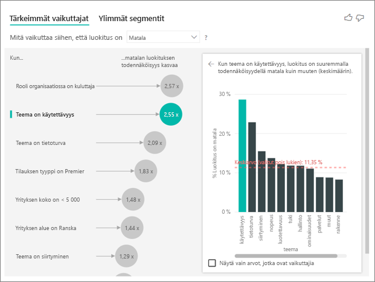

Toiseksi tärkein tekijä liittyy asiakasarvostelun teemaan. Asiakkaat, jotka antoivat palautetta tuotteen käytettävyydestä, antoivat 2,55 kertaa todennäköisemmin alhaisen pistemäärän kuin asiakkaat, jotka antoivat palautetta muista teemoista, kuten luotettavuudesta, rakenteesta tai nopeudesta. 

Näet visualisoinnista toiseen siirtyessä, että keskiarvoa ilmaiseva punainen katkoviiva on muuttunut 5,78 %:sta 11,34 %:iin. Keskiarvo on muuttuva, koska se perustuu kaikkien muiden arvojen keskiarvoon. Ensimmäisen vaikuttajan tapauksessa keskiarvo sulki asiakkaan roolin ulkopuolelle. Toisen vaikuttajan tapauksessa se sulkee pois käytettävyyden teeman. 
 
Valitse **Näytä vain arvot, jotka ovat vaikuttajia** -valintaruutu suodattaaksesi vain vaikuttavien arvojen perusteella. Tässä tapauksessa niitä ovat roolit, jotka lisäävät alhaisen pistemäärän todennäköisyyttä. Power BI tunnistaa kahdestatoista teemasta neljä, jotka lisäävät alhaisen pistemäärän todennäköisyyttä. 

## Käytä muita visualisointeja 
 
Aina kun valitset osittajan, suodattimen tai muun pohjalla olevan visualisoinnin, tärkeimpien vaikuttajien visualisointi suorittaa analyysinsa uudelleen uudelle tieto-osalle. Voit esimerkiksi siirtää **Yrityksen koko** -elementin raporttiin ja käyttää sitä osittajana. Sen avulla voit nähdä, poikkeavatko suuryritysasiakkaiden tärkeimmät vaikuttajat muusta väestöstä. Suuryrityksissä on yli 50 000 työntekijää.
 
Valitsemalla **> 50 000** analyysi suoritetaan uudelleen, jolloin voit nähdä, että vaikuttajat ovat muuttuneet. Suuryritysasiakkaiden ollessa kyseessä alhaisten luokitusten tärkein vaikuttaja liittyy teemaltaan tietoturvaan. On syytö tutkia asiaa tarkemmin sen selvittämiseksi, ovatko suuret asiakkaamme tyytymättömiä joihinkin tiettyihin tietoturvaominaisuuksiin. 

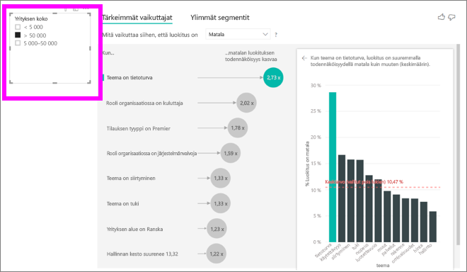

## Tärkeimpien jatkuvien vaikuttajien tulkitseminen 
 
Toistaiseksi olet käyttänyt visualisointeja sen selvittämiseen, kuinka erilaiset luokkakentät vaikuttavat alhaisiin luokituksiin. Voit halutessasi käyttää **Selitysperuste**-kentässä myös jatkuvia tekijöitä, kuten ikä, pituus ja hinta. Katsotaan, mitä tapahtuu, jos **Asiakkuuden pituus** siirretään asiakastaulukosta **Selitysperuste**-kenttään. Asiakkuuden pituus kuvaa, kuinka kauan asiakas on käyttänyt palvelua. 
 
Kun asiakkuuden pituus kasvaa, myös alhaisemman luokituksen todennäköisyys kasvaa. Tämä trendi viittaa siihen, että pitkäaikaiset asiakkaat antavat alhaisen pistemäärän muita todennäköisemmin. Tämä on kiinnostava havainto, joka antaa perustetta jatkotoimenpiteisiin. 
 
Visualisointi kertoo, että aina kun asiakkuuden kesto kasvaa 13,44 kuukaudella, alhaisen luokituksen todennäköisyys kasvaa keskimäärin 1,23-kertaiseksi. Tässä tapauksessa 13,44 kuukautta kuvaa asiakkuuden keston keskihajontaa. Näin saamamme merkityksellinen tieto tarkastelee sitä, kuinka asiakkuuden keston nostaminen vakiomäärän (asiakkuuden keston standardihajonnan) verran vaikuttaa alhaisen luokituksen todennäköisyyteen. 
 
Oikeanpuoleisessa ruudussa oleva pistekaavio näyttää alhaisen luokituksen prosenttiosuuden kunkin asiakkuuden kestoarvon mukaan. Se korostaa kulmakertoimen trendiviivalla.

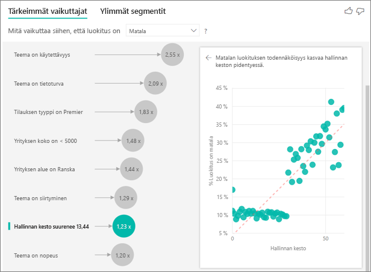

## Lokeroidut tärkeimmät jatkuvat vaikuttajat

Joissakin tapauksissa saatat huomata, että jatkuvat tekijät muuttuvat automaattisesti luokittaisiksi. Tämä johtuu huomiostamme, että muuttujien välinen suhde ei ole lineaarinen, joten emme voi kuvailla suhdetta yksinkertaisesti kasvavaksi tai väheneväksi (kuten teimme yllä olevassa esimerkissä).

Suoritamme korrelaatiotestejä määrittääksemme, miten lineaarinen vaikuttaja on suhteessa kohteeseen. Jos kohde on jatkuva, suoritamme Pearsonin korrelaation, ja jos kohde on luokittainen, teemme pistebiseriaaliset korrelaatiotestit. Jos havaitsemme, että suhde ei ole riittävän lineaarinen, suoritamme valvotun lokeroinnin ja luomme enintään viisi lokeroa. Selvittääksemme mitkä lokerot ovat järkevimpiä, käytämme valvottua lokerointimenetelmää, jossa tarkastellaan selittävän tekijän ja analysoitavan kohteen välistä suhdetta.

## Mittareiden ja koosteiden tulkitseminen tärkeimpinä vaikuttajina 
 
Voit myös käyttää mittareita ja koosteita selvittävinä tekijöinä analyyseissasi. Saatat ehkä haluta nähdä, miten asiakkaiden palvelupyyntöjen määrä tai avoimen palvelupyynnön keskimääräinen kesto vaikuttavat saatuun pistemäärään. 
 
Tässä tapauksessa haluat nähdä, vaikuttaako asiakkaan tukipalvelupyyntöjen määrä hänen antamaansa pistemäärään. Siirrä **tukipalvelupyynnön tunnus** tukipalvelupyyntöjen taulukosta. Koska asiakkaalla voi olla useita tukipalvelupyyntöjä, sinun tarvitsee koostaa tunnus asiakastasolle. Koostaminen on tärkeää, koska analyysiä suoritetaan asiakastasolla, jolloin kaikki vaikuttavat tekijät tulee määritellä kyseisellä erottelutasolla. 
 
Katsotaan tunnusten määrää. Kullakin asiakasrivillä on tietty määrä tukipalvelupyyntöjä. Tässä tapauksessa näemme, että kun tukipalvelupyyntöjen määrä kasvaa, alhaisen luokituksen todennäköisyys kasvaa 5,51-kertaiseksi. Oikeanpuoleinen visualisointi näyttää, että tukipalvelupyyntöjen keskiarvomäärän erilaisten **Luokitus**-arvojen mukaan, jotka on arvioitu asiakastasolla. 

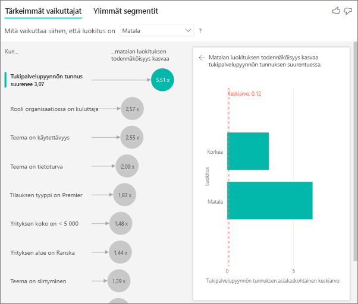

## Tulosten tulkinta: Ylimmät segmentit 
 
Voit arvioida kunkin vaikuttimen erikseen **tärkeimmät vaikuttajat** -välilehden avulla. Voit myös käyttää **Ylimmät segmentit** -välilehteä nähdäksesi, miten eri tekijät yhdessä vaikuttavat analysoitavaan arvoon. 
 
Ylimmissä segmenteissä näytetään ensiksi yleiskatsaus kaikkiin niihin segmentteihin, jotka Power BI on löytänyt. Seuraavassa esimerkissä löytyi kuusi segmenttiä. Nämä segmentit luokitellaan segmentin sisäisen alhaisten luokituksen prosenttiosuuden mukaan. Näemme esimerkiksi, että segmentillä 1 on 74,3 % alhaisista asiakasluokituksista. Mitä korkeammalla kuplakaavio on, sitä suurempi on alhaisten luokitusten osuus. Kuplakaavion koko taas edustaa sitä, montako asiakasta segmentissä on. 

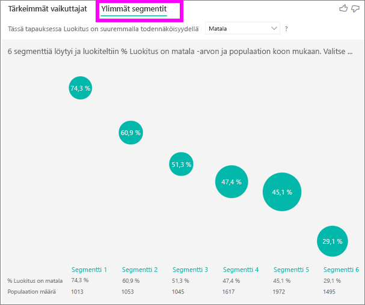

Valitsemalla kuplakaavion poraudut segmentin yksityiskohtiin. Jos valitset esimerkiksi segmentin 1, huomaat, että se koostuu suhteellisen vakiintuneista asiakkaista. He ovat olleet asiakkaita yli 29 kuukautta ja heillä on enemmän kuin neljä tukipalvelupyyntöä. He eivät myöskään ole julkaisijoita, joten he ovat joko kuluttajia tai järjestelmänvalvojia. 
 
Tämän ryhmän edustajista 74,3 % asiakkaista antoi alhaisen luokituksen. Keskimääräinen asiakas antaa alhaisen luokituksen 11,7 %:n todennäköisyydellä, joten tällä segmentillä on merkittävästi suurempi määrä alhaisia luokituksia. Se on 63 prosenttiyksikköä suurempi osuus. Segmentti 1 sisältää noin 2,2 % tiedoista, joten se edustaa perusjoukon käytettävää osaa. 

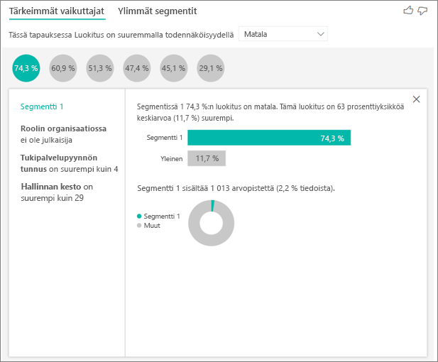

## Numeeristen tietojen käsittely

Jos siirrät numeerisen kentän **Analysoi**-kenttään, voit valita miten kyseistä skenaariota käsitellään. Voit muuttaa visualisoinnin toimintaa siirtymällä **Muotoilu-ruutuun** ja vaihtamalla **Luokittainen analyysityyppi** ja **Jatkuva analyysityyppi** -vaihtoehtojen välillä.

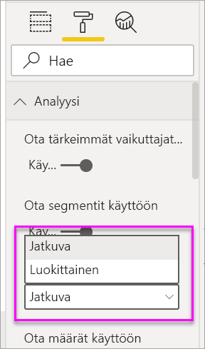

**Luokittainen analyysityyppi** toimii edellä kuvatulla tavalla. Jos esimerkiksi tarkastelet kyselyn pisteitä väliltä 1‒10, voit kysyä vaikka ”mitkä asiat vaikuttavat 1-arvosanan antamiseen?”

**Jatkuva analyysityyppi** muuttaa kysymyksen jatkuvaksi. Yllä annetussa esimerkissä uusi kysymys olisi ”mitkä asiat vaikuttavat kyselyn pisteiden suurenemiseen/pienenemiseen?”

Tästä erottelusta on paljon hyötyä, kun analysoit useita yksilöllisiä arvoja sisältävää kenttää. Alla olevassa esimerkissä tarkastellaan talojen hintoja. Ei ole kovin merkityksellistä kysyä ”mitkä asiat vaikuttavat siihen, että talon arvo on 156 214?”, sillä kysymys on hyvin tarkka eikä saatavilla todennäköisesti ole riittävästi tietoa mallin päättelemiseksi.

Kysy mieluummin ”mitkä asiat vaikuttavat talon hinnan nousuun?”, jolloin talojen hintoja käsitellään arvoväleinä eikä yksittäisinä arvoina.

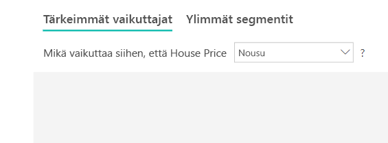

## Tulosten tulkinta: Tärkeimmät vaikuttajat 

Tässä tilanteessa tarkastelemme, mitkä asiat vaikuttavat talojen hintojen nousuun. Tutkimme useita tekijöitä, jotka voivat vaikuttaa talon hintaan. Tällaisia ovat esimerkiksi **Year Built** (vuosi, jolloin talo on rakennettu), **KitchenQual** (keittiön laatu) ja **YearRemodAdd** (talon remontointivuosi). 

Alla olevassa esimerkissä tarkastelemme tärkeintä vaikuttajaa, joka on Erinomainen-laatuarvion saanut keittiö. Tulokset ovat hyvin samankaltaisia analysoidessamme luokittaisia mittaustietoja. Oleellisia eroja ovat:

- Oikeanpuoleinen pylväskaavio näyttää prosenttiosuuksien sijasta keskiarvot. Se siis näyttää, millainen ero on erinomaisella keittiöllä varustetun keskivertotalon (vihreä palkki) ja muunlaisen keskivertotalon (pisteviiva) hinnalla
- Kuplassa näkyvä numero esittää yhä punaisen pisteviivan ja vihreän palkin eroa, mutta se ilmaistaan lukuna (158 490 $) todennäköisyyden (1,93x) sijaan. Erinomaisella keittiöllä varustetut talot ovat siis lähes 160 000 $ kalliimpia kuin talot, joiden keittiöt eivät ole erinomaisia.

Alla olevassa esimerkissä näytetään jatkuvan vaikuttavan tekijän (rakennuksen remontointivuosi) vaikutus talon hintaan. Luokittaisiin arvoihin jatkuvasti vaikuttavien tekijöiden analysointi eroaa seuraavilla tavoilla:

-   Oikeanpuoleisen ruudun pistekaavio näyttää talon keskimääräisen hinnan kutakin remontointivuotta kohti. 
-   Kuplassa näytetty arvo kertoo, paljonko talon keskimääräinen hinta kasvaa (tässä tapauksessa 2 870 $), kun remontointivuosi nousee keskihajonnan verran (tässä tapauksessa 20 vuotta)

Arvojen tapauksessa tarkastellaan talon keskimääräistä rakennusvuotta. Analyysi on seuraavanlainen:

-   Oikeanpuoleisen ruudun pistekaavio näyttää talon keskimääräisen hinnan taulukon arvoa kohti
-   Kuplassa näytetty arvo kertoo, paljonko talon keskimääräinen hinta kasvaa (tässä tapauksessa 1 350 $), kun keskimääräinen vuosi nousee keskihajonnan verran (tässä tapauksessa 30 vuotta)

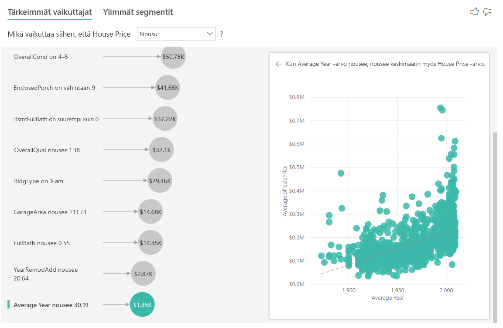

## Tulosten tulkinta: Ylimmät segmentit

Numeeristen kohteiden ylimmät segmentit näyttävät ryhmät, joissa talojen hinnat ovat keskimäärin suuremmat kuin yleisessä tietojoukossa. Alla olevassa esimerkissä **segmentti 1** koostuu taloista, joiden **GarageCars**-arvo (autotallin mahtuvien autojen määrä) on suurempi kuin 2 ja **RoofStyle**-arvo on Trendikäs. Talot, joilla on nämä ominaisuudet, maksavat keskimäärin 355 000 $, kun talojen keskimääräinen hinta tiedoissa on 180 000 $.

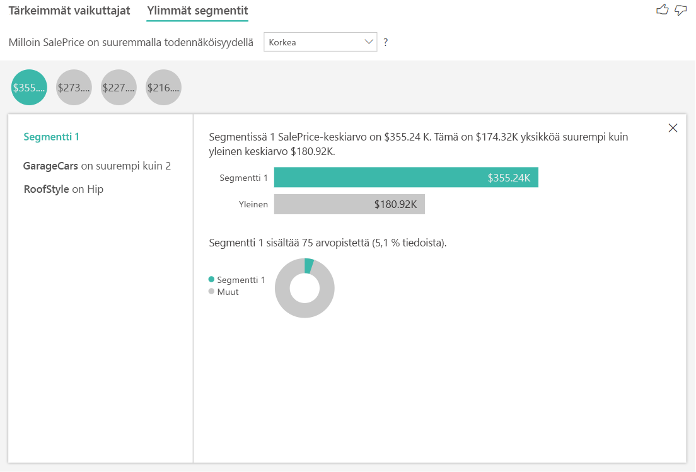

## Huomioon otettavat seikat ja vianmääritys 
 
**Mitä rajoituksia visualisointiin liittyy?** 
 
Tärkeimpien vaikuttajien visualisoinnissa on joitakin rajoituksia:

- Suoraa kyselyä ei tueta
- Reaaliaikaista Azure Analysis Services- ja SQL Server Analysis Services -yhteyttä ei tueta
- Julkaisemista verkkoon ei tueta
- .NET Framework 4.6 tai uudempi vaaditaan

**Näkyviin tulee virhesanoma, joka mukaan vaikuttajia tai segmenttejä ei löytynyt. Mistä tämä johtuu?** 

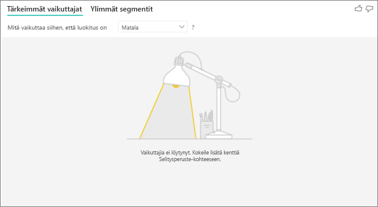

Tämä virhe ilmenee, kun olet sisällyttänyt kenttiä **Selitysperuste**-kohtaan, mutta vaikuttajia ei ole löytynyt. 
- Sisällytit analysoitavan arvon sekä **Analysoi**- että **Selitysperuste**-kohtaan. Poista se **Selitysperuste**-kohdasta. 
- Selityskentissäsi on liian monta luokkaa, joissa on liian vähän havaintoja. Tässä tilanteessa visualisoinnin on hankala määrittää, mitkä tekijät ovat vaikuttajia. Yleistyksiä on vaikea tehdä muutaman havainnon perusteella. Jos analysoit numeerista kenttää, sinun kannattaa vaihtaa **Luokittainen analyysi** **Jatkuvaan analyysiin** **Analyysi**-kortin **Muotoilu-ruudusta**.
- Selittävillä tekijöilläsi on riittävästi havaintoja yleistysten tekemiseen, mutta visualisointi ei löytänyt niistä merkityksellisiä korrelaatioita raportoitaviksi.
 
**Näen sellaisen virheen, että analysoimallani arvolla ei ole riittävästi tietoja analyysin suorittamiseksi. Mistä tämä johtuu?** 

Visualisointi etsii toistuvia kuvioita yhden ryhmän tiedoista verrattuna muihin ryhmiin. Se voi etsiä esimerkiksi alhaisia arvosanoja antaneet asiakkaat korkeita arvosanoja antaneiden asiakkaiden joukosta. Jos mallisi tiedoissa on vain vähän havaintoja, kuvioita on vaikea löytää. Jos visualisoinnilla ei ole riittävästi tietoja käytettävissään merkityksellisten vaikuttajien löytämiseksi, analyysin suorittamiseen tarvitaan enemmän tietoja. 

Suosittelemme, että valitussa tilassa on vähintään 100 havaintoa. Tässä tapauksessa tilan muodostavat vaihtuvat asiakkaat. Verrattavissa tiloissa on oltava vähintään 10 havaintoa. Tässä tapauksessa vertailutilan muodostavat asiakkaat, jotka eivät vaihdu.

Jos analysoit numeerista kenttää, sinun kannattaa vaihtaa **Luokittainen analyysi** **Jatkuvaan analyysiin** **Analyysi**-kortin **Muotoilu-ruudusta**.

**Näen sellaisen virheen, että *Selitysperuste*-kohdan kenttä ei ole ainutlaatuisessa suhteessa taulukkoon, joka sisältää analysoimani arvon. Mistä tämä johtuu?**
 
Analyysi tapahtuu analysoitavan kentän taulukkotasolla. Jos esimerkiksi analysoit palvelusi saamaa asiakaspalautetta, sinulla on ehkä taulukko, josta ilmenee, onko tietty asiakas antanut sinulle korkean vai alhaisen luokituksen. Tässä tapauksessa analyysisi suoritetaan asiakastaulukkotasolla. 

Jos sinulla on asiaan liittyvä taulukko, joka on määritetty rakeisemmalle tasolle kuin mittausarvosi sisältävä taulukko, saat tämän virheilmoituksen. Tässä on esimerkki: 
 
- Analysoit syitä siihen, että asiakkaat antavat palvelullesi alhaisia luokituksia.
- Haluat nähdä, vaikuttaako asiakkaiden antamiin arvioihin laite, jolla he käyttävät palveluasi.
- Asiakas voi hyödyntää palvelua monin eri tavoin.
- Alla olevassa esimerkissä asiakas 10000000 käyttää palvelua sekä selaimella että taulutietokoneella.

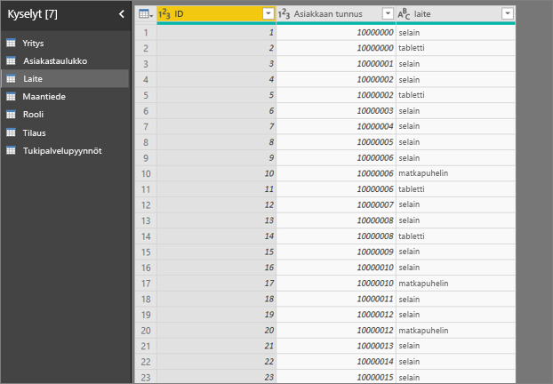

Jos yrität käyttää laitesaraketta selittävänä tekijänä, saat seuraavan virheilmoituksen: 

Tämä virhesanoma tulee näkyviin, koska laitetta ei ole määritetty asiakastasolla. Yksittäinen asiakas voi käyttää palvelua monilla eri laitteilla. Jotta visualisointi voisi etsiä kuvioita, laitteesta on tehtävä asiakkaan ominaisuus. Voit valita useista ratkaisuista, jotka riippuvat yrityksen tuntemuksen tasostasi: 
 
- Voit muuttaa laskettavien laitteiden yhteenvetoa. Käytä laskentaa esimerkiksi, jos laitteiden määrä saattaa vaikuttaa asiakkaan antamaan luokitukseen. 
- Voit pivotoida laitesarakkeen nähdäksesi, vaikuttaako palvelun käyttäminen tietyllä laitteella asiakkaan luokitukseen.
 
Tässä esimerkissä tiedot pivotoitiin, jotta voitiin luoda uusia sarakkeita selaimelle, mobiililaitteelle ja taulutietokoneelle (varmista, että poistat suhteesi ja luot ne uudelleen mallinnusnäkymässä tietojen pivotoinnin jälkeen). Voit nyt käyttää näitä laitteita **Selitysperuste**-kohdassa. Ilmenee, että kaikki laitteet ovat vaikuttajia ja että selaimella on kaikkein suurin vaikutus asiakkaan antamaan pistemäärään.

Tarkemmin sanoen, asiakkaat, jotka eivät käytä palvelua selaimen kautta, antavat 3,79 kertaa todennäköisemmin alhaiset pisteet verrattuna muihin. Alempana luettelossa ilmenee, että mobiililaitteilla tilanne on päinvastainen. Asiakkaat, jotka käyttävät mobiilisovellusta, antavat todennäköisemmin alhaiset pisteet kuin muut asiakkaat. 

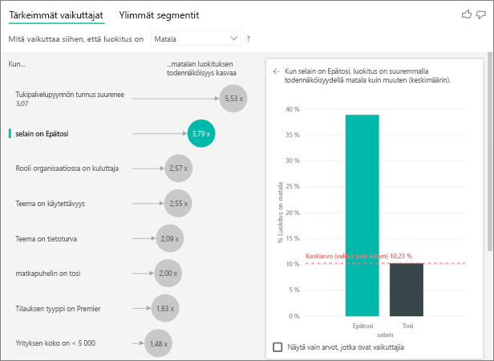

**Näen varoituksen, että mittareita ei sisälly analyysiini. Mistä tämä johtuu?** 

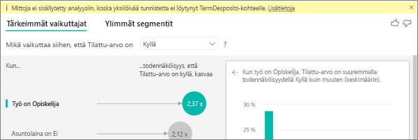

Analyysi tapahtuu analysoitavan kentän taulukkotasolla. Jos arvioit asiakkaiden vaihtuvuutta, sinulla saattaa olla taulukko, joka kertoo, onko asiakas vaihtunut vai ei. Tässä tapauksessa analyysisi suoritetaan asiakastaulukkotasolla.
 
Mittarit ja koosteet analysoidaan oletusarvoisesti taulukkotasolla. Jos käytössä olisi keskimääräisten kuukausittaisten kulujen mittari, se analysoitaisiin asiakastaulukkotasolla. 

Jos asiakastaulukolla ei ole yksilöivää tunnusta, et voi arvioida arvoa, ja analyysi jättää sen huomiotta. Voit välttää tämän tilanteen varmistamalla, että arvon sisältävällä taulukolla on yksilöivä tunnus. Tässä tapauksessa kyse on asiakastaulukosta ja yksilöivä tunnus on asiakastunnus. Voit myös lisätä indeksisarakkeen helposti Power Queryn avulla.
 
**Saan varoituksen, että analysoimallani arvolla on yli 10 yksilöllistä arvoa ja että tämä voi vaikuttaa analyysini laatuun. Mistä tämä johtuu?** 

AI-visualisointi voi analysoida luokittaisia kenttiä ja numeerisia kenttiä. Luokittaisia kenttien tapauksessa, esimerkiksi vaihtuva asiakas = Kyllä/Ei tai asiakastyytyväisyys = Suuri/Normaali/pieni. Analysoitavien luokkien määrän suurentaminen tarkoittaa, että luokkaa kohti on vähemmän havaintoja. Tässä tilanteessa visualisoinnin on vaikea etsiä kuvioita tiedoista. 

Voit numeerisia kenttiä analysoidessasi valita, käsitelläänkö numeerisia kenttiä, kuten tekstiä, jolloin suoritat saman analyysin kuin luokittaisille tiedoille (**Luokittainen analyysi**). Jos sinulla on paljon erillisiä arvoja, suosittelemme, että vaihdat analyysin **jatkuvaan analyysiin**. Se tarkoittaa, että kuvioita voidaan päätellä numeroiden suurenemisesta tai pienenemisestä sen sijaan, että niitä käsiteltäisiin yksittäisinä arvoina. Voit vaihtaa **Luokittaisen analyysin** **Jatkuvaan analyysiin** **Analyysi**-kortin **Muotoilu-ruudusta**.

Vahvempien vaikuttajien löytämiseksi suosittelemme ryhmittelemään samanlaiset arvot yksittäiseksi yksiköksi. Jos yksi mittausarvoistasi on hinta, saat luultavasti parempia tuloksia ryhmittämällä samansuuntaiset hinnat Kallis-, Keskihintainen- ja Halpa-luokkiin sen sijaan, että käyttäisit yksittäisiä hintapisteitä. 

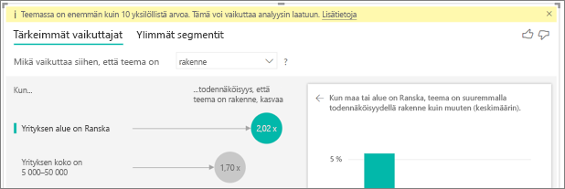

**Tiedoissani on tekijöitä, jotka näyttävät tärkeiltä vaikuttajilta, mutta eivät ole sellaisia. Miten näin voi käydä?**

Seuraavassa esimerkissä kuluttaja-asiakkaat ovat alhaisten luokitusten lähde: heidän arvioistaan 14,93 % on alhaisia. Myös järjestelmänvalvojan rooliin liittyy korkea alhaisten luokitusten prosenttiosuus (13,42 %), mutta roolia ei pidetä vaikuttajana. 

Tämä johtuu siitä, että visualisointi huomioi myös arvopisteiden määrän vaikuttajia etsiessään. Seuraavassa esimerkissä kuluttajia on yli 29 000 kuluttajaa ja 10 kertaa vähemmän järjestelmänvalvojia (noin 2 900). Heistä vain 390 on antanut alhaisen luokituksen. Visualisoinnilla ei siksi ole riittävästi tietoja määrittämään, onko se todella löytänyt järjestelmänvalvojien arvioihin liittyvän kuvion vai onko kyseessä vain satunnainen löytö. 

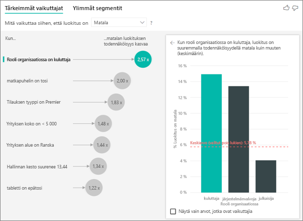

**Miten tärkeimmät vaikuttajat lasketaan luokittaista analyysia varten?**

Taustalla AI-visualisointi suorittaa [ML.NET](https://dotnet.microsoft.com/apps/machinelearning-ai/ml-dotnet)-ympäristön avulla logistista regressiota tärkeimpien vaikuttajien laskemiseksi. Logistinen regressio on tilastotieteellinen malli, joka vertaa erilaisia ryhmiä toisiinsa. 

Jos haluat nähdä, mistä alhaiset luokitukset johtuvat, logistinen regressio selvittää, miten alhaisen pistemäärän antaneet asiakkaat eroavat korkean pistemäärän antaneista. Jos sinulla on useita luokkia, kuten korkea, neutraali ja alhainen, tarkastelet siitä, miten alaisen luokituksen antaneet asiakkaat eroavat asiakkaista, jotka eivät antaneet alhaista luokitusta. Miten tässä tapauksessa alhaisen arvion antaneet asiakkaat eroavat asiakkaista, jotka antoivat korkean tai neutraalin luokituksen? 
 
Logistinen regressio etsii tiedoista kuvioita selvittäen, miten alhaisen luokituksen antaneet asiakkaat mahdollisesti eroavat korkean luokituksen antaneista. Se saattaa esimerkiksi havaita, että asiakkaat, joilla on enemmän tukipalvelupyyntöjä, antavat prosentuaalisesti paljon suuremman määrän alhaisia luokituksia kuin ne, joilla tukipalvelupyyntöjä on vähän tai ei ollenkaan.
 
Logistinen regressio huomioi myös arvopisteiden määrän. Jos esimerkiksi asiakkaat, jotka ovat järjestelmänvalvojan roolissa, antavat suhteessa enemmän kielteisiä pistemääriä, mutta järjestelmänvalvojia on vain kourallinen, tätä ei pidetä vaikuttajana. Tämä erottelu on tehty, koska arvopisteiden määrästä ei voida muodostaa kuviota. Tilastoanalyysitestiä eli Waldin testiä käytetään sen määrittämiseen, voidaanko tekijää pitää vaikuttajana. Visualisointi määrittää kynnysarvon käyttämällä p-arvoa 0,05. 

**Miten tärkeimmät vaikuttajat lasketaan numeerista analyysia varten?**

Taustalla AI-visualisointi suorittaa [ML.NET](https://dotnet.microsoft.com/apps/machinelearning-ai/ml-dotnet)-ympäristön avulla lineaarista regressiota tärkeimpien vaikuttajien laskemiseksi. Lineaarinen regressio on tilastollinen malli, joka tarkastelee analysoitavan kentän muutoksia selittävien tekijöiden perusteella.

Jos esimerkiksi analysoit talojen hintoja, lineaarinen regressio etsii erinomaisen keittiön vaikutusta talon hintaan. Onko erinomaisella keittiöillä varustettujen talojen hinta yleisesti alhaisempi tai korkeampi kuin sellaisten talojen, joissa ei ole erinomaista keittiötä?

Lineaarinen regressio huomioi myös arvopisteiden määrän. Jos esimerkiksi tenniskenttä nostaa talon hintaa, mutta vain harvojen talojen pihalla on tenniskenttä, vaikuttajaa ei pidetä merkittävänä. Tämä erottelu on tehty, koska arvopisteiden määrästä ei voida muodostaa kuviota. Tilastoanalyysitestiä eli Waldin testiä käytetään sen määrittämiseen, voidaanko tekijää pitää vaikuttajana. Visualisointi määrittää kynnysarvon käyttämällä p-arvoa 0,05. 

**Miten segmentit lasketaan?**

AI-visualisointi suorittaa taustalla [ML.NET](https://dotnet.microsoft.com/apps/machinelearning-ai/ml-dotnet)-ympäristön avulla päätöspuuta kiinnostavien aliryhmien löytämiseksi. Päätöspuun tarkoituksena on saada koottua aliryhmä arvopisteitä, jolla kiinnostava mittausarvo on suhteellisen korkealla. Tällaisia voivat olla esimerkiksi alhaisen luokituksen antaneet asiakkaat tai kalliit talot.

Päätöspuu ottaa kunkin selittävän tekijän käsittelyyn ja pyrkii selvittämään, millä tekijällä saadaan paras *jako*. Jos esimerkiksi suodatat tiedot niin, että ne sisältävät enää vain suuryritysasiakkaat, erottaako tämä joukosta asiakkaat, jotka antoivat korkean tai alhaisen luokituksen? Ehkä on parempi suodattaa tiedot niin, että ne sisältävät vain tietoturva-asioita kommentoineet asiakkaat? 

Kun päätöspuu tekee jaon, se vie tietojen aliryhmän ja määrittää kyseisten tietojen seuraavaksi parhaan jaon. Tässä tapauksessa aliryhmä muodostuu asiakkaista, jotka kommentoivat tietoturva-asioita. Kunkin jaon jälkeen päätöspuu huomioi myös, onko jäljellä riittävästi arvopisteitä, jotta ryhmää voidaan pitää kyllin edustavana kuvion päättelemiseksi, vai voisiko kyse olla vain tietojen poikkeamasta, jota ei voi pitää oikeana segmenttinä. Toista tilastoanalyysitestiä sovelletaan jaetun ehdon tilastollisen merkittävyyden selvittämiseksi p-arvon ollessa 0,05. 

Kun päätöspuun suorittaminen on päättynyt, se ottaa kaikki jaot, kuten tietoturvakommentit ja suuryritykset, ja luo Power BI -suodattimia. Tämä suodatinyhdistelmä pakataan segmenttimuotoon visualisoinnissa. 
 
**Miksi eräät tekijät muuttuvat vaikuttajiksi tai lakkaavat olemasta vaikuttajia, kun siirrän lisää kenttiä *Selitysperuste*-kenttään?**

Visualisointi arvioi kaikki selittävät tekijät yhdessä. Tekijä voi olla vaikuttaja itsessään, mutta muiden tekijöiden ohella ei välttämättä. Oletetaan, että haluat analysoida sitä, mikä nostaa talon hintaa. Selittävinä tekijöinä ovat makuuhuoneiden lukumäärä ja talon koko:

- Yksinään makuuhuoneiden määrän kasvu voi olla talon hintaa nostava tekijä.
- Jos talon koko otetaan mukaan analyysiin, se tarkoittaa, että näet, mitä makuuhuoneille tapahtuu talon koon pysyessä vakiona.
- Jos rakennuksen vakiokoko on 140 neliömetriä, on epätodennäköistä, että makuuhuoneiden määrän jatkuva kasvu nostaisi talon hintaa merkittävästi. 
- Makuuhuoneiden merkitys saattaa olla nyt vähäisempi kuin ennen talon koon huomioimista. 

## Seuraavat vaiheet
- [Yhdistelmäkaaviot Power BI:ssä](power-bi-visualization-combo-chart.md)
- [Visualisointityypit Power BI:ssä](power-bi-visualization-types-for-reports-and-q-and-a.md)
