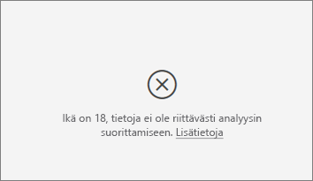

# Tärkeiden vaikuttajien visualisointi
Tärkeiden vaikuttajien visualisoinnin avulla ymmärrät paremmin sinua kiinnostavaa arvoa säätäviä tekijöitä. Se analysoi tietosi, panee merkitsevät tekijät järjestykseen ja näyttää ne tärkeinä vaikuttajina. Olet ehkä kiinnostunut tietämään, mikä vaikuttaa työntekijöiden vaihtuvuuteen. Yksi tekijä voi olla työsopimuksen pituus ja toinen työntekijän ikä. 
 
## Milloin kannattaa käyttää tärkeimpiä vaikuttajia? 
Tärkeimpien vaikuttajien visualisointi on hyvä valinta, kun haluat: 
- Nähdä, mitkä tekijät vaikuttavat analysoitavaan arvoon.

- Verrata näiden tekijöiden suhteellista tärkeyttä toisiinsa. Onko lyhytaikaisilla työsopimuksilla esimerkiksi enemmän merkitystä työntekijöiden vaihtuvuuteen kuin pitkäaikaisilla? 

## Tärkeimpien vaikuttajien vaatimukset 
Analysoitavan arvon on oltava luokkakenttä.    

## Tärkeimpien vaikuttajien visualisoinnin ominaisuudet

    

1. ***Välilehdet*** – siirry näkymästä toiseen valitsemalla välilehti. Tärkeimmissä vaikuttajissa näet valittuun mittausarvoon eniten vaikuttavat tekijät. Ylimmissä segmenteissä näet valittuun mittausarvoon eniten vaikuttavat segmentit. *Segmentti* koostuu arvojen yhdistelmästä.  Yksi segmentti voivat olla kuluttajat, jotka ovat olleet kuluttajia ainakin kahdenkymmenen vuoden ajan ja asuvat maan länsiosissa. 

2. ***Avattavan taulukko*** – tutkittavan tiedon arvo. Tässä esimerkissä tarkastelemme mitattavaa tietoa **luokitus** ja sille valitsemamme arvo on **alhainen**.    

3. ***Oikaisu*** – auttaa meitä tulkitsemaan vasemman ruudun visualisoinnin. 

4. ***Vasen ruutu*** – vasen ruutu sisältää yhden visualisoinnin.  Tässä tapauksessa vasen ruutu näyttää meille luettelon tärkeimmistä vaikuttajista.

5. ***Oikaisu*** – auttaa meitä tulkitsemaan oikean ruudun visualisoinnin.

6. ***Oikea ruutu*** – oikea ruutu sisältää yhden visualisoinnin. Tässä tapauksessa pylväskaavio näyttää kaikki arvot **tärkeimmälle vaikuttajalle**, **teema** joka valitaan vasemmasta ruudusta. Tietty arvo (**Käytettävyys**) vasemmasta ruudusta on vihreä ja kaikki muut **Teeman** arvot ovat mustalla.

7. ***Keskiarvon viiva*** – keskiarvo lasketaan kaikille muille mahdollisille **Teeman** arvoille paitsi **käytettävyydelle**. Laskelma koskee siis kaikkia mustalla näkyviä arvoja. Se kertoo meille, mikä muiden **teemojen** prosenttiosuus johti alhaiseen luokitukseen. Toisin sanoen antaessaan luokituksen asiakas ilmoittaa luokitukselle myös syyn eli **teeman**. Teemoja ovat esimerkiksi käytettävyys, nopeus, tietoturva ym. **Teema** = **Käytettävyys** on vasemman ruudun visualisoinnin mukaan toiseksi tärkein alhaiseen luokitukseen vaikuttava tekijä. Jos laskemme keskiarvon kaikista muista teemoista ja niiden vaikutuksesta **alhaiseen** luokitukseen, saamme tuloksen, joka tässä näkyy punaisena. Kaikkien muiden teemojen joukosta vain 11,35 prosenttia niistä ovat suurempia kuin **käytettävyys**. 

8. ***Valintaruutu*** – näytä vain sellaiset arvot, jotka ovat vaikuttajia.

## Tärkeimpien vaikuttajien visualisoinnin luominen 
 
Katso tästä videosta, miten tärkeimpien vaikuttajien visualisointi luodaan, ja luo sitten itse sellainen noudattamalla seuraavia ohjeita. 

<iframe width="560" height="315" src="https://www.youtube.com/embed/fDb5zZ3xmxU" frameborder="0" allow="accelerometer; autoplay; encrypted-media; gyroscope; picture-in-picture" allowfullscreen></iframe>

Microsoftin tuotteiden hallinta haluaa selvittää, mitkä tekijät saavat asiakkaat esittämään kielteisiä mielipiteitä pilvipalvelustamme.  Jos haluat osallistua, avaa [asiakaspalautteen PBIX-tiedosto](https://github.com/Microsoft/powerbi-desktop-samples/blob/master/2019/customerfeedback.pbix) Power BI Desktopissa. Voit myös ladata [asiakaspalautteen Excel-tiedoston Power Bi -palvelulle tai Power Bi Desktopille](https://github.com/Microsoft/powerbi-desktop-samples/blob/master/2019/customerfeedback.xlsx). 

> [!NOTE]
> Asiakaspalautteen tietojoukko perustuu lähteeseen [Moro et al., 2014] S. Moro, P. Cortez ja P. Rita. A Data-Driven Approach to Predict the Success of Bank Telemarketing. Decision Support Systems, Elsevier, 62:22-31, kesäkuu 2014 

1. Avaa raportti ja valitse tärkeimpien vaikuttajien kuvake.  

    

2. Vedä tutkittava mittausarvo **Analysoi**-kenttään. **Analysoi**-kenttä tukee vain luokkamuuttujia, ei jatkuvia muuttujia. Koska haluamme nähdä, mikä saa asiakkaan antamaan palvelumme laadulle luokituksen **Alhainen**, teemme valinnan **Asiakastaulu** > **Luokitus**.    
3. Vedä sitten mielestäsi **Luokitukseen** vaikuttavia kenttiä **Selitysperuste**-säilöön. Voit vetää sinne aivan niin monta kenttää kuin haluat. Tässä tapauksessa aloitamme seuraavista: 
    - Maa tai alue 
    - Rooli organisaatiossa 
    - Paketin tyyppi 
    - Yrityksen koko 
    - teema     
4. Koska olemme kiinnostuneita negatiivisista luokituksista, valitse **Alhainen** avattavasta luettelosta **Miksi luokitus on**.  

    

Analyysi tapahtuu analysoitavan kentän taulukkotasolla. Tässä tapauksessa meitä kiinnostaa **Luokitus**-mittausarvo, joka määritellään asiakkaan tasolla (jokainen asiakas on antanut joko korkean tai alhaisen pistemäärän). Kaikki selitystekijämme on määriteltävä asiakastasolla, jotta visualisointi voi hyödyntää niitä. 

Yllä olevassa esimerkissä kaikki selitystekijämme ovat joko yksi yhteen- tai monta yhteen -suhteessa mittausarvoomme. Kukin pistemäärä esimerkiksi liittyy vain yhteen teemaan (asiakasarvion pääteemaan). Vastaavasti jos asiakkaat ovat kotoisin tietystä maasta, edustavat tiettyä jäsenyystyyppiä ja heillä on tietty rooli organisaatiossaan. Selittävät tekijät ovat siis jo asiakkaan määritteitä, eikä mitään muunnoksia tarvita – visualisointi voi käyttää niitä välittömästi. 

Myöhemmin tarkastelemme tässä opetusohjelmassa mutkikkaampia esimerkkejä, joissa on kyse yksi moneen -suhteista. Tällaisissa tapauksissa sarakkeet on ensin koostettava asiakkaan tasolle asti, ennen kuin analyysi voidaan suorittaa.  

Selittävinä tekijöinä käytetyt mitat ja koosteet arvioidaan myös **Analysoi**-mittausarvon taulukkotasolla, mistä näemme tässä artikkelissa myöhemmin esimerkkejä. 

## Tärkeimpien luokkavaikuttajien tulkitseminen 
Katsotaanpa tärkeimpiä vaikuttajia alhaisten luokitusten takana. 

### Tärkein yksittäinen tekijä, joka vaikuttaa alhaisten luokitusten todennäköisyyteen

Organisaatiossamme on kolme roolia: kuluttajat, järjestelmänvalvojat ja julkaisijat. Näemme, että kuluttajan rooli on tärkeimpiä alhaiseen luokitukseen liittyviä tekijöitä. 

Vielä tarkemmin: kuluttajamme antavat meille kielteisen arvion 2,57 kertaa todennäköisemmin. Tärkeimpien vaikuttajien kaavio luetteloi tekijän **Rooli organisaatiossa = kuluttaja** vasemmalla olevan luettelon kärkeen. Kun valitset **Rooli organisaatiossa = kuluttaja**, Power BI näyttää meille lisätietoja oikeanpuoleisessa ruudussa – kunkin **roolin** vaikutus alhaisen luokituksen todennäköisyyteen.
  
- 14,93 % kuluttajista antaa alhaisen pistemäärän  
- Keskimäärin kaikki muut roolit antavat alhaisen pistemäärän 5,78 % ajasta 
- Kuluttajat antavat siksi alhaisen pistemäärän 2,57 kertaa todennäköisemmin kaikkiin muihin rooleihin verrattuna (erotus vihreän viivan ja punaisen katkoviivan välillä) 

### Toiseksi tärkein yksittäinen tekijä, joka vaikuttaa alhaisten luokitusten todennäköisyyteen

Tärkeimpien vaikuttajien visualisointi kykenee vertaamaan ja panemaan tärkeysjärjestykseen tekijöitä monilta eri muuttujilta.  Toinen vaikuttajamme ei liity mitenkään **rooliin organisaatiossa**.  Valitse luettelon toinen vaikuttava tekijä; **Teema = käytettävyys**. 

Tässä näemme, että toiseksi tärkein tekijä liittyy asiakasarvostelun teemaan. Asiakkaat, jotka antoivat palautetta tuotteen *käytettävyydestä*, antoivat 2,21 kertaa todennäköisemmin alhaisen pistemäärän kuin asiakkaat, jotka antoivat palautetta muista teemoista, kuten luotettavuudesta, rakenteesta tai nopeudesta. 

Näet visualisoinnista toiseen siirtyessä, että keskiarvoviiva (punainen katkoviiva) on muuttunut 5,78 %:sta 11,34 %:iin. Keskiarvo on muuttuva, koska se perustuu kaikkien muiden arvojen keskiarvoon. Ensimmäisen vaikuttajan tapauksessa keskiarvon laskemiseen ei otettu mukaan asiakkaan roolia, kun taas toisessa tapauksessa siitä jätettiin pois käytettävyyden teema. 
 
Jos visualisoinnin alariville jätetään valintamerkki, visualisointi suodattaa arvot niin, että vain vaikuttavat arvot jäävät (tässä tapauksessa alhaiseen pistemäärään myötävaikuttavat arvot). Siirrymme siis 12 teemasta niihin neljään, jotka Power BI on tunnistanut alhaisia luokituksia aiheuttaviksi. 

## Vuorovaikutus muiden visualisointien kanssa 
 
Aina kun käyttäjä napsauttaa osittajaa, suodatinta tai muuta pohjalla olevaa visualisointia, Tärkeimmät vaikuttajat -visualisointi suorittaa analyysinsa uudelleen uudelle tieto-osalle. Vedetäänpä esimerkiksi Yrityksen koko raporttiin ja käytetään sitä osittajana. Haluamme nähdä, ovatko yritysasiakkaidemme tärkeimmät vaikuttajat (yrityksen koko suurempi kuin 50 000) erilaisia kuin koko väestö.  
 
Valitsemalla **> 50 000** analyysi saadaan suoritettua uudelleen, ja voimme nähdä, että vaikuttajat ovat muuttuneet. Suurten yritysasiakkaiden ollessa kyseessä alhaisten luokitusten tärkein vaikuttaja liittyy **teemaltaan** **tietoturvaan**. Haluamme tutkia asiaa tarkemmin sen selvittämiseksi, ovatko suuret asiakkaamme tyytymättömiä joihinkin tiettyihin tietoturvaominaisuuksiin. 

## Jatkuvasti tärkeimpinä pysyvien vaikuttajien tulkitseminen 
 
Toistaiseksi olemme käyttäneet visualisointeja sen selvittämiseen, kuinka erilaiset luokkakentät vaikuttavat alhaisiin luokituksiin. On mahdollista käyttää myös jatkuvia tekijöitä (esimerkiksi ikä, pituus, hinta) Selitysperuste-kohdassa. Katsotaan, mitä tapahtuu, jos pudotamme ’Asiakkuuden pituus’ Asiakas-taulukosta ’Selitysperusteeseen’. Asiakkuuden pituus tarkoittaa, kuinka kauan asiakas on käyttänyt palvelua. 
 
Voimme huomata, että kuin **Asiakkuuden pituus** kasvaa, myös alhaisemman luokituksen todennäköisyys kasvaa. Tästä trendistä voidaan päätellä, että pitkäaikaisemmat asiakkaamme antavat todennäköisemmin kielteisen arvion. Tätä mielenkiintoista tietoa on ehkä syytä pohtia myöhemmin.  
 
Visualisointi kertoo, että aina kun asiakkuuden kesto kasvaa 13,44 kuukaudella, alhaisen luokituksen todennäköisyys kasvaa keskimäärin 1,23 kertaa. Tässä tapauksessa 13,44 kuukautta kuvaa asiakkuuden keston keskihajontaa. Näin saamamme merkityksellinen tieto tarkastelee sitä, kuinka asiakkuuden keston nostaminen vakiomäärän (asiakkuuden keston standardihajonnan) verran vaikuttaa alhaisen luokituksen todennäköisyyteen. 
 
Oikealla puolella pistekaavio piirtää keskimääräisen %:n asiakkuuden keston kunkin arvon alhaisille luokituksille ja sisältää trendiviivan, joka korostaa kaltevuutta.  

## Mittasuhteiden/koosteen tulkitseminen tärkeimpinä vaikuttajina 
 
Käyttäjät voivat myös käyttää mittasuhteita ja koosteita selvittävinä tekijöinä analyysissaan. Haluamme ehkä nähdä, miten asiakkaiden palvelupyyntöjen määrä tai avoimen palvelupyynnön keskimääräinen kesto vaikuttavat saamaamme pistemäärään. 
 
Tässä tapauksessa haluamme nähdä, vaikuttaako asiakkaan tukipalvelupyyntöjen määrä hänen meille antamaansa pistemäärään. Aiomme nyt siirtää tukipalvelupyynnön tunnuksen pois tukipalvelupyyntötaulukosta. Koska asiakkaalla voi olla useita tukipalvelupyyntöjä, meidän tarvitsee koostaa tunnus asiakastasolle. Tämä koostaminen on tärkeää, koska suoritamme analyysiä asiakkaan tasolla, jolloin kaikki ohjaimet tulee määritellä kyseisellä askelvälitasolla. 
 
Tarkastelemme tunnusten määrää (niin, että jokaisella asiakasrivillä näkyy siihen liittyvien palvelupyyntöjen määrä). Tässä tapauksessa näemme, että kun palvelupyyntöjen määrä kasvaa, luokituksen alhaisuuden todennäköisyys kasvaa 5,51-kertaiseksi. Oikeanpuoleinen visualisointi näyttää meille tukipalvelupyyntöjen keskiarvomäärän erilaisten luokitusarvojen mukaan (arvioitu asiakastasolla). 

## Tulosten tulkitseminen: ylimmät segmentit 
 
Samalla kun Tärkeimmät vaikuttajat -välilehti sallii käyttäjien arvioida kutakin tekijää erikseen, käyttäjät voivat siirtyä Ylimpiin segmentteihin nähdäkseen, miten tekijöiden yhdistelmä vaikuttaa heidän analysoimaansa arvoon. 
 
Ylimmissä segmenteissä näytetään ensiksi yleiskatsaus kaikkiin niihin segmentteihin, jotka Power BI on löytänyt. Alla olevassa esimerkissä näemme, että on löytynyt kuusi segmenttiä. Nämä segmentit luokitellaan segmentin sisäisen alhaisten luokituksen %:n mukaan. Näemme esimerkiksi, että segmentillä 1 on 74,3 % alhaista asiakasluokitusta.  Mitä korkeammalla kuplakaavio on, sitä suurempi on alhaisten luokitusten osuus. Kuplakaavion koko taas edustaa sitä, kuinka monta asiakasta segmentissä on. 

Valitsemalla kuplakaavion poraudut segmentin yksityiskohtiin. Jos esimerkiksi valitsemme segmentin 1, huomaamme, että se koostuu suhteellisen vakiintuneista asiakkaista (ovat olleet asiakkaitamme ainakin 29 kuukauden ajan), joilla on suuri määrä tukipalvelupyyntöjä (enemmän kuin 4). He eivät myöskään ole julkaisijoita (joten he ovat joko kuluttajia tai järjestelmänvalvojia).  
 
Tässä ryhmässä 74,3 % on antanut alhaisen luokituksen. Keskimääräinen asiakas antaa alhaisen luokituksen 11,7 % ajasta, joten tällä segmentillä on merkittävästi suurempi määrä alhaisia luokituksia (63 prosenttiyksikköä korkeampi). Huomaamme myös, että segmentti 1 sisältää noin 2,2 % tiedosta, joten se edustaa perusjoukon käytettävää osaa. 

## Huomioon otettavat seikat ja vianmääritys 
 
**Mitä rajoituksia esikatseluun liittyy?** 
 
Tärkeimpien vaikuttajien visualisointi on tällä hetkellä julkisessa esikatselussa, ja käyttäjien tulisi olla tietoisia eräistä rajoituksista. Toimintoihin, joita ei tällä hetkellä tueta, kuuluvat: 
- Sellaisten arvojen analysointi, jotka ovat koosteita/mittauksia 
- Visualisoinnin käyttäminen Power BI Embeddedissä
- Visualisoinnin käyttäminen Power BI -mobiilisovelluksissa
- Rivitason suojauksen tuki 
- Suorien kyselyjen tuki 
- Live-yhteyksien tuki 
 
**Näen sellaisen virheen, että vaikuttajia/segmenttejä ei ole löytynyt ollenkaan. Mistä tämä johtuu?**  

Tämä virhe ilmenee, kun olet sisällyttänyt kenttiä kohtaan **Selitysperuste**, mutta vaikuttajia ei ole löytynyt.   
- Olet sisällyttänyt analysoitavan arvon sekä kohtaan ’Analysoi’ että kohtaan ’Selitysperuste’ (sinun on poistettava se kohdasta **Selitysperuste**) 
- Selityskentissäsi on liian monta luokkaa, joissa on liian vähän havaintoja. Tällöin visualisoinnin on vaikea määrittää, mitkä tekijät ovat vaikuttajia, koska on vaikeaa tehdä yleistyksiä pienestä määrästä havaintoja 
- Selittävillä tekijöilläsi on riittävästi havaintoja yleistysten tekemiseen, mutta visualisointi ei löytänyt niistä merkityksellisiä korrelaatioita raportoitaviksi 
 
**Näen sellaisen virheen, että arvolla, jota analysoin, ei ole riittävästi tietoja analyysin suorittamiseksi. Mistä tämä johtuu?**  

Visualisointi toimii tarkastelemalla kuvioita yhden ryhmän tiedoissa (esimerkiksi asiakkaiden, jotka ovat antaneet alhaisia luokituksia) verrattuna toiseen ryhmään (esimerkiksi asiakkaisiin, jotka ovat antaneet korkeita luokituksia). Jos mallisi tiedoissa on vain vähän havaintoja, on vaikea löytää kuvioita. Jos visualisoinnilla ei ole riittävästi tietoja käytettävissään merkityksellisten vaikuttajien löytämiseksi, analyysin suorittamiseen tarvitaan enemmän tietoja. On suositeltavaa kerätä ainakin 100 havaintoja valitulle tilalle (vaihtuvat asiakkaat) ja ainakin 10 havaintoa verrokkitilalle (asiakkaat, jotka eivät vaihdu).  
 
**Näen sellaisen virheen, että ’Selitysperuste’-kenttä ei ole ainutlaatuisessa suhteessa taulukkoon, joka sisältää analysoimani arvon. Mistä tämä johtuu?**  
 
Analyysi tapahtuu analysoitavan kentän taulukkotasolla. Jos esimerkiksi analysoit palvelusi saamaa asiakaspalautetta, sinulla on ehkä taulukko, josta ilmenee, onko tietty asiakas antanut sinulle korkean vai alhaisen luokituksen. Tässä tapauksessa analyysisi suoritetaan asiakastaulukkotasolla. 

Jos sinulla on asiaan liittyvä taulukko, joka on määritetty rakeisemmalle tasolle kuin mittausarvosi sisältävä taulukko, saat tämän virheilmoituksen. Kuvaillaan tätä seuraavalla esimerkillä: 
 
- Olet analysoimassa syitä siihen, että asiakkaat antavat alhaisia luokituksia palvelullesi 
- Olet kiinnostunut näkemään, vaikuttaako asiakkaiden antamiin arvioihin laite, jolla he käyttävät palveluasi 
- Asiakas voi hyödyntää palvelua monin eri tavoin   
- Alla olevassa esimerkissä asiakas 10000000 käyttää sekä selainta että taulutietokonetta palvelun tavoittamiseen 

Jos yrität käyttää laitesaraketta selittävänä tekijänä, saat seuraavan virheilmoituksen: 

Tämä johtuu siitä, että laitetta ei ole määritetty asiakkaan tasolla – sama asiakas voi hyödyntää palvelua useilla eri laitteilla. Jotta visualisointi voisi etsiä kuvioita, laitteesta on tehtävä asiakkaan määrite. Tässä tapauksessa voin tarjota useita ratkaisua, jotka riippuvat siitä, miten ymmärrän yrityksen toiminnan: 
 
- Voin muuttaa laitteen yhteenvedon esimerkiksi lukumääräksi, jos uskon, että laitteiden lukumäärä voi vaikuttaa asiakkaan antamaan pistemäärään 
- Voin pivotoida laitesarakkeen nähdäkseni, vaikuttaako palvelun käyttäminen tietyllä laitteella asiakkaan luokitukseen  
 
Tässä esimerkissä pivotoin tietoni luodakseni uudet sarakkeet selaimelle, mobiililaitteelle ja taulutietokoneelle. Nyt voin käyttää niitä selitysperusteena. Ilmenee, että kaikki laitteet osoittautuvat vaikuttajiksi, jolloin selaimella on kaikkein suurin vaikutus asiakkaan antamaan pistemäärään. 

Tarkemmin sanoen, asiakkaat, jotka eivät käytä palvelua selaimen kautta, antavat 3,79 kertaa todennäköisemmin alhaiset pisteet kuin ne, jotka käyttävät. Alempana luettelossa näemme, että mobiililaitteen ollessa kyseessä asia on päinvastoin. Asiakkaat, jotka käyttävät mobiilisovellusta, antavat todennäköisemmin alhaiset pisteet kuin ne, jotka eivät.  

**Näen varoituksen, että mittayksiköitä ei sisälly analyysiini. Mistä tämä johtuu?** 

Analyysi tapahtuu analysoitavan kentän taulukkotasolla. Jos arvioit asiakkaiden vaihtuvuutta, sinulla saattaa olla taulukko, joka kertoo, onko asiakas vaihtunut vai ei. Tässä tapauksessa analyysisi suoritetaan asiakastaulukkotasolla.
 
Mittayksiköt ja koosteet analysoidaan oletusarvoisesti taulukkotasolla. Jos meillä olisi mittayksikkö kohteelle ’Keskimääräiset kuukausittaiset kulut’, se analysoitaisiin asiakastaulukkotasolla.  

Jos asiakastaulukolla ei ole yksilöivää tunnusta, emme voi tehdä mittayksikköperustaista arviota, ja analyysi jättää sen huomiotta. Varmista tämän välttämiseksi, että mittausarvosi sisältävällä taulukolla (tässä tapauksessa asiakastaulukolla) on yksilöivä tunnus (esimerkiksi asiakastunnus). On myös helppoa lisätä indeksisarake käyttämällä Power Queryä.
 
**Saan varoituksen, että analysoimallani mittausarvolla on yli 10 yksilöllistä arvoa ja että tämä voi vaikuttaa analyysini laatuun. Mistä tämä johtuu?**  

AI-visualisointi on optimoitu analysoimaan luokkia (esimerkiksi Vaihtuvuus on ’Kyllä’ tai ’Ei’, Asiakastyytyväisyys on ’Suuri’, ’Keskinkertainen’ tai ’Alhainen’ jne.) Lisäämällä analysoitavien luokkien määrää saamme vähemmän havaintoja/luokka, mikä tarkoittaa, että visualisoinnin on vaikeampaa löytää tiedoista kuvioita. 

Vahvempien vaikuttajien löytämiseksi suosittelemme samanlaisten arvojen ryhmittämistä yksittäiseksi yksiköksi. Jos yksi mittausarvoistasi on hinta, saat luultavasti parempia tuloksia ryhmittämällä samansuuntaiset hinnat säilöiksi, kuten ’Kallis’, ’Keskihintainen’ ja ’Halpa’, sen sijaan että käyttäisit yksittäisiä hintapisteitä. 

**Tiedoissani on tekijöitä, jotka näyttävät tärkeiltä vaikuttajilta, mutta eivät ole sellaisia. Miten näin voi käydä?**

Alla olevassa esimerkissä näemme, että asiakkaat, jotka ovat kuluttajia, ovat alhaisia luokituksia aiheuttava tekijä (14,93 % on alhainen luokitus). Kiinnostavaa kyllä myös järjestelmänvalvojan rooliin liittyy korkea prosenttimäärä alhaisia luokituksia (13,42 %), mutta roolia ei pidetä vaikuttajana. 

Tämä johtuu siitä, että visualisointi ottaa huomioon myös arvopisteiden määrän hakiessaan vaikuttajia. Alla olevassa esimerkissä on yli 29 000 kuluttajaa ja 10 kertaa vähemmän järjestelmänvalvojia (noin 2900). Lisäksi heistä vain 390 on antanut alhaisen luokituksen. Visualisoinnilla ei siksi ole riittävästi tietoja sen määrittämiseksi, onko se todella löytänyt järjestelmänvalvojiin liittyvän kuvion, vai onko kyseessä vain satunnainen löytö.  

**Miten tärkeimmät vaikuttajat lasketaan?**

Taustalla AI-visualisointi suorittaa [ML.NET](https://dotnet.microsoft.com/apps/machinelearning-ai/ml-dotnet)-ympäristön avulla logistista regressiota tärkeimpien vaikuttajien laskemiseksi. Logistinen regressio on tilastotieteellinen malli, joka vertaa erilaisia ryhmiä toisiinsa. Jos olisimme selvittämässä, mistä alhaiset luokitukset johtuvat, logistinen regressio selvittäisi, miten alhaisen pistemäärän antaneet asiakkaat eroavat korkean pistemäärän antaneista. Jos meillä olisi useita luokkia (korkea pistemäärä, neutraali pistemäärä, alhainen pistemäärä), tarkastelisimme sitä, miten alhaisen luokituksen antaneet asiakkaat eroavat niistä, jotka eivät antaneet alhaista luokitusta (miten he eroavat niistä, jotka antoivat korkean TAI neutraalin luokituksen). 
 
Logistinen regressio etsii tiedoista kuvioita selvittäen, miten alhaisen luokituksen antaneet asiakkaat mahdollisesti eroavat korkean luokituksen antaneista. Se saattaa esimerkiksi havaita, että asiakkaat, joilla on enemmän tukipalvelupyyntöjä, antavat paljon suuremman %-määrän alhaisia luokituksia kuin ne, joilla on harvoja tai ei ollenkaan tukipalvelupyyntöjä.
 
Logistinen regressio ottaa huomioon myös arvopisteiden määrän. Jos esimerkiksi asiakkaat, jotka ovat järjestelmänvalvojan roolissa, antavat suhteessa enemmän kielteisiä pistemääriä, mutta järjestelmänvalvojia on vain kourallinen, tätä ei pidetä vaikutusvaltaisena tekijänä. Tämä johtuu siitä, että käytettävissä ei ole riittävän paljon arvopisteitä, jotta niistä voitaisiin päätellä kuvion olemassaolo. Tilastoanalyysitestiä (Waldin testiä) käytetään sen määrittämiseen, voidaanko tekijää pitää vaikuttajana. Visualisointi määrittää kynnysarvon käyttämällä p-arvoa 0,05. 

**Miten segmentit lasketaan?**

AI-visualisointi suorittaa taustalla [ML.NET](https://dotnet.microsoft.com/apps/machinelearning-ai/ml-dotnet)-ympäristön avulla päätöspuuta kiinnostavien aliryhmien löytämiseksi. Päätöspuun tarkoituksena on saada koottua aliryhmä arvopisteitä, jolla meitä kiinnostava mittausarvo on suhteellisen korkealla (esimerkiksi alhaisen luokituksen antaneet asiakkaat). 

Päätöspuun ottaa kunkin selittävän tekijän käsittelyyn ja pyrkii selvittämään, millä tekijällä saadaan paras jako. Jos esimerkiksi suodatamme tiedot niin, että ne sisältävät enää vain suuryritysasiakkaat, erottaako tämä joukosta asiakkaat, jotka antoivat meille korkean tai alhaisen luokituksen? Tai ehkä on parempi suodattaa tiedot niin, että ne sisältävät vain tietoturva-asioita kommentoineet asiakkaat? 

Kun päätöspuu tekee jaon, se ottaa tietyn tietojen aliryhmän (esimerkiksi juuri tietoturva-asioita kommentoineet asiakkaat) ja yrittää selvittää, mikä olisi seuraavaksi paras jako juuri näille tiedoille. Kunkin jaon jälkeen se pohtii myös, onko jäljellä riittävästi arvopisteitä, jotta saatua ryhmää voidaan pitää kyllin edustavana kuvion päättelemiseksi, vai voisiko kyse olla vain tietoanomaliasta, jota ei voi pitää oikeana segmenttinä. (Toista tilastoanalyysitestiä sovelletaan jaetun ehdon tilastollisen merkittävyyden selvittämiseksi p-arvon ollessa 0,05). 

Kun päätöspuun suorittaminen on päättynyt, se ottaa kaikki jaot (tietoturvakommentit, suuryritykset) ja luo Power BI -suodattimia. Tämä suodatinyhdistelmä pakataan segmenttimuotoon visualisoinnissa. 
 
**Miksi eräät tekijät muuttuvat vaikuttajiksi tai lakkaavat olemasta vaikuttajia, kun vedän lisää kenttiä Selitysperuste-kohtaan?**

Visualisointi arvioi kaikki selittävät tekijät yhdessä. Tämä tarkoittaa, että tekijä, joka yksinään voi olla vaikuttaja, ei ehkä ole, jos sitä pohditaan yhteydessä muihin tekijöihin. Ajatellaanpa, että olemme analysoimassa sitä, mikä nostaa talon hintaa, selittävinä tekijöinä makuuhuoneiden lukumäärä ja talon koko: 
- Yksinään makuuhuoneiden määrän kasvu voi olla talon hintaa nostava ohjain 
- Jos otamme talon koon mukaan analyysiin, se tarkoittaa, että katsomme, mitä tapahtuu makuuhuoneille kun talon koko pysyy vakiona 
- Jos määritämme talon kooksi 140 neliö- metriä, on epätodennäköistä, että makuuhuoneiden määrän jatkuva lisääminen nostaa talon hintaa dramaattisesti. Makuuhuoneet eivät välttämättä ole yhtä tärkeä tekijä kuin ennen talon koon huomiointia. 

## Seuraavat vaiheet
[Yhdistelmäkaaviot Power BI:ssä](power-bi-visualization-combo-chart.md)

[Visualisointityypit Power BI:ssä](power-bi-visualization-types-for-reports-and-q-and-a.md)
