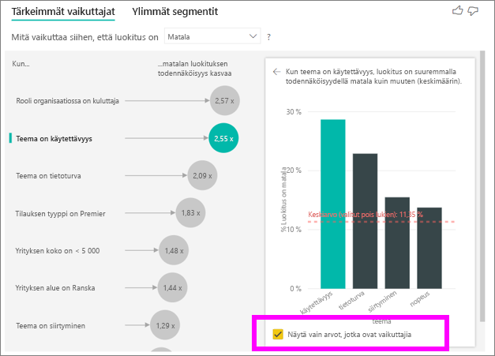

# Tärkeiden vaikuttajien visualisointi
Visualisoinnin avaimen influencers auttaa ymmärtämään tekijät asemaan mittausarvoa, josta olet kiinnostunut. Se analysoi tietosi, panee merkitsevät tekijät järjestykseen ja näyttää ne tärkeinä vaikuttajina. Oletetaan, että haluat mitä vaikutuksista työntekijän liikevaihto, joka tunnetaan myös churn sanomia. Pääsee saattaa olla työsuhde sopimuksen pituus ja toinen tekijä voi olla työntekijän ikä. 
 
## Milloin kannattaa käyttää avaimen influencers 
Avaimen influencers visualisointi on hyvä vaihtoehto, jos haluat: 
- Katso, mitkä tekijät vaikuttavat analysoitavassa mittausarvo.
- Kontrasti suhteellinen tärkeys näistä tekijöistä. Onko lyhytaikaisilla työsopimuksilla esimerkiksi enemmän merkitystä työntekijöiden vaihtuvuuteen kuin pitkäaikaisilla? 

## Tärkeimpien vaikuttajien vaatimukset 
Voit analysoida arvon on oltava luokittaista tai numeerinen kenttä (koosteet ja mittayksiköitä ei vielä tueta).

## Visualisoinnin avaimen influencers ominaisuudet

1. **Välilehdet**: Valitse välilehti näkymissä. **Avaimen influencers** kerrotaan ylimmät osallistujat valitun metric-arvoa. **Ylin segmentit** kerrotaan yläreunan segmentit, jotka vaikuttavat valitun metric-arvo. *Segmentti* koostuu arvojen yhdistelmästä. Esimerkiksi yhdestä segmentistä saattaa olla kuluttajille, joilla on vähintään 20 vuotta asiakkaille ja live lännessä. 

2. **Avattavasta luetteloruudusta**: Mittarin tutkimuksen kohteena arvo. Tässä esimerkissä tarkastelee mittausarvon **luokitus**. Valitulla arvolla on **pieni**.

3. **Oikaisussa**: Se auttaa tulkita visualisoinnin vasemmassa ruudussa.

4. **Vasemmassa ruudussa**: Vasemmassa ruudussa on yksi visualisointi. Tässä tapauksessa vasemmassa ruudussa näkyy yläreunan avaimen influencers luettelo.

5. **Oikaisussa**: Se auttaa tulkita visual oikeanpuoleisessa ruudussa.

6. **Oikeanpuoleisessa ruudussa**: Oikeanpuoleisessa ruudussa on yksi visualisointi. Tässä tapauksessa pylväskaavio näyttää kaikki arvot avaimen vaikuttajana **teeman** , joka valittiin vasemmassa ruudussa. Tietyn arvon **käytettävyyttä** vasemmassa ruudussa näkyy vihreänä. Kaikki muut arvot **teeman** näkyvät mustaksi.

7. **Keskiarvon viiva**: Kaikki muut mahdolliset arvot lasketaan keskiarvo **teeman** lukuun ottamatta **käytettävyyttä**. Laskelma koskee siis kaikkia mustalla näkyviä arvoja. Se ilmaisee, mikä prosenttiosuus toinen **teemat** sait alhaista luokitusta vastaavaksi. Toisin sanoen, kun asiakas annetaan luokitus, asiakkaan kuvataan syy tai luokitus teeman myös. Jotkin teemat ovat käytettävyyttä, nopeuden ja suojausasetukset. 

   **Teema on käytettävyyttä** on toiseksi avaimen vaikuttajana-alhaista luokitusta vastaavaksi, visualisoinnin vasemmassa ruudussa mukaan. Jos keskimääräinen kaikki muut teemat ja niiden luokitus on vaikutus **pieni**, näytetään punaisina tuloksen. Kaikki muut teemoista annetaan, vain 11.35 % on suurempi kuin **käytettävyyttä**.

8. **Valintaruutu**: **Näytä vain arvot, jotka ovat influencers**.

## Tärkeimpien vaikuttajien visualisoinnin luominen 
 
Katso tämä video ja lue, miten voit luoda avaimen influencers visualisoinnin. Noudata näitä ohjeita luo sellainen. 

<iframe width="560" height="315" src="https://www.youtube.com/embed/fDb5zZ3xmxU" frameborder="0" allow="accelerometer; autoplay; encrypted-media; gyroscope; picture-in-picture" allowfullscreen></iframe>

Tuotteen esimiehesi haluaa sinun sanomia joka tekijät liidi asiakkaat voivat jättää negatiivinen kirjoituksia-pilvipalveluun. Jos haluat osallistua, avaa [asiakaspalautteen PBIX-tiedosto](https://github.com/Microsoft/powerbi-desktop-samples/blob/master/2019/customerfeedback.pbix) Power BI Desktopissa. Voit myös ladata [asiakkaan palaute Excel-tiedoston Power BI-palvelussa tai Power BI Desktop](https://github.com/Microsoft/powerbi-desktop-samples/blob/master/2019/customerfeedback.xlsx). 

> [!NOTE]
> Asiakaspalaute tietojoukko on perusteella, [Moro prohon tai, 2014] S. Moro s. Cortez ja s. Rita. ”Tietoihin perustuvia lähestymistavan ennusteen pankin puhelinmarkkinoinnin onnistumista”. *Tue järjestelmiä Decision*, Elsevier, 62:22-31, kesäkuussa 2014. 

1. Avaa raportti ja valitse **avaimen influencers** kuvake. 

    

2. Siirrä mittausarvoa, joita haluat tutkia tietoja **analysoi** kenttä. **Analysoi** kenttä tukee vain luokittaista tai satunnaista, muuttujan. Määrittää asiakas Nähdäksesi luokitus palvelun vähäistä, valitse **asiakasrekisteriin** > **luokitus**. 
3. Siirrä kenttiä, jotka mielestäsi voivat vaikuttaa **luokitus** tietoja **selittää mukaan** kenttä. Voit siirtää niin monta kenttää kuin haluat. Tässä tapauksessa alkaa:
    - Maa tai alue 
    - Rooli organisaatiossa 
    - Paketin tyyppi 
    - Yrityksen koko 
    - teema 
1. Keskitytään negatiivinen luokitukset, valitse **pieni** - **mikä vaikuttaa olevan luokitus** avattavasta ruudusta.  

    

Analyysi suoritetaan kentälle, jota analysoidaan taulukkotasolla. Tässä tapauksessa se on **luokitus** mittausarvo. Tämän mittausarvon on määritetty asiakkaan tasolla. Kullekin asiakkaalle on annettu, suuri pistemäärä tai alhainen arvo. Kaikki selittävän tekijät on määritettävä visualisointi, jotta asiakas-tasolla käyttää niitä. 

Edellisessä esimerkissä selittävän tekijöistä on yksi-yhteen tai mittausarvon monta yhteen suhdetta. Tässä tapauksessa kukin pistemäärä on täsmälleen yksi teema siihen. Tämä teema oli tärkein teeman asiakkaan tarkastelun. Vastaavasti asiakkaat ovat yksi maasta on yksi Jäsenyystyyppi ja suorittaa yksi organisaation sisällä. Selittävän tekijät on jo asiakkaan ja mitään muunnoksia tarvitaan. Visualisoinnin tehdä niistä heti käyttöön. 

Tässä opetusohjelmassa tarkastelemme monimutkaisempia esimerkkejä, joissa on yksi-moneen-suhteita. Tällaisessa tapauksessa sarakkeiden on ensin voi koostaa asiakkaan tasolle ennen kuin voit suorittaa analyysi. 

Mittayksiköt ja koosteet käyttää selittävän tekijät arvioidaan taulukon tasolla **analysoi** mittausarvo. Esimerkkejä näytetään myöhemmin tässä artikkelissa. 

## Tulkita luokittaista avaimen influencers 
Katsotaanpa avaimen influencers alhainen luokitukset varten. 

### Yläreunan yhdestä tekijästä, joka vaikuttaa alhaista luokitusta vastaavaksi todennäköisyyttä

Organisaation tässä esimerkissä on kolme roolia: kuluttajan, järjestelmänvalvoja ja julkaisijan. Käyttäjä on yläreunan kerroin, joka osallistuu alhaista luokitusta vastaavaksi. 

Tarkemmin että kuluttajien todennäköisimmin 2.57 kertaa antaa palvelusi negatiivinen arvo. Avaimen influencers kaavion luettelot **organisaation roolin on kuluttaja** vasemmalla luettelossa ensimmäisenä. Valitsemalla **organisaation roolin on kuluttaja**, Power BI Näyttää lisätietoja oikeanpuoleisessa ruudussa. Näytetään jokaisen roolin vertailutiedot vaikutus todennäköisyyttä alhaista luokitusta vastaavaksi.
  
- 14.93 % kuluttajien antaa alhainen arvo. 
- Keskimäärin muita rooleja antaa alhainen pistemäärä 5.78 % ajasta.
- Kuluttajien todennäköisimmin 2.57 kertaa antaa alhainen pistemäärä verrattuna muita rooleja. Voit selvittää tämän vihreän palkki jakamalla punainen pisteviiva. 

### Toinen yhdestä tekijästä, joka vaikuttaa alhaista luokitusta vastaavaksi todennäköisyyttä

Visualisoinnin avaimen influencers vertaa ja luokittelee tekijät-useita eri muuttujia. Toinen vaikuttajana ei ole mitään tekemistä kanssa **organisaation roolin**. Valitse luettelo, joka on toisen vaikuttajana **teema on käytettävyyttä**. 

Tarkista asiakkaan teeman liittyy toiseksi Tärkein tekijä. Asiakkaat, jotka Kommentoitu tietoja tuotteen käytettävyyttä oli 2.55 kertaa todennäköisesti antaa alhainen pistemäärä asiakkaat, jotka muut teemoja, kuten luotettavuuden, rakenne tai nopeus Kommentoitu verrattuna. 

Visualisointien, välille keskiarvoa, joka näkyy punainen pisteviiva, muuttaa 5.78 % 11.34 %. Keskiarvo on dynaaminen, koska se perustuu muiden arvojen keskiarvon. Ensimmäinen vaikuttajana keskiarvon jätetty pois asiakkaan rooli. Toinen vaikuttajana se jätetty pois käytettävyyttä teeman. 
 
Valitse **Näytä vain arvot, jotka ovat influencers** valintaruudun voit suodattaa käyttämällä vaikutusvaltaiset arvoja. Tässä tapauksessa ne rooleja, jotka ohjaavat alhainen pistemäärä. 12 teemat on vähennetty, Power BI tunnistaa teemoja, jotka ohjaavat alhainen luokitukset neljän. 

## Muiden visualisointien 
 
Aina, kun olet valinnut osittajan, suodattaa tai muu visualisointi pohjalla, visual avaimen influencers suorittaa sen tiedot uusi osa analyysi uudelleen. Voit esimerkiksi siirtää **yrityksen koko** raporttiin ja käyttää sitä osittajana. Sen avulla voit yrityksen asiakkaille avaimen influencers on eri kuin väestön. Enterprise-yrityksen koko on suurempi kuin 50 000 työntekijät.
 
Valitsemalla **> 50 000** uusinnoiksi analyysi, ja voit nähdä, influencers muuttunut. Suuri yritysasiakkaille yläreunan vaikuttajana-alhainen luokitukset teemaa suojauksesta. Haluat ehkä tutkia Katso lisäksi, jos on suuri asiakkaita kehotetaan surullinen tietoja tietyn suojausominaisuuksia. 

## Jatkuva avaimen influencers tulkita 
 
Tähän mennessä olet nähnyt visualisoinnin avulla voit tutkia miten eri luokittaisia kenttiä vaikuttaa alhainen luokitukset. On myös mahdollista, että jatkuva tekijät, kuten ikä, height ja hinnan **selittää mukaan** kenttä. Katsotaan mitä tapahtuu, kun **työuran kesto** siirretään asiakkaan taulukon **selittää mukaan**. Työuran kesto kuvataan miten kauan asiakas on käyttää palvelua. 
 
Kun työuran kesto kasvaa, saat pienempi luokitus todennäköisyyttä kasvaa. Tämä trendi ehdottaa, että kausierot asiakkaat todennäköisimmin antaa negatiivinen arvo. Nämä merkitykselliset tiedot ovat mielenkiintoisia, ja toinen, jota haluat seurata, myöhemmin. 
 
Visualisointi näyttää, että aina, kun 13.44 kuukauden mukaan suurenee työuran kesto keskimäärin alhaista luokitusta vastaavaksi todennäköisyyttä suurentaa 1,23 kertaa. Tässä tapauksessa 13,44 kuukautta kuvaa asiakkuuden keston keskihajontaa. Jotta saat merkityksellisiä tietoja käsitellään kasvattamista työuran kesto standard verran, joka on työuran kesto keskihajonnan, vaikuttaa todennäköisyyttä saat alhaista luokitusta vastaavaksi. 
 
Oikeanpuoleisessa ruudussa Pistekaavio-piirron piirtää alhainen luokitukset kullekin arvolle työuran kesto prosentteina. Se korostaa kulmakerroin trendiviiva kanssa.

## Tulkitse avaimen influencers mittayksiköt ja koosteet 
 
Voit käyttää mittayksiköt ja koosteet selittävän tekijät analyysin sisällä. Haluat esimerkiksi nähdä, mitä vaikutus asiakkaan tuki palvelupyyntöjen määrä tai avaa lippu keskimääräinen kesto on pistemäärän näyttöön. 
 
Tässä tapauksessa haluat nähdä, jos, asiakkaalla on tuki-palvelupyyntöjen määrä vaikuttaa ne antavat pistemäärä. Nyt voit tuoda **tue lippu tunnus** tuki lippu taulukosta. Koska asiakas voi olla useita tuki tukipyynnöt, koostaa asiakkaan tason tunnus. Kooste on tärkeää, koska analyysi suoritetaan asiakkaan tasolla, joten kaikki ohjaimet on määritettävä askelväliä kyseisellä tasolla. 
 
Katsotaan tunnukset määrä. Asiakkaan kullakin rivillä on tuki palvelupyyntöjä siihen määrän. Tässä tapauksessa tuki palvelupyyntöjä kasvaa määränä todennäköisyyttä luokitus on ylin suurenee 5.51 kertaa. Visualisoinnin oikealla näyttää tuki palvelupyyntöjen keskimääräinen määrä eri **luokitus** arvot arvioida asiakkaan tasolla. 

## Tulkitse tulokset: Ylimmät segmentit 
 
Voit määrittää **avaimen influencers** välilehti arvioida kunkin palvelun erikseen. Voit myös käyttää **ensimmäiset segmentit** välilehti, niin näet, miten tekijöiden vaikuttaa arvon, joka analysointisi. 
 
Yläreunan segmentit näyttää aluksi, Power BI löydetyt segmentit yleiskatsaus. Seuraavassa esimerkissä kuusi segmentit löytyi. Näillä segmenteillä toimintaistunnot luokitellaan alhainen luokitukset segmentin prosenttiluvun mukaan. 1, segmentillä on esimerkiksi 74.3 % asiakkaan luokitukset, jotka ovat vähissä. Mitä korkeammalla kuplakaavio on, sitä suurempi on alhaisten luokitusten osuus. Kuplan koko edustaa montako asiakkaita kehotetaan segmentissä. 

Valitsemalla kuplakaavion poraudut segmentin yksityiskohtiin. Jos valitset segmentti 1, esimerkiksi löydät, että se koostuu suhteellisen vakiintuneet asiakkaiden. Ne on 29 kuukautta asiakkaille ja on yli neljä tuki palvelupyyntöjä. Lopuksi ne eivät ole julkaisijat, jotta ne ovat käyttäjät ja järjestelmänvalvojat. 
 
Tämän ryhmän 74.3 % asiakkaiden antoi alhaista luokitusta vastaavaksi. Keskimääräinen asiakkaan antoi luokitus 11.7 % ajasta, joten tämän segmentin on suurempi alhainen luokitukset pieni. Se on 63 prosenttiosuus pistettä suurempi. Segmentin 1 sisältää myös noin 2.2 % tiedoista, jotta se edustaa käytettävää osaa populaation. 

## Numeeristen tietojen kanssa työskenteleminen

Jos siirryt numeerinen kenttä **analysoi** kentän, voit valita miten käsitellään skenaarion. Voit muuttaa visualisoinnin ongelma siirtymällä **muotoilu-ruudun** ja Siirtyminen **Luokittaista Analysis tyyppi** ja **jatkuvaa Analysis tyyppiä**.

A **Luokittaista Analysis tyyppi** toimii edellä kuvatulla tavalla. Esimerkiksi jos tarkastelemallesi kyselyyn pisteet väliltä 1-10, voit kysyä ”mitä vaikuttaa kyselyyn pisteet 1”?

A **jatkuvaa Analysis tyyppiä** muuttuu kysymyksen jatkuva yksi. Yllä oleva esimerkki Microsoftin uutta kysymystä olisi ”mitä vaikuttaa kyselyyn pisteet voit suurentaa tai pienentää”?

Tunnukseen on paljon hyötyä, kun paljon yksilöivät arvot ovat analysointi-kentässä. Alla olevassa esimerkissä tarkastelemme rakennuksen hinnat. Se ei ole lukuna pyytämään ”mitä vaikuttaa olevan 156,214 hinta rakennuksen”? se on erittäin tiettyjen ja todennäköisesti ei on riittävästi tietoja johda kuviota.

Sen sijaan haluamme ehkä esittää, ”mitä vaikuttaa rakennuksen hinta lisäämiseksi'? jonka avulla voimme käsitellä rakennuksen hinnat alue erillisiä arvoja sijasta.

## Tulkitse tulokset: Tärkeimmät vaikuttajat 

Tässä tilanteessa tarkastelemme, mikä vaikuttaa rakennuksen hinta lisäämiseksi'. Emme käy selittävän tekijöistä, jotka saattavat vaikuttaa rakennuksen hinta, kuten **vuoden luotu** (vuosi talon on luotu) **KitchenQual** (kitchenin, ylläpitäjä laatu) ja **YearRemodAdd** (vuosi talon oli remodeled). 

Alla olevassa esimerkissä tarkastelemme Microsoftin yläreunan vaikuttajana, joka on parhaillaan erinomainen kitchenin, ylläpitäjä laadun. Tulokset ovat hyvin samankaltaisia kuin Muistatko analysoidaan meidän on muutamia tärkeitä eroja luokittaista mittaustiedot:

- Pylväskaavio oikealla tarkastelet keskiarvot prosenttiosuudet sijasta. Se näyttää siksi meille mitä rakennuksen kanssa erinomainen kitchenin, ylläpitäjä rakennuksen keskimääräinen hinta on (vihreä palkki) verrattuna rakennuksen keskimääräinen hinta rakennuksen ilman erinomainen kitchenin, ylläpitäjä (pisteviivan)
- Kuplan numero on yhä punainen pisteviiva ja vihreä palkki ero, mutta se ilmaistaan lukuna ($158. 49K) sen sijaan, että todennäköistä (1.93 x). Niin edelleen keskimääräinen, selvitysyhteisöjen erinomainen keittiöistä kanssa on lähes $160K enemmän kuin selvitysyhteisöjen erinomainen keittiöistä ilman kalliita.

Alla olevassa esimerkissä olemme tarkastelet vaikutus jatkuva kerroin (vuosi rakennuksen oli remodeled) on rakennuksen hinnan. Miten luokittaista mittareita jatkuva influencers analysoidaan verrattuna erot ovat seuraavat:

-   Oikeanpuoleisessa ruudussa Pistekaavio-piirron piirtää rakennuksen keskimääräinen hinta jokaiselle erilliselle arvolle remodeled vuoden. 
-   Kuplan arvo kerrotaan, kuinka paljon keskimääräinen talon mukaan hinta kasvaa (Tässä tapauksessa $2. 87k) kun talon oli vuoden remodeled jakautumisen mukaan sen keskihajonnan (Tässä tapauksessa 20 vuotta)

Lopuksi voimme löytää keskimääräinen vuoden toimenpiteiden rakennuksen on luotu. Tätä analysis on seuraava:

-   Oikeanpuoleisessa ruudussa scatterplot piirtää rakennuksen keskimääräinen hinta jokaiselle erilliselle arvolle taulukossa
-   Kuplan arvo kerrotaan, kuinka paljon keskimääräinen talon mukaan hinta kasvaa (Tässä tapauksessa $1. 35K) kun keskimääräinen vuoden suurentaa sen keskihajonnan (Tässä tapauksessa 30 vuotta)

## Tulkitse tulokset: Yläreunan segmentit

Yläreunan segmentit-numeeristen kohteet Näytä ryhmät, joissa Talon hinnat keskimäärin on suurempi kuin yleisen tietojoukon. Esimerkiksi alla näemme, **segmentti 1** koostuu selvitysyhteisöjen jossa **GarageCars** (autotallin mahtuu autojen määrä) on suurempi kuin 2 ja **RoofStyle** on Hip. Selvitysyhteisöjen, joilla on nämä ominaisuudet on keskimääräinen hinta-$355K-tiedot, jotka ovat $180K yleistä keskiarvo.

## Huomioon otettavat seikat ja vianmääritys 
 
**Mitä ovat esikatselun rajoituksia?** 
 
Avaimen influencers visual on tällä hetkellä julkisen esikatselun, ja se on joitakin rajoituksia. Sisältää ominaisuuksia, joita ei tueta tällä hetkellä: 
- Analysoidaan mittareita, jotka ovat koosteet tai mittayksiköitä.
- Käyttö Power BI Embedded visualisoinnissa.
- Kuluttaja visualisoinnin Power BI-mobiilisovelluksissa.
- Rivitason suojauksen tuki.
- Suorien kyselyjen tuki.
- Reaaliaikaisen yhteyden tukea.

**Näkyviin tulee virhesanoma, joka influencers tai segmenttejä ei löytynyt. Mistä tämä johtuu?** 

Tämä virhe ilmenee, kun kenttien mukana **selittää mukaan** mutta ei ole influencers ei löytynyt. 
- Oli analysointi mittausarvo sisältyvät molemmat **analysoi** ja **selittää mukaan**. Poista se **selittää mukaan**. 
- Selityskentissäsi on liian monta luokkaa, joissa on liian vähän havaintoja. Tässä tilanteessa helpottaa visualisoinnin ja määritä, mitkä tekijät influencers on vaikea. Siinä on vaikea generalize vain muutama havainnot perusteella. Jos toimialuepohjaisten numeerisen kentän sinun kannattaa vaihtaa **Luokittaista Analysis** - **jatkuva Analysis** - **muotoilu-ruudun** kohdassa  **Analysis** kortti.
- Selittävän tekijät on tarpeeksi huomautuksia generalize, mutta visualisointia ei löytynyt mitään merkityksellinen korrelaatioita raporttiin.
 
**Näkyviin tulee virhesanoma analysoin mittausarvoa ei ole riittävästi tietoja analyysi suoritetaan. Mistä tämä johtuu?** 

Visualisointi toimii katsomalla kuviot tiedoissa yhden ryhmän verrattuna muihin ryhmiin. Se etsii esimerkiksi asiakkaiden, jotka antoi pieni verrattuna luokitukset, joka antoi suuren luokitukset asiakkaille. Jos mallissasi on vain muutama havainnot, saadaan vaikea löytää. Jos visualisointia ei ole riittävästi tietoja löydät kuvaava influencers, se ilmaisee, että analyysi suorittamiseen tarvitaan enemmän tietoja. 

Suosittelemme, että sinulla on valitussa tilassa vähintään 100 huomautukset. Tässä tapauksessa osavaltio on asiakkaat, jotka churn. Tarvitset myös osavaltioiden vertailun käyttää vähintään 10 huomautukset. Tässä tapauksessa vertailu-tila on asiakkaat, jotka eivät churn.

Jos toimialuepohjaisten numeerisen kentän sinun kannattaa vaihtaa **Luokittaista Analysis** - **jatkuva Analysis** - **muotoilu-ruudun** kohdassa  **Analysis** kortti.

**Näkyviin tulee virhesanoma, joka kenttä *selittää mukaan* ei ole yksilöivästi liittyvät analysoin arvon sisältävä taulukko. Mistä tämä johtuu?**
 
Analyysi suoritetaan kentälle, jota analysoidaan taulukkotasolla. Esimerkiksi jos asiakaspalautteen analysoida-palvelussa, sinulla on taulukko, joka kertoo, onko asiakas antoi korkeaa luokitusta tai alhaista luokitusta vastaavaksi. Tässä tapauksessa analyysit suoritetaan asiakkaan taulukon tasolla. 

Jos sinulla on liittyvä taulukko, joka on määritetty tarkemmat tasolla kuin taulukon, joka sisältää-mittausarvo, näet tämän virheen. Tässä on esimerkki: 
 
- Voit analysoida asiakkaat voivat antaa alhainen luokitukset palvelun määrittää.
- Haluat nähdä, jos laite, johon asiakkaan kuluttaa palvelusi vaikuttaa ne antavat tarkistukset.
- Asiakas voivat käyttää palvelun useilla eri tavoilla.
- Seuraavassa esimerkissä asiakkaan 10000000 käyttää selaimessa ja tabletilla palvelun käyttämiseksi.

Jos yrität käyttää laitteen sarakkeen selittävän tekijä, näet seuraavan virheen: 

Tämä virhesanoma tulee näkyviin, koska laite ei ole määritetty asiakkaan tasolla. Yhden asiakkaan voivat käyttää palvelun eri laitteille. Voit etsiä kuviot visualisoinnin laitteen on oltava määritteen asiakkaan. On useita ratkaisuja, jotka ovat riippuvaisia liiketoiminnan ymmärrät: 
 
- Voit muuttaa laitteiden määrä yhteenveto. Jos laitteiden määrä saattaa vaikuttaa pistemäärä, joka antaa asiakkaalle, esimerkiksi käyttää määrä. 
- Voit käsitellä laitteen sarakkeessa, jos kuluttaja tietyn laitteen huolto vaikuttaa asiakkaan luokitus.
 
Tässä esimerkissä tablet ja luoda uusia sarakkeita selaimen, mobiilisovellus, oli poimia tietoja. Voit nyt käyttää nämä laitteet- **selittää mukaan**. Kaikki laitteet vaaleammat influencers ja selain on asiakkaan pistemäärä suurin vaikutus.

Tarkemmin, käyttävät asiakkaat eivät selainta käyttää palvelun todennäköisimmin 3.79 kertaa antaa alhainen arvo kuin asiakkaat, jotka tehdä. LOWER alas luettelossa mobiililaitteille käänteisen on TOSI. Asiakkaat, jotka käyttävät mobiilisovelluksen todennäköisimmin alhainen arvo kuin asiakkaat, jotka eivät anna. 

**Näyttöön varoitusta mittayksiköitä ei sisälly Omat analysis. Mistä tämä johtuu?** 

Analyysi suoritetaan kentälle, jota analysoidaan taulukkotasolla. Jos voit analysoida asiakkaan arvioivan, joudut ehkä taulukon, joka kertoo, onko asiakas churned vai ei. Tässä tapauksessa analyysit suoritetaan asiakkaan taulukon tasolla.
 
Mittayksiköt ja koosteet ovat oletusarvoisesti Analysoidut taulukon tasolla. Jos keskimääräinen kuukausittain kulujen mitta, se analysoida asiakkaan taulukon tasolla. 

Jos Asiakas-taulukosta ei ole yksilöivä tunnus, ei voi arvioida mittayksikön, ja se ohitetaan analyysi mukaan. Voit välttää tämän tilanteen, varmista, että taulukkoa, jonka-mittausarvo on yksilöivä tunnus. Tässä tapauksessa se on Asiakas-taulukosta ja yksilöivä tunnus on asiakkaan tunnus. On myös helppo Lisää indeksisarake käyttämällä Power Query.
 
**Näyttöön varoitusta analysoin mittausarvo on yli 10 yksilöllisiä arvoja ja määrä saattaa vaikuttaa Omat analysis laadun. Mistä tämä johtuu?** 

AI-visualisointia voit analysoida luokittaisia kenttiä ja numeerisia kenttiä. Luokittaisia kenttiä, esimerkiksi voivat olla arvioivan on Kyllä tai ei, asiakastyytyväisyys on suuri, Normaali tai pieni. Analysoitava luokkia suurentaminen voit on vähemmän havainnot per luokka. Tässä tilanteessa vaikeuttaa visualisointi etsiä kuviot tiedoissa. 

Kun analysoit numeerisia kenttiä voit valita välillä käsitellen numeerisia kenttiä, kuten tekstiä, jolloin suoritat saman analysis kuten luokkatiedot (**Luokittaista Analysis**). Jos sinulla on paljon eri analysis-valitsimen arvot, suosittelemme, että **jatkuva Analysis** kuin, joka tarkoittaa, että olemme johda mallit-kun luvut Suurenna tai Pienennä sijaan käsitellen kuin erillisiä arvoja. Voit vaihtaa **Luokittaista Analysis** - **jatkuva Analysis** - **muotoilu-ruudun** kohdassa **Analysis** kortti.

Löytää vahvempaa influencers Suosittelemme ryhmitellä samankaltaisia arvot yhdeksi yhdessä. Esimerkiksi jos sinulla on hinta mittarin, joita tulet todennäköisesti saada paremman tulokset ryhmittelemällä samankaltaisia hinnat suuri, Normaali ja vs. yksittäisen hinnan pisteiden alhainen luokat. 

**Tiedot, joka näyttää tältä, niiden on oltava avaimen influencers on tekijöitä, mutta ne eivät ole. Miten näin voi käydä?**

Seuraavassa esimerkissä asiakkaille, jotka ovat kuluttajien asema alhainen luokitukset 14.93 % luokituksen, jotka ovat vähissä. Järjestelmänvalvoja-rooli on myös paljon alhainen luokitukset 13.42 %, mutta se ei ole pidetään vaikuttajana. 

Tämä määritys syy on se, että visualisoinnin katsoo arvopisteiden määrän myös kun se havaitsee influencers. Seuraavassa esimerkissä on yli 29,000 kuluttajille ja 10 kertaa vähemmän Järjestelmänvalvojat, noin 2,900. Vain 390 niistä antoi alhaista luokitusta vastaavaksi. Visualisointia ei ole tarpeeksi tietoja määrittämään, onko se löysi mallia, joiden järjestelmänvalvoja tai jos se on juuri nyt löytäminen. 

**Miten voit laskea avaimen influencers luokittaista analyysia varten?**

AI-visualisointi käyttää taustalla, [ML.NET](https://dotnet.microsoft.com/apps/machinelearning-ai/ml-dotnet) logistic regression laskemiseen avaimen influencers suorittamiseen. Logistinen regressio on tilastotieteellinen malli, joka vertaa erilaisia ryhmiä toisiinsa. 

Jos haluat nähdä määrittää alhainen luokitukset, logistic regression tarkastelee siitä, miten asiakkaat, jotka antoi alhainen pistemäärä eroavat asiakkaat, jotka ovat antaneet suuri pistemäärä. Jos sinulla on useita luokkia, kuten, Neutraali, ja alimmat pisteet tarkastelet siitä, miten asiakkaat, jotka ovat antaneet alhaista luokitusta vastaavaksi eroavat asiakkaat, jotka ei anna alhaista luokitusta vastaavaksi. Tässä tapauksessa asiakkaat, jotka antoi alhainen pistemäärä suoratoistoon asiakkailta, jotka ovat antaneet korkeaa luokitusta tai neutraali luokitus? 
 
Logistic regression kuviot tiedoissa etsii ja miten asiakkaat, jotka ovat antaneet alhaista luokitusta vastaavaksi saattaa vaihdella asiakkailta, jotka ovat antaneet korkeaa luokitusta etsii. Se saattaa hakea, esimerkiksi asiakkaille, joilla Lisää tukea palvelupyyntöjä antaa suurempi prosenttiosuus alhainen luokitukset kuin asiakkaille, joilla on vain vähän tai ei tue palvelupyyntöjä.
 
Logistic regression pitää myös, kuinka monta arvopisteet ovat olemassa. Esimerkiksi jos asiakkaat, jotka toista järjestelmänvalvojaroolissa antaa suhteellisesti enemmän negatiivisia pisteet, mutta on vain muutama Järjestelmänvalvojat, kertoimen ei huomioida samaa mieltä. Tämä määritys on tehty, koska ei ole tarpeeksi käytettävissä johda kuviota arvopisteitä. Tilastoanalyysit testiä, kutsutaan Wald testi, käytetään määrittämään, onko kerroin pidetään vaikuttajana. Visualisointi määrittää kynnysarvon käyttämällä p-arvoa 0,05. 

**Miten voit laskea avaimen influencers numeerinen analyysia varten?**

AI-visualisointi käyttää taustalla, [ML.NET](https://dotnet.microsoft.com/apps/machinelearning-ai/ml-dotnet) lineaarisen regression laskemiseen avaimen influencers suorittamiseen. Lineaarisen regression on tilastoanalyysit malli, joka näyttää, miten kenttä on analysointi tulos muuttuu selittävän tekijöiden perusteella.

Esimerkiksi jos olemme toimialuepohjaisten rakennuksen hinnat, lineaarisen regression tarkastellaan vaikutus ottaa erinomainen kitchenin, ylläpitäjä sillä rakennuksen hinnan. Selvitysyhteisöjen erinomainen keittiöistä kanssa on yleensä alemman tai ylemmän rakennuksen hinnat verrattuna selvitysyhteisöjen ilman erinomainen keittiöistä?

Lineaarisen regression pitää myös arvopisteiden määrän. Esimerkiksi jos selvitysyhteisöjen tenniskentät kanssa on korkeampi hinnat, mutta Meillä on vain harvoja selvitysyhteisöjen, joilla Tenniskenttä, kertoimen ei pidetä samaa mieltä. Tämä määritys on tehty, koska ei ole tarpeeksi käytettävissä johda kuviota arvopisteitä. Tilastoanalyysit testiä, kutsutaan Wald testi, käytetään määrittämään, onko kerroin pidetään vaikuttajana. Visualisointi määrittää kynnysarvon käyttämällä p-arvoa 0,05. 

**Miten segmentit lasketaan?**

AI-visualisointi käyttää taustalla, [ML.NET](https://dotnet.microsoft.com/apps/machinelearning-ai/ml-dotnet) päätöspuu löydät mielenkiintoisia alaryhmiä suorittamiseen. Päätöspuun tavoitteena on aliryhmä arvopistettä, joka on melko suuren arvon, josta olet kiinnostunut päättyä. Tämä voi asiakkaille, joilla on vähän luokitukset tai selvitysyhteisöjen suuren hinnat.

Päätöspuun ottaa kunkin selittävän tekijä ja yrittää syy, mitkä Authentication antaa parhaan *jakaa*. Esimerkiksi, jos voit suodattaa tietoja sisältämään vain suuri Yritysasiakkaat, on, erottaa asiakkaat, jotka ovat antaneet korkeaa luokitusta vs. alhaista luokitusta vastaavaksi? Tai ehkä tuli paremmin sisältämään vain asiakkaat, jotka tietoturvasta Kommentoitu tietojen suodattamiseen? 

Kun Päätöspuun tekee jaon, se vie tiedot aliryhmä ja määrittää seuraava paras jako-tiedot. Tässä tapauksessa aliryhmä on asiakkaat, jotka Kommentoitu suojaus. Kunkin Jaa jälkeen se pitää onko tämän ryhmän edustavan tarpeeksi johtaa kuvion vai onko se poikkeamien, tiedot ja todellisia segmentin tarpeeksi arvopisteitä. Toinen tilastoanalyysit test käytetään Tarkista tilastoanalyysit merkitsevyyden Jaa ehdon 0,05 p-arvo. 

Kun Päätöspuun on päättynyt, se vie kaikki jakaa suojaus kommentit ja suuri yritys, kuten ja luo Power BI-suodattimia. Tämä suodatinyhdistelmä pakataan segmenttimuotoon visualisoinnissa. 
 
**Miksi tehdä tiettyjen tekijöiden tulee influencers tai estää kuin kenttiä tietoja siirretään influencers *selittää mukaan* kentän?**

Visualisointi arvioi kaikki selittävät tekijät yhdessä. Tekijä voi olla vaikuttajana yksinään, mutta kun katsotaan muiden tekijöiden mukaan se ei välttämättä ole. Oletetaan, että haluat analysoida määrittää rakennuksen hinta on suuri Makuuhuoneiden ja rakennuksen kokoisia selittävän tekijät:

- Yksinään yksi Makuuhuoneiden voi olla rakennuksen hinnat olevan suuren ohjainta.
- Mukaan lukien rakennuksen koon analyysi merkitys tarkastelet nyt tapahtuva Makuuhuoneiden rakennuksen koko pysyy vakiona.
- Jos rakennuksen koon vahvistetaan 1 500 neliöjalkaa, on epätodennäköistä, että jatkuva lisääntyminen Makuuhuoneiden määrä kasvaa huomattavasti rakennuksen hinnan. 
- Makuuhuoneiden ei ehkä ole tärkeäksi kerroin, kuin se oli ennen rakennuksen koon käsiteltiin. 

## Seuraavat vaiheet
- [Yhdistelmäkaaviot Power BI:ssä](power-bi-visualization-combo-chart.md)
- [Visualisointityypit Power BI:ssä](power-bi-visualization-types-for-reports-and-q-and-a.md)
