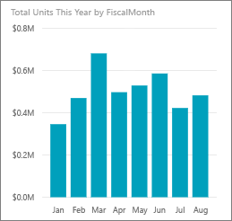
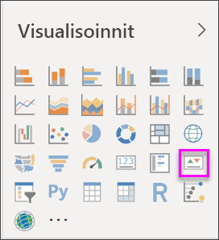
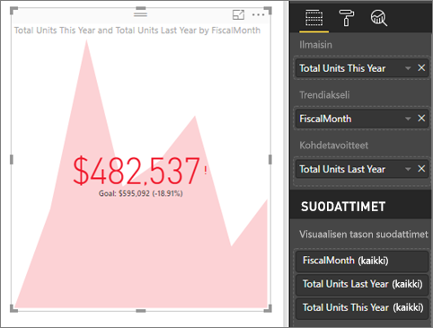

# Suorituskykyilmaisimien visualisoinnit
Suorituskykyilmaisin (KPI) on visuaalinen vihje, joka kertoo edistymisen määrän kohti mitattavissa olevaa tavoitetta. Katso lisätietoja suorituskykyilmaisimista [Microsoft Developer Networkista](https://msdn.microsoft.com/library/hh272050).

Jos et ole rekisteröitynyt Power BI:hin, [rekisteröidy ilmaiseen kokeiluversioon](https://app.powerbi.com/signupredirect?pbi_source=web) ennen aloittamista.

## Edellytykset
* [Power BI Desktop – se on ilmainen!](https://powerbi.microsoft.com/get-started/)
* [Jälleenmyyntianalyysimallin PBIX-tiedosto](http://download.microsoft.com/download/9/6/D/96DDC2FF-2568-491D-AAFA-AFDD6F763AE3/Retail%20Analysis%20Sample%20PBIX.pbix)

## Milloin suorituskykyilmaisinta kannattaa käyttää?
Suorituskykyilmaisin on hyvä vaihtoehto, kun halutaan

* mitata edistymistä (minkä edellä vai jäljessä olen?)
* mitata etäisyyttä tavoitteeseen (kuinka paljon edellä tai jäljessä olen?)   

## Suorituskykyilmaisimia koskevat vaatimukset
Suorituskykyilmaisin perustuu tiettyyn mittariin, ja se on suunniteltu mittarin nykyisen arvon ja tilan arviointiin määritettyyn kohteeseen verrattuna. Siksi suorituskykyilmaisimen visualisointi edellyttää *perustason* mittaria, joka tekee arvioinnin arvoon ja *kohde*mittariin tai arvoon ja *raja-arvoon* tai *tavoitteeseen*.

Tällä hetkellä suorituskykyilmaisimen tietojoukon pitää sisältää suorituskykyilmaisimen tavoitearvoja. Jos tietojoukko ei sisällä niitä, voit luoda tavoitteita lisäämällä tietomalliin tai PBIX-tiedostoon Excel-taulukon, jossa on tavoitteita.

## Suorituskykyilmaisimen luominen
Jos haluat seurata mukana, avaa [jälleenmyyntianalyysin .PBIX-tiedosto](http://download.microsoft.com/download/9/6/D/96DDC2FF-2568-491D-AAFA-AFDD6F763AE3/Retail%20Analysis%20Sample%20PBIX.pbix) Power BI Desktopissa. Luomme suorituskykyilmaisimen, joka mittaa edistymisen kohti myynnin tavoitetta.

Tai kello näyttää, miten voit luoda yksittäisten arvojen visualisoinnit: mittarit, kortit ja suorituskyvyn mittarit.

<iframe width="560" height="315" src="https://www.youtube.com/embed/xmja6EpqaO0?list=PL1N57mwBHtN0JFoKSR0n-tBkUJHeMP2cP" frameborder="0" allowfullscreen></iframe>

1. Avaa raportti raporttinäkymässä ja lisää uusi sivu valitsemalla keltainen välilehti.    
2. Valitse Kentät-ruudussa **Myynti > Yksikköjen kokonaismäärä tänä vuonna**.  Tämä on ilmaisin.
3. Lisää **Aika > FiscalMonth**.  Tämä edustaa trendiä.
4. TÄRKEÄÄ: Lajittele kaavio **FiscalMonth**-arvon mukaan. Kun muunnat visualisoinnin suorituskykyilmaisimeksi, lajitteluvaihtoehtoa ei ole.

    
5. Muunna visualisointi suorituskykyilmaisimeksi valitsemalla suorituskykyilmaisimen kuvake Visualisointi-ruudusta.
   
    
6. Lisää tavoite. Lisää edellisen vuoden myynti tavoitteeksi. Vedä **Yksikköjen kokonaismäärä viime vuonna** **Kohdetavoitteet**-kenttään.
   
    
7. Vaihtoehtoisesti voit muotoilla suorituskykyilmaisimen avaamalla muotoiluruudun valitsemalla maalitelakuvakkeen.
   
   * **Ilmaisin** – ohjaa ilmaisimen näyttöyksiköitä ja desimaaleja.
   * **Trendiakseli** – kun arvona on **Käytössä**, trendiakseli näkyy suorituskykyilmaisimen visualisoinnin taustalla.  
   * **Tavoitteet** – kun arvona on **Käytössä**, visualisointi näyttää tavoitteen ja etäisyyden tavoitteesta prosenttilukuna.
   * **Värikoodaus > Suunta** – joitakin suorituskykyilmaisimia pidetään *parempina* suuremmille arvoille ja joitakin pidetään *parempina* pienemmille arvoille. Esimerkiksi tulot vs. odotusaika. Yleensä tulojen suurempi arvo on parempi verrattuna odotusajan suurempaan arvoon. Valitse **suuri on parempi**, ja voit myös muuttaa väriasetuksia.

Suorituskykyilmaisimet ovat myös käytettävissä Power BI -palvelussa ja mobiililaitteissa – voit siis aina olla yhteydessä liiketoimintasi sykkeeseen.

## Huomioon otettavat seikat ja vianmääritys
* Jos suorituskykyilmaisimesi ei näytä samalta kuin edellä, sinun täytyy ehkä lajitella fiscalmonth-arvon mukaan. Koska suorituskykyilmaisimissa ei ole lajitteluasetusta, sinun täytyy lajitella fiscalmonth-arvon mukaan *ennen* visualisoinnin muuntamista suorituskykyilmaisimeksi.

## Seuraavat vaiheet

[Perustason kartat Power BI:ssä](power-bi-map-tips-and-tricks.md)

[Visualisointityypit Power BI:ssä](power-bi-visualization-types-for-reports-and-q-and-a.md)