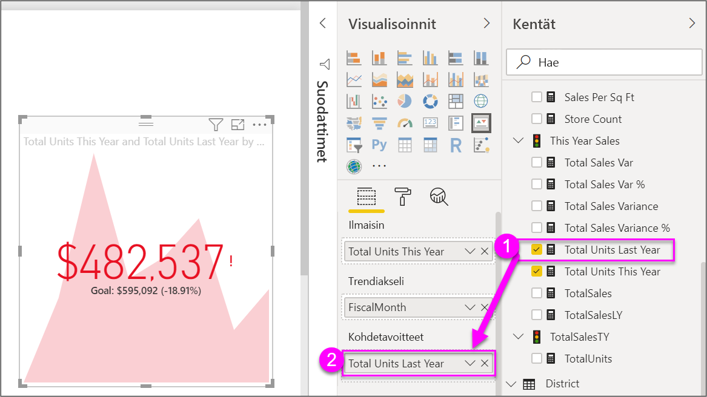

# Suorituskykyilmaisimen (KPI) visualisointien luominen

[!INCLUDE[consumer-appliesto-nyyn](../includes/consumer-appliesto-nyyn.md)]

[!INCLUDE [power-bi-visuals-desktop-banner](../includes/power-bi-visuals-desktop-banner.md)]

Suorituskykyilmaisin (KPI) on visuaalinen vihje, joka kertoo edistymisen määrän kohti mitattavissa olevaa tavoitetta. Lisätietoja suorituskykyilmaisimista on artikkelissa [Suorituskykyilmaisimet (KPI) PowerPivotissa](https://support.office.com/en-us/article/Key-Performance-Indicators-KPIs-in-Power-Pivot-E653EDEF-8A21-40E4-9ECE-83A6C8C306AA).

## Milloin suorituskykyilmaisinta kannattaa käyttää?

Suorituskykyilmaisin on hyvä vaihtoehto, kun halutaan

* Mitata edistymistä. Vastata kysymykseen ”Mitä olen edellä tai jäljessä?”.

* Mitata etäisyyttä tavoitteeseen. Vastata kysymykseen ”Kuinka paljon edellä tai jäljessä olen?”.

## Suorituskykyilmaisimia koskevat vaatimukset

Suunnittelija käyttää KPI-visualisoinnin pohjana tiettyä mittaria. Suorituskykyilmaisimen tarkoituksena on auttaa sinua arvioimaan mittarin nykyistä arvoa ja tilaa verrattuna määritettyyn tavoitteeseen. Siksi suorituskykyilmaisimen visualisointi edellyttää *perustason* mittaria, joka tekee arvioinnin arvoon, *kohde*mittariin tai arvoon ja *raja-arvoon* tai *tavoitteeseen*.

KPI-tietojoukon pitää sisältää suorituskykyilmaisimen tavoitearvoja. Jos tietojoukko ei sisällä tavoitearvoja, voit luoda niitä lisäämällä tietomalliin tai PBIX-tiedostoon Excel-laskentataulukon, jossa on tavoitteita.

## Edellytykset

Tässä opetusohjelmassa käytetään [Jälleenmyyntianalyysimallin PBIX-tiedostoa](https://download.microsoft.com/download/9/6/D/96DDC2FF-2568-491D-AAFA-AFDD6F763AE3/Retail%20Analysis%20Sample%20PBIX.pbix).

1. Valitse valikkorivin vasemmasta yläosasta **Tiedosto** > **Avaa**

1. **Jälleenmyyntianalyysimallin PBIX-tiedoston löytäminen**

1. Avaa **jälleenmyyntianalyysimallin PBIX-tiedosto** raporttinäkymässä. 

1. Lisää uusi sivu valitsemalla **+** . 

> [!NOTE]
> Raportin jakaminen työtoverin kanssa Power BI:ssä edellyttää, että teillä kummallakin on oma Power BI Pro -käyttöoikeus tai että raportti on tallennettu Premium-kapasiteettiin.    

## Suorituskykyilmaisimen luominen

Tässä esimerkissä luomme suorituskykyilmaisimen, joka mittaa edistymistä kohti myyntitavoitetta.

1. Valitse **Kentät**-ruudussa **Myynti > Yksikköjen kokonaismäärä tänä vuonna**.  Tämä arvo on ilmaisin.

1. Lisää **Aika > FiscalMonth**.  Tämä arvo edustaa trendiä.

1. Valitse visualisoinnin oikeasta yläkulmasta kolme pistettä (...) ja tarkista, että Power BI lajittelee sarakkeet nousevaan järjestykseen **FiscalMonth**-arvon mukaan.

    > [!IMPORTANT]
    > Kun muunnat visualisoinnin suorituskykyilmaisimeksi, lajitteluvaihtoehtoa **ei** ole. Sinun täytyy lajitella se oikein nyt.

    

    Kun visualisointi on lajiteltu oikein, se näyttää tältä:

    

1. Muunna visualisointi suorituskykyilmaisimeksi valitsemalla **suorituskykyilmaisimen** kuvake **Visualisointi**-ruudusta.

    

1. Lisää tavoite vetämällä **Yksikköjen kokonaismäärä viime vuonna** **Kohdetavoitteet**-kenttään.

    

1. Vaihtoehtoisesti voit muotoilla suorituskykyilmaisimen avaamalla muotoiluruudun valitsemalla maalitelakuvakkeen.

    * **Ilmaisin** – ohjaa ilmaisimen näyttöyksiköitä ja desimaaleja.

    * **Trendiakseli** – kun arvona on **Käytössä**, visualisointi näyttää trendiakselin suorituskykyilmaisimen visualisoinnin taustalla.  

    * **Tavoitteet** – kun arvona on **Käytössä**, visualisointi näyttää tavoitteen ja etäisyyden tavoitteesta prosenttilukuna.

    * **Värikoodaus > Suunta** – joitakin suorituskykyilmaisimia pidetään parempina *suuremmille* arvoille ja joitakin pidetään parempina *pienemmille* arvoille. Esimerkiksi tulot vs. odotusaika. Yleensä tulojen suurempi arvo on parempi verrattuna odotusajan suurempaan arvoon. Valitse **suuri on parempi**, ja muuta vaihtoehtoisesti väriasetuksia.

Suorituskykyilmaisimet ovat saatavilla Power BI -palvelussa ja mobiililaitteissa. Sen avulla voit olla aina yhteydessä liiketoimintasi sykkeeseen.

## Huomioon otettavat seikat ja vianmääritys

Jos suorituskykyilmaisimesi ei näytä samalta kuin yksi edellisistä, se johtuu ehkä siitä, ettet lajitellut sitä **FiscalMonth**-arvon mukaan. Suorituskykyilmaisimissa ei ole lajitteluvaihtoehtoa. Sinun täytyy aloittaa uudestaan ja lajitella **FiscalMonth**-arvon mukaan *ennen* visualisoinnin muuntamista suorituskykyilmaisimeksi.

## Seuraavat vaiheet

* [Vinkkejä Power BI -karttavisualisoinneille](power-bi-map-tips-and-tricks.md)

* [Visualisointityypit Power BI:ssä](power-bi-visualization-types-for-reports-and-q-and-a.md)

Onko sinulla kysyttävää? [Kokeile Power BI -yhteisöä](https://community.powerbi.com/)
