# Opetusohjelma: Upota Power Apps -visualisointi Power BI -raporttiin

Tässä opetusohjelmassa luomme Power Apps -visualisoinnilla uuden Power BI -malliraporttiin upotetun sovelluksen. Tämä sovellus on vuorovaikutuksessa kyseisen raportin muiden visualisointien kanssa.

Jos sinulla ei ole Power Apps -tilausta, [luo ilmainen tili](https://web.powerapps.com/signup?redirect=marketing&email=) ennen aloittamista.

Tässä opetusohjelmassa opit:
> [!div class="checklist"]
> * Power Apps -visualisoinnin lisääminen Power BI -raporttiin
> * Luomaan Power Appsissa työskennellen uuden sovelluksen, joka käyttää Power BI -raportin tietoja
> * Tarkastelemaan ja käsittelemään raportin Power Apps -visualisointia

## Edellytykset

* [Google Chrome](https://www.google.com/chrome/browser/)- tai [Microsoft Edge](https://www.microsoft.com/windows/microsoft-edge) -selain
* [Power BI -tilaus](https://docs.microsoft.com/power-bi/service-self-service-signup-for-power-bi), jossa on [mahdollisuusanalyysimalli](https://docs.microsoft.com/power-bi/sample-opportunity-analysis#get-the-content-pack-for-this-sample) asennettuna
* Käsitys siitä, miten [sovelluksia luodaan Power Appsissa](https://docs.microsoft.com/powerapps/maker/canvas-apps/data-platform-create-app-scratch) ja [Power BI -raportteja](https://docs.microsoft.com/power-bi/service-the-report-editor-take-a-tour) muokataan

## Luo uusi sovellus
Kun lisäät Power Apps -visualisoinnin raporttiisi, se käynnistää Power Apps Studion Power Appsin ja Power BI:n välisellä reaaliaikaisella tietoyhteydellä.

1. Avaa mahdollisuusanalyysimallin raportti ja valitse *Tulevia mahdollisuuksia* -sivu. 

2. Siirtämällä raporttiruutuja ja muuttamalla niiden kokoa voit tehdä tilaa uudelle visualisoinnille.

    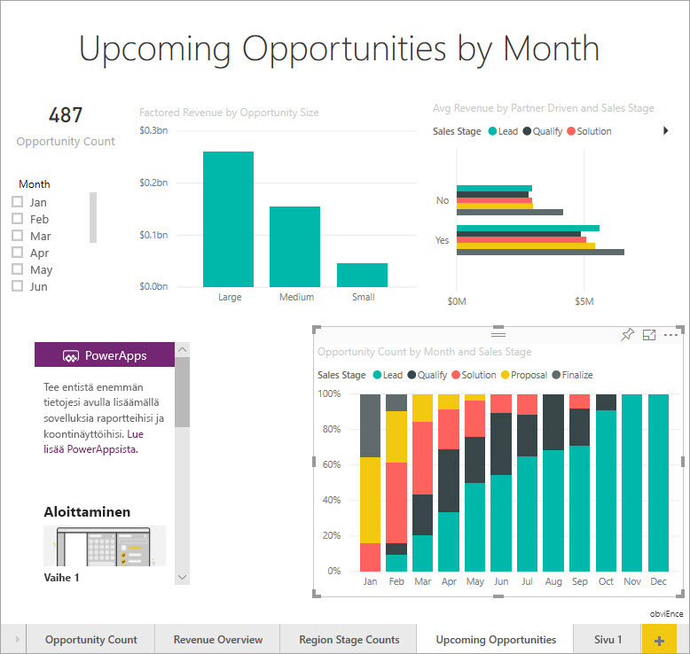

2. Valitse Visualisoinnit-ruudusta Power Apps -kuvake ja muuta sitten visualisoinnin kokoa, kunnes se mahtuu luomaasi tilaan.

    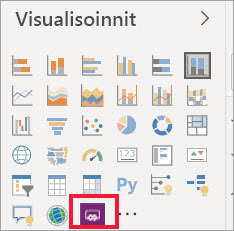

3. Valitse **Kentät**-ruudussa **Nimi**, **Tuotekoodi** ja **Myyntivaihe**. 

    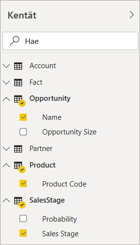

4. Valitse Power Apps -visualisoinnissa Power Apps -ympäristö, johon haluat luoda sovelluksen, ja napsauta tai napauta sitten **Luo uusi**.

    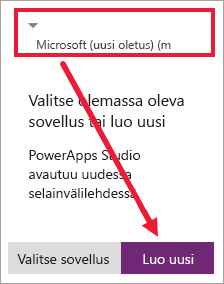

    Näet Power Apps Studiossa luodun perussovelluksen sekä *valikoiman*, jossa näkyy jokin Power BI:ssä valitsemistasi kentistä.

    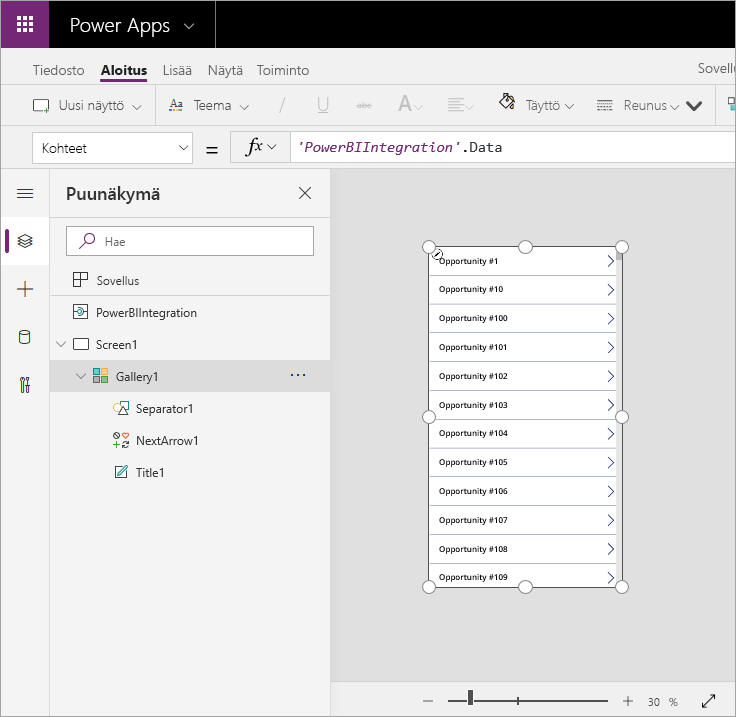

5.  Muuta valikoiman kokoa siten, että se vie vain puolet näytöstä. 

6. Valitse vasemmassa ruudussa **Screen1** ja määritä sitten näytön **Täyttö**-ominaisuudeksi ”LightBlue” (jotta se erottuu paremmin raportissa).

    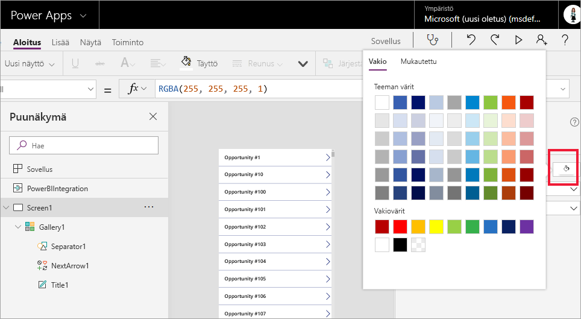

6. Tee tilaa otsikko-ohjausobjektille. 

    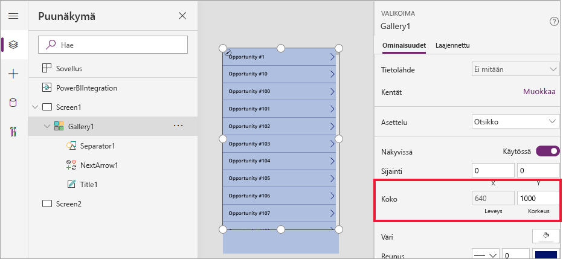

8. Lisää kohdassa **valikoima** tekstiotsikko-ohjausobjekti.

   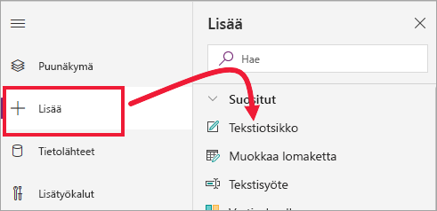

7. Vedä otsikko visualisoinnin alareunaan. Aseta **Teksti**-ominaisuudeksi `"Opportunity Count: " & CountRows(Gallery1.AllItems)`. Näet nyt tietojoukon mahdollisuuksien kokonaismäärän.

    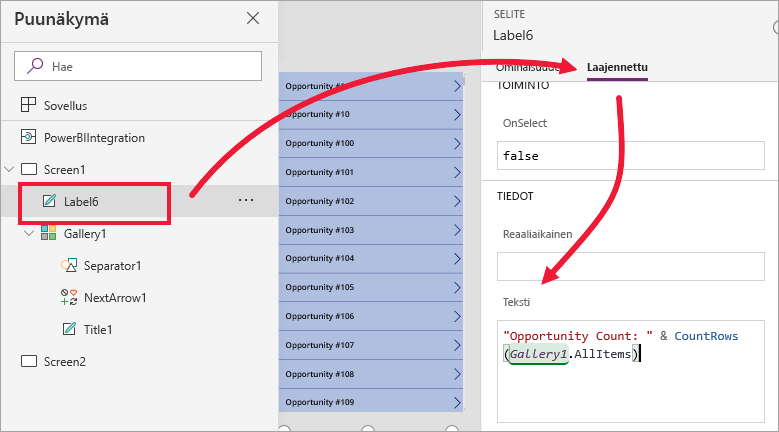

    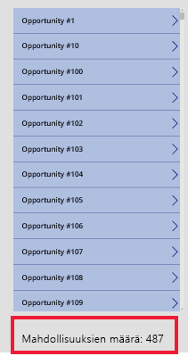

7. Tallenna sovellus nimellä ”Mahdollisuudet-sovellus”. 

    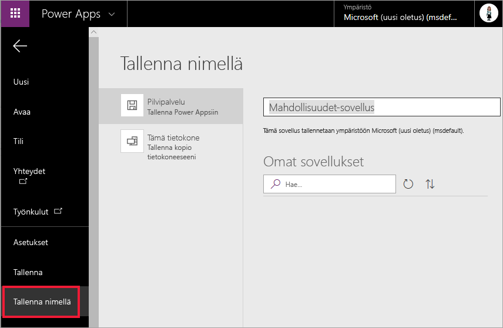

## Sovelluksen tarkasteleminen raportissa
Sovellus on nyt käytettävissä Power BI -raportissa, ja se on vuorovaikutuksessa muiden visualisointien kanssa, koska se jakaa saman tietolähteen.

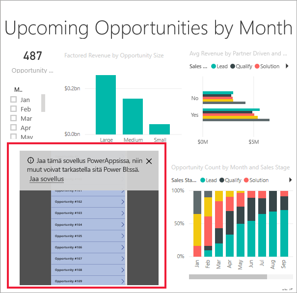

Valitse Power BI -raportin osittajassa **Jan**. Näin koko raportti suodatetaan, mukaan lukien sovelluksen tiedot.

Huomaa, että mahdollisuuksien lukumäärä sovelluksessa vastaa raportin vasemmassa yläkulmassa olevaa lukua. Voit valita muita raportin kohteita; sovelluksen tiedot päivitetään.

## Puhdista resurssit
Jos et enää halua käyttää mahdollisuusanalyysimallia, voit poistaa koontinäytön, raportin ja tietojoukon.

## Seuraavat vaiheet
[Q&A-visualisointi](power-bi-visualization-types-for-reports-and-q-and-a.md)    
[Opetusohjelma: Power Apps -visualisoinnin upottaminen Power BI -raporttiin](https://docs.microsoft.com/powerapps/maker/canvas-apps/powerapps-custom-visual)