# Johdatus Power BI:n Q&A-visualisointiin

[!INCLUDE [power-bi-service-new-look-include](../includes/power-bi-service-new-look-include.md)]

## Mikä Q&A-visualisointi on

Q&A-visualisoinnin avulla käyttäjät voivat esittää kysymyksiä käyttämällä luonnollista kieltä ja saada vastauksia visualisoinnin muodossa. 

[!INCLUDE [power-bi-visuals-desktop-banner](../includes/power-bi-visuals-desktop-banner.md)]

Q&A-visualisointia voidaan käyttää välineenä, jonka avulla *käyttäjät* saavat nopeasti vastauksia tietoihinsa ja jonka avulla *suunnittelijat* voivat luoda visualisointeja raporttiin vain kaksoisnapsauttamalla mitä tahansa kohtaa raportissa ja käyttämällä luonnollista kieltä. Koska Q&A-visualisointi käyttäytyy kuin mikä tahansa muu visualisointi, se voidaan ristiinsuodatettaa/ristiinkorostaa ja se tukee myös kirjanmerkkejä. Q&A-visualisointi tukee myös teemoja ja muita oletusmuotoiluasetuksia, jotka ovat käytettävissä Power BI:ssä.

Q&A-visualisointi koostuu neljästä ydinosasta:

- Kysymysruutu. Tähän käyttäjät voivat kirjoittaa kysymykseensä, ja heille näytetään ehdotuksia, joiden avulla he voivat viimeistellä kysymyksensä.
- Valmiiksi täytetty ehdotettujen kysymysten luettelo.
- Kuvake, joka muuntaa Q&A-visualisoinnin vakiovisualisoinniksi. 
- Kuvake, joka avaa Q&A-työkalut, joiden avulla suunnittelijat voivat määrittää pohjana olevan luonnollisen kielen moduulin.

## Edellytykset

1. Tässä opetusohjelmassa käytetään [myynti- ja markkinointimallin](https://download.microsoft.com/download/9/7/6/9767913A-29DB-40CF-8944-9AC2BC940C53/Sales%20and%20Marketing%20Sample%20PBIX.pbix) PBIX-tiedostoa. 

1. Valitse Power BI Desktopin valikkorivin vasemmasta yläosasta **Tiedosto** > **Avaa**
   
2. Etsi oma **myynti- ja markkinointimallin** PBIX-tiedostosi

1. Avaa tiedosto raporttinäkymään .

1. Valitse  uuden sivun lisäämiseksi.

Jos näyttöön tulee virhe Q&A-visualisointia luotaessa, tarkista [rajoitukset](../natural-language/q-and-a-limitations.md)-osiosta, tuetaanko tietolähdemääritystä.

## Luo Q&A-visualisointi käyttämällä ehdotettua kysymystä
Tässä harjoituksessa valitaan yksi ehdotetuista kysymyksistä Q&A-visualisoinnin luomiseksi. 

1. Aloita tyhjältä raporttisivulta ja valitse Q&A-visualisointikuvake Visualisoinnit-ruudusta.

    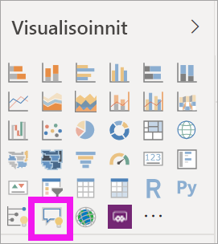

2. Muuta visualisoinnin kokoa vetämällä reunaa.

    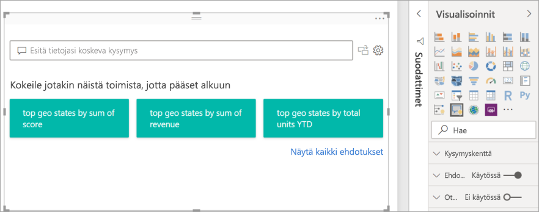

3. Jos haluat luoda visualisoinnin, valitse jokin ehdotetuista kysymyksistä tai ala kirjoittaa kysymysruutuun. Tässä esimerkissä olemme valinneet **parhaat maantieteelliset osavaltiot tuoton summan mukaan**. Power BI tekee parhaansa valitakseen käytettävän visualisointityypin. Tässä tapauksessa kyseessä on kartta.

    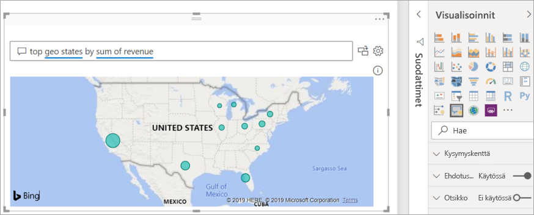

    Voit kuitenkin määrittää Power BI:n käyttämään tiettyä visualisointityyppiä lisäämällä sen luonnollisen kielen kyselyyn. Muista, että kaikki visualisointityypit eivät toimi tai ole järkeviä tietojesi kanssa. Nämä tiedot eivät esimerkiksi tuota mielekästä pistekaaviota. Ne toimivat kuitenkin täytettynä karttana.

    

## Q&A-visualisoinnin luominen luonnollisen kielen kyselyn avulla
Edellisessä esimerkissä valittiin yksi ehdotetuista kysymyksistä Q&A-visualisoinnin luomiseksi.  Tässä harjoituksessa kirjoitat oman kysymyksesi. Power BI:n automaattinen täydennys, ehdotukset ja palaute auttavat kysymyksen kirjoittamisessa.

Jos et ole varma, minkä tyyppisiä kysymyksiä haluat esittää tai mitä termejä haluat käyttää, laajenna **Näytä kaikki ehdotukset** tai selaa Kentät-ruutua, joka löytyy pohjan oikeasta reunasta. Näin voit tutustua Myynti ja markkinointi -tietojoukon ehtoihin ja sisältöön.

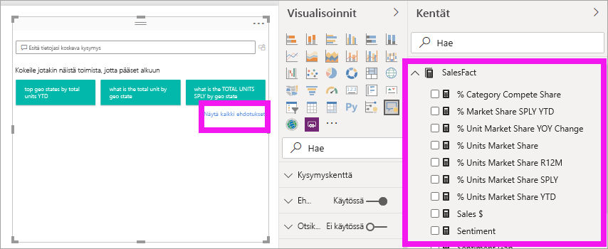

1. Kirjoita kysymys Q&A-kenttään. Power BI alleviivaa sanat, joita se ei tunnista, punaisella. Aina kun se on mahdollista, Power BI auttaa määrittämään tunnistamattomia sanoja.  Alla olevassa ensimmäisessä esimerkissä jompikumpi ehdotuksista sopii meille.  

    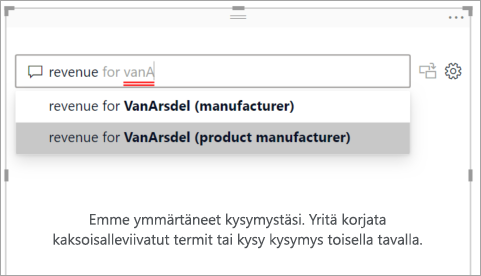

2. Kun kirjoitamme kysymystä lisää, Power BI ilmoittaa, ettei se ymmärrä kysymystä, ja yrittää auttaa. Alla olevassa esimerkissä Power BI kysyy "Tarkoititko..." ja ehdottaa eri tapaa esittää kysymys käyttämällä tietojoukkomme terminologiaa. 

    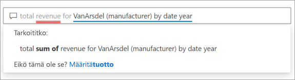

5. Power BI:n avulla pystyimme esittämään kysymyksen tunnistettavia termejä käyttämällä. Power BI näyttää tulokset linjakaaviona. 

    

6. Muutetaan visualisointi pylväskaavioksi. 

    

7.  Lisää visualisointeja raporttisivulle ja tarkastele, miten Q&A-visualisointi on vuorovaikutuksessa muiden sivulla olevien visualisointien kanssa. Tässä esimerkissä Q&A-visualisointi on suodattanut viivakaavion ja kartan ristiin sekä korostanut palkkikaaviot ristiin.

    

## Q&A-visualisoinnin ulkoasun muotoileminen ja mukauttaminen
Q&A-visualisointia voidaan mukauttaa käyttämällä muotoiluruutua ja ottamalla käyttöön teema. 

### Ota teema käyttöön
Kun valitset teeman, kyseinen teema otetaan käyttöön koko raporttisivulla. Valittavana on monia teemoja, joten kokeile niitä, kunnes löydät haluamasi ulkoasun. 

1. Valitse valikkoriviltä **Aloitus**-välilehti ja valitse **Vaihda teemaa**. 

    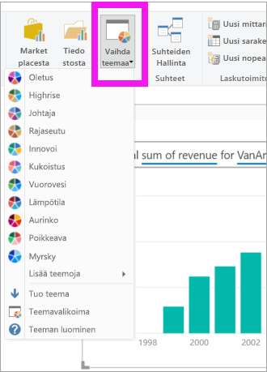

    
    
2. Tässä esimerkissä olemme valinneet **Lisää teemoja** > **Turvallinen värisokeille**.

    

### Muotoile Q&A-visualisointia
Muotoile Q&A visualisointia, kysymyskenttää ja tapaa, jolla ehdotukset näytetään. Voit muuttaa kaikkea otsikon taustasta väriin, joka näkyy, kun hiiren osoitin on tunnistamattomien sanojen päällä. Olemme lisänneet kysymysruutuun harmaan taustan ja muuttaneet alleviivaukset keltaisiksi ja vihreiksi. Otsikko on keskitetty, ja sillä on keltainen tausta. 

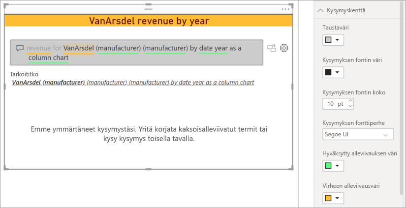

## Muunna Q&A-visualisointi vakiovisualisoinniksi
Olemme muotoilleet värisokeille turvallista pylväskaaviovisualisointia hieman lisäämällä siihen otsikon ja reunan. Nyt olemme valmiit muuntamaan sen raportin vakiovisualisoinniksi ja kiinnittämään sen koontinäyttöön.

Valitse -kuvake, jos haluat **muuttaa tämän Q&A-tuloksen vakiovisualisoinniksi**.

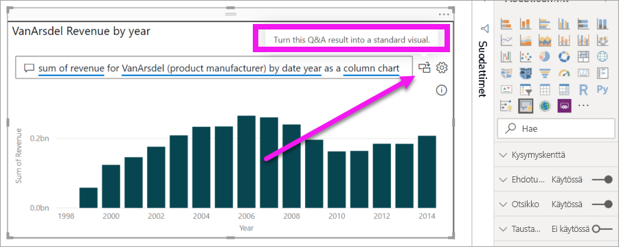

Tämä visualisointi ei ole enää Q&A-visualisointi vaan vakiosarakekaavio. Se voidaan kiinnittää koontinäyttöön. Raportissa tämä visualisointi käyttäytyy samalla tavalla kuin muut vakiovisualisoinnit. Huomaa, että Visualisoinnit-ruudussa näkyy valittuna pylväskaaviokuvake Q&A-visualisointikuvakkeen sijaan.

Jos käytät ***Power BI -palvelua***, voit nyt kiinnittää visualisoinnin koontinäyttöön valitsemalla Kiinnitä-kuvakkeen. 

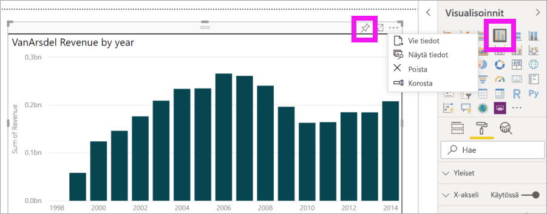

## Q&A-visualisoinnin kehittyneet ominaisuudet
Hammasrataskuvakkeen valitseminen avaa Q&A-visualisoinnin Työkalut-ruudun. 

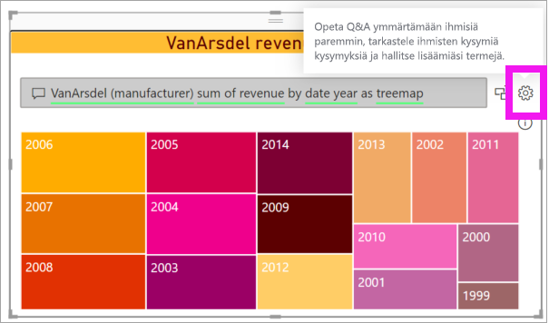

Työkalut-ruudun avulla voit opettaa Q&A:lle termejä, joita se ei tunnista, hallita näitä termejä ja hallita tämän tietojoukon ja raportin ehdotettuja kysymyksiä. Työkalut-ruudussa voit myös tarkastella kysymyksiä, joita on esitetty tätä Q&A-visualisointia käyttämällä, ja nähdä kysymykset, jotka käyttäjät ovat merkinneet. Jos haluat lisätietoja, lue [Tietoja Q&A-työkaluista](../natural-language/q-and-a-tooling-intro.md).

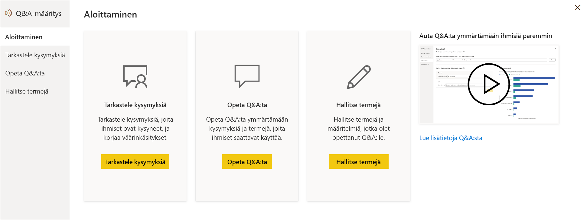

## Huomioon otettavat seikat ja vianmääritys
Q&A-visualisointi integroituu Officen ja Bingin kanssa, ja ne yrittävät sovittaa yleiset tunnistamattomat sanat tietojoukkosi kenttiin.  

## Seuraavat vaiheet

Luonnollisen kielen voi integroida useilla eri tavoilla. Katso lisätietoja seuraavista artikkeleista:

* [Q&A-työkalut](../natural-language/q-and-a-tooling-intro.md)
* [Q&A:n parhaat käytännöt](../natural-language/q-and-a-best-practices.md)
