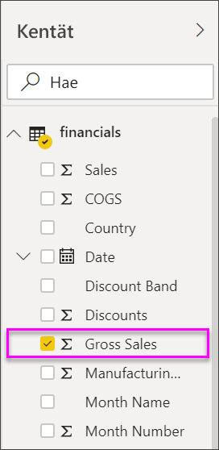
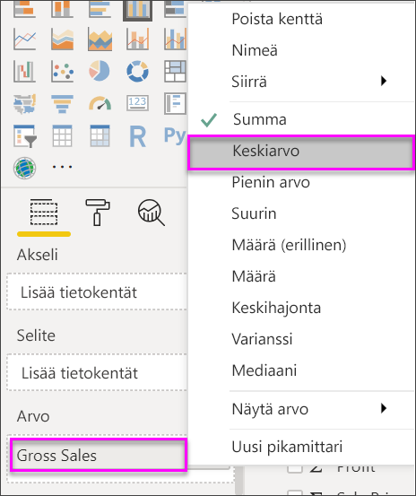
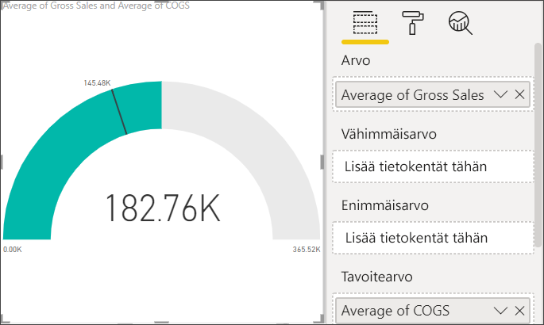
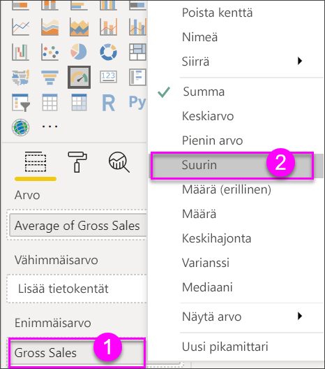
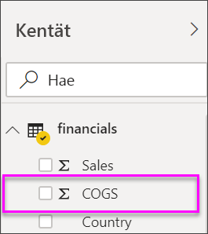
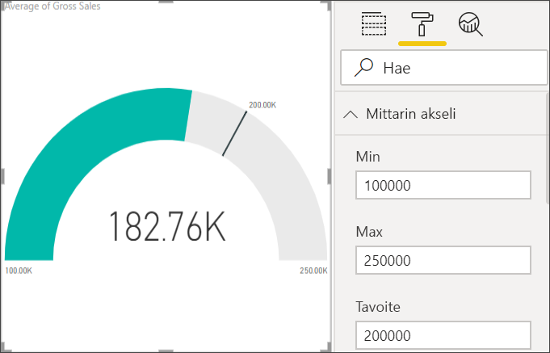

# Viisarimittarikaaviot Power BI:ssä

[!INCLUDE [power-bi-visuals-desktop-banner](../includes/power-bi-visuals-desktop-banner.md)]

Viisarimittarikaaviossa on pyöreä kaari, ja siinä on yksi arvo, joka mittaa edistymistä kohti tavoitetta tai suorituskyvyn mittaria. Rivi (tai *neula*) edustaa tavoitetta tai tavoitearvoa. Varjostus edustaa edistymistä tätä tavoitetta kohti. Kaaren sisällä oleva arvo tarkoittaa edistymisen arvoa. Power BI jakaa kaikki mahdolliset arvot tasaisesti kaarta pitkin minimistä (äärimmäisenä vasemmalla oleva arvo) maksimiin (äärimmäisenä oikealla oleva arvo).

Tässä esimerkissä olet automyyjä, joka seuraa myyntitiimin keskimääräistä myyntiä kuukaudessa. Neula edustaa 140 auton myyntitavoitetta. Pienin mahdollinen keskimääräinen myynti on 0, ja maksimi on 200.  Sininen varjostus näyttää, että tiimin myyntivauhti on tässä kuussa noin 120 kappaletta. Onneksi tiimillä on vielä toinen viikko aikaa tavoitteen saavuttamiseen.

Will näyttää sivulle, miten voit luoda yksittäisten arvojen visualisoinnit: mittarit, kortit ja suorituskyvyn mittarit.
   > [!NOTE]
   > Tässä videossa käytetään Power BI Desktopin vanhempaa versiota.
   > 
   > 
<iframe width="560" height="315" src="https://www.youtube.com/embed/xmja6EpqaO0?list=PL1N57mwBHtN0JFoKSR0n-tBkUJHeMP2cP" frameborder="0" allowfullscreen></iframe>

## Milloin käyttää viisarimittaria?

Viisarimittarit ovat hyvä vaihtoehto, kun:

* esitetään edistyminen kohti tavoitetta

* esitetään prosenttiyksiköitä, kuten suorituskyvyn mittareita

* näytetään yhden mittarin kunto

* näytetään tiedot, jotka voit lukea ja ymmärtää nopeasti.

## Edellytykset

Tässä opetusohjelmassa käytetään [Excelin Talousmalli-tiedostoa](https://download.microsoft.com/download/9/6/D/96DDC2FF-2568-491D-AAFA-AFDD6F763AE3/Retail%20Analysis%20Sample%20PBIX.pbix).

1. Valitse valikkorivin vasemmasta yläosasta **Nouda tiedot** > **Excel**
   
2. **Excelin Talousmalli-tiedoston** löytäminen

1. Avaa **Excelin Talousmalli-tiedosto** raporttinäkymässä .

1. Valitse **Talous** ja **Taul1**

1. Valitse **Lataa**

1. Valitse  uuden sivun lisäämiseksi.

## Luo viisarimittarin perusmalli

### Vaihe 1: Luo mittari bruttomyynnin seuraamiseen

1. Aloita tyhjältä raporttisivulta

1. Valitse **Kentät**-ruudusta **Bruttomyynti**.

   

1. Muuta koostaminen arvoon **Keskimääräinen**.

   

1. Valitse mittarikuvake  pylväskaavion muuntamiseksi mittarikaavioksi.

    

    Sen mukaan, milloin lataat **Talousmalli**-tiedoston, saatat nähdä lukuja, jotka eivät täsmää näiden lukujen kanssa.

    > [!TIP]
    > Oletusarvon mukaan Power BI luo mittarikaavion, jossa nykyisen arvon (tässä tapauksessa **keskimääräinen myynti**) oletetaan olevan mittarin puolivälissä. Koska **keskimääräinen bruttomyynti** on $ 182. 76K, aloitusarvo (minimi) on 0 ja loppuarvo (maksimi) on määritetty kaksinkertaiseksi nykyiseen arvoon nähden.

### Vaihe 3: Määritä tavoitearvo

1. Vedä **myytyjen tuotteiden kustannukset** **Kentät**-ruudusta **Tavoitearvo**-säilöön.

1. Muuta koostaminen arvoon **Keskimääräinen**.

   Power BI Lisää neulan edustamaan Microsoftin tavoitearvoa **$145. 48K**.

   

    Huomaa, että olemme ylittäneet tavoitteemme.

   > [!NOTE]
   > Voit syöttää tavoitearvon myös manuaalisesti. Katso [Käytä manuaalisia muotoiluvaihtoehtoja minimi-, maksimi- ja tavoitearvojen asettamiseen](#use-manual-format-options-to-set-minimum-maximum-and-target-values).

### Vaihe 4: Aseta maksimiarvo

Vaiheessa 2 Power BI asetti **Arvo**-kentän avulla automaattisesti minimi- ja maksimiarvot. Entä jos haluat määrittää oman maksimiarvon? Oletetaan, että sen sijasta, että käyttäisit kaksinkertaista nykyistä arvoa suurimpana mahdollisena arvona, haluat asettaa sen suurimpaan bruttomyyntimäärään tietojoukossasi.

1. Vedä **Bruttomyynti** **Kentät**-ruudusta **Maksimiarvo**-säilöön.

1. Muuta koostaminen arvoon **Maksimi**.

   

   Mittarin piirretään uudelleen uudella loppuarvolla 1,21 miljoonaa bruttomyyntinä.

   

### Vaihe 5: Tallenna raporttisi

1. [Tallenna raportti](../service-report-save.md).

## Käytä manuaalisia muotoiluvaihtoehtoja minimi-, maksimi- ja tavoitearvojen asettamiseen

1. Vedä **Maksimibruttomyynti** kohdasta **Maksimiarvo**.

1. Avaa **Muotoilu**-ruutu valitsemalla maalirullakuvake.

   

1. Laajenna **Mittarin akselia** ja syötä arvot kohteille **Min** ja **Max**.

    

1. Tyhjennä **Myytyjen tuotteiden kustannukset** -vaihtoehto **Kentät**-ruudusta tavoitearvon poistamiseksi.

    

1. Kun **Tavoite**-kenttä näkyy kohdassa **Mittarin akseli**, syötä arvo.

     

1. Jatka vaihtoehtoisesti mittarikaavion muotoilua.

Kun olet käynyt läpi nämä vaiheet, sinulla on mittarikaavio, joka näyttää suunnilleen tältä:

## Seuraava vaihe

* [Suorituskyvyn mittarin visualisoinnit](power-bi-visualization-kpi.md)

* [Visualisointityypit Power BI:ssä](power-bi-visualization-types-for-reports-and-q-and-a.md)

Onko sinulla kysyttävää? [Kokeile Power BI -yhteisöä](https://community.powerbi.com/)
