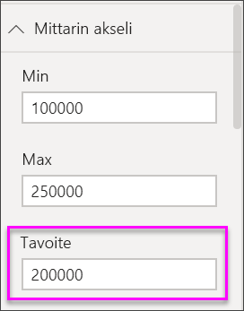

# Viisarimittarikaaviot Power BI:ssä
Viisarimittarikaaviossa on pyöreä kaari, ja siinä on yksi arvo, joka mittaa edistymistä kohti tavoitetta/suorituskyvyn mittaria.  Tavoite tai tavoitearvo esitetään riveittäin (neula). Tämän päämäärän edistyminen esitetään varjostuksella.  Arvo, joka edustaa kyseistä edistymistä, näkyy lihavoituna kaaren sisällä. Kaikki mahdolliset arvot on jaettu tasaisesti kaarta pitkin minimistä (äärimmäisenä vasemmalla oleva arvo) maksimiin (äärimmäisenä oikealla oleva arvo).

Seuraavassa esimerkissä olemme automyyjä, joka seuraa myyntitiimin keskimääräistä myyntiä kuukaudessa. Tavoitteemme on 140, ja sitä edustaa musta neula.  Pienin mahdollinen keskimääräinen myynti on 0, ja maksimiksi on asetettu 200.  Sininen varjostus näyttää, että olemme tällä hetkellä noin 120 kappaleen vauhdissa tässä kuussa. Onneksi meillä on vielä viikko aikaa tavoitteiden saavuttamiseksi.

## Milloin käyttää viisarimittaria?
Viisarimittarit ovat hyvä vaihtoehto, kun:

* esitetään edistyminen kohti tavoitetta.
* esitetään prosenttiyksiköitä, kuten suorituskyvyn mittareita.
* näytetään yhden mittauksen kunto.
* näytetään tiedot, joita voidaan nopeasti tarkistaa ja ymmärtää.

### Edellytykset
 - Power BI -palvelu tai Power BI Desktop
 - Talousmalli-Excel-työkirjan: [lataa näyte suoraan](http://go.microsoft.com/fwlink/?LinkID=521962).

## Luo viisarimittarin perusmalli
Näissä ohjeissa käytetään Power BI -palvelua. Jatka kirjautumalla Power BI -palveluun ja avaa Excel Talousmalli -tiedosto.  

Tai kello näyttää, miten voit luoda yksittäisten arvojen visualisoinnit: mittarit, kortit ja suorituskyvyn mittarit.

<iframe width="560" height="315" src="https://www.youtube.com/embed/xmja6EpqaO0?list=PL1N57mwBHtN0JFoKSR0n-tBkUJHeMP2cP" frameborder="0" allowfullscreen></iframe>

### Vaihe 1: Avaa Excelin Talousmalli-tiedosto
1. [Lataa Excel Talousmalli -mallitiedosto](../sample-financial-download.md), jos et ole vielä tehnyt sitä. Muista, mihin tallensit sen.

2. Avaa tiedosto ***Power BI -palvelussa*** valitsemalla **Nouda tiedot \>**  ja selaamalla sijaintiin, johon tallensit tiedoston. Valitse **Tuo**. Talousmalli lisätään työtilaasi tietojoukkona.

3. Valitse **tietojoukon** sisältöluettelosta **Talousmalli** ja avaa se Tutustu-tilassa.

    

### Vaihe 2: Luo mittari bruttomyynnin seuraamiseen
1. Valitse **Kentät** -ruudussa **Bruttomyynti**.
   
   
2. Muuta koostaminen arvoon **Keskimääräinen**.
   
   
3. Valitse mittarikuvake  pylväskaavion muuntamiseksi mittariksi.
   
   Oletusarvon mukaan Power BI luo mittakaavion, jossa nykyinen arvo (tässä tapauksessa keskimääräinen bruttomyynti) oletetaan olevan mittarin puolivälissä. Koska keskimääräinen bruttomyynti on $ 182. 76K, aloitusarvo (minimi) on 0 ja loppuarvo (maksimi) on määritetty kaksinkertaiseksi nykyiseen arvoon nähden.
   
   

### Vaihe 3: Määritä tavoitearvo
1. Vedä **myytyjen tuotteiden kustannukset (COGS)** **tavoitearvoon**.
2. Muuta koostaminen arvoon **Keskimääräinen**.
   Power BI Lisää neulan edustamaan Microsoftin tavoitearvoa **$145. 48K**. Huomaa, että olemme ylittäneet tavoitteemme.
   
   
   
   > [!NOTE]
   > Voit syöttää tavoitearvon myös manuaalisesti.  Lue seuraava kohta ”Käytä muotoiluasetuksia, minimi-, maksimi- ja tavoitearvojen asettamiseen”.
   > 
   > 

### Vaihe 4: Aseta maksimiarvo
Vaiheessa 2 Power BI käytti Arvo-kenttää asettamana automaattisesti minimin (alku) ja maksimin (loppu).  Mutta entä jos haluat määrittää oman maksimiarvon?  Oletetaan, että sen sijasta, että käyttäisit kaksinkertaista nykyistä arvoa suurimpana mahdollisena arvona, haluat asettaa sen suurimpaan bruttomyyntimäärään tietojoukossasi. 

1. Vedä **Bruttomyynti** **Kentät**-luettelosta **suurimman arvon** kohdalle.
2. Muuta koostaminen arvoon **Maksimi**.
   
   
   
   Mittarin piirretään uudelleen uudella loppuarvolla 1,21 miljoonaa bruttomyyntinä.
   
   

### Vaihe 5: Tallenna raporttisi
1. [Tallenna raportti](../service-report-save.md).
2. [Mittarikaavion lisääminen koontinäytön ruutuna](../service-dashboard-pin-tile-from-report.md). 

## Käytä muotoiluasetuksia, minimi-, maksimi- ja tavoitearvojen asettamiseen
1. Vedä **Maksimibruttomyynti** kohdasta **Maksimiarvo**.
2. Avaa muotoiluruutu valitsemalla maalitelakuvake.
   
   
3. Laajenna **Mittarin akselia** ja syötä arvot **Min** ja **Max**.
   
    
4. Poista nykyinen tavoitearvo poistamalla valintamerkki kohdasta **COGS**.
   
    
5. Kun **Tavoite**-kenttä näkyy kohdassa **Mittarin akseli**, syötä arvo.
   
    
6. Jatka vaihtoehtoisesti mittarikaavion muotoilua.

## Seuraava vaihe

[Mittarit Power BI:ssä](power-bi-visualization-kpi.md)

[Visualisointityypit Power BI:ssä](power-bi-visualization-types-for-reports-and-q-and-a.md)
