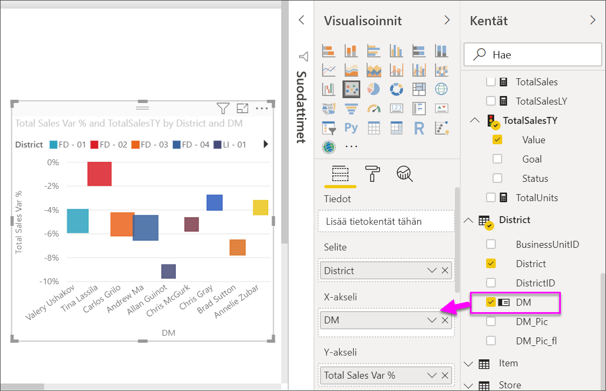

# Piste-, kupla- ja pistetulostuskaaviot Power BI:ssä

Pistekaaviossa on aina kaksi arvoakselia, jotka näyttävät yhden numeerisen tietosarjan vaakasuuntaisella akselilla ja toisen numeerisen arvosarjan pystysuuntaisella akselilla. Kaaviossa näytetään arvopisteet numeerisen arvon X ja Y leikkauskohdassa yhdistämällä nämä kaksi arvoa yhdeksi arvopisteeksi. Power BI voi jakaa nämä arvopisteet tasaisesti tai epätasaisesti vaakasuuntaiselle akselille kaavion edustamien tietojen mukaan.

Katso tästä videosta, miten Will luo pistekaavion, ja noudata sitten seuraavia ohjeita luodaksesi sellaisen itse.

<iframe width="560" height="315" src="https://www.youtube.com/embed/PVcfPoVE3Ys?list=PL1N57mwBHtN0JFoKSR0n-tBkUJHeMP2cP" frameborder="0" allowfullscreen></iframe>

Voit määrittää arvopisteiden määrän. Niiden enimmäismäärä on 10 000.  

## Milloin kannattaa käyttää pistekaaviota, kuplakaaviota tai pistetulostuskaaviota

### Piste- ja kuplakaaviot

Pistekaavio näyttää kahden numeerisen arvon välisen suhteen. Kuplakaavio korvaa arvopisteet kuplilla, joissa kuplan *koko* edustaa kolmansien lisätietojen dimensiota.

Pistekaavio on hyvä valinta:

* Suhteiden osoittamiseen kahden numeerisen arvon välillä.

* Kahden numeroryhmän piirtämiseen yhtenä X- ja Y-koordinaattien sarjana.

* Viivakaavion sijaan silloin, kun halutaan muuttaa vaakasuuntaisen akselin asteikkoa.

* Vaakasuuntaisen akselin muuttamiseen logaritmiseen asteikkoon.

* Sellaisten laskentataulukon tietojen näyttämiseen, joihin sisältyy arvopareja tai ryhmiteltyjä arvosarjoja.

    > [!TIP]
    > Pistekaaviossa on mahdollista säätää akselien yksittäisiä asteikkoja lisätietojen saamiseksi ryhmitellyistä arvoista.

* Toistuvien mallien osoittamiseen suurissa tietojoukoissa esimerkiksi osoittamalla lineaarisia tai epälineaarisia trendejä, klustereita ja poikkeavia arvoja.

* Suurten arvopistemäärien vertailuun ajasta riippumatta.  Mitä enemmän tietoja sisällytät pistekaavioon, sitä parempia vertailuja voit tehdä.

Pistekaavioiden lisäksi hyvä vaihtoehto ovat kuplakaaviot:

* Jos tiedoissasi on kolme arvosarjaa, joista jokainen sisältää joukon arvoja.

* Taloudellisten tietojen esittämiseen.  Erikokoiset kuplat ovat hyödyllisiä erityisten arvojen visuaaliseen korostamiseen.

* Neljännesten kanssa käytettäväksi.

### Pistetulostuskaaviot

Pistetulostuskaavio muistuttaa kuplakaaviota ja pistekaaviota, mutta X-akselille voi tulostaa myös numeerisia tai luokittaisia tietoja.

Se on mainio valinta, jos haluat sisällyttää X-akselille luokittaista tietoa.

## Edellytykset

* Power BI -palvelu

* Jälleenmyyntianalyysimallin raportti

## Pistekaavion luominen

Seuraa mukana kirjautumalla sisään [Power BI -palveluun](https://app.powerbi.com) ja avaamalla [Jälleenmyyntianalyysimalli](../sample-datasets.md)-raportti [Muokkaa raporttia](../service-interact-with-a-report-in-editing-view.md) -näkymässä.

1. Valitse  tyhjän raporttisivun luomiseksi.

1. Valitse **Kentät**-ruudusta seuraavat kentät:

    * **Myynti** > **Myynti/neliöjalka**

    * **Myynti** > **Myyntivariaatio-% yhteensä**

    * **Alue** > **Alue**

    

1. Valitse **Visualisointi**-ruudusta  klusteroidun pylväskaavion muuntamiseksi pistekaavioksi.

   

1. Vedä **Alue** kohteesta **Tiedot** kohteeseen **Selite**.

    Power BI näyttää pistekaavion, jossa **Myyntivariaatio-% yhteensä** on piirretty Y-akselille ja **Myynti/neliöjalka** X-akselille. Arvopisteiden värit edustavat alueita:

    

Nyt lisätään kolmas dimensio.

## Kuplakaavion luominen

1. Vedä **Kentät**-ruudusta **Myynti** > **Tämän vuoden myynti** > **Arvo** **Koko**-säilöön. Arvopisteet laajenevat myynnin arvon mukaisiin kokoihin.

   

1. Pidä hiiren osoitinta kuplan päällä. Kuplan koko kuvastaa arvoa **Tämän vuoden myynti**.

    

1. Voit määrittää kuplakaaviossa näkyvien arvopisteiden määrän laajentamalla **Visualisoinnit**-ruudun **Muotoilu**-osiossa olevaa **Yleistä**-kohtaa ja säätämällä **Tietojen määrä**-kohtaa.

    

    Voit määrittää tietojen enimmäismääräksi minkä tahansa luvun, joka on enintään 10 000. Suurten lukujen yhteydessä on suositeltavaa testata toiminta ensin hyvän suorituskyvyn varmistamiseksi.

    > [!NOTE]
    > Useammat arvopisteet saattavat merkitä pidempää latausaikaa. Jos haluat julkaista raportteja, joissa on rajat asteikon lopussa, testaa raporttisi myös verkossa ja mobiililaitteessa. Voit näin varmistaa, että kaavion suorituskyky vastaa käyttäjien odotuksia.

1. Voit [muotoilla visualisoinnin värejä, nimiä, otsikoita, taustaa ja muuta](service-getting-started-with-color-formatting-and-axis-properties.md).

    Jos haluat [parantaa helppokäyttöisyyttä](../desktop-accessibility.md), harkitse merkin muotojen lisäämistä kullekin riville. Jos haluat valita merkin muodon, laajenna **Muodot**-kohtaa, valitse **Merkin muoto** ja valitse muoto.

    

    Voit muuttaa merkin muodon vinoneliöksi, kolmioksi tai neliöksi. Erilaisten merkin muotojen käyttö kullekin riville helpottaa raporttien käyttäjiä erottamaan rivit (tai alueet) toisistaan.

## Pistetulostuskaavion luominen

Luo pistetulostuskaavio korvaamalla **numeerinen X-akseli**-kenttä luokittaisella kentällä.

Poista **X-akselin** ruudusta **Myynti/neliöjalka** ja korvaa se kentällä **Alue** > **Aluejohtaja**.

## Huomioon otettavat seikat ja vianmääritys

### Pistekaaviossasi on vain yksi arvopiste

Onko pistekaaviossasi vain yksi arvopiste, joka koostaa kaikki arvot X- ja Y-akseleille?  Vai yhdistääkö kaavio kaikki arvot yhdelle vaaka- tai pystysuuntaiselle riville?

Lisää kenttä **Tiedot**-säilöön ja kerro näin Power BI:lle, miten arvot ryhmitetään. Kentän on oltava yksilöllinen jokaiselle arvopisteelle, jonka haluat piirtää. Esimerkiksi yksinkertainen rivin numero tai tunnuskenttä.

Tai jos tiedoissasi ei ole näitä, luo kenttä, joka liittää X- ja Y-arvot yhteen niin, että ne yksilöivät pisteen:

Jos haluat luoda uuden kentän, [käytä Power BI Desktopin kyselyeditoria lisätäksesi indeksisarakkeen](../desktop-add-custom-column.md) tietojoukkoosi. Lisää sitten tämä sarake visualisointisi **Tiedot**-säilöön.

## Seuraavat vaiheet

* [Suuren tiheyden näytteenotto Power BI:n pistekaavioissa](desktop-high-density-scatter-charts.md)

* [Visualisointityypit Power BI:ssä](power-bi-visualization-types-for-reports-and-q-and-a.md)

Onko sinulla kysyttävää? [Kokeile Power BI -yhteisöä](http://community.powerbi.com/)
