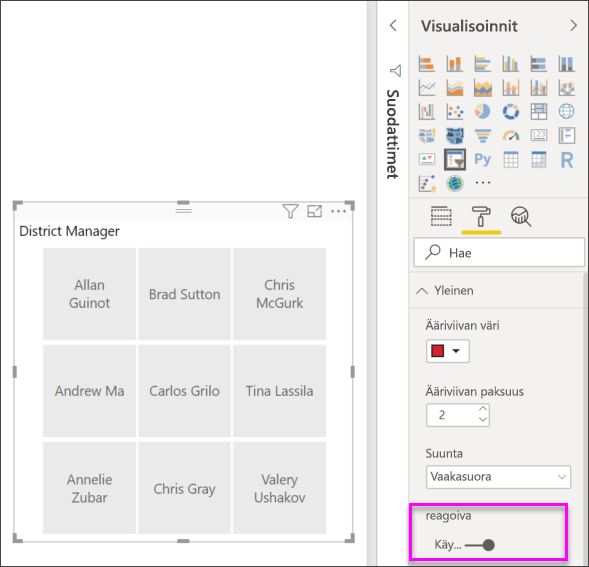

# Osittajat Power BI:ssä

[!INCLUDE [applies-to](../includes/applies-to.md)] [!INCLUDE [yes-desktop](../includes/yes-desktop.md)] [!INCLUDE [yes-service](../includes/yes-service.md)]

Oletetaan, että haluat, että raportin lukijat voivat tarkastella yleisiä myyntitilastoja, mutta myös korostaa yksittäisten aluepäälliköiden suorituskykyä ja eri aikavälejä. Voit luoda erillisiä raportteja tai vertailukaavioita. Voit myös käyttää *osittajia*. Osittaja on vaihtoehtoinen suodatustapa, jolla voit rajoittaa tietojoukon osaa, joka näkyy muissa raportin visualisoinneissa. 

Tässä artikkelissa käydään läpi perusosittajan luominen ja muotoileminen käyttämällä maksutonta [Jälleenmyyntianalyysimallia](../sample-retail-analysis.md). Se myös esittelee, miten voit määrittää, mihin visualisointeihin osittaja vaikuttaa, ja miten voit synkronoida sen muilla sivuilla olevien osittajien kanssa. Seuraavassa on joitakin muita artikkeleita, joissa selitetään, miten voit tehdä tietyntyyppisiä osittajia:

- [Numeerisen alueen osittajat](../desktop-slicer-numeric-range.md).
- [Suhteelliset päivämääräosittajat](desktop-slicer-filter-date-range.md).
- Reagoivat, [koonmuuttokelpoiset osittajat](../power-bi-slicer-filter-responsive.md).
- [Hierarkiaosittajat](../create-reports/power-bi-slicer-hierarchy-multiple-fields.md), joissa on useita kenttiä.

## Osittajan käyttäminen
Osittajia kannattaa käyttää seuraavissa tilanteissa:

* Haluat helpottaa käyttöä näyttämällä usein käytettyjä tai tärkeitä suodattimia raporttipohjalla.
* Haluat helpottaa nykyisen suodatetun tilan tarkastelua avaamatta avattavaa luetteloa. 
* Haluat käyttää suodatuksessa sarakkeita, jotka ovat tarpeettomia ja piilotettuina tietotaulukoissa.
* Haluat luoda tarkempia raportteja sijoittamalla osittajia tärkeiden visualisointien viereen.

Power BI -osittajat eivät tue

- syötekenttiä
- porautumista.

## Osittajan luominen

Tämä osittaja suodattaa tiedot alueen esimiehen mukaan. Jos haluat noudattaa tätä menettelyä, lataa [Jälleenmyyntianalyysimalli-PBIX-tiedosto](https://download.microsoft.com/download/9/6/D/96DDC2FF-2568-491D-AAFA-AFDD6F763AE3/Retail%20Analysis%20Sample%20PBIX.pbix).

1. Avaa Power BI Desktop ja valitse valikkorivillä **Tiedosto** > **Avaa**.
   
1. Etsi **Jälleenmyyntianalyysimalli.pbix**-tiedosto selaamalla ja valitse sitten **Avaa**.

1. Avaa tiedosto raporttinäkymässä valitsemalla vasemman ruudun **Raportti**-kuvake .

1. Luo uusi osittaja valitsemalla **Yleiskatsaus**-sivulla, kun pohjassa ei ole mitään valittuna, **Osittaja**-kuvake **Visualisoinnit**-ruudusta. 

1. Kun uusi osittaja on valittuna, lisää osittajaan tiedot valitsemalla **Kentät**-ruudussa **Alue** > **Aluejohtaja**. 

    Uudessa osittajassa on nyt luettelo aluejohtajista sekä heidän valintaruutunsa.
    
    
    
1. Muuta pohjan elementtien kokoa ja vedä ne uusiin kohtiin tehdäksesi tilaa osittajalle. Jos pienennät osittajan liian pieneksi, sen kohdat leikataan. 

1. Valitse nimet osittajasta ja katso, miten tämä vaikuttaa sivun muihin visualisointeihin. Poista nimien valinta valitsemalla ne uudelleen. Voit valita useita nimiä kerralla pitämällä **Ctrl**-näppäintä painettuna valitessasi nimiä. Kaikkien nimien valinnalla on sama vaikutus kuin jos ei valittaisi mitään. 

1. Voit muotoilla osittajaa myös valitsemalla **Visualisoinnit**-ruudusta **Muotoile** (maalirullakuvake). 

   Vaihtoehtoja on liikaa, jotta niitä voisi kaikkia kuvailla tässä, joten kokeile itse ja luo juuri itsellesi sopiva osittaja. Seuraavassa kuvassa ensimmäinen osittaja on vaakasuuntainen ja siinä on värilliset tausta tietoyksiköille. Toinen osittaja on pidetty pystysuuntainen ja värien sijaan siinä on perinteisempi ulkoasu.

   

   >[!TIP]
   >Osittajan luettelokohteet lajitellaan oletusarvoisesti nousevassa järjestyksessä. Jos haluat muuttaa lajittelujärjestyksen laskevaksi, valitse osittajan oikeasta yläkulmasta kolme pistettä ( **...** ) ja valitse **Lajittele laskevasti**.

## Määrittää, millä sivulla osittajat vaikuttavat visualisointeihin
Osittajat raporttisivuilla vaikuttavat oletusarvoisesti kaikkiin muihin sivulla oleviin visualisointeihin toisensa mukaan lukien. Kun valitset luettelosta arvot ja juuri luomasi päivämääräliukusäätimet, huomaat vaikutukset muihin visualisointeihin. Suodatetut tiedot ovat molemmissa liukusäätimissä valittujen arvojen leikkauspiste. 

Voit estää joidenkin sivujen visualisointien vaikutukset visualisointitoimilla. **Yleiskatsaus**-sivun **Kokonaismyynnin variaatioprosentti tilikauden kuukauden ja aluejohtajan mukaan** -kaavio näyttää ne aluejohtajien yleiset vertailutiedot kuukausittain, jotka haluat pitää aina näkyvissä. Visualisointitoimilla voit estää osittajavalintoja suodattamasta tätä kaaviota. 

1. Siirry raportin **Yleiskatsaus**-sivulle ja valitse sitten aiemmin luomasi **Aluejohtaja**-osittaja.

1. Valitse Power BI Desktopissa **Muotoile**-valikon **Visualisointityökalut**-kohdasta **Muokkaa vuorovaikutuksia**.
   
    (joissa kaikissa on **Suodata**- ja **Ei mitään** -asetukset) näkyvät kaikkien sivulla olevien visualisointien yläpuolella. Aluksi **Suodata**-asetus on valittuna valmiiksi kaikissa objekteissa.
   
1. Valitse **Ei mitään** -asetus **Kokonaismyynnin variaatioprosentti tilikauden kuukauden mukaan** -kaavion yläpuolella olevasta suodatinobjektista, jotta **Aluejohtaja**-osittaja ei enää suodata tätä kaaviota. 

1. Valitse **Avauspäivä**-osittaja ja valitse sitten **Ei mitään** -asetus **Kokonaismyynnin variaatioprosentti tilikauden kuukauden mukaan** -kaavion yläpuolella olevasta suodatinobjektista, jotta tämä osittaja ei enää suodata tätä kaaviota. 

   Nyt, kun valitset nimet ja päivämäärävälit osittajasta, **Kokonaismyynnin variaatioprosentti tilikauden kuukauden mukaan** -kaavio ei muutu.

Lisätietoja vuorovaikutusten muokkaamisesta on artikkelissa [Visualisointien vuorovaikutusten muokkaaminen Power BI -raportissa](../service-reports-visual-interactions.md).

## Osittajien synkronoiminen ja käyttäminen muilla sivuilla
Vuoden 2018 helmikuun Power BI -päivityksestä alkaen voit synkronoida osittajan ja käyttää sitä millä tahansa tai kaikilla raportin sivuilla. 

Nykyisen raportin **Alueen kuukausimyynti** -sivulla on myös **Aluejohtaja**-osittaja, mutta entä jos haluamme tämän osittajan myös **Uudet myymälät**-sivulle? **Uudet myymälät** -sivulla on osittaja, mutta sen tiedoissa on vain **Myymälän nimi**. **Synkronoi osittaja** -ruudussa voit synkronoida **Aluejohtaja**-osittajan näille sivuille, jolloin minkä tahansa sivun osittajavalinnat vaikuttavat kaikkien kolmen sivun visualisointeihin.

1. Valitse Power BI Desktopin **Näytä**-valikosta **Synkronoi osittajat**.

    

    **Synkronoi osittajat** -ruutu tulee näkyviin **Suodattimet**- ja **Visualisoinnit**-ruutujen väliin.

    

1. Valitse raportin **Alueen kuukausimyynti** -sivulla **Aluejohtaja**-osittaja. 

    Koska olet jo luonut **Aluejohtaja** (**DM**) -osittajan **Yleiskatsaus**-sivulle, **Synkronoi osittajat** -ruutu tulee näkyviin seuraavasti:
    
    
    
1. Valitse **Synkronoi osittajat** -ruudun **Synkronoi**-sarakkeessa **Yleiskatsaus**-, **Alueen kuukausimyynti**- ja **Uudet myymälät** -sivut. 

    Tämän valinnan johdosta **Alueen kuukausimyynti** -osittaja synkronoidaan näille kolmelle sivulle. 
    
1. Valitse **Synkronoi osittajat** -ruudun **Näkyvissä**-sarakkeessa **Uudet myymälät** -sivu. 

    Tämän valinnan johdosta **Alueen kuukausimyynti** -osittaja on näkyvissä näillä kolmella sivulla. **Synkronoi osittajat** -ruutu avautuu nyt seuraavasti:

    

1. Noudata osittajan synkronoinnin vaikutuksia ja tee se näkyväksi muille sivuille. Näet, että **Alueen kuukausimyynti** -sivulla **Aluejohtaja**-osittaja näyttää nyt samat kuin valinnat **Yleiskatsaus**-sivulla. **Aluejohtaja**-osittaja on nyt näkyvissä **Uudet myymälät** -sivulla ja sen valinnat vaikuttavat valintoihin, jotka ovat käytettävissä **Myymälän nimi** -osittajassa. 
    
    >[!TIP]
    >Vaikka osittaja näkyy alun perin synkronoidulla sivuilla saman kokoisena ja samassa sijainnissa kuin alkuperäisellä sivulla, voit siirtää, muuttaa kokoa ja muotoilla synkronoituja osittajia eri sivuilla itsenäisesti. 

    >[!NOTE]
    >Jos synkronoit osittajan sivulle, mutta et määritä sitä näkyviin sivulla, muilla sivuilla tehdyt osittajan valinnat suodattavat edelleen tietoja sivulla.
 
## Osittajien suodattaminen
Voit käyttää osittajille visualisointitason suodattimia, joilla voit lyhentää osittajassa näkyvien arvojen luetteloa. Voit esimerkiksi suodattaa pois tyhjät arvot luettelon osittajasta tai suodattaa pois tietyt päivämäärät alueen osittajasta. Kun teet tämän, se vaikuttaa vain *osittajassa näytettäviin arvoihin*, ei *suodattimeen, jota osittaja käyttää muihin visualisointeihin*, kun teet valinnan. Oletetaan esimerkiksi, että käytät suodatinta alueen osittajassa niin, että vain tietyt päivämäärät näkyvät. Osittajan valinta näyttää vain kyseisen alueen ensimmäisen ja viimeisen päivämäärän, mutta voit silti nähdä muita päivä määriä muissa visualisoinneissasi. Kun muutat valittua aluetta osittajassa, näet muiden visualisointien päivittyvän. Osittajan tyhjentäminen näyttää kaikki päivämäärät uudelleen.

Artikkelissa [Suodatintyypit](../power-bi-report-filter-types.md) on lisätietoja visualisointitason suodattimista.

## Osittajien muotoilu
Käytettävissä on erilaisia muotoiluasetuksia osittajan tyypin mukaan. Käyttämällä **Vaaka**-suuntaa **Reagoiva**-asettelua ja **Nimi**-väriä, voit luoda painikkeita tai ruutuja standardiluettelonimikkeiden sijaan ja muuttaa osittajan kohteiden kokoa sopimaan eri näyttöjen ja asettelujen kokoon.  

1. Kun **Aluejohtaja**-osittaja on valittuna millä tahansa sivulla, tuo muotoilutoiminnot näkyviin valitsemalla **Visualisoinnit**-ruudun **Muotoile**-kuvake . 
    
    
    
1. Voit katsella ja muokata asetuksia valitsemalla kunkin luokan vieressä olevaa avattavan valikon nuolta. 

### Yleiset asetukset
1. Valitse **Muotoile**-kohdasta **Yleiset**, valitse **ääriviivan väriksi** punainen ja vaihda sitten **ääriviivan paksuudeksi***2*. 

    Tämä määrittää otsikon ja kohteiden ääriviivojen ja alleviivausten värin ja paksuuden.

1. **Suunta**-asetuksena on oletusarvoisesti **Pysty**. Jos haluat luoda osittajan, jossa ruudut tai painikkeet ovat vaakasuunnassa ja jos haluat vierittää nuolilla päästäksesi nimikkeisiin, jotka eivät mahdu osittajaan, valitse **Vaaka**.
    
    
    
1. Kun **otat käyttöön** **Reagoiva**-asettelun, voit muuttaa osittajan kokoa ja järjestystä näytön ja osittajan koon mukaan. 

    Luettelo-osittajien kohdalla reagoiva asettelu estää nimikkeiden katkaisemisen pienissä näytöissä. Se on käytettävissä vain vaakasuunnassa. Alueen liukusäätimen osittajien kohdalla reagoiva muotoilu muuttaa liukusäätimen tyyliä ja tarjoaa entistä joustavampaa koon muuttamista. Molemmista osittajista tulee pieniä suodatinkuvakkeita.
    
    
    
    >[!NOTE]
    >Reagoivan asettelun muutokset saattavat ohittaa määrittämäsi tietyn otsikon ja kohteen muotoilun. 
    
1. Määritä osittajan sijainti ja koko tarkasti **X-sijainti**-, **Y-sijainti**-, **Leveys**- ja **Korkeus**-kohdissa tai siirrä osittaja suoraan piirtoalustalle. 

    Kokeile eri tietoyksikkökokoja ja järjestelyjä ja huomioi, miten reagoiva muotoilu muuttuu vastaavasti. Nämä asetukset ovat käytettävissä vain vaakasuuntaa käytettäessä. 

    

Jos haluat lisätietoja vaaka-asettelusta ja reagoivasta asettelusta, lue ohjeartikkeli [Kooltaan muokattavan reagoivan osittajan luominen Power BI:ssä](../power-bi-slicer-filter-responsive.md).

### Valinnan hallinta -asetukset (vain luettelon osittajat)
1. Ota **Valinnan hallinta** -kohdassa **Näytä Valitse kaikki -vaihtoehto** -asetus **Käyttöön**. Tämä lisää **Valitse kaikki** -asetuksen osittajaan. 

    **Näytä Valitse kaikki -vaihtoehto** -asetus on oletusarvoisesti **poissa käytöstä**. Kun se on käytössä, sillä voi valita kaikki kohteet tai poistaa kaikkien kohteiden valinnan. Jos valitset kaikki kohteet, kohteen valitseminen poistaa sen valinnan. Tämä mahdollistaa *ei-ole*-tyyppisen suodattimen käytön.
    
    
    
1. Kun **poistat** **Yksittäinen valinta** -asetuksen käytöstä, voit valita useita kohteita painamatta **Ctrl**-painiketta pitkään. 

    **Yksittäinen valinta** on oletusarvoisesti **käytössä**. Kohteen valitseminen valitsee sen ja **Ctrl**-näppäintä pitkään painamalla voi valita useita kohteita. Kohteen valitseminen uudelleen poistaa sen valinnan.

### Otsikon asetukset
**Otsikko** on oletusarvoisesti **käytössä**. Tässä valinnassa näytetään tietokentän nimi osittajan yläreunassa. 
- Muotoile otsikkoteksti tätä artikkelia varten seuraavasti: 
   - **Fontin väri**: punainen
   - **Tekstin koko**: **14 pt**
   - **Tasaus**: **Keskitetty**
   - **Fonttiperhe**: **Arial Black**

### Kohteiden asetukset (vain luettelo-osittajat)
1. Muotoile **kohteiden** asetukset tätä artikkelia varten seuraavasti:
    - **Fontin värin**: musta
    - **Tausta**: vaalea punainen
    - **Tekstin koko**: **10 pt**
    - **Fonttiperhe**: **Arial**
 
1. Valitse **Ääriviiva**-asetukseksi **Kehys**, jos haluat piirtää kunkin kohteen ympärille reunuksen **yleisissä** asetuksissa määrittämälläsi koolla ja värillä. 
    
    
    
    >[!TIP]
    >- Kun valittuna on **Yleiset** > **Suunta** > **Vaaka**, valitsemattomissa kohteissa käytetään valittua tekstiä ja taustavärejä ja valituissa kohteissa käytetään järjestelmäoletusta, jolloin tausta on yleensä musta ja teksti valkoinen.
    >- Kun valittuna on **Yleiset** > **Suunta > Pysty**, kohteissa käytetään aina valittuja värejä ja valittuna olevat valintaruudut ovat aina mustia. 

### Päivämäärien ja numeroiden syötekentät ja liukusäädinasetukset (vain alueliukusäädinosittajat)
- Luettelo-osittajissa päivämäärien ja numeroiden syöteasetukset ovat samat kuin **kohteilla**, mutta ääriviiva- ja alleviivausasetukset eivät ole käytettävissä.
- **Liukusäätimen** asetusten avulla voit määrittää alueen liukusäätimen värin tai **poistaa liukusäätimen käytöstä**, jolloin jäljelle jäävät vain numeroiden syötekentät.

### Muut muotoiluasetukset
Muut muotoiluasetukset ovat oletusarvoisesti **poissa käytöstä**. Jos haluat hallita niitä, **ota ne käyttöön**: 
- **Tausta:** lisää taustaväri osittajaan ja määritä sen läpinäkyvyys.
- **Lukitse kuvasuhde**: säilytä osittajan muoto, jos sen kokoa muutetaan.
- **Reunus**: Lisää reunus osittajan ympärille ja määritä sen väri. Tämä osittajan reunus on eri kuin **yleisissä** asetuksissa määritetty reunus. 

## Seuraavat vaiheet
Katso lisätietoja seuraavista artikkeleista:

- [Visualisointityypit Power BI:ssä](power-bi-visualization-types-for-reports-and-q-and-a.md)

- [Taulukot Power BI:ssä](power-bi-visualization-tables.md)

