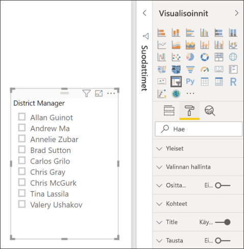
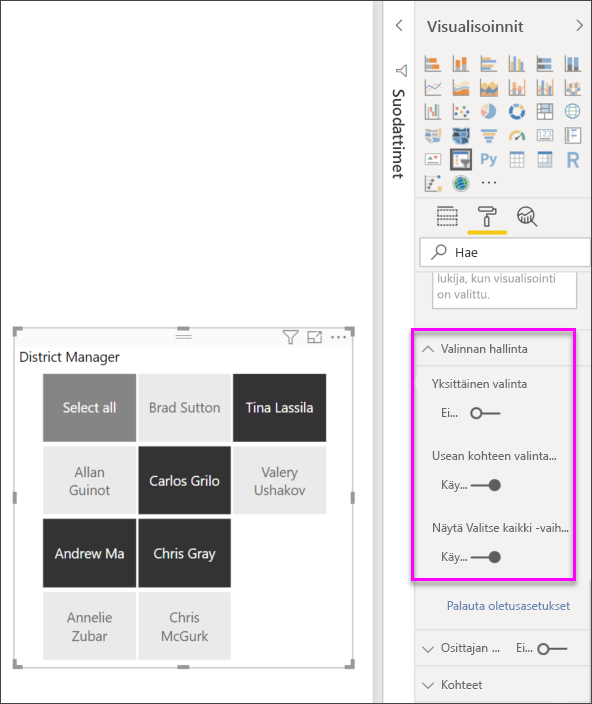

# Osittajat Power BI:ssä
Haluat, että raportinlukijasi voivat tarkastella yleisiä myyntitilastoja, mutta myös korostaa yksittäisten aluepäälliköiden suorituskykyä ja eri aikavälejä. Voit luoda erillisiä raportteja tai vertailukaavioita tai osittajia. Osittaja on vaihtoehtoinen suodatustapa, jolla voit rajoittaa tietojoukon osaa, joka näkyy muissa raportin visualisoinneissa. 

Tässä opetusohjelmassa käytetään maksutonta [jälleenmyyntianalyysimallia](../sample-retail-analysis.md), ja opit luomaan, muotoilemaan ja käyttämään luettelon ja päiväyksen alueosittajia. Pidä hauskaa opetellessasi uusia tapoja muotoilla ja käyttää osittajia. 

## Osittajan käyttäminen
Osittajia kannattaa käyttää seuraavissa tilanteissa:

* Haluat helpottaa käyttöä näyttämällä usein käytettyjä tai tärkeitä suodattimia raportin piirtoalustassa.
* Haluat helpottaa nykyisen suodatetun tilan tarkastelua avaamatta avattavaa luetteloa. 
* Haluat käyttää suodatuksessa sarakkeita, jotka ovat tarpeettomia ja piilotettuina tietotaulukoissa.
* Haluat luoda tarkempia raportteja sijoittamalla osittajia tärkeiden visualisointien viereen.

Power BI -osittajia koskevat seuraavat rajoitukset:

- Osittajat eivät tue syöttökenttiä.
- Osittajia ei voi kiinnittää koontinäyttöön.
- Osittajat eivät tue porautumista.
- Osittajat eivät tue visuaalisen tason suodattimia.

## Osittajien luominen

Jos haluat luoda uuden osittajan, voit valita osittajan kuvakkeen ja sitten suodatettavan datakentän, joiden mukaan suodatetaan (tai vetämällä se **Kentät**-ruutuun **Visualisoinnit** -ruudussa), tai voit valita tai vetää datakentän ensin visualisoinnin luomiseksi ja valita sitten osittajakuvakkeen visualisoinnin kääntämiseksi osittajaksi. Eri datatyypit luovat erilaisia osittajia eri tehosteilla ja asetuksilla. 

Kun ensimmäisen kerran muutat raporttia, **Palauta oletus** -painike syttyy. Tämä on muistutus siitä, että olet tehnyt muutoksen alkuperäisen raportin asetuksiin. Jos siirryt pois raportista, muutokset tallennetaan (jatkuvasti). Kun palaat raporttiin, sinun ei tarvitse osittaa raporttia uudelleen.  Jos kuitenkin haluat palauttaa raportin tekijän oletusasetuksiin, valitse **Palauta oletusasetukseen** -painike ylimmästä valikkopainikkeesta.

> [!NOTE]
> Jos **Palauta oletusasetukseen** -painike on poissa käytöstä, se joko tarkoittaa, että raportin tekijä on poistanut käytöstä raportin ominaisuuden tai raportti sisältää mukautettua visualisointia. Osoittamalla osoittimella painiketta voit lukea työkaluvihjeen. 

**Luo uusi osittaja tietojen suodattamiseksi aluejohtajan mukaan**

1. Avaa [Jälleenmyyntianalyysimalli](../sample-retail-analysis.md) Power BI Desktopissa tai Power BI -palvelussa. (Valitse Power BI -palvelussa **Muokkaa raporttia**.)
2. **Yleiskatsaus**-sivulla, kun pohjassa ei ole mitään valittuna, valitse **Osittaja**-kuvake  - **Visualisoinnit**-ruudusta uuden osittajan luomiseksi. 
3. Kun uusi osittaja on valittuna, valitse **Aluejohtaja** kohdasta **Alue** **Kentät**-ruudussa osittajan lisäämiseksi. Uusi osittajan on luettelo, jossa on valintaruutu ennen nimeä. 
    
    
    
4. Muuta osittajan kokoa ja vedä se ja muut alustan elementit tehdäksesi tilaa osittajalle. Huomaa, että osittajan nimikkeet leikataan, jos pienennät osittajan liian pieneksi. 
5. Valitse nimet osittajasta ja huomaa sivulla olevien muiden visualisointien vaikutukset. Valitse nimet uudelleen ja poista niiden valinta. Pidä **Ctrl**-näppäintä alhaalla yhden kuin useamman nimen valitsemiseksi. Kaikkien nimien valinnalla on sama vaikutus kuin jos ei valittaisi mitään. 

>[!TIP]
>Osittajan luettelot on lajiteltu nousevaan järjestykseen aakkosnumeerisessa järjestyksessä oletuksena. Jos haluat palauttaa lajittelujärjestyksen laskevaksi, valitse osittajan oikeasta yläkulmasta kolmen pisteen symboli (**...**) ja valitse pudotusvalikosta **Lajittelu aluejohtajan mukaan**. 

**Uuden osittajan luominen tietojen suodattamiseksi päivämääräalueen mukaan**

1. Kun alustalta ei ole valittu mitään, vedä alas **Aika** Kentät-ruudussa ja vedä **Kuukausi** (tai **päivämäärä** Power BI-palvelussa) **Arvot**-ruudussa uuden visualisoinnin luomiseksi Visualisoinnit-ruudussa.
2. Kun uusi visualisointi on valittuna, valitse **Osittaja**-kuvake visualisoinnin muuttamiseksi osittajaksi. Tämä osittaja on liukusäädin, johon on täytetty päivämääräalue.
    
    
    
4. Muuta osittajan kokoa ja vedä se ja muut alustan elementit tehdäksesi tilaa osittajalle. Huomaa, että liukusäädin muuttaa osittajan kokoa, mutta se katoaa ja päivämäärät leikkautuvat pois, jos muutat osittajan koon liian pieneksi. 
4. Valitse liukusäätimellä eri päivämääräalue tai valitse päivämääräkenttä kirjoittaaksesi arvon tai ota esiin kalenteri tarkemman valinnan tekemiseksi. Huomaa vaikutukset muihin sivulla oleviin visualisointeihin.
    
    >[!NOTE]
    >Numeerinen ja päivämäärä/kellonaika-tietotyypit muodostavat alueen liukusäätimen osittajat oletusarvoisesti. Helmikuun 2018 Power BI -päivityksestä alkaen kokonaisluvun tietotyypin alueen liukusäätimet kohdistavat nyt kokonaislukuarvoihin desimaalien sijaan. 

>[!TIP]
>Vaikka **Kuukausi**-tietokenttä tuottaa **Välillä**-alueen liukusäätimen osittajan tyypin oletuksena, voit muuttaa sen muihin osittajan tyyppeihin ja valinta-asetuksiin. Voit muuttaa osittajan tyyppiä osittaja valittuna siirtämällä kohdistinta osittajan oikeaan yläkulmaan, pudottamalla esiin tulevan merkin ja valitsemalla toisen valinnoista, kuten **Luettelo** tai **Ennen**. Huomaa, miten osittajan ulkoasun ja valinnan vaihtoehdot muuttuvat. 

Jos haluat lisätietoja alueen päivämäärä- ja numeroalueen liukusäätimien luomisesta, katso seuraava video ja lue [Numeerisen alueen osittajan käyttö Power BI Desktopissa](../desktop-slicer-numeric-range.md).
<iframe width="560" height="315" src="https://www.youtube.com/embed/zIZPA0UrJyA" frameborder="0" allowfullscreen></iframe> 

## Määrittää, millä sivulla osittajat vaikuttavat visualisointeihin
Osittajat raporttisivuilla vaikuttavat oletusarvoisesti kaikkiin muihin sivulla oleviin visualisointeihin toisensa mukaan lukien. Kun valitset arvot luettelosta ja päivämäärän ja juuri luomasi liukusäätimet, huomaat vaikutukset muihin visualisointeihin. Suodatetut tiedot ovat molemmissa liukusäätimissä valittujen arvojen leikkauspiste. 

Voit estää joidenkin sivujen visualisointien vaikutukset käyttämällä **Visuaaliset vuorovaikutukset** -asetusta. **Yleiskatsaus**-sivulla ”Kokonaismyynnin variaatioprosentti tilikauden kuukauden ja aluejohtajan mukaan” -kaavio näyttää ne aluejohtajien yleiset vertailutiedot kuukausittain, jotka haluat pitää aina näkyvissä. Voit käyttää **Visualisointitoimet** estämään osittajan valintoja suodattamasta tässä kaaviossa. 

1. Kun aluejohtajan osittaja on valittuna:
    - Valitse Power BI Desktopissa **Visualisointityökalut**-kohdan **Muotoile**-valikosta **Muokkaa vuorovaikutuksia**.
    - Avaa Power BI -palvelun valikkoriviltä **Visuaaliset vuorovaikutukset** ja ota käyttöön **Muokkaa vuorovaikutuksia**. 
   
    näkyvät kaikkien muiden sivulla olevien visualisointien yläpuolella. Aluksi valitaan kaikki **Suodatin**-kuvakkeet.
   
2. Valitse **Ei mitään** -kuvake **Kokonaismyynnin variaatioprosentti tilikauden kuukauden mukaan** -kaaviosta, jotta osittaja lopettaa sen suodattamisen. 
3. Valitse **Kuukausi**-liukusäädin ja valitse sitten uudelleen **Ei mitään** -kuvake **Kokonaismyynnin variaatioprosentti tilikauden kuukauden mukaan** -kaaviosta, jotta osittaja lopettaa sen suodattamisen. Nyt, kun valitset nimet ja päivämäärävälit osittajasta, Kokonaismyynnin variaatioprosentti tilikauden kuukauden mukaan -kaavio ei muutu. 

Lisätietoja vuorovaikutusten muokkaamisesta on artikkelissa [Visuaaliset vuorovaikutukset Power BI -raportissa](../service-reports-visual-interactions.md).

## Osittajien synkronoiminen ja käyttäminen muilla sivuilla
Vuoden 2018 helmikuun Power BI -päivityksestä alkaen voit synkronoida osittajan ja käyttää sitä millä tahansa tai kaikilla raportin sivuilla. 

Nykyisessä raportissa **Alueen kuukausimyynti** -sivulla on myös **Aluejohtaja**-osittaja, mutta se ei ole synkronoitu siihen, jonka loit **Yleiskatsaus**-sivulla (kahdella osittajalla voi olla eri valinnat). **Uudet myymälät** -sivulla on vain **Myymälän nimi** -osittaja. Voit synkronoida uuden **Aluejohtaja**-osittajan näille sivuille niin, että osittajan valinnat millä tahansa sivulla vaikuttavat kaikkien kolmen sivun visualisointeihin. 

1. Valitse Power BI Desktopin **Näytä**-valikosta **Synkronoi osittajat** ja ota käyttöön **Synkronoi osittajaruutu** Power BI -palvelussa. **Synkronoi osittajat** -ruutu avautuu. 
2. Valitse **Yleiskatsaus** -sivulta **Aluejohtaja**-osittaja. Huomaa, että **Alueen kuukausimyynti** -sivu on jo valittuna **Näkyvissä**-sarakkeessa, koska sivulla on myös Aluejohtaja-osittaja, mutta sitä ei ole valittu **Synkronointi**-sarakkeeseen. 
    
    
    
3. Valitse **Synkronointi**-sarakkeesta **Uudet myymälät** -sivu ja **Alueen kuukausimyynti** -sivu synkronoidaksesi **Yleiskatsaus**-osittajan kyseisille sivuille. 
    
3. Valitse **Näkyvissä**-sarakkeesta **Uudet myymälät** -sivu ja jätä **Alueen kuukausimyynti** -sivu valituksi. 
4. Noudata osittajan synkronoinnin vaikutuksia ja tee se näkyväksi muille sivuille. **Alueen kuukausimyynti** -sivulla **Aluejohtaja**-osittaja näyttää nyt samat kuin **Yleiskatsaus**-sivulla. **Uudet myymälät** -sivulla valinnat **Aluejohtaja** -osittajassa vaikuttavat valintoihin, jotka ovat käytettävissä **Myymälän nimi** -osittajassa. 
    
    >[!TIP]
    >Vaikka osittaja näkyy alun perin synkronoidulla sivuilla saman kokoisena ja samassa sijainnissa kuin alkuperäisellä sivulla, voit siirtää, muuttaa kokoa ja muotoilla synkronoituja osittajia eri sivuilla itsenäisesti. 

>[!NOTE]
>Jos synkronoit osittajan sivulle, mutta et tee sitä näkyviin sivulla, muilla sivuilla tehdyt osittajan valinnat suodattavat edelleen tietoja sivulla.
 
## Osittajien muotoilu
Eri muotoiluasetukset ovat käytettävissä osittajan tyypin mukaan. Käyttämällä **Vaaka**-suuntaa **Reagoiva**-asettelua ja **Nimi**-väriä, voit luoda painikkeita tai ruutuja standardiluettelonimikkeiden sijaan ja muuttaa osittajan kohteiden kokoa sopimaan eri näyttöjen ja asettelujen kokoon.  

1. Kun olet valinnut **Aluejohtaja** -osittajan miltä tahansa sivulta, tuo muotoiluasetukset näkyviin valitsemalla **Visualisoinnit**-ruudusta **Muotoile**-kuvake. 
    
    
    
2. Voit katsella ja muokata asetuksia valitsemalla kunkin luokan vieressä olevaa avattavan valikon nuolta. 

### Yleiset asetukset
1. Valitse **Ääriviivan väri** -kohdasta punainen ja muuta **Ääriviivan paksuus** -arvoksi 2. Tämä määrittää otsikon ja kohteen ääriviivojen ja alleviivausten värin ja paksuuden, jos käytössä. 
2. Kohdassa **Suunta** on oletusarvona **Pystysuora**. Valitse **Vaaka** luodaksesi osittajan, jossa ruudut tai painikkeet ovat vaakasuunnassa ja vierittääksesi nuolia päästäksesi nimikkeisiin, jotka eivät mahdu osittajaan.
    
    
    
3. Ottamalla käyttöön **Reagoiva**-asettelun voit muuttaa osittajan kokoa ja järjestystä viewscreenin ja osittajan koon mukaan. Luettelo osittajille vasteellisesta asettelusta on käytössä vain vaakasuunnassa, ja se estää tietoyksiköitä leikkautumasta pois pienillä näytöillä. Alueen liukusäätimen osittajien kohdalla reagoiva muotoilu muuttaa liukusäätimen tyyliä ja tarjoaa entistä joustavampaa koon muuttamista. Kumpikin osittajan tyyppi muuttuu suodatinkuvakkeeksi hyvin pienessä koossa. 
    
    
    
    >[!NOTE]
    >Reagoivan asettelun muutokset saattavat ohittaa määrittämäsi tietyn otsikon ja kohteen muotoilun. 
    
4. Määritä osittajan sijainti ja koko numerotarkkuudella **X-sijainti**-, **Y-sijainti**-, **Leveys**- ja **Korkeus**-kohdissa tai siirrä osittaja suoraan piirtoalustalle. Kokeile eri tietoyksikkökokoja ja järjestelyjä ja huomioi, miten reagoiva muotoilu muuttuu vastaavasti.  

    

Artikkelissa [Kooltaan muokattavan reagoivan osittajan luominen Power BI:ssä](../power-bi-slicer-filter-responsive.md) on lisätietoja vaaka-asettelusta ja reagoivasta asettelusta.

### Valinnan hallinta -asetukset (vain luettelon osittajat)
1. **Näytä Valitse kaikki** -asetus on oletusarvona **poistettu käytöstä**. Ota asetus käyttöön siirtämällä sen valintakytkin **Käytössä**-asentoon, jos haluat lisätä osittajaan **Valitse kaikki** -kohteen, jonka avulla voit valita kaikki kohteet tai poistaa niiden valinnan. Kun kaikki kohteet ovat valittuina, yhden kohteen napsauttaminen tai napauttaminen poistaa sen valinnan, mikä sallii ei-ole-tyypin suodattimen. 
    
    
    
2. **Yksittäinen valinta** on oletusarvon mukaan **käytössä**. Voit valita yhden kohteen napsauttamalla tai napauttamalla kyseistä kohdetta ja useita kohteita painamalla **Ctrl**-painiketta samalla kun napsautat tai napautat valittavia kohteita. Kun siirrät **Yksittäinen valinta** -asetuksen valintakytkimen **Ei käytössä** -asentoon, voit valita useita kohteita painamatta **Ctrl**-painiketta pitkään. Voit poistaa kohteen valinnan napsauttamalla tai napauttamalla sitä uudelleen. 

### Otsikko-asetukset
**Otsikko** on oletusarvon mukaan **käytössä**. Otsikko sisältää tietokentän nimen ja näkyy osittajan yläreunassa. 
1. Muotoile otsikon tekstiä valitsemalla **fontin väriksi** punainen, **tekstin kooksi** 14 pt ja **fonttiperheeksi** Arial Black. 
2. Valitse **Alleviivattu**-kohdasta **Vain alhaalla**, jos haluat lisätä alleviivauksen **yleisissä** asetuksissa määrittämälläsi koolla ja värillä. 

### Kohteen asetukset (vain luettelon osittajat)
1. Muotoile kohteen tekstiä ja taustaa valitsemalla **fontin väriksi** musta, **taustaksi** vaaleanpunainen, **tekstin kooksi** 10 pt ja **fonttiperheeksi** Arial. 
2. Valitse **Ääriviiva**-kohdasta **Kehys**, jos haluat piirtää kunkin kohteen ympärille reunuksen **yleisissä** asetuksissa määrittämälläsi koolla ja värillä. 
    
    
    
    >[!TIP]
    >- Kun valittuna on **Suunta > Vaaka**, valitsemattomissa kohteissa käytetään valittua tekstiä ja taustavärejä ja valituissa kohteissa käytetään järjestelmäoletusta, jolloin tausta on yleensä musta ja teksti valkoinen.
    >- Kun valittuna on **Suunta > Pysty**, kohteissa käytetään aina määritettyjä värejä ja valittuna olevat valintaruudut ovat aina mustia. 

### Päivämäärä/numeroiden syötteet ja liukusäätimen asetukset (vain alueen liukusäätimen osittajat)
- Päivämäärä/numeroiden syötteet ovat samat kuin **kohteen** osittajaluetteloiden valinnat, lukuun ottamatta **Ääriviiva**.toimintoa tai alleviivausta.
- Liukusäätimen asetusten avulla voit määrittää alueen liukusäätimen värin tai kääntää liukusäätimen **pois käytöstä**, jolloin jäljelle jäävät vain numeeriset syötteet.

### Muut muotoiluasetukset
Muut muotoiluasetukset eivät ole oletusarvon mukaan käytössä. Kun **Käytössä**: 
- **Nimi:** Lisää ja muotoilee osittajan yläreunassa olevan nimen (otsikon lisäksi ja siitä riippumatta). 
- **Tausta:** Lisää taustavärin yleiseen osittajaan ja määrittää sen läpinäkyvyyden.
- **Lukitse kuvasuhde:** Säilyttää osittajan muodon, jos sen kokoa muutetaan.
- **Reunus:** Lisää yhden pikselin reunuksen osittajan ympärille ja määrittää sen värin. (Tämä osittajan reunus on eri kuin yleisissä ääriviiva-asetuksissa määritetty reunus, ja yleisissä ääriviiva-asetuksissa määritetty reunus ei vaikuta tähän reunukseen.) 

## Seuraavat vaiheet
[Rekisteröi ilmainen kokeiluversio](https://powerbi.microsoft.com/get-started/)

Onko sinulla ideoita Power BI:n parantamiseksi? [Lähetä idea](https://ideas.powerbi.com/forums/265200-power-bi-ideas).

Onko sinulla kysyttävää? [Kokeile Power BI -yhteisöä](http://community.powerbi.com/)

[Visualisoinnin lisääminen raporttiin](power-bi-report-add-visualizations-i.md)

[Visualisointityypit Power BI:ssä](power-bi-visualization-types-for-reports-and-q-and-a.md)

[Power BI:n peruskäsitteet](../service-basic-concepts.md)

