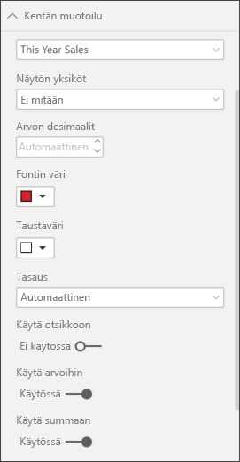
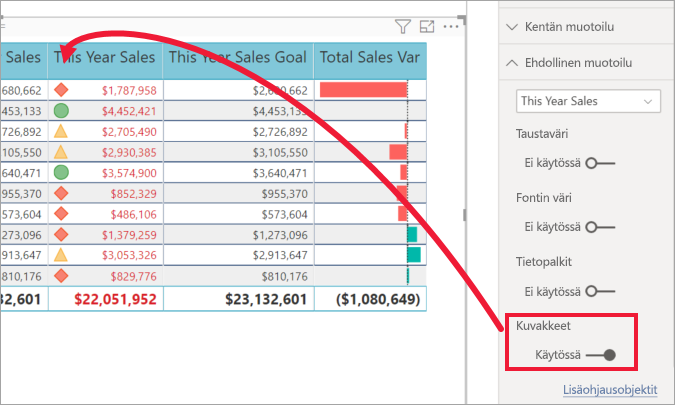

# Taulukot Power BI -raporteissa ja raporttinäkymissä

[!INCLUDE [power-bi-visuals-desktop-banner](../includes/power-bi-visuals-desktop-banner.md)]

Taulukko on ruudukko, joka sisältää tietoja järjestettynä loogiseen sarjaan rivejä ja sarakkeita. Se voi sisältää myös otsikkoja ja summarivin. Taulukot toimivat hyvin kvantitatiivisessa vertailussa, jossa tarkastellaan yhden luokan monia arvoja. Esimerkiksi tässä taulukossa näytetään **luokan** viisi eri mittaria.

Voit luoda taulukoita raporteissa ja ristiinkorostaa taulukon elementtejä muiden samalla raporttisivulla olevien visualisointien kanssa. Voit valita rivejä, sarakkeita ja jopa yksittäisiä soluja ristiinkorostettavaksi. Voit myös kopioida ja liittää yksittäisten ja useiden solujen valintoja muihin sovelluksiin.

## Milloin taulukkoa kannattaa käyttää?

Taulukko on hyvä vaihtoehto:

* yksityiskohtaisen tiedon ja tarkkojen arvojen selaamiseen ja vertailemiseen (visuaalisten esitysten sijaan).

* tietojen esittämiseen taulukkomuodossa.

* numeeristen tietojen luokiteltuun esittämiseen.

## Edellytys

Tässä opetusohjelmassa käytetään [Jälleenmyyntianalyysimallin PBIX-tiedostoa](https://download.microsoft.com/download/9/6/D/96DDC2FF-2568-491D-AAFA-AFDD6F763AE3/Retail%20Analysis%20Sample%20PBIX.pbix).

1. Valitse valikkorivin vasemmasta yläosasta **Tiedosto** > **Avaa**
   
2. **Jälleenmyyntianalyysimallin PBIX-tiedoston löytäminen**

1. Avaa **Jälleenmyyntianalyysimallin PBIX-tiedosto** raporttinäkymässä .

1. Valitse  uuden sivun lisäämiseksi.

## Luo taulukko

Luot artikkelin alussa kuvatun taulukon, jossa esitetään myyntiarvot nimikeluokan mukaisesti.

1. Valitse **Kentät**-ruudusta **Nimike** > **luokka**.

    Power BI luo automaattisesti taulukon, jossa luetellaan kaikki luokat.

    

1. Valitse **Myynti > Keskimääräinen yksikköhinta** ja **Myynti > Viime vuoden myynti**

1. Valitse sitten **Myynti > Tämän vuoden myynti** ja valitse kaikki kolme vaihtoehtoa: **Arvo**, **Tavoite** ja **Tila**.

1. Etsi **Visualisoinnit**-ruudusta **Arvot** ja valitse arvoja, kunnes kaavion sarakkeiden järjestys vastaa tämän sivun ensimmäistä kuvaa. Vedä arvot säilöön tarvittaessa. **Arvot**-säilö näyttää tältä.

    

## Taulukon muotoileminen

Taulukkoa voi muotoilla monella eri tavalla. Käsittelemme tässä artikkelissa niistä vain muutamia. Hyvä tapa oppia lisää muista muotoiluvaihtoehdoista on avata **Muotoilu**-ruutu (maalirullakuvake ) ja tutustua niihin.

* Kokeile taulukkoruudukon muotoilemista. Olet tässä lisännyt sinisen pystyruudukon, lisännyt riveihin tilaa, paksuntanut ääriviivaa ja kasvattanut tekstin kokoa.

    

    

* Vaihda sarakeotsikoiden taustaväriä, lisää ääriviiva ja kasvata tekstin kokoa.

    

    

* Voit myös käyttää muotoilua yksittäisissä sarakkeissa ja sarakeotsikoissa. Aloita laajentamalla **Kentän muotoilu** ja valitsemalla muotoiltava sarake avattavasta luettelosta. **Kentän muotoilun** avulla voit tehdä esimerkiksi seuraavia määrityksiä sarakearvojen mukaan: näyttöyksiköt, fontin väri, desimaalipaikkojen määrä, tausta, tasaus ja paljon muuta. Kun olet säätänyt asetukset, valitse, otetaanko ne käyttöön myös otsikossa ja summariveissä.

    

    

* Hieman lisämuokkausta ja tässä on lopullinen taulukkomme.

    

### Ehdollinen muotoilu

*Ehdollinen muotoilu* on yksi muotoilutyyppi. Power BI voi soveltaa ehdollista muotoilua mihin tahansa kenttään, jonka lisäsit **Visualisoinnit**-ruudun **Arvot**-säilöön.

Taulukoiden ehdollisen muotoilun avulla voit määrittää kuvakkeita, URL-osoitteita, solun taustavärejä ja fontin värejä soluarvojen perusteella. Voit käyttää myös liukuvärejä.

1. Avaa **Muotoile**-ruudussa **Ehdollinen muotoilu** -kortti.

    

1. Valitse muotoiltava kenttä ja ota **taustavärin** liukusäädin käyttöön. Power BI käyttää liukuväriä sarakkeen arvojen perusteella. Jos haluat muuttaa oletusvärejä, valitse **Lisäohjausobjektit**.

    Jos valitset **Erkautuva**-vaihtoehdon, voit määrittää myös valinnaisen **keskiarvon**.

    

    Käytetäänpä räätälöityä muotoilua Keskimääräisen nimikehintamme arvoihin. Valitse **Erkautuva**, lisää vähän väriä ja valitse **OK**.

    
1. Lisää taulukkoon uusi kenttä, jossa on sekä positiivisia että negatiivisia arvoja. Valitse **Myynti > Myyntivariaatio yhteensä**.

    

1. Lisää tietopalkin ehdollinen muotoilu ottamalla **Tietopalkit**-liukusäädin käyttöön.  

    

1. Jos haluat mukauttaa tietopalkkeja, valitse **Lisäohjausobjektit**. Määritä avautuvassa valintaikkunassa värit **positiiviselle palkille** ja **negatiiviselle palkille**, valitse **Näytä vain palkki** -vaihtoehto ja tee kaikki muut haluamasi muutokset.

    

1. Valitse **OK**.

    Tietopalkit korvaavat taulukon numeroarvot, mikä tekee siitä helpommin luettavan.

    

1. Lisää visuaalisia vihjeitä taulukkoosi *ehdollisten kuvakkeiden* avulla.  Valitse **Ehdollinen muotoilu** -kortissa **Tämän vuoden myynti** avattavasta valikosta. Ota **Kuvakkeet**-liukusäädin **käyttöön**.  Jos haluat mukauttaa kuvakkeita, valitse **Lisäohjausobjektit**.

    

## Arvojen kopiointi Power BI -taulukoista muissa sovelluksissa käytettäviksi

Matriisissa tai taulukossa voi olla sisältöä, jota haluat käyttää muissa sovelluksissa, kuten Dynamics CRM:ssä, Excelissä tai jopa muissa Power BI -raporteissa. Power BI:ssä voit hiiren kakkospainikkeella kopioida tiedot yhteen soluun tai valikoiman soluja leikepöydälle ja liittää ne toisiin sovelluksiin.

Kopioi yhden solun arvo seuraavasti:

1. Valitse kopioitava solu.

1. Napsauta solua hiiren kakkospainikkeella.

1. Valitse **Kopioi** > **Kopioi arvo**.

    

    Solun muotoilematon arvo on leikepöydällä, josta voit liittää sen toiseen sovellukseen.

Kopioi useampi kuin yksi solu seuraavasti:

1. Valitse solualue tai valitse **Ctrl**-näppäimellä yksi tai useampi solu.

1. Napsauta hiiren kakkospainikkeella yhden valitsemasi solun sisällä.

1. Valitse **Kopioi** > **Kopioi valinta**.

    

## Taulukon sarakeleveyden muuttaminen

Joskus Power BI katkaisee raportin tai näkymän sarakeotsikon. Voit näyttää sarakkeen koko nimen liikuttamalla hiiren osoitinta otsikon oikealla puolella nähdäksesi kaksoisnuolet, ja valitsemalla ja vetämällä.

## Huomioon otettavat seikat ja vianmääritys

* Sovellettaessa sarakemuotoilua voit valita vain yhden tasausvaihtoehdon saraketta kohti: **Automaattinen**, **vasen**, **keskitetty**, **oikea**. Yleensä sarake sisältää vain tekstiä tai numeroita eikä niiden yhdistelmiä. Jos sarake sisältää sekä numeroita että tekstiä, **Automaattinen** tasaa tekstin vasemmalle ja numerot oikealle. Tämä käyttäytyminen tukee kieliä, jotka luetaan vasemmalta oikealle.

* Jos taulukon solujen tai otsikoiden tekstitiedoissa on uusi rivi -merkkejä, nämä merkit ohitetaan, ellet vaihda tekstin rivitysasetusta elementin liittyvässä muotoiluruudun kortissa. 

## Seuraavat vaiheet

* [Puukartat Power BI:ssä](power-bi-visualization-treemaps.md)

* [Visualisointityypit Power BI:ssä](power-bi-visualization-types-for-reports-and-q-and-a.md)
