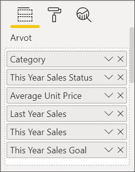
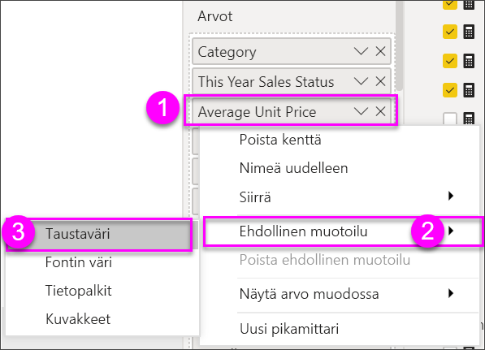
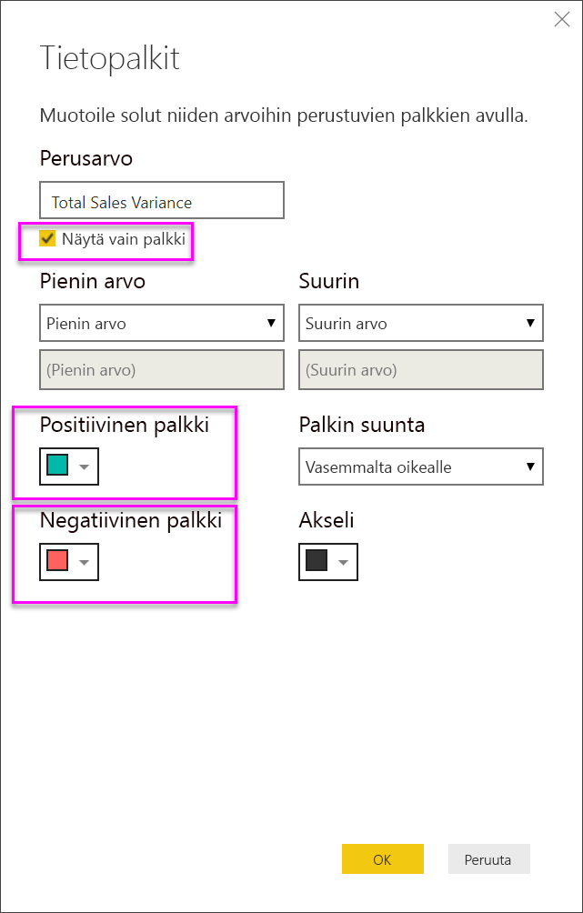

# Taulukot Power BI -raporteissa ja raporttinäkymissä
Taulukko on ruudukko, joka sisältää tietoja järjestettynä loogiseen sarjaan rivejä ja sarakkeita. Se voi sisältää myös otsikkoja ja summarivin. Taulukot toimivat hyvin kvantitatiivisessa vertailussa, jossa tarkastellaan moni arvoja tietystä kategoriasta. Esimerkiksi tässä taulukossa näkyvät **luokan** viisi eri mittayksikköä.

Voit luoda taulukoita raporteissa ja ristiinkorostaa taulukon elementtejä muiden samalla raporttisivulla olevien visualisointien kanssa.  Lisäksi voit valita rivejä, sarakkeita ja jopa yksittäisiä soluja ristiinkorostettavaksi. Yksittäisten ja useiden solujen valintoja voi kopioida ja liittää muihin sovelluksiin.

## Milloin taulukkoa kannattaa käyttää?
Taulukko on hyvä vaihtoehto:

* yksityiskohtaisen tiedon ja tarkkojen arvojen selaamiseen ja vertailemiseen (visuaalisten esitysmuotojen sijaan).
* tietojen esittämiseen taulukkomuodossa.
* numeeristen tietojen luokiteltuun esittämiseen.   

> [!NOTE]
> Jos taulukossa on liikaa arvoja, harkitse sen muuntamista matriisiksi ja/tai alirakenteen käyttämistä. Taulukko näyttää enintään 3 500 arvopistettä.

## Edellytykset
- Power BI -palvelu tai Power BI Desktop
- Jälleenmyyntianalyysimalli

## Luo taulukko
Luomme yllä esitetyn taulukon, jossa esitetään myyntiarvot nimikeluokan mukaisesti. Kirjaudu Power BI -palveluun (ei Desktopiin), jotta voit seurata ohjeita. Valitse **Nouda tiedot \> Mallit \> Jälleenmyyntianalyysimalli > Yhdistä** ja valitse **Koontinäyttö**. Visualisoinnin luominen edellyttää tietojoukon ja raportin muokkausoikeuksia. Kaikeksi onneksi Power BI -mallit ovat kaikki muokattavissa. Jos raportti on jaettu kanssasi, et pysty luomaan visualisointeja raporteissa.

1. Valitse vasemmasta siirtymisruudusta **Työtilat > Oma työtila**.    
2. Valitse Tietojoukot-välilehti ja vieritä alas juuri lisäämäsi Jälleenmyyntianalyysimallin tietojoukkoon.  Valitse **Raportin luominen** -kuvake.

    
2. Valitse raporttieditorissa **Nimike** > **luokka**.  Power BI luo automaattisesti taulukon, jossa luetellaan kaikki luokat.

    
3. Valitse **Myynti > Keskimääräinen nimikehinta** ja **Myynti > Viime vuoden myynti** ja **Myynti > Tämän vuoden myynti** ja valitse kaikki kolme vaihtoehtoa (Arvo, Tavoite ja Tila).   
4. Etsi Visualisoinnit-ruudussa **Arvot** ja vedä ja pudota niitä, kunnes kaavion sarakkeiden järjestys vastaa tämän sivun ensimmäistä kuvaa.  Arvojen tulee näyttää tältä.

    
5. Kiinnitä taulukko koontinäytölle valitsemalla Kiinnitä-kuvake.  

     

## Taulukon muotoileminen
Taulukkoa voi muotoilla erittäin monella tapaa, käsittelemme niistä tässä vain muutamia. Voit oppia lisää muista muotoilutavoista avaamalla Muotoilu-ruudun (maalitelakuvake ) ja tutkimalla.

* Kokeile taulukkoruudukon muotoilemista. Tässä olemme lisänneet sinisen pystyruudukon, lisänneet riveihin tilaa, paksuntaneet ääriviivaa ja kasvattaneet hieman tekstin kokoa.

    

    
* Vaihdoimme sarakeotsikoiden taustaväriä, lisäsimme ääriviivan ja kasvatimme tekstin kokoa. 

    

    

* Voit myös käyttää muotoilua yksittäisissä sarakkeissa ja sarakeotsikoissa. Aloita laajentamalla **Kentän muotoilu** ja valitsemalla muotoiltava sarake avattavasta luettelosta. Kentän muotoilun avulla voit tehdä esimerkiksi seuraavia määrityksiä sarakearvojen mukaan: näyttöyksiköt, fontin väri, desimaalipaikkojen määrä, tausta, tasaus ja paljon muuta. Kun olet säätänyt asetukset, valitse, otetaanko ne käyttöön myös otsikossa ja summariveissä.

    

* Hieman lisämuokkausta ja tässä on lopullinen taulukkomme. Koska muotoiluvaihtoehtoja on niin paljon, paras tapa oppia on aloittaa tavallisesta taulukosta, avata Muotoilu-ruutu  ja aloittaa tutustuminen. 

    

### Ehdollinen muotoilu
Yhdestä muotoilutyypistä käytetään nimitystä *ehdollinen muotoilu* ja sitä käytetään **arvojen** kenttiin Power BI -palvelun tai Desktopin **Visualisointi**-ruudussa. 

Taulukoiden ehdollisen muotoilun avulla voit määrittää mukautettuja solujen taustavärejä ja tekstin värejä solujen arvoihin perustuen. Voit käyttää myös liukuvärejä. 

1. Valitse alaspäin osoittava nuori Power BI -palvelun tai Desktopin **Visualisoinnit**-ruudussa sen **Arvon** vierestä, jota haluat muotoilla (tai napsauta kenttää hiiren kakkospainikkeella). Voit hallita kenttien ehdollista muotoilua ainoastaan **Kenttien** **Arvot**-alueella.

    
2. Valitse **Taustaväriasteikot**. Voit valita avautuvassa valintaikkunassa värin sekä *Vähimmäis-* ja *Enimmäis*-arvot. Jos valitset **Erkautuva**-valinnan, voit määritellä myös valinnaisen *Keski*arvon.

    

    Käytetäänpä räätälöityä muotoilua Keskimääräisen nimikehintamme arvoihin. Valitse **Erkautuva**, lisää vähän väriä ja paina **OK**. 

    
3. Lisää taulukkoon uusi kenttä, jossa on sekä positiivisia että negatiivisia arvoja.  Valitse **Myynti > Myyntivariaatio yhteensä**. 

    
4. Valitse tietopalkin ehdollinen muotoilu painamalla **Myyntivariaatio yhteensä** -kohdan vieressä olevaa alaspäin osoittavaa nuolta ja valitsemalla **Ehdollinen muotoilu > Tietopalkit**.

    
5. Määritä avautuvassa valintaikkunassa värit **positiiviselle palkille**, **negatiiviselle palkille**, lisää valinta kohtaan **Näytä vain palkki** ja tehdä muita haluamiasi muutoksia.

    

    Kun valitset **OK**, tietopalkit korvaavat taulukon numeroarvot, mikä tekee siitä helpommin luettavan.

    
6. Jos haluat poistaa ehdollisen muotoilun visualisoinnista, napsauta vain kenttää uudelleen hiiren kakkospainikkeella ja valitse **Poista ehdollinen muotoilu**.

> [!TIP]
> Ehdollinen muotoilu on käytettävissä myös Muotoilu-ruudusta (maalirullakuvake). Valitse muokattava arvo ja aseta sitten **Väriasteikko**- tai **Tietopalkki**-arvoksi **Käytössä**, jolloin käytetään oletusasetuksia. Jos haluat mukauttaa asetuksia, valitse **Lisäasetukset**.
> 
## Arvojen kopiointi Power BI -taulukoista muissa sovelluksissa käytettäviksi

Matriisissa tai taulukossa voi olla sisältöä, jota haluat käyttää muissa sovelluksissa, kuten Dynamics CRM:ssä, Excelissä tai jopa muissa Power BI -raporteissa. Power BI:ssä voit hiiren kakkospainikkeella kopioida solun tai valikoiman soluja leikepöydälle ja liittää toiseen sovellukseen.

* Kopioi yksittäisen solun arvo valitsemalla solu, napsauttamalla hiiren kakkospainiketta ja valitsemalla **Kopioi arvo**. Solun muotoilematon arvo on nyt leikepöydällä, josta voit liittää sen toiseen sovellukseen.

    

* Jos haluat kopioida useita soluja, valitse solualue tai useita soluja yhdessä Ctrl-näppäimen kanssa. Kopio sisältää sarakkeiden ja rivien otsikot.

    

    Kopio sisältää sarakkeiden ja rivien otsikot.

    

## Taulukon sarakeleveyden muuttaminen
Joskus Power BI katkaisee raportin tai näkymän sarakeotsikon. Nähdäksesi sarakkeen koko nimen, pidä hiirtä otsikon oikealla puolella nähdäksesi kaksoisnuolet, valitse ja vedä.

## Huomioon otettavat seikat ja vianmääritys
* Sovellettaessa sarakemuotoilua voit valita vain yhden tasausvaihtoehdon saraketta kohti: automaattinen, vasen, keskitetty, oikea. Yleensä sarake sisältää vain tekstiä tai numeroita eikä niiden yhdistelmiä. Jos sarake sisältää sekä numeroita että tekstiä, **Automaattinen** tasaa tekstin vasemmalle ja numerot oikealle. Tämä tukee kieliä, joita luetaan vasemmalta oikealle.   

## Seuraavat vaiheet

[Puukartat Power BI:ssä](power-bi-visualization-treemaps.md)

[Visualisointityypit Power BI:ssä](power-bi-visualization-types-for-reports-and-q-and-a.md)