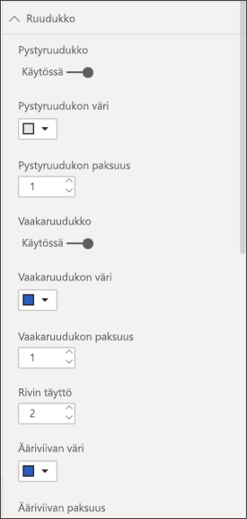

# Taulukot Power BI -raporteissa ja raporttinäkymissä

Taulukko on ruudukko, joka sisältää tietoja järjestettynä loogiseen sarjaan rivejä ja sarakkeita. Se voi sisältää myös otsikkoja ja summarivin. Taulukot toimivat hyvin kvantitatiivisessa vertailussa, jossa tarkastellaan yhden luokan monia arvoja. Esimerkiksi tässä taulukossa näytetään **luokan** viisi eri mittaria.

Voit luoda taulukoita raporteissa ja ristiinkorostaa taulukon elementtejä muiden samalla raporttisivulla olevien visualisointien kanssa. Voit valita rivejä, sarakkeita ja jopa yksittäisiä soluja ristiinkorostettavaksi. Voit myös kopioida ja liittää yksittäisten ja useiden solujen valintoja muihin sovelluksiin.

## Milloin taulukkoa kannattaa käyttää?

Taulukko on hyvä vaihtoehto:

* yksityiskohtaisen tiedon ja tarkkojen arvojen selaamiseen ja vertailemiseen (visuaalisten esitysten sijaan).

* tietojen esittämiseen taulukkomuodossa.

* numeeristen tietojen luokiteltuun esittämiseen.

## Edellytykset

* Power BI -palvelu tai Power BI Desktop

* Jälleenmyyntianalyysimallin raportti

## Jälleenmyyntianalyysimallin raportin hankkiminen

Näissä ohjeissa käytetään jälleenmyyntianalyysimallia. Visualisoinnin luominen edellyttää tietojoukon ja raportin muokkausoikeuksia. Kaikeksi onneksi Power BI -mallit ovat kaikki muokattavissa. Jos joku jakaa raportin kanssasi, et voi luoda visualisointeja raporteissa. Voit seurata mukana hankkimalla [jälleenmyyntianalyysimallin raportin](../sample-datasets.md).

Kun olet hankkinut **jälleenmyyntianalyysimallin** tietojoukon, voit aloittaa.

## Luo taulukko

Luot artikkelin alussa kuvatun taulukon, jossa esitetään myyntiarvot nimikeluokan mukaisesti.

1. Valitse **Oma työtila** -kohdasta **Tietojoukot** > **Luo raportti**.

    

1. Valitse **Kentät**-ruudusta **Nimike** > **luokka**.

    Power BI luo automaattisesti taulukon, jossa luetellaan kaikki luokat.

    

1. Valitse **Myynti > Keskimääräinen yksikköhinta** ja **Myynti > Viime vuoden myynti**

1. Valitse sitten **Myynti > Tämän vuoden myynti** ja valitse kaikki kolme vaihtoehtoa: **Arvo**, **Tavoite** ja **Tila**.

1. Etsi **Visualisoinnit**-ruudusta **Arvot**, ja vedä ja pudota niitä, kunnes kaavion sarakkeiden järjestys vastaa tämän sivun ensimmäistä kuvaa. **Arvot**-säilö näyttää tältä.

    

1. Kiinnitä taulukko koontinäytölle valitsemalla Kiinnitä-kuvake.  visualisoinnin oikeassa yläkulmassa.

## Taulukon muotoileminen

Taulukkoa voi muotoilla monella eri tavalla. Käsittelemme tässä artikkelissa niistä vain muutamia. Hyvä tapa oppia lisää muista muotoiluvaihtoehdoista on avata **Muotoilu**-ruutu (maalirullakuvake ) ja tutustua niihin.

* Kokeile taulukkoruudukon muotoilemista. Olet tässä lisännyt sinisen pystyruudukon, lisännyt riveihin tilaa, paksuntanut ääriviivaa ja kasvattanut tekstin kokoa.

    

    

* Vaihda sarakeotsikoiden taustaväriä, lisää ääriviiva ja kasvata tekstin kokoa.

    

    

* Voit myös käyttää muotoilua yksittäisissä sarakkeissa ja sarakeotsikoissa. Aloita laajentamalla **Kentän muotoilu** ja valitsemalla muotoiltava sarake avattavasta luettelosta. **Kentän muotoilun** avulla voit tehdä esimerkiksi seuraavia määrityksiä sarakearvojen mukaan: näyttöyksiköt, fontin väri, desimaalipaikkojen määrä, tausta, tasaus ja paljon muuta. Kun olet säätänyt asetukset, valitse, otetaanko ne käyttöön myös otsikossa ja summariveissä.

    

    

* Hieman lisämuokkausta ja tässä on lopullinen taulukkomme.

    

### Ehdollinen muotoilu

*Ehdollinen muotoilu* on yksi muotoilutyyppi. Power BI soveltaa kenttien ehdollista muotoilua **Visualisoinnit**-ruudun **Arvot**-säilöön.

Taulukoiden ehdollisen muotoilun avulla voit määrittää mukautettuja solujen taustavärejä ja tekstin värejä solujen arvoihin perustuen. Voit käyttää myös liukuvärejä.

1. Valitse **Visualisoinnit**-ruudussa **Kentät**-kuvake.

1. Valitse alaspäin osoittava nuoli sen **Arvot**-säilön vierestä, jota haluat muotoilla (tai napsauta kenttää hiiren kakkospainikkeella).

    > [!NOTE]
    > Voit hallita kenttien ehdollista muotoilua ainoastaan **Kenttien** **Arvot**-alueella.

    

1. Valitse **Taustaväri**.

1. Voit määrittää avautuvassa valintaikkunassa värin sekä **vähimmäisarvon** ja **enimmäisarvon**. Jos valitset **Erkautuva**-vaihtoehdon, voit määrittää myös valinnaisen **keskiarvon**.

    

    Käytetäänpä räätälöityä muotoilua Keskimääräisen nimikehintamme arvoihin. Valitse **Erkautuva**, lisää vähän väriä ja valitse **OK**.

    
1. Lisää taulukkoon uusi kenttä, jossa on sekä positiivisia että negatiivisia arvoja. Valitse **Myynti > Myyntivariaatio yhteensä**.

    

1. Valitse tietopalkin ehdollinen muotoilu painamalla **Myyntivariaatio yhteensä** -kohdan vieressä olevaa alaspäin osoittavaa nuolta ja valitsemalla **Ehdollinen muotoilu > Tietopalkit**.

    

1. Määritä avautuvassa valintaikkunassa värit **positiiviselle palkille** ja **negatiiviselle palkille**, valitse **Näytä vain palkki** -vaihtoehto ja tee kaikki muut haluamasi muutokset.

    

1. Valitse **OK**.

    Tietopalkit korvaavat taulukon numeroarvot, mikä tekee siitä helpommin luettavan.

    

Jos haluat poistaa ehdollisen muotoilun visualisoinnista, napsauta kenttää uudelleen hiiren kakkospainikkeella ja valitse **Poista ehdollinen muotoilu**.

> [!TIP]
> Ehdollinen muotoilu on käytettävissä myös **Muotoilu**-ruudusta. Valitse muokattava arvo ja aseta sitten **Väriasteikko**- tai **Tietopalkki**-arvoksi **Käytössä**, jolloin käytetään oletusasetuksia. Jos haluat mukauttaa asetuksia, valitse **Lisäasetukset**.

## Arvojen kopiointi Power BI -taulukoista muissa sovelluksissa käytettäviksi

Matriisissa tai taulukossa voi olla sisältöä, jota haluat käyttää muissa sovelluksissa, kuten Dynamics CRM:ssä, Excelissä tai jopa muissa Power BI -raporteissa. Power BI:ssä voit hiiren kakkospainikkeella kopioida tiedot yhteen soluun tai valikoiman soluja leikepöydälle ja liittää ne toisiin sovelluksiin.

Kopioi yhden solun arvo seuraavasti:

1. Valitse kopioitava solu.

1. Napsauta solua hiiren kakkospainikkeella.

1. Valitse **Kopioi** > **Kopioi arvo**.

    

    Solun muotoilematon arvo on leikepöydällä, josta voit liittää sen toiseen sovellukseen.

Kopioi useampi kuin yksi solu seuraavasti:

1. Valitse solualue tai valitse **Ctrl**-näppäimellä yksi tai useampi solu.

1. Napsauta hiiren kakkospainikkeella yhden valitsemasi solun sisällä.

1. Valitse **Kopioi** > **Kopioi valinta**.

    

    Kopio sisältää sarakkeiden ja rivien otsikot.

    

## Taulukon sarakeleveyden muuttaminen

Joskus Power BI katkaisee raportin tai näkymän sarakeotsikon. Voit näyttää sarakkeen koko nimen liikuttamalla hiiren osoitinta otsikon oikealla puolella nähdäksesi kaksoisnuolet, ja valitsemalla ja vetämällä.

## Huomioon otettavat seikat ja vianmääritys

Sovellettaessa sarakemuotoilua voit valita vain yhden tasausvaihtoehdon saraketta kohti: **Automaattinen**, **vasen**, **keskitetty**, **oikea**. Yleensä sarake sisältää vain tekstiä tai numeroita eikä niiden yhdistelmiä. Jos sarake sisältää sekä numeroita että tekstiä, **Automaattinen** tasaa tekstin vasemmalle ja numerot oikealle. Tämä käyttäytyminen tukee kieliä, jotka luetaan vasemmalta oikealle.

## Seuraavat vaiheet

* [Puukartat Power BI:ssä](power-bi-visualization-treemaps.md)

* [Visualisointityypit Power BI:ssä](power-bi-visualization-types-for-reports-and-q-and-a.md)
