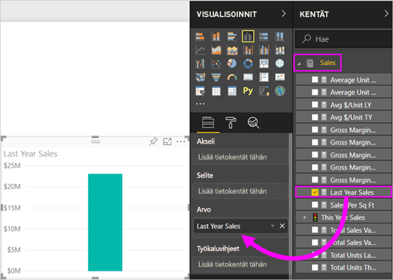
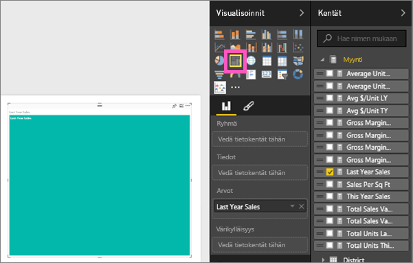
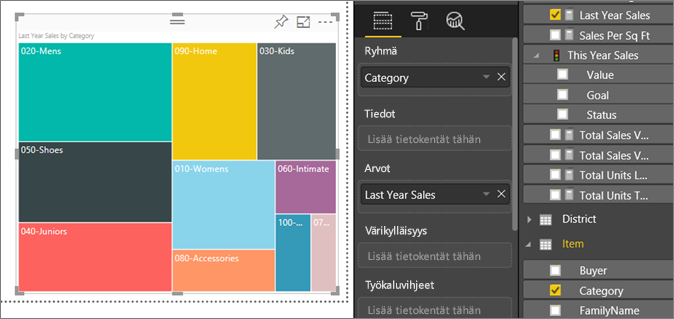
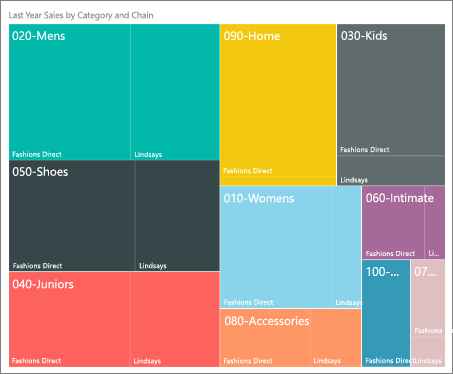
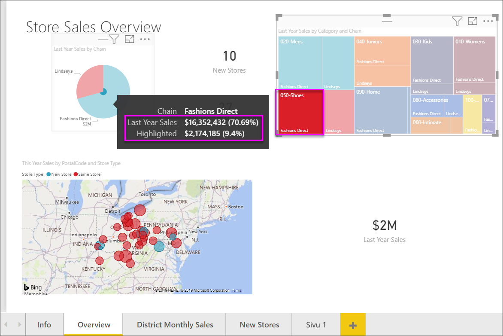

# Puukartat Power BI:ssä
Puukartoissa hierarkkiset tiedot näytetään sisäkkäisten suorakulmioiden joukkona.  Hierarkian kukin taso on edustettuna värillisenä suorakulmiona (jota kutsutaan usein ”haaraksi”), joka sisältää muita suorakulmioita (”lehtiä”).  Kunkin suorakulmion sisällä oleva suorakulmio perustuu mitattavaan arvoon. Suorakulmiot järjestetään koon mukaan vasemmasta yläkulmasta (suurin) oikeaan alakulmaan (pienin).

Jos esimerkiksi analysoin yritykseni myyntilukuja, voin valita näytettäviksi ylätason suorakulmioita *(haaroja)* vaatetuskategorioille: **Kaupunki**, **Maaseutu**, **Nuoriso** ja **Sekalaiset**.  Luokkia kuvastavat suorakulmat ositetaan luokkiin kuuluvien vaatevalmistajien mukaan pienemmiksi suorakulmioiksi, joita kutsutaan myös *lehdiksi*. Näiden pienempien suorakulmioiden koko ja väri perustuu myyntimääriin.  

Yllä olevan **Kaupunki**-luokan vaatteista `Maximus`-tyyppisiä myytiin paljon hyvin, `Natura`- ja `Fama`-tyyppisiä vähemmän, ja `Leo`-tyyppisiä heikoimmin.  Näiden perusteella **Kaupunki**-puukartallani on seuraavat ominaisuudet:
* suurin suorakulmio (`Maximus`) vasemmassa yläkulmassa
* pienempiä suorakulmioita (`Natura` ja `Fama`)
* paljon muita suorakulmioita, jotka vastaavat muita myytyjä vaatteita, ja 
* yksi hyvin pieni suorakulmio (`Leo`).  

Voin tällöin myös verrata myytyjen tuotteiden määrää kaikkien muiden vaateluokkien osalta vertaamalla kunkin lehtisolmun kokoa ja väriä: mitä suurempi suorakulmio ja mitä tummempi sävy, sitä korkeampi arvo.

## Milloin puukarttaa kannattaa käyttää?
Puukartat ovat hyvä vaihtoehto seuraaville:

* kun halutaan näyttää suuria määriä hierarkkisia tietoja.
* kun palkkikaaviolla ei voida tehokkaasti käsitellä suuria määriä arvoja.
* kun halutaan näyttää kunkin osan väliset ja koko kokonaisuuden mittasuhteet.
* kun halutaan näyttää mittayksikön jakautuminen kuviona kussakin hierarkian luokkatasossa.
* kun halutaan näyttää määritteet käyttämällä kokovertailua ja värikoodausta.
* kun halutaan, että kuviot, poikkeavat arvot, tärkeimmät tekijät ja poikkeukset erottuvat selvästi.

### Edellytykset
 - Power BI -palvelu tai Power BI Desktop
 - Jälleenmyyntianalyysimalli

## Peruspuukartan luominen
Haluatko ensin seurata, kun joku luo puukartan?  Siirry videossa kohtaan 2:10, niin näet, kun Amanda luo puukartan.

<iframe width="560" height="315" src="https://www.youtube.com/embed/IkJda4O7oGs" frameborder="0" allowfullscreen></iframe>

Tai luo oma puukarttasi. Näissä ohjeissa käytetään jälleenmyyntianalyysimallia. Kirjaudu Power BI -palveluun (ei Desktopiin), jotta voit seurata ohjeita. Valitse **Nouda tiedot \> Mallit \> Jälleenmyyntianalyysimalli > Yhdistä\> ja valitse \>Koontinäyttö**. Visualisoinnin luominen raporttiin edellyttää tietojoukon ja raportin muokkausoikeuksia. Onneksi Power BI -mallit ovat muokattavia. Et voi kuitenkaan lisätä visualisointeja raporttiin, jonka joku toinen on jakanut kanssasi.  

1. Avaa Jälleenmyyntianalyysimallin raportti valitsemalla koontinäytössä ”Myymälöitä yhteensä” -ruutu.    
2. Avaa [Muokkausnäkymä](../service-interact-with-a-report-in-editing-view.md) ja valitse **Myynti** > **Viime vuoden myynti** -mittayksikkö.   
      
3. Muuta kaavio puukartaksi.  
      
4. Vedä **Kohde** > **Luokka** **Ryhmä**-kohtaan. Power BI luo puukartan, jossa suorakulmioiden koko kuvastaa kokonaismyyntiä ja väri edustaa luokkaa.  Olet periaatteessa luonut hierarkian, joka kuvaa visuaalisesti kokonaismyynnin suhteellista kokoa luokittain.  **Miehet**-luokassa myynti on suurinta ja **Sukkatuotteet**-luokassa se on alhaisinta.   
      
5. Vedä **Kauppa** > **Ketju** **Tiedot**-kohtaan puukartan viimeistelemiseksi. Nyt voit verrata viime vuoden myyntiä luokan ja ketjun mukaan.   
   
   
   > [!NOTE]
   > Värikylläisyyttä ja Tietoja ei voi käyttää samanaikaisesti.
   > 
   > 
5. Pidä osoitinta **Ketju**-alueen päällä, jolloin saat esiin työkaluvihjeen, joka koskee **Luokan** kyseistä osaa.  Jos esimerkiksi viet hiiren **Fashions Direct** -kohtaan **090-Home** -suorakulmiossa, näet Fashion Directin Koti-luokkaa vastaavan työkaluvihjeen.  
   
6. [Lisää puukartta koontinäytön ruutuna (kiinnitä visualisointi)](../service-dashboard-tiles.md). 
7. [Tallenna raportti](../service-report-save.md).

## Korostaminen ja ristiinsuodatus
Lisätietoja Suodattimet-paneelin käyttämisestä saat ohjeaiheesta [Suodattimen lisääminen raporttiin](../power-bi-report-add-filter.md).

Luokan tai Tietojen korostaminen puukartassa ristiinkorostaa ja ristiinsuodattaa muut raporttisivulla olevat visualisoinnit... ja päinvastoin. Jotta voit seurata ohjeita, lisää tälle raporttisivulle visualisointeja tai kopioi puukartta tämän raportin jollekin muulle ei-tyhjälle sivulle.

1. Valitse puukartasta Luokka tai Ketju Luokan sisältä.  Se ristiinkorostaa muut sivulla olevat visualisoinnit. Valitsemalla esimerkiksi **050-Kengät**, näen, että edellisen vuoden kenkämyynti oli 3 640 471 dollaria, josta 2 174 185 dollaria tuli Fashions Directistä.  
   

2. Jos **Viime vuoden myynti ketjun mukaan** -ympyräkaaviossa valitaan **Fashions Direct** -sektori, tämä ristiinsuodattaa puukartan.  
       

3. Jos haluat määrittää, miten visualisoinnit ristiinkorostavat ja -suodattavat toisiaan, katso [visualisointien vuorovaikutukset Power BI -raportissa](../service-reports-visual-interactions.md)

## Seuraavat vaiheet

[Vesiputouskaaviot Power BI:ssä](power-bi-visualization-waterfall-charts.md)

[Visualisointityypit Power BI:ssä](power-bi-visualization-types-for-reports-and-q-and-a.md)