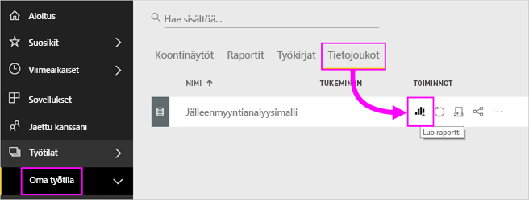

# Puukartat Power BI:ssä

Puukartoissa hierarkkiset tiedot näytetään sisäkkäisten suorakulmioiden joukkona. Hierarkian kukin taso on edustettuna värillisenä suorakulmiona (haara), joka sisältää muita pienempiä suorakulmioita (lehtiä). Power BI määrittää kunkin suorakulmion sisällä olevan koon mitatun arvon mukaan. Suorakulmiot järjestetään koon mukaan vasemmasta yläkulmasta (suurin) oikeaan alakulmaan (pienin).

Esimerkiksi jos analysoit myyntiäsi, sinulla saattaa olla ylimmän tason haaroja vaatetusluokille: **Kaupunki**, **Maaseutu**, **Nuoriso** ja **Sekalaiset**. Power BI jakaa luokan suorakulmiot lehdiksi tässä luokassa oleville vaatteiden valmistajille. Näiden lehtien koko ja väri perustuu myyntimääriin.

Yllä olevassa **Kaupunki**-haarassa myytiin paljon **VanArsdel**-vaatteita. **Natura**- ja **Fama**-vaatteita myytiin vähemmän. **Leo**-vaatteita myytiin vain muutama. Näiden perusteella puukartan **Kaupunki**-haaralla on seuraavat ominaisuudet:

* Suurin suorakulmio **VanArsdel**-vaatteille vasemmassa yläkulmassa

* Hieman pienempiä suorakulmioita **Natura**- ja **Fama**-vaatteille.

* Paljon muita suorakulmioita kaikille muille myydyille vaatteille.

* Hyvin pieni suorakulmio **Leo**-vaatteille.

Voin myös verrata myytyjen tuotteiden määrää kaikkien muiden vaateluokkien osalta vertaamalla kunkin lehtisolmun kokoa ja väriä: mitä suurempi suorakulmio ja mitä tummempi sävy, sitä korkeampi arvo.

Haluatko ensin seurata, kun joku luo puukartan? Siirry videossa kohtaan 2:10, niin näet, kun Amanda luo puukartan.

<iframe width="560" height="315" src="https://www.youtube.com/embed/IkJda4O7oGs" frameborder="0" allowfullscreen></iframe>

## Milloin puukarttaa kannattaa käyttää?

Puukartat ovat hyvä vaihtoehto seuraaville:

* kun halutaan näyttää suuria määriä hierarkkisia tietoja

* kun palkkikaaviolla ei voida tehokkaasti käsitellä suuria määriä arvoja

* kun halutaan näyttää kunkin osan väliset ja koko kokonaisuuden mittasuhteet

* kun halutaan näyttää mittarin jakautuminen kuviona kussakin hierarkian luokkatasossa

* kun halutaan näyttää määritteet kokovertailun ja värikoodauksen avulla

* kun halutaan kuvioiden, poikkeavien arvojen, tärkeimpien tekijöiden ja poikkeusten erottuvan selvästi.

## Edellytykset

* Power BI -palvelu tai Power BI Desktop

* Jälleenmyyntianalyysimallin raportti

## Jälleenmyyntianalyysimallin raportin hankkiminen

Näissä ohjeissa käytetään jälleenmyyntianalyysimallia. Visualisoinnin luominen edellyttää tietojoukon ja raportin muokkausoikeuksia. Kaikeksi onneksi Power BI -mallit ovat kaikki muokattavissa. Jos joku jakaa raportin kanssasi, et voi luoda visualisointeja raporteissa. Voit seurata mukana hankkimalla [jälleenmyyntianalyysimallin raportin](../sample-datasets.md).

Kun olet hankkinut **jälleenmyyntianalyysimallin** tietojoukon, voit aloittaa.

## Peruspuukartan luominen

Luot raportin ja lisäät perustason puukartan.

1. Valitse **Oma työtila** -kohdasta **Tietojoukot** > **Luo raportti**.

    

1. Valitse **Kentät**-ruudusta **Myynti** > **Viime vuoden myynti** -mittari

   

1. Valitse puukartan kuvake  kaavion muuntamiseksi puukartaksi.

   

1. Vedä **Kohde** > **Luokka** **Ryhmä**-kohtaan.

    Power BI luo puukartan, jossa suorakulmioiden koko kuvastaa kokonaismyyntiä ja väri edustaa luokkaa. Olet periaatteessa luonut hierarkian, joka kuvaa visuaalisesti kokonaismyynnin suhteellista kokoa luokittain. **Miehet**-luokassa myynti on suurinta ja **Sukkatuotteet**-luokassa se on alhaisinta.

    

1. Vedä **Kauppa** > **Ketju** **Tiedot**-kohtaan puukartan viimeistelemiseksi. Nyt voit verrata viime vuoden myyntiä luokan ja ketjun mukaan.

   

   > [!NOTE]
   > Värikylläisyyttä ja Tietoja ei voi käyttää samanaikaisesti.

1. Pidä osoitinta **Ketju**-alueen päällä, jolloin saat esiin työkaluvihjeen, joka koskee **Luokan** kyseistä osaa.

    Jos esimerkiksi viet hiiren **Fashions Direct** -kohtaan **090-Home** -suorakulmiossa, näet Fashion Directin Koti-luokkaa vastaavan työkaluvihjeen.

   

1. Lisää puukartta [koontinäytön ruutuna (kiinnitä visualisointi)](../service-dashboard-tiles.md).

1. Tallenna [raportti](../service-report-save.md).

## Korostaminen ja ristiinsuodatus

Lisätietoja **Suodattimet**-ruudun käyttämisestä saat artikkelista [Lisää suodatin raporttiin](../power-bi-report-add-filter.md).

**Luokan** tai **Tietojen** korostaminen puukartassa ristiinkorostaa ja ristiinsuodattaa muut raporttisivulla olevat visualisoinnit ja päinvastoin. Jotta voit seurata mukana, lisää tälle raporttisivulle visualisointeja tai kopioi puukartta tämän raportin jollekin muulle sivulle.

1. Valitse puukartasta **Luokka** tai **Ketju** **Luokan** sisältä. Se ristiinkorostaa muut sivulla olevat visualisoinnit. Valitsemalla esimerkiksi **050-Kengät**, näet, että edellisen vuoden kenkämyynti oli **3 640 471 dollaria**, josta **2 174 185 dollaria** tuli **Fashions Directistä**.

   

1. Jos **Viime vuoden myynti ketjun mukaan** -ympyräkaaviossa valitaan **Fashions Direct** -sektori, tämä ristiinsuodattaa puukartan.
   

1. Jos haluat hallita, miten visualisoinnit ristiinkorostavat ja -suodattavat toisiaan, katso artikkelia [Muuta visualisointien vuorovaikutusta Power BI -raportissa](../service-reports-visual-interactions.md)

## Seuraavat vaiheet

* [Vesiputouskaaviot Power BI:ssä](power-bi-visualization-waterfall-charts.md)

* [Visualisointityypit Power BI:ssä](power-bi-visualization-types-for-reports-and-q-and-a.md)
