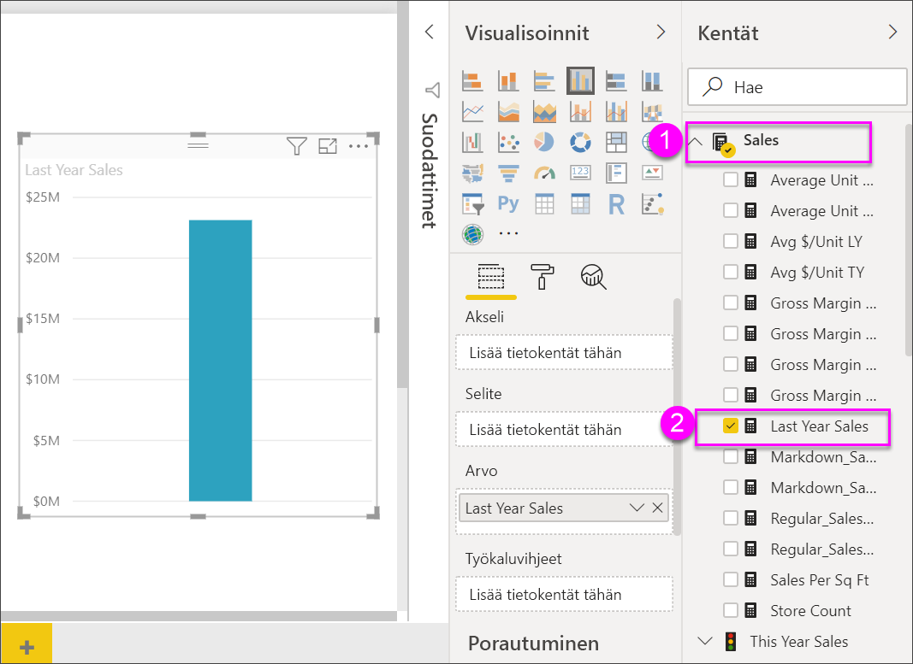

# Puukartat Power BI:ssä

[!INCLUDE[consumer-appliesto-nyyn](../includes/consumer-appliesto-nyyn.md)]

[!INCLUDE [power-bi-visuals-desktop-banner](../includes/power-bi-visuals-desktop-banner.md)]

Puukartoissa hierarkkiset tiedot näytetään sisäkkäisten suorakulmioiden joukkona. Hierarkian kukin taso on edustettuna värillisenä suorakulmiona (haara), joka sisältää muita pienempiä suorakulmioita (lehtiä). Power BI määrittää kunkin suorakulmion sisällä olevan koon mitatun arvon mukaan. Suorakulmiot järjestetään koon mukaan vasemmasta yläkulmasta (suurin) oikeaan alakulmaan (pienin).

Esimerkiksi jos analysoit myyntiäsi, sinulla saattaa olla ylimmän tason haaroja vaatetusluokille: **Kaupunki**, **Maaseutu**, **Nuoriso** ja **Sekalaiset**. Power BI jakaa luokan suorakulmiot lehdiksi tässä luokassa oleville vaatteiden valmistajille. Näiden lehtien koko ja väri perustuu myyntimääriin.

Yllä olevassa **Kaupunki**-haarassa myytiin paljon **VanArsdel**-vaatteita. **Natura**- ja **Fama**-vaatteita myytiin vähemmän. **Leo**-vaatteita myytiin vain muutama. Näiden perusteella puukartan **Kaupunki**-haaralla on seuraavat ominaisuudet:

* Suurin suorakulmio **VanArsdel**-vaatteille vasemmassa yläkulmassa

* Hieman pienempiä suorakulmioita **Natura**- ja **Fama**-vaatteille.

* Paljon muita suorakulmioita kaikille muille myydyille vaatteille.

* Hyvin pieni suorakulmio **Leo**-vaatteille.

Voin myös verrata myytyjen tuotteiden määrää kaikkien muiden vaateluokkien osalta vertaamalla kunkin lehtisolmun kokoa ja väriä: mitä suurempi suorakulmio ja mitä tummempi sävy, sitä korkeampi arvo.

## Milloin puukarttaa kannattaa käyttää?

Puukartat ovat hyvä vaihtoehto seuraaville:

* kun halutaan näyttää suuria määriä hierarkkisia tietoja

* kun palkkikaaviolla ei voida tehokkaasti käsitellä suuria määriä arvoja

* kun halutaan näyttää kunkin osan väliset ja koko kokonaisuuden mittasuhteet

* kun halutaan näyttää mittarin jakautuminen kuviona kussakin hierarkian luokkatasossa

* kun halutaan näyttää määritteet kokovertailun ja värikoodauksen avulla

* kun halutaan kuvioiden, poikkeavien arvojen, tärkeimpien tekijöiden ja poikkeusten erottuvan selvästi.

## Edellytys

Tässä opetusohjelmassa käytetään [Jälleenmyyntianalyysimallin PBIX-tiedostoa](https://download.microsoft.com/download/9/6/D/96DDC2FF-2568-491D-AAFA-AFDD6F763AE3/Retail%20Analysis%20Sample%20PBIX.pbix).

1. Valitse valikkorivin vasemmasta yläosasta **Tiedosto** > **Avaa**
   
2. **Jälleenmyyntianalyysimallin PBIX-tiedoston löytäminen**

1. Avaa **Jälleenmyyntianalyysimallin PBIX-tiedosto** raporttinäkymässä .

1. Valitse  uuden sivun lisäämiseksi.

> [!NOTE]
> Raportin jakaminen työtoverin kanssa Power BI:ssä edellyttää, että teillä kummallakin on oma Power BI Pro -käyttöoikeus tai että raportti on tallennettu Premium-kapasiteettiin.    

Kun olet hankkinut **jälleenmyyntianalyysimallin** tietojoukon, voit aloittaa.

## Peruspuukartan luominen

Luot raportin ja lisäät perustason puukartan.

1. Valitse **Kentät**-ruudusta **Myynti** > **Viime vuoden myynti** -mittari

   

1. Valitse puukartan kuvake  kaavion muuntamiseksi puukartaksi.

   

1. Valitse **Kohde** > **Luokka**, jolloin **Luokka** lisätään **Ryhmä**-säilöön.

    Power BI luo puukartan, jossa suorakulmioiden koko kuvastaa kokonaismyyntiä ja väri edustaa luokkaa. Olet periaatteessa luonut hierarkian, joka kuvaa visuaalisesti kokonaismyynnin suhteellista kokoa luokittain. **Miehet**-luokassa myynti on suurinta ja **Sukkatuotteet**-luokassa se on alhaisinta.

    

1. Valitse **Kauppa** > **Ketju**, jolloin **Ketju** lisätään **Tiedot**-säilöön. Nyt voit verrata viime vuoden myyntiä luokan ja ketjun mukaan.

   

   > [!NOTE]
   > Värikylläisyyttä ja Tietoja ei voi käyttää samanaikaisesti.

1. Pidä osoitinta **Ketju**-alueen päällä, jolloin saat esiin työkaluvihjeen, joka koskee **Luokan** kyseistä osaa.

    Jos esimerkiksi viet hiiren **Fashions Direct** -kohtaan **090-Home** -suorakulmiossa, näet Fashion Directin Koti-luokkaa vastaavan työkaluvihjeen.

   

## Korostaminen ja ristiinsuodatus

**Luokka**- tai **Tiedot**-kohdan korostaminen puukartassa ristiinkorostaa ja ristiinsuodattaa muut raporttisivulla olevat visualisoinnit. Jotta voit seurata mukana, lisää tälle raporttisivulle visualisointeja tai kopioi puukartta tämän raportin jollekin muulle sivulle. Alla oleva puukartan kuva kopioitiin **Yleiskatsaus**-sivulle. 

1. Valitse puukartasta **Luokka** tai **Ketju** **Luokan** sisältä. Se ristiinkorostaa muut sivulla olevat visualisoinnit. Valitsemalla esimerkiksi **050-Kengät**, näet, että edellisen vuoden kenkämyynti oli **16 352 432 dollaria**, josta **2 174 185 dollaria** tuli **Fashions Directistä**.

   

1. Jos **Viime vuoden myynti ketjun mukaan** -ympyräkaaviossa valitaan **Fashions Direct** -sektori, tämä ristiinsuodattaa puukartan.
   

1. Jos haluat hallita, miten visualisoinnit ristiinkorostavat ja -suodattavat toisiaan, katso artikkelia [Muuta visualisointien vuorovaikutusta Power BI -raportissa](../service-reports-visual-interactions.md)

## Seuraavat vaiheet

* [Vesiputouskaaviot Power BI:ssä](power-bi-visualization-waterfall-charts.md)

* [Visualisointityypit Power BI:ssä](power-bi-visualization-types-for-reports-and-q-and-a.md)
