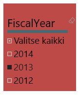

# Visualisointityypit Power BI:ssä
## Visualisoinnit Power BI:ssä
Lisäämme uusia visualisointeja, pysy kuulolla!

Tutustu [Microsoft AppSourceen](https://appsource.microsoft.com/marketplace/apps?product=power-bi-visuals) , josta löydät kasvavan luettelon [mukautetuista visualisoinneista](../power-bi-custom-visuals.md), joita voit ladata ja käyttää omissa raporttinäkymissä ja raporteissa. Oletko luova henkilö? [Lue, miten voit luoda ja lisätä omia visualisointeja tähän yhteisösivustoon](../developer/office-store.md).  

## Luettelo visualisoinneista, jotka ovat käytettävissä Power BI:ssa
Kaikki nämä visualisoinnit voidaan lisätä Power BI-raportteihin, jotka on määritetty Q&A:ssa ja kiinnitetty raporttinäkymään.

### Aluekaaviot: Perus (kerrostettu) ja pinottu

>[!TIP]
>Perusaluekaavio perustuu viivakaavioon, jonka alue on akselin ja täytetyn viivan välillä.

Lisätietoja on artikkelissa [Perusaluekaavio](power-bi-visualization-basic-area-chart.md).

### Palkki- ja pylväskaaviot

 

>[!TIP]
>Palkkikaaviot ovat vakiomuotoisia katseltaessa tiettyä arvoa eri luokkien välillä.

### Kortit: Moniriviset

### Kortit: Yksittäinen luku

Lisätietoja on kohdassa [Kortin luominen (ison numeron ruutu)](power-bi-visualization-card.md).

### Yhdistelmäkaaviot

>[!TIP]
>Yhdistelmäkaavio yhdistää pylväskaavion ja viivakaavion. Vaihtoehtoja ovat seuraavat: *viivakaavio ja pinottu pylväskaavio* sekä *viivakaavio ja lohkopylväskaavio*.

Lisätietoja on artikkelissa [Power BI -yhdistelmäkaaviot](power-bi-visualization-combo-chart.md).

### Rengaskaaviot

>[!TIP]
>Rengaskaaviot muistuttavat ympyräkaavioita.  Ne näyttävät osien suhteen kokonaisuuteen.

Lisätietoja on artikkelissa [Power BI -rengaskaaviot](power-bi-visualization-doughnut-charts.md).

### Suppilokaavio

>[!TIP]
>Suppilokaaviot auttavat visualisoimaan prosessia, jossa on vaiheita ja tietoyksikön työnkulku peräkkäin yhdestä vaiheesta seuraavaan.  Käytä suppilokaaviota, kun vaiheiden välillä on peräkkäinen työnkulu, kuten myyntiprosessi, joka alkaa llideistä ja päättyy ostoon.

Lisätietoja on artikkelissa [Power BI -suppilokaaviot](power-bi-visualization-funnel-charts.md).

### Mittarikaaviot

>[!TIP]
>Näyttää nykyisen tilan tavoitteen kontekstissa.

Lisätietoja on artikkelissa [Power BI -mittarikaaviot](power-bi-visualization-radial-gauge-charts.md).

<!-- ### Key influencers chart

A key influencer chart displays the major contributors to a selected result or value. -->

### Suorituskyvyn mittarit

>[!TIP]
>Näyttää mitattavissa olevan tavoitteen edistymisen.

Lisätietoja on artikkelissa [Power BI:n suorituskyvyn mittarit](power-bi-visualization-kpi.md).

### Viivakaaviot

>[!TIP]
>Korostaa koko arvosarjan yleistä muotoa yleensä ajan kuluessa.

### Kartat: Peruskartat

>[!TIP]
>Käytetään sekä luokiteltuun että kvantitatiiviseen tietoon, joilla on paikkatietojen sijainnit.

Lisätietoja on artikkelissa [Vihjeitä ja vinkkejä kartan visualisointeja varten](power-bi-map-tips-and-tricks.md).

### Kartat: ArcGIS-kartat

Lisätietoja on artikkelissa [Power BI:n ArcGIS-kartat](power-bi-visualization-arcgis.md).

### Kartat: Täytetyt kartat (Choropleth)

>[!TIP]
>Mitä voimakkaampi väri, sitä suurempi arvo.

Lisätietoja on artikkelissa [Täytetyt kartat Power BI:ssä](power-bi-visualization-filled-maps-choropleths.md).

### Kartat: Muotokartat

>[!TIP]
>Vertaa alueita värin mukaan.

Lisätietoja on artikkelissa [Muotokartat Power BI:ssä](desktop-shape-map.md).

### Matrix

Lisätietoja on artikkelissa [Matriisivisualisoinnit Power BI:ssä](desktop-matrix-visual.md).

### Ympyräkaaviot

Ympyräkaaviot näyttävät osien suhteen kokonaisuuteen. 

### Nauhakaavio

Nauhakaaviot näyttävät, millä tietoluokalla on paras sijoitus (suurin arvo). Nauhakaaviot esittävät luokkamuutoksen tehokkaasti, koska korkein sija (suurin arvo) näkyy aina ylimpänä kullakin ajanjaksolla.

### Piste- ja kuplakaaviot

>[!TIP]
>Näyttävät suhteen kahden (pistekaavio) tai kolmen (kuplakaavio) määrällisen mitan välillä, onko niitä, missä järjestyksessä jne.

Lisätietoja on artikkelissa [Power BI -pistekaaviot](power-bi-visualization-scatter.md).

### Suuren tiheyden pistekaavio

>[!TIP]
>Liian moni arvopiste voi vaikeuttaa visualisoinnin tulkintaa, minkä vuoksi visualisoinnin tarkkuus varmistetaan kehittyneillä näytteenottoalgoritmeilla.

Lisätietoja on artikkelissa [Suuren tiheyden pistekaaviot Power BI:ssä](desktop-high-density-scatter-charts.md).

### Osittajat

Lisätietoja on artikkelissa [Power BI:n osittajat](power-bi-visualization-slicers.md).

### Erilliset kuvat

Lisätietoja on artikkelissa [Lisää kuvan pienoissovellus raporttinäkymään](../service-dashboard-add-widget.md).

### Taulukot

>[!TIP]
>Toimivat hyvin kvantitatiivisessa kohteiden välisessä vertailussa, jos luokkia on paljon.

Lisätietoja on artikkelissa [Power BI:n taulukoiden käsitteleminen](power-bi-visualization-tables.md).

### Puukartat

Lisätietoja on artikkelissa [Puukartat Power BI:ssä](power-bi-visualization-treemaps.md).

>[!TIP]
>Kyseessä ovat värilliset suorakulmiot, joiden koko vastaa arvoa.  Ne voivat olla hierarkkisia, suorakulmiot sisäkkäin pääsuorakulmioissa.

### Vesiputouskaaviot

>[!TIP]
>Vesiputouskaaviot näyttävät juoksevan summan, kun arvoja lisätään tai vähennetään.

Lisätietoja on artikkelissa [Power BI -vesiputouskaaviot](power-bi-visualization-waterfall-charts.md).

## Kerro Q&A:llen minkä visualisoinnin haluat
Power BI Q&A:lla kirjoitettaessa kyselyjä luonnollisella kielellä voit määrittää visualisointityypin kyselyssäsi.  Esimerkki:

”***myynti osavaltioittain puukarttana***”

## Seuraavat vaiheet
[Visualisoinnit Power BI -raporteissa](power-bi-report-visualizations.md)    
[Oikealla oleva visuaalinen viite osoitteesta sqlbi.com](http://www.sqlbi.com/wp-content/uploads/videotrainings/dashboarddesign/visuals-reference-may2017-A3.pdf)