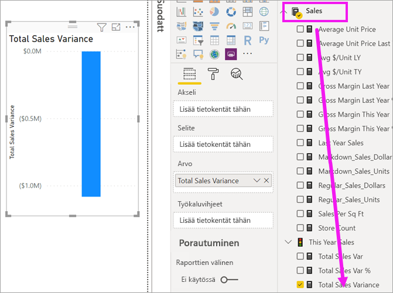
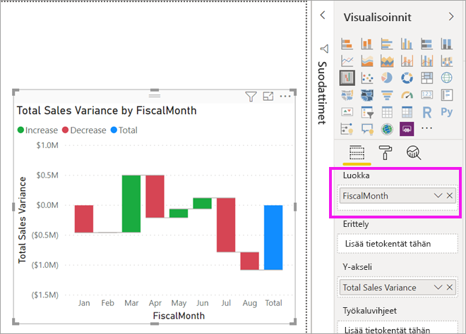
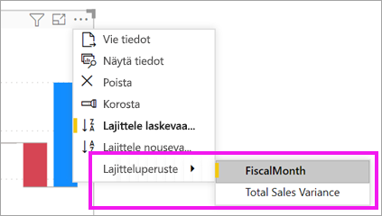
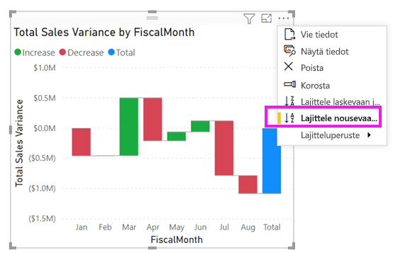
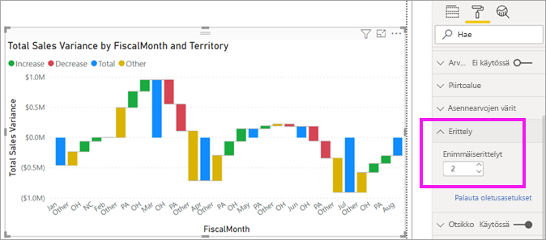

# Vesiputouskaaviot Power BI:ssä

[!INCLUDE[consumer-appliesto-nyyn](../includes/consumer-appliesto-nyyn.md)]

[!INCLUDE [power-bi-visuals-desktop-banner](../includes/power-bi-visuals-desktop-banner.md)]

Vesiputouskaaviot näyttävät juoksevan kokonaissumman, kun Power BI lisää ja vähentää arvoja. Ne ovat hyödyllisiä sen ymmärtämiseksi, miten positiivisten ja negatiivisten muutosten sarja vaikuttaa alkuarvoon (kuten nettotuloon).

Sarakkeet ovat värikoodattuja, joten huomaat nopeasti nousut ja laskut. Alkuarvon ja lopullisen arvon sarakkeet usein [alkavat vaaka-akselilla](https://support.office.com/article/Create-a-waterfall-chart-in-Office-2016-for-Windows-8de1ece4-ff21-4d37-acd7-546f5527f185#BKMK_Float "aloita vaaka-akselilla"), kun taas keskitason arvot ovat irrallisia sarakkeita. Tämän tyylin vuoksi vesiputouskaavioita kutsutaan myös siltakaavioiksi.

## Milloin kannattaa käyttää vesiputouskaaviota

Vesiputouskaavio on hyvä vaihtoehto:

* kun olet tehnyt muutoksia mittarin aikasarjaan tai eri luokkiin

* jos haluat valvoa tärkeimpiä kokonaisarvoon vaikuttavia muutoksia

* jos haluat tehdä kaavion yrityksen vuosittaisesta tuotosta näyttämällä eri tulonlähteitä ja lopulta kokonaisvoiton (tai tappion)

* jos haluat havainnollistaa yrityksen alku- ja lopetushenkilöstömäärää vuoden aikana

* jos haluat visualisoida, kuinka paljon rahaa ansaitset ja käytät joka kuukausi sekä tilin juoksevan saldon.

## Edellytys

Tässä opetusohjelmassa käytetään [Jälleenmyyntianalyysimallin PBIX-tiedostoa](https://download.microsoft.com/download/9/6/D/96DDC2FF-2568-491D-AAFA-AFDD6F763AE3/Retail%20Analysis%20Sample%20PBIX.pbix).

1. Valitse valikkorivin vasemmasta yläosasta **Tiedosto** > **Avaa**
   
2. **Jälleenmyyntianalyysimallin PBIX-tiedoston löytäminen**

1. Avaa **Jälleenmyyntianalyysimallin PBIX-tiedosto** raporttinäkymässä .

1. Valitse  uuden sivun lisäämiseksi.

> [!NOTE]
> Raportin jakaminen työtoverin kanssa Power BI:ssä edellyttää, että teillä kummallakin on oma Power BI Pro -käyttöoikeus tai että raportti on tallennettu Premium-kapasiteettiin.    

## Vesiputouskaavion luominen

Luot vesiputouskaavion, joka näyttää myynnin vaihtelun (arvioitu myynti vs. todellinen myynti) kuukauden mukaan.

### Rakenna vesiputouskaavio

1. Valitse **Kentät**-ruudussa **Myynti**  > **Myyntivariaatio yhteensä**.

   

1. Valitse Vesiputous-kuvake 

    

1. Valitse **Aika** > **FiscalMonth** sen lisäämiseksi **Luokka**-säilöön.

    

### Vesiputouskaavion lajittelu

1. Varmista, että Power BI lajittelee vesiputouskaavion kuukausittain. Valitse kaavion oikeasta yläkulmasta **Enemmän vaihtoehtoja** (...).

    Valitse tässä esimerkissä **Lajitteluperuste** ja valitse **FiscalMonth**. Valintasi vieressä näkyvä keltainen merkkivalo ilmaisee, kun valinta-asetusta käytetään.

    
    
    Jos haluat näyttää kuukaudet kronologisessa järjestyksessä, valitse **Lajittele nousevaan järjestykseen**. Tarkista, että keltainen ilmaisin näkyy **Lajittele nousevaan järjestykseen** -vaihtoehdon vieressä vasemmalla. Tämä ilmaisee, että valitsemasi asetus on käytössä.

    

    

    Huomaa, että kaaviosi lajitellaan tammikuusta elokuuhun FiscalMonth-kohteelle.  

### Vesiputouskaavion tarkastelu

Tarkastele hieman enemmän nähdäksesi, mikä aiheuttaa eniten muutoksia kuukausittain.

1.  Valitse **Myymälä** > **Alue**, jolloin**Alue** lisätään **Erittely**-säilöön.

    

    Power BI käyttää **Erittely** arvoa lisätietojen lisäämiseen visualisointiin. Power BI lisää viisi suurinta osallistujaa nousuun tai laskuun tilikuukauden mukaan. Tämä tarkoittaa sitä, että esimerkiksi helmikuussa on nyt kuusi arvopistettä vain yhden sijaan.  

    

    Olet esimerkiksi kiinnostunut vain kahdesta suurimmasta osallistujasta.

1. Valitse **Muotoilu**-ruudussa **Erittely** ja määritä **Suurimmat erittelyt** arvoksi **2**.

    

    Lyhyestä katsauksesta käy ilmi, että Ohion ja Pennsylvanian alueet ovat vesiputouskaavion suurimmat osallistujat sekä negatiivisessa että positiivisessa liikkeessä.

    

## Seuraavat vaiheet

* [Visualisointien vuorovaikutuksen muuttaminen Power BI -raportissa](../service-reports-visual-interactions.md)

* [Visualisointityypit Power BI:ssä](power-bi-visualization-types-for-reports-and-q-and-a.md)
