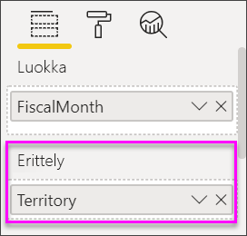

# Vesiputouskaaviot Power BI:ssä

Vesiputouskaaviot näyttävät juoksevan kokonaissumman, kun Power BI lisää ja vähentää arvoja. Ne ovat hyödyllisiä sen ymmärtämiseksi, miten positiivisten ja negatiivisten muutosten sarja vaikuttaa alkuarvoon (kuten nettotuloon).

Sarakkeet ovat värikoodattuja, joten huomaat nopeasti nousut ja laskut. Alkuarvon ja lopullisen arvon sarakkeet usein [alkavat vaaka-akselilla](https://support.office.com/article/Create-a-waterfall-chart-in-Office-2016-for-Windows-8de1ece4-ff21-4d37-acd7-546f5527f185#BKMK_Float "alkavat vaaka-akselilla"), kun taas keskitason arvot ovat irrallisia sarakkeita. Tämän tyylin vuoksi vesiputouskaavioita kutsutaan myös siltakaavioiksi.

<iframe width="560" height="315" src="https://www.youtube.com/embed/qKRZPBnaUXM" frameborder="0" allow="autoplay; encrypted-media" allowfullscreen></iframe>

## Milloin kannattaa käyttää vesiputouskaaviota

Vesiputouskaavio on hyvä vaihtoehto:

* kun olet tehnyt muutoksia mittarin aikasarjaan tai eri luokkiin

* jos haluat valvoa tärkeimpiä kokonaisarvoon vaikuttavia muutoksia

* jos haluat tehdä kaavion yrityksen vuosittaisesta tuotosta näyttämällä eri tulonlähteitä ja lopulta kokonaisvoiton (tai tappion)

* jos haluat havainnollistaa yrityksen alku- ja lopetushenkilöstömäärää vuoden aikana

* jos haluat visualisoida, kuinka paljon rahaa ansaitset ja käytät joka kuukausi sekä tilin juoksevan saldon.

## Edellytykset

* Power BI -palvelu tai Power BI Desktop

* Jälleenmyyntianalyysimallin raportti

## Jälleenmyyntianalyysimallin raportin hankkiminen

Näissä ohjeissa käytetään jälleenmyyntianalyysimallia. Visualisoinnin luominen edellyttää tietojoukon ja raportin muokkausoikeuksia. Kaikeksi onneksi Power BI -mallit ovat kaikki muokattavissa. Jos joku jakaa raportin kanssasi, et voi luoda visualisointeja raporteissa. Voit seurata mukana hankkimalla [jälleenmyyntianalyysimallin raportin](../sample-datasets.md).

Kun olet hankkinut **jälleenmyyntianalyysimallin** tietojoukon, voit aloittaa.

## Vesiputouskaavion luominen

Luot vesiputouskaavion, joka näyttää myynnin vaihtelun (arvioitu myynti vs. todellinen myynti) kuukauden mukaan.

1. Valitse **Oma työtila** -kohdasta **Tietojoukot** > **Luo raportti**.

    

1. Valitse **Kentät**-ruudussa **Myynti**  > **Myyntivariaatio yhteensä**.

   

1. Valitse Vesiputous-kuvake  kaavion muuntamiseksi puukartaksi.

    Jos **Myyntivariaatio yhteensä** ei ole **Y-akselin** alueella, vedä se sinne.

    

1. Valitse **Aika** > **FiscalMonth** sen lisäämiseksi **Luokka**-säilöön.

    

1. Varmista, että Power BI lajitteli vesiputouskaavion aikajärjestyksessä. Valitse kaavion oikeassa yläkulmassa olevat kolme pistettä (...).

    Tarkista, että keltainen ilmaisin on **Lajittele nousevaan järjestykseen**- ja **FiscalMonth**-vaihtoehtojen vieressä vasemmalla

    

    Voit myös tarkastella X-akselin arvoja ja näet, että ne ovat järjestyksessä **tammikuusta** **elokuuhun**.

    Tarkastele hieman enemmän nähdäksesi, mikä aiheuttaa eniten muutoksia kuukausittain.

1. Vedä **Myymälä** > **Alue** ja **Erittely**-säilöön.

    

    Oletusarvon mukaan Power BI lisää viisi suurinta osallistujaa nousuun tai laskuun kuukauden mukaan.

    

    Olet kiinnostunut vain kahdesta suurimmasta osallistujasta.

1. Valitse **Muotoilu**-ruudussa **Erittely** ja määritä **Suurimmat erittelyt** arvoksi **2**.

    

    Lyhyestä katsauksesta käy ilmi, että Ohion ja Pennsylvanian alueet ovat vesiputouskaavion suurimmat osallistujat sekä negatiivisessa että positiivisessa liikkeessä.

    

    Tämä on mielenkiintoinen havainto. Onko Ohion ja Pennsylvanian vaikutus niin merkittävä, koska myynti näillä kahdella alueella on paljon muita alueita suurempaa? Voit tarkistaa asian.

1. Luo kartta, jossa myynti näytetään alueen mukaan tänä vuonna ja viime vuonna.

    

    Kartta tukee teoriaasi. Se näyttää, että näillä kahdella alueella oli suurin myyntiarvo viime vuonna (kuplan koko) ja tänä vuonna (kuplan varjostus).

## Korostaminen ja ristiinsuodatus

Lisätietoja **Suodattimet**-ruudun käytöstä on artikkelissa [Lisää suodatin raporttiin muokkausnäkymässä](../power-bi-report-add-filter.md).

Sarakkeen korostaminen vesiputouskaaviossa ristiinsuodattaa muut raporttisivulla olevat visualisoinnit ja päinvastoin. **Summa**sarake ei kuitenkaan käynnistä korostusta tai vastaa ristiinsuodatukseen.

## Seuraavat vaiheet

* [Visualisointien vuorovaikutuksen muuttaminen Power BI -raportissa](../service-reports-visual-interactions.md)

* [Visualisointityypit Power BI:ssä](power-bi-visualization-types-for-reports-and-q-and-a.md)
