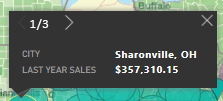
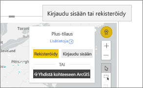

# ArcGIS-karttojen käsittely Power BI:ssä
Tämä ohjeaihe on kirjoitettu sellaisen henkilön näkökulmasta, joka käyttää ArcGIS-karttaa Power BI -palvelussa, Desktopissa tai mobiililaitteessa. Kun suunnittelija jakaa ArcGIS Map for Power BI -visualisoinnin kanssasi, voit käyttää visualisointia monin eri tavoin.  Jos haluat lisätietoa ArcGIS-karttojen luomisesta, katso [opetusohjelma Esrin ArcGIS-kartoista](../visuals/power-bi-visualization-arcgis.md).

ArcGIS-kartat ja Power BI yhdessä tekevät kartoista muutakin kuin vain esitettäviä pisteitä. Raporttien suunnittelijat aloittavat kartasta ja yhdistävät siihen demografisia tietoja sisältäviä tasoja. Näiden sijaintipohjaisten tietokerrosten (kuten laskentatietojen) yhdistäminen sijaintikohtaista analyysiä sisältäviin karttoihin mahdollistaa visualisoinnin tietojen ymmärtämisen syvemmin.

> [!TIP]
> GIS tarkoittaa maantieteellistä tietojärjestelmää (Geographic Information System).
> 

Tämä ArcGIS Map for Power BI -visualisointi esittää viime vuoden myynnin kaupungeittain. Siinä käytetään pohjana tiekarttaa ja siihen liitetty myös kerroksena kotitalouksien keskitulotiedot. Kartassa on kaksi nastaa (punainen ja keltainen) sekä yksi ajoajan säde (violetti).

> [!TIP]
> Katso esimerkkejä ja lue käyttäjien kokemuksia [Esrin Power BI -sivulta](https://www.esri.com/powerbi). Katso myös Esrin ohjeartikkeli [ArcGIS Maps for Power BI:n käytön aloitus](https://doc.arcgis.com/en/maps-for-powerbi/get-started/about-maps-for-power-bi.htm).
> 
> 

## Käyttäjän suostumus

Kun työtoveri jakaa sinulle ensimmäisen kerran ArcGIS-kartan, Power BI näyttää sinulle suostumuskehotteen. ArcGIS Maps for Power BI on Esrin (https://www.esri.com) ) tarjoama palvelu, ja käyttäessäsi ArcGIS Maps for Power BI:tä sinua koskevat Esrin käyttöehdot ja tietosuojakäytäntö. Power BI -käyttäjien, jotka haluavat käyttää ArcGIS Maps for Power BI -visualisointeja, on ilmaistava suostumuksensa valintaikkunassa.

## Tasojen ymmärtäminen

ArcGIS Map for Power BI -visualisoinnissa voi olla useita eri tasoja demografisille sijaintitiedoille.

### Pohjakartat

Jokainen ArcGIS Map for Power BI -visualisointi alkaa pohjakartasta. Pohjakartat ovat ikään kuin tietojen pohjia. Pohjakartta voi olla tavallinen tumma tai vaalea pohja

 

tai pohja, jolla on katu- ja liikennetietoja. 

  

Pohjakartta peittää koko pohjan: kun panoroit ja zoomaat, kartta päivittyy. Lähentämällä näkymää näet tarkempia katu- ja liikennetietoja. Kun siirryt panoroimalla mantereelta toiselle, yksityiskohtien taso pysyy samana. Tässä siirryimme panoroimalla Portosta Pekingiin.

  

### Viittauskerrokset

Raportin *suunnittelija* voi lisätä yhden viittauskerroksen. Viittauskerrokset ovat Esrin isännöimiä. Ne tarjoavat lisäkerroksen demografisia tietoja sijainnista. Alla olevassa esimerkissä on väestötiheyden viittauskerros. Mitä tummempi väri, sitä suurempi tiheys.

  

### Infograafit

Raportin *suunnittelija* voi lisätä useita infograafikerroksia. Infograafit ovat nopeita visuaalisia ilmaisimia, jotka näytetään visuaalisen pohjan oikealla puolella. Infograafit ovat Esrin isännöimiä. Ne tarjoavat lisäkerroksen demografisia tietoja sijainnista. Alla olevassa esimerkissä on käytössä kolme infograafia. Niitä ei näytetä itse kartassa, vaan korteissa. Infograafikortit päivittyvät, kun zoomaat, panoroit ja valitset alueita kartalla.

  

### Nastat

Nastat edustavat tarkkoja sijainteja, esimerkiksi kaupunkia tai osoitetta. Joskus raporttien *suunnittelijat* käyttävät nastoja, joissa on ajoaikasäde. Tässä esimerkissä näytetään myymälät, jotka ovat 50 mailin säteellä Pohjois-Carolinan Charlottesta.

 

## Vuorovaikutus ArcGIS Maps for Power BI -visualisoinnin kanssa
Käytettävissäsi olevat toiminnot riippuvat siitä, miten raportti jaettiin kanssasi, ja Power BI -tilityypistäsi. Jos sinulla on kysyttävää, ota yhteyttä järjestelmänvalvojaasi. ArcGIS Maps for Power BI -visualisoinnit toimivat pitkälti samalla tavalla kuin muutkin raportin visualisoinnit. Voit [tarkastella visualisoinnin luomiseen käytettyjä tietoja](../consumer/end-user-show-data.md), tarkastella karttaa [tarkastelutilassa ja koko näytön tilassa](../consumer/end-user-focus.md), [lisätä kommentteja](../consumer/end-user-comment.md), [käyttää suodattimia](../consumer/end-user-report-filter.md), jotka raportin *suunnittelija* on määrittänyt, ja niin edelleen. ArcGIS-visualisoinnit voivat ristiinsuodattaa muita raporttisivun visualisointeja (ja toisinpäin).

Näet työkaluvihjeitä siirtämällä hiiren osoittimen pohjakartan sijaintien kohdalle (esimerkiksi kuplan kohdalle). ArcGIS-visualisoinnin valintatyökaluilla voit näyttää myös lisää työkaluvihjeitä sekä tehdä tiettyjä valintoja pohjakartalla tai viittauskerroksessa.  

### Valintatyökalut

ArcGIS Maps for Power BI:ssä on viisi valintatilaa. Voit valita enintään 250 arvopistettä kerrallaan.

#### Yksittäinen valinta -työkalu

 

Valitse arvopiste, kupla, nasta tai yksittäinen arvopiste viittauskerroksesta. Power BI näyttää työkaluvihjeen, joka sisältää tietoja valinnastasi. Yksittäinen valinta ristiinsuodattaa muut raporttisivun visualisoinnit valintasi perusteella sekä päivittää valitun alueen infograafikortit. 

Tässä olemme valinneet pohjakartalta ruskean kupla-arvopisteen. Power BI
- korostaa valinnan,
- näyttää työkaluvihjeen tälle arvopisteelle, 
- päivittää infograafikortit näyttämään tietoja vain valinnastamme ja
- ristiinkorostaa pylväskaavion.

Jos kartassa on viittauskerros, sijaintien valitseminen näyttää tietoja työkaluvihjeessä. Tässä olemme valinneet Senecan piirikunnan. Näemme tietoja raportin *suunnittelijan* karttaan lisäämän viittauskerroksen tiedoista (väestöntiheys). Tässä esimerkissä arvopisteemme sisältää kaksi piirikuntaa, joten työkaluvihjeessä on kaksi sivua. Kummallakin niistä on kaavio. Saat näkyviin lisätietoja valitsemalla pylvään kaaviosta. 

> [!TIP]
  > Joskus voit vähentää työkaluvihjesivujen määrää lähentämällä näkymän tiettyyn sijaintiin.  Jos et lähennä, sijainnit saattavat näkyä päällekkäin, jolloin Power BI näyttää sinulle samanaikaisesti useita työkaluvihjeitä. Voit siirtyä työkaluvihjeestä toiseen käyttämällä nuolikuvakkeita.
  > 
  > 

#### Valitse useita -työkalu

 

Piirrä suorakulmio kartalle ja valitse siihen sisältyvät arvopisteet. CTRL-näppäimen avulla voit valita useita suorakulmioita. Valitse useita ristiinkorostaa muut raporttisivun visualisoinnit valintasi perusteella sekä päivittää valitun alueen infograafikortit.

 

#### Viittauskerrostyökalu

 

Voit käyttää rajauksia tai monikulmioita viittauskerroksissa ja valita siten sisäpuolelle jäävät arvopisteet. Sitä on vaikea nähdä, mutta viittauskerroksessa on keltainen ääriviiva. Toisin kuin Yksittäinen valinta -työkalussa, emme saa työkaluvihjettä. Saamme sen sijaan tietoja arvopisteistä, jotka ovat ääriviivan sisällä. Tässä esimerkissä valintamme sisältää arvopisteen: se on Lindseys-kaupan arvopiste Winston Salemissa.

 

#### Puskurityökalu

 

Tällä voit valita arvopisteitä puskuritason avulla. Tällä työkalulla voit esimerkiksi valita ajomatkasäteen ja jatkaa raportin muiden osien käyttöä. Ajomatkasäde pysyy aktiivisena ja infograafikortit näyttävät edelleen ajomatkasäteen, mutta kartan muiden arvopisteiden valitseminen ristiinsuodattaa raporttisivun muut visualisoinnit.

 

#### Etsi vastaava -työkalu

 

Tällä voit etsiä sijainteja, joilla on samankaltaisia ominaisuuksia. Aloita valitsemalla vähintään yksi kiinnostava piste tai viitesijainti ja määritä sitten jopa viisi dimensiota, joita haluat käyttää analyysissä. Etsi vastaavat -työkalu laskee sitten kartalta 10 sijaintia, jotka ovat eniten samankaltaisia kuin määrittämäsi viitesijainnit. Infograafikorttien avulla saat sitten lisätietoja kunkin tuloksen demografisista ominaisuuksista. Niiden avulla voit myös luoda ajoaika-alueita, joista saat kuvan ajomatkasta kuhunkin niistä. Etsi vastaavat -työkalulla voit myös suodattaa raporttiasi ja löytää siitä uusia näkökulmia. Mikä tärkeintä, kaikki laskutoimitukset tehdään paikallisesti koneessasi, joten voit olla varma siitä, että tiedot pysyvät turvassa.

## Huomioitavat asiat ja rajoitukset
ArcGIS Maps for Power BI on saatavilla seuraavissa palveluissa ja sovelluksissa:

|Palvelu/sovellus  |Käytettävyys  |
|---------|---------|
|Power BI Desktop     |     Kyllä    |
|Power BI -palvelu (app.powerbi.com)     |    Kyllä     |
|Power BI -mobiilisovellukset     |  Kyllä      |
|Power BI:n julkaise verkkoon -toiminto     |  Ei       |
|Power BI Embedded     |     Ei    |
|Upottaminen Power BI -palveluun (PowerBI.com)  | Ei |

## Miten ArcGIS Maps ja Power BI toimivat yhdessä?
ArcGIS Maps for Power BI on Esrin (https://www.esri.com) ) toimittama. ArcGIS Maps for Power BI:n käyttöön sovelletaan Esrin [käyttöehtoja](https://go.microsoft.com/fwlink/?LinkID=8263222) ja [tietosuojakäytäntöä](https://go.microsoft.com/fwlink/?LinkID=826323). Power BI -käyttäjien, jotka haluavat käyttää ArcGIS Maps for Power BI -visualisointeja, on ilmaistava suostumuksensa valintaikkunassa (ks. Käyttäjän suostumus -kohta).  Esrin ArcGIS Maps for Power BI:n käyttöön sovelletaan Esrin käyttöehtoja ja tietosuojakäytäntöä, joihin on linkki suostumuksen valintaikkunassa. Kunkin käyttäjän on ilmaistava suostumuksensa ennen ArcGIS Maps for Power BI:n ensimmäistä käyttökertaa. Kun käyttäjä antaa suostumuksensa, visualisointiin sidotut tiedot lähetetään Esrin palveluihin, joissa niihin lisätään vähintään sijaintitiedot. Tämä tarkoittaa sijaintitietojen muuntamista pituus- ja leveyspiireiksi, jotka voidaan esittää kartalla. Voit olettaa, että kaikki visualisointeihin sidotut tiedot voidaan lähettää Esrin palveluihin. Esri tarjoaa mm. pohjakarttojen, paikkatietojen analyysin ja sijaintitietojen lisäämisen tapaisia palveluita. ArcGIS Maps for Power BI:n visualisoinnit toimivat yhdessä näiden palvelujen kanssa Esrin tarjoaman ja ylläpitämän suojatun SSL-sertifioidun yhteyden avulla. Lisätietoja ArcGIS Maps for Power BI:stä on tarjolla Esrin [ArcGIS Maps for Power BI -tuotesivulla](https://www.esri.com/powerbi).

### Power BI Plus

Kun käyttäjä tilaa Plus-version Esrin ArcGIS Maps for Power BI:n kautta tarjoaman tilauksen kautta, käyttäjän ja Esrin välillä on suora suhde. Power BI ei lähetä käyttäjän henkilökohtaisia tietoja Esrille. Käyttäjä kirjautuu Esrin tarjoamaan AAD-sovellukseen omalla AAD-tunnuksellaan ja ilmaisee luottavansa siihen. Tällöin käyttäjä jakaa henkilökohtaiset tietonsa suoraan Esrille. Kun käyttäjä lisää Plus-sisältöä ArcGIS Maps for Power BI -visualisointiin, kyseistä sisältöä tarkastelevilla ja muokkaavilla muilla työtovereilla täytyy olla myös Plus-tilaus Esriltä. 

Jos sinulla on kysyttävää Esrin ArcGIS Maps for Power BI:n teknisestä toiminnasta, ota yhteyttä Esriin tukisivun kautta.

## Huomioon otettavat seikat ja vianmääritys

**ArcGIS kartta ei näy**    
Palveluissa tai sovelluksissa, joissa ArcGIS Maps for Power BI ei ole käytettävissä, visualisointi näkyy tyhjänä tilana, jossa näkyy Power BI -logo.

**En näe kartalla kaikkia tietojani**    
Kun leveysasteita ja pituusasteita geokoodataan kartalle, arvopisteitä näytetään korkeintaan 30 000. Kun arvopisteinä on esimerkiksi postinumeroja tai katuosoitteita, geokoodataan vain ensimmäiset 15 000 arvopistettä. Paikannimien ja maiden sijaintitietoja ei lasketa 1500 osoitteen kiintiöön.

**Onko ArcGIS Maps for Power BI:n käyttö maksullista?**

ArcGIS Map for Power BI on maksuton kaikille Power BI -käyttäjille. Se on **Esrin** tarjoama palvelun osa, johon sovelletaan **Esrin** käyttöehtoja ja tietosuojakäytäntöä, kuten tässä artikkelissa mainittiinkin jo aiemmin. ArcGIS **Plus** -tilaus on maksullinen.

**Saan virhesanoman, jonka mukaan välimuisti on täynnä**

Tämä on virhe, jota korjataan parhaillaan.  Sitä ennen valitse virheilmoituksessa näkyvä linkki, joka johdattaa sinut Power BI:n välimuistin tyhjentämisohjeisiin.

**Voinko tarkastella ArcGIS-karttoja offline-tilassa?**

Et. Power BI tarvitsee verkkoyhteyden karttojen näyttämiseen.

## Seuraavat vaiheet
Ohjeiden hakeminen: **Esri** tarjoaa [monipuolisia ](https://go.microsoft.com/fwlink/?LinkID=828772)**ArcGIS Maps for Power BI**:n ominaisuuksia koskevia ohjeita.

Voit esittää kysymyksiä, hakea ajantasaisimpia tietoja, ilmoittaa ongelmista ja hakea vastauksia [ArcGIS Maps for Power BI **:tä käsittelevästä Power BI -yhteisökeskustelusta**](https://go.microsoft.com/fwlink/?LinkID=828771).

[ArcGIS Maps for Power BI -tuotesivu](https://www.esri.com/powerbi)
