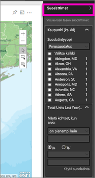
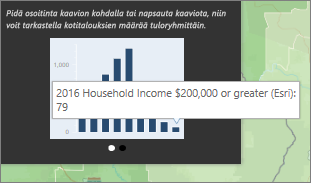

# ArcGIS-karttojen käsittely Power BI:ssä
Tämä ohjeaihe on kirjoitettu sellaisen käyttäjän näkökulmasta, joka on ArcGIS-kartan *kuluttaja* ja tarkastelee karttaa Power BI -palvelussa, Desktopissa tai mobiililaitteelta. Kun ArcGIS-kartan tehnyt henkilö jakaa kartan sinulle, voit toimia kartan kanssa monin eri tavoin.  Jos haluat lisätietoa ArcGIS-karttojen luomisesta, katso [opetusohjelma Esrin ArcGIS-kartoista](../visuals/power-bi-visualization-arcgis.md).

ArcGIS-kartat ja Power BI yhdessä tekevät kartoista muutakin kuin vain esitettäviä pisteitä. Valittavissasi on pohjakarttoja, sijaintityyppejä, teemoja, symbolityylejä ja viittauskerroksia, joiden avulla voit luoda upeita, informatiivisia karttavisualisointeja. Määräävien tietokerrosten (kuten laskentatietojen) yhdistäminen sijaintikohtaista analyysiä sisältäviin karttoihin mahdollistaa visualisoinnin tietojen ymmärtämisen syvemmin.

> [!TIP]
> GIS tarkoittaa maantieteellistä tietojärjestelmää (Geographic Information System).
> 

Tässä esimerkissä esitetään viime vuoden myynti kaupungeittain ja käytetään pohjana tiekarttaa, jossa on lisäksi kokoa edustavia kuplasymboleja sekä viittauskerroksena kotitalouksien keskitulo. Kartassa on myös kolme nastamerkkiä ja yksi ajoaikasäde (violetti).

> [!TIP]
> Katso esimerkkejä ja lue käyttäjien kokemuksia [Esrin Power BI -sivulta](https://www.esri.com/powerbi). Katso myös Esrin ohjeartikkeli [ArcGIS Maps for Power BI:n käytön aloitus](https://doc.arcgis.com/en/maps-for-powerbi/get-started/about-maps-for-power-bi.htm).
> 
> 

 

## Käyttäjän suostumus
Kun työtoveri jakaa sinulle ensimmäisen kerran ArcGIS-kartan, Power BI antaa sinulle siitä ilmoituksen. ArcGIS Maps for Power BI on Esrin (www.esri.com) tarjoama palvelu, ja käyttäessäsi ArcGIS Maps for Power BI:tä sinua koskevat Esrin käyttöehdot ja tietosuojakäytäntö. Power BI -käyttäjien, jotka haluavat käyttää ArcGIS Maps for Power BI -visualisointeja, on ilmaistava suostumuksensa valintaikkunassa.

## Valintatyökalut
ArcGIS Maps for Power BI:ssä on kolme valintatilaa. Voit valita enintään 250 arvopistettä kerrallaan.

 Valitse yksittäisiä arvopisteitä.

 Piirrä suorakulmio kartalle ja valitse siihen sisältyvät arvopisteet. CTRL-näppäimen avulla voit valita useita suorakulmioita.

 Tällä painikkeella voit käyttää rajauksia tai monikulmioita viittauskerroksissa ja valita siten sisäpuolelle jäävät arvopisteet.

 

## ArcGIS-karttojen käsittely
Käytettävissäsi olevat ominaisuudet määräytyvät sen mukaan, oletko kartan *luoja* (alkuperäinen tekijä) vai *kuluttaja* (jolle ArcGIS-kartta on jaettu). Jos käsittelet ArcGIS-karttaa kuluttajana (eli [lukunäkymässä](../consumer/end-user-reading-view.md)), käytettävissäsi ovat seuraavien toiminnot.

* Jos olet Premium-kuluttaja, jolla on *tarkasteluoikeudet*, pystyt [tarkastelemaan visualisoinnin luomiseen käytettyjä tietoja](../consumer/end-user-show-data.md), [tilaamaan](../consumer/end-user-subscribe.md) sekä tarkastelemaan karttaa [tarkastelutilassa ja koko näytön tilassa](../consumer/end-user-focus.md). Voit myös esimerkiksi [tarkastella aiheeseen liittyvää sisältöä](../consumer/end-user-related.md), [jakaa raportin](../service-share-reports.md) ja [käyttää suodattimia](../consumer/end-user-report-filter.md), jotka *raportin luoja* on määrittänyt.

* Muiden visualisointityyppien tapaan Power BI **Pro** -kuluttajat voivat tehdä kaikkea sitä mitä Premium-kuluttajatkin. Lisäksi he voivat esimerkiksi [viedä visualisointien pohjana olevia tietoja](../visuals/power-bi-visualization-export-data.md), [hakea käyttötietoja](../service-usage-metrics.md), tallentaa kopioita ja [julkaista verkkoon](../service-publish-to-web.md).

    
* Jos haluat tutkia karttaa suodattimien avulla, laajenna **Suodattimet**-ruutu.   
      
* Jos kartassa on viittauskerros, voit valita sijainteja, jolloin niiden tiedot näytetään työkaluvihjeessä. Seuraavassa kuvassa näkyy valittuna oleva Adamsin piirikunta ja kartan tekijän lisäämän viittauskerroksen mukaisesti kotitalouksien keskitulo.
  
      
  
    Tässä tapauksessa näkyviin tulee myös kaavio. Voit porautua syvemmälle tietoihin valitsemalla kaaviosta jonkin pylvään. Tästä näemme, että Adamsin piirikunnassa on 79 kotitaloudessa keskitulo 200 000 dollaria tai enemmän.
  
    
  
    Nuolen valitsemalla saat näkyviin lisää kaavioita.
* Kun viet hiiren osoittimen pohjakarttaan merkittyjen symbolien kohdalle, näet työkaluvihjeen, joka antaa lisätietoja.     
  
  
  > [!TIP]
  > Haluamasi paikan valitseminen saattaa edellyttää kartan lähentämistä.  Jos et lähennä, sijainnit saattavat näkyä päällekkäin, jolloin Power BI näyttää sinulle samanaikaisesti useita työkaluvihjeitä. Voit siirtyä työkaluvihjeestä toiseen käyttämällä nuolikuvakkeita.
  > 
  > 
  > 
  > 
* Jos kartan luoja on lisännyt ArcGIS-karttaan infografiikkakerroksen, näet lisää tietoja kartan oikeassa yläkulmassa.  Esimerkiksi tässä tapauksessa kartan luoja on lisännyt merkinnän ”alle 14-vuotiaat lapset”.
  
    

## Huomioitavat asiat ja rajoitukset
ArcGIS Maps for Power BI on saatavilla seuraavissa palveluissa ja sovelluksissa:

<table>
<tr><th>Palvelu/sovellus</th><th>Käytettävyys</th></tr>
<tr>
<td>Power BI Desktop</td>
<td>Kyllä</td>
</tr>
<tr>
<td>Power BI -palvelu (app.powerbi.com)</td>
<td>Kyllä</td>
</tr>
<tr>
<td>Power BI -mobiilisovellukset</td>
<td>Kyllä</td>
</tr>
<tr>
<td>Power BI:n julkaise verkkoon -toiminto</td>
<td>Ei</td>
</tr>
<tr>
<td>Power BI Embedded</td>
<td>Ei</td>
</tr>
<tr>
<td>Upottaminen Power BI -palveluun (PowerBI.com)</td>
<td>Ei</td>
</tr>
</table>

**Miten ArcGIS Maps ja Power BI toimivat yhdessä?**
ArcGIS Maps for Power BI on Esrin tekemä (www.esri.com). ArcGIS Maps for Power BI:n käyttöön sovelletaan Esrin [käyttöehtoja](https://go.microsoft.com/fwlink/?LinkID=8263222) ja [tietosuojakäytäntöä](https://go.microsoft.com/fwlink/?LinkID=826323). Power BI -käyttäjien, jotka haluavat käyttää ArcGIS Maps for Power BI -visualisointeja, on ilmaistava suostumuksensa valintaikkunassa (ks. Käyttäjän suostumus -kohta).  Esrin ArcGIS Maps for Power BI:n käyttöön sovelletaan Esrin käyttöehtoja ja tietosuojakäytäntöä, joihin on linkki suostumuksen valintaikkunassa. Kunkin käyttäjän on ilmaistava suostumuksensa ennen ArcGIS Maps for Power BI:n ensimmäistä käyttökertaa. Kun käyttäjä antaa suostumuksensa, visualisointiin sidotut tiedot lähetetään Esrin palveluihin, joissa niihin lisätään vähintään sijaintitiedot. Tämä tarkoittaa sijaintitietojen muuntamista pituus- ja leveyspiireiksi, jotka voidaan esittää kartalla. Voit olettaa, että kaikki visualisointeihin sidotut tiedot voidaan lähettää Esrin palveluihin. Esri tarjoaa mm. pohjakarttojen, paikkatietojen analyysin ja sijaintitietojen lisäämisen tapaisia palveluita. ArcGIS Maps for Power BI:n visualisoinnit toimivat yhdessä näiden palvelujen kanssa Esrin tarjoaman ja ylläpitämän suojatun SSL-sertifioidun yhteyden avulla. Lisätietoja ArcGIS Maps for Power BI:stä on tarjolla Esrin [ArcGIS Maps for Power BI -tuotesivulla](https://www.esri.com/powerbi).

**Power BI Plus**    

Kun käyttäjä tilaa Plus-version Esrin ArcGIS Maps for Power BI:n kautta tarjoaman tilauksen kautta, käyttäjän ja Esrin välillä on suora suhde. Power BI ei lähetä käyttäjän henkilökohtaisia tietoja Esrille. Käyttäjä kirjautuu Esrin tarjoamaan AAD-sovellukseen omalla AAD-tunnuksellaan ja ilmaisee luottavansa siihen. Tällöin käyttäjä jakaa henkilökohtaiset tietonsa suoraan Esrille. Kun käyttäjä lisää Plus-sisältöä ArcGIS Maps for Power BI -visualisointiin, kyseistä sisältöä tarkastelevilla ja muokkaavilla muilla Power BI -käyttäjillä on myös oltava Plus-tilaus. 

Jos sinulla on kysyttävää Esrin ArcGIS Maps for Power BI:n teknisestä toiminnasta, ota yhteyttä Esriin tukisivun kautta.

**ArcGIS kartta ei näy**    
Palveluissa tai sovelluksissa, joissa ArcGIS Maps for Power BI ei ole käytettävissä, visualisointi näkyy tyhjänä tilana, jossa näkyy Power BI -logo.

**En näe kartalla kaikkia tietojani**    
Kun leveysasteita ja pituusasteita geokoodataan kartalle, arvopisteitä näytetään korkeintaan 30 000. Kun arvopisteinä on esimerkiksi postinumeroja tai katuosoitteita, geokoodataan vain ensimmäiset 15 000 arvopistettä. Paikannimien ja maiden sijaintitietoja ei lasketa 1500 osoitteen kiintiöön.

**Onko ArcGIS Maps for Power BI:n käyttö maksullista?**

ArcGIS Map for Power BI on maksuton kaikille Power BI -käyttäjille. Se on **Esrin** tarjoama palvelun osa, johon sovelletaan **Esrin** käyttöehtoja ja tietosuojakäytäntöä, kuten tässä artikkelissa mainittiinkin jo aiemmin. ArcGIS **Plus** -tilaus on maksullinen.

**Saan virhesanoman, jonka mukaan välimuisti on täynnä**

Tämä on virhe, jota korjataan parhaillaan.  Sitä ennen valitse virheilmoituksessa näkyvä linkki, joka johdattaa sinut Power BI:n välimuistin tyhjentämisohjeisiin.

**Voinko tarkastella ArcGIS-karttoja offline-tilassa?**

Et. Power BI tarvitsee verkkoyhteyden karttojen näyttämiseen.

## Seuraavat vaiheet
Ohjeiden hakeminen: **Esri** tarjoaa [monipuolisia ](https://go.microsoft.com/fwlink/?LinkID=828772) **ArcGIS Maps for Power BI**:n ominaisuuksia koskevia ohjeita.

Voit esittää kysymyksiä, hakea ajantasaisimpia tietoja, ilmoittaa ongelmista ja hakea vastauksia [ArcGIS Maps for Power BI **:tä käsittelevästä Power BI -yhteisökeskustelusta**](https://go.microsoft.com/fwlink/?LinkID=828771).

[ArcGIS Maps for Power BI -tuotesivu](https://www.esri.com/powerbi)
