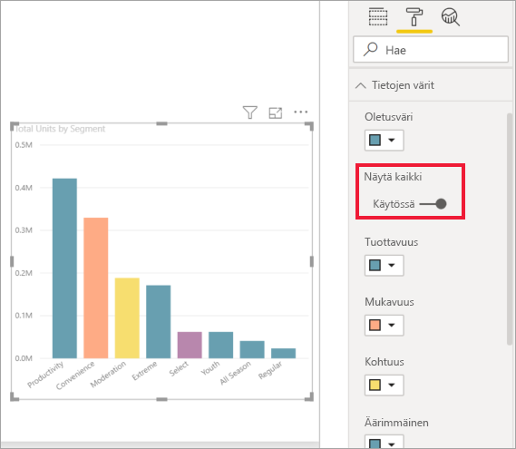
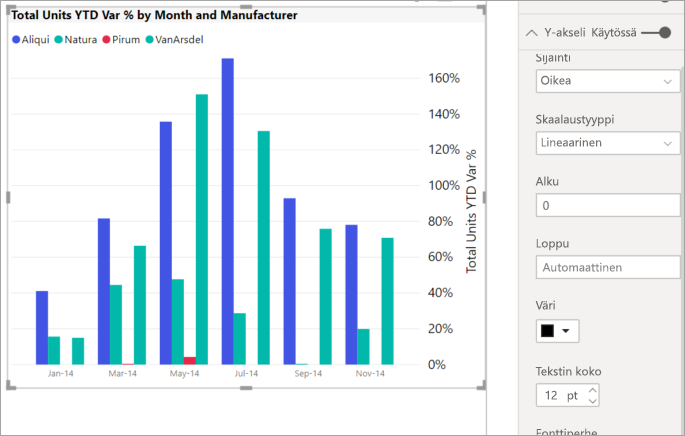

# Muotoiluruudun käytön aloittaminen
Jos sinulla on raportin muokkausoikeudet, käytettävissäsi on useita muotoiluasetuksia. Valitsemalla Power BI -raportit voit muuttaa arvosarjojen, arvopisteiden ja jopa visualisointien taustan värin. Voit muuttaa sitä, miten x-akseli ja y-akseli esitetään. Voit muotoilla myös visualisointien, muotojen ja otsikoiden fonttien ominaisuuksia. Power BI antaa sinun päättää raporttiesi ulkoasun täysin.

Aloita avaamalla raportti Power BI Desktopissa tai Power BI -palvelussa. Kummassakin on lähes samat muotoiluasetukset. Kun avaat raportin Power BI -palvelussa, valitse valikkoriviltä **Muokkaa**. 

Kun muokkaat raporttia ja sinulla on visualisointi valittuna, näkyviin tulee **Visualisoinnit**-ruutu. Tämän ruudun avulla voit muuttaa visualisointeja. **Visualisoinnit**-ruudun alapuolella on kolme kuvaketta: **Kentät** (palkkien pino), **Muoto** (tela) ja **Analytiikka** (suurennuslasi). Alla olevassa kuvassa näkyvä keltainen palkki kuvakkeen alapuolella osoittaa **Kentät**-kuvakkeen olevan valittuna.

Kun valitset kohdan **Muoto**, sen alapuolella oleva alue näyttää mukautukset, jotka ovat käytössä valitun visualisoinnin kanssa.  

Voit mukauttaa kunkin visualisoinnin monia elementtejä. Saatavilla olevat vaihtoehdot riippuvat valitusta visualisoinnista. Näihin vaihtoehtoihin kuuluvat esimerkiksi seuraavat:

* Selite
* X-akseli
* Y-akseli
* Tietojen värit
* Arvopisteiden otsikot
* Muodot
* Piirtoalue
* Otsikko
* Tausta
* Lukitse kuvasuhde
* Reunus
* Työkaluvihjeet
* Visualisointiotsikot
* Muodot
* Sijainti    
ynnä muut.

> [!NOTE]
>  
> Kaikkia näitä elementtejä ei näy jokaisen visualisointityypin kanssa. Valitsemasi visualisointi vaikuttaa käytettävissä oleviin mukautuksiin; et voi esimerkiksi mukauttaa x-akselia jos olet valinnut ympyräkaavion, sillä niissä ei ole x-akselia.

Huomaa myös, että jos et ole valinnut visualisointia, kuvakkeiden sijaan näkyviin tulee **Suodattimet**, josta voit asettaa suodattimia kaikkiin sivulla oleviin visualisointeihin.

Paras tapa oppia käyttämään muotoiluasetuksia on kokeilla niitä. Voit aina kumota tekemäsi muutokset tai palauttaa oletusasetukset. Käytettävissä on uskomattoman paljon vaihtoehtoja, ja uusia lisätään koko ajan. Kaikkia muotoiluasetuksia ei voi kuvailla yhdessä artikkelissa. Pääset alkuun, kun tutustumme muutamiin yhdessä. 

1. Visualisoinnissa käytettävien värien muuttaminen   
2. Tyylin ottaminen käyttöön    
3. Arvoakselin ominaisuuksien muuttaminen    
4. Arvopisteiden otsikoiden lisääminen    

## Värien käyttäminen

Käydään läpi visualisoinnin värien mukauttamiseen tarvittavat vaiheet.

1. Valitse visualisointi, jotta siitä tulee aktiivinen.

2. Avaa Muotoilu-välilehti valitsemalla maalitelakuvake. Muotoilu-välilehdellä näytetään kaikki valitun visualisoinnin käytettävissä olevat muotoiluelementit.

    

3. Laajenna käytettävissä olevat mukautukset valitsemalla **Tietojen värit**.  

    

4. Muuta **Näytä kaikki** -kohdan asetukseksi Käytössä ja valitse sarakkeille eri värit.

    

Alla on muutamia hyödyllisiä vihjeitä värien käyttämiseen. Luettelon numerot esiintyvät myös seuraavassa näytössä ja ne ilmaisevat, mistä näitä hyödyllisiä elementtejä pääsee käyttämään tai muuttamaan.

1. Etkö pidä väristä? Ei hätää, valitse **Palauta oletusasetukseen** ja valintasi palautuvat oletusasetukseen. 

2. Etkö pidä mistään värimuutoksista? Valitse **Palauta oletusasetukseen** **Tietojen väri** -osan alareunasta, niin värit palautetaan oletusasetuksiinsa. 

3. Haluatko värin, jota et näe valikoimassa? Valitse vain **Mukautettu väri** ja valitse asteikolta.  

   

Etkö pidä juuri tekemistäsi muutoksista? Käytä yhdistelmää **CTRL + Z** kumoamisvaiheena, aivan kuten olet tottunut tekemään.

## Tyylin käyttäminen taulukossa
Joillakin Power BI -visualisoinneilla on **Tyyli**-asetus. Yhdellä napsautuksella visualisoinnissa otetaan käyttöön koko joukko muotoiluasetuksia. 

1. Valitse taulukko tai matriisi muuttaaksesi se aktiiviseksi.   
1. Avaa Muotoilu-välilehti ja valitse **Tyyli**.

   

1. Valitse tyyli avattavasta valikosta. 

   

Senkin jälkeen, kun olet ottanut tyylin käyttöön, voit jatkaa kyseisen visualisoinnin ominaisuuksien, kuten värin, muotoilua.

## Akselin ominaisuuksien muuttaminen

X- tai Y-akselin muokkaaminen on usein hyödyllistä. Seuraavassa kuvassa näytetään, miten voit muokata haluamaasi akselia valitsemalla alanuoli-kuvakkeen akselin vasemmalta puolelta, aivan kuten värejä käyttäessäsi.  

Alla olevassa esimerkissä olemme tehneet Y-akseliin seuraavat muotoilut:
- Otsikot on siirretty visualisoinnin oikealle puolelle.

- Aloitusarvo on muutettu nollaksi.

- Otsikon fontin värin on muutettu mustaksi.

- Otsikon fontin koko suurennettiin 12:een.

- Y-akselille on annettu otsikko.

    

**X-akseli**n tai **Y-akselin** vieressä olevalla valintanapilla voit poistaa akselin otsikot kokonaan. **Otsikko**-kohdan vieressä olevalla valintanapilla voit valita ovatko akseleiden otsikot käytössä vai eivät.  

## Arvopisteiden otsikoiden lisääminen    

Tässä vielä viimeinen muotoiluesimerkki, ennen kuin aloitat itsenäisen tutustumisen.  Lisätään aluekaavioon arvopisteiden otsikoita. 

Tässä on kaavio *ennen* muotoilua. 

Ja tässä muotoilun *jälkeen*.

Aktivoimme visualisoinnin valitsemalla sen ja avasimme Muotoilu-välilehden.  Valitsimme **arvopisteiden otsikot** ja otimme ne käyttöön. Sitten suurensimme fonttikoon 12:ksi, muutimme kirjasinperheen Arial Blackiksi, otimme käyttöön asetuksen **Näytä tausta** ja valitsimme taustaväriksi valkoisen, jonka läpinäkyvyys on 5 %.

Nämä ovat vain muutamia mahdollisia muotoilutehtäviä. Avaa raportti muokkaustilassa ja luo kauniita ja informatiivisia visualisointeja Muotoilu-ruudun avulla.

## Seuraavat vaiheet
Katso lisätietoja seuraavasta artikkelista:  

* [Vinkkejä värimuotoiluun Power BI:ssä](service-tips-and-tricks-for-color-formatting.md)  
* [Ehdollinen muotoilu taulukoissa](../desktop-conditional-table-formatting.md)

